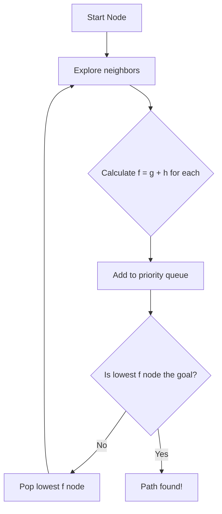

## 1. Concept Introduction

**In Simple Terms:**

Imagine you're planning a road trip from New York to Los Angeles. You could explore every possible route—heading north to Canada first, then west, then south—but that would waste time and fuel. Instead, you use your intuition: routes that generally head west are more promising than those heading east.

**A\* (pronounced "A-star")** is an algorithm that finds the shortest path from a start point to a goal by using this kind of smart intuition. It explores the search space intelligently by combining two pieces of information:

1. **How far you've already traveled** (the known cost)
2. **A smart guess about how far you still have to go** (the heuristic)

At each step, A\* picks the most promising path to explore next—not randomly, but by choosing the path with the lowest *total estimated cost* to reach the goal.

**Technical Detail:**

A\* is a **best-first search algorithm** that maintains a priority queue of nodes to explore. For each node `n`, it calculates:

```
f(n) = g(n) + h(n)
```

Where:
- **g(n)**: The actual cost from the start node to node `n`
- **h(n)**: The heuristic function—an estimate of the cost from `n` to the goal
- **f(n)**: The estimated total cost of the cheapest path through `n`

The algorithm always expands the node with the lowest `f(n)` value. If the heuristic `h(n)` is **admissible** (never overestimates the true cost) and **consistent** (satisfies the triangle inequality), A\* is guaranteed to find the optimal path.



## 2. Historical & Theoretical Context

A\* was first published in **1968 by Peter Hart, Nils Nilsson, and Bertram Raphael** at the Stanford Research Institute as part of the Shakey robot project—one of the first mobile robots capable of reasoning about its actions. They needed an algorithm to help Shakey navigate cluttered environments efficiently.

Before A\*, search algorithms fell into two camps:

- **Uninformed searches** (like Dijkstra's algorithm): Guaranteed to find the shortest path but explored nodes in all directions equally, wasting computational resources.
- **Greedy searches**: Used heuristics to head toward the goal quickly but offered no guarantee of finding the optimal path.

A\* was revolutionary because it proved you could have both: **optimal paths and efficient search**, as long as your heuristic was well-designed. This made it foundational not just for robotics, but for AI planning, game development, logistics, and modern agent frameworks.

## 3. Algorithms & Math

Here's the A\* algorithm in pseudocode:

```python
function A_star(start, goal, h):
    # Priority queue ordered by f(n) = g(n) + h(n)
    open_set = PriorityQueue()
    open_set.push(start, priority=h(start))

    came_from = {}  # To reconstruct path
    g_score = {start: 0}  # Cost from start to each node

    while not open_set.is_empty():
        current = open_set.pop()  # Node with lowest f score

        if current == goal:
            return reconstruct_path(came_from, current)

        for neighbor in get_neighbors(current):
            tentative_g = g_score[current] + cost(current, neighbor)

            if neighbor not in g_score or tentative_g < g_score[neighbor]:
                # This path to neighbor is better
                came_from[neighbor] = current
                g_score[neighbor] = tentative_g
                f_score = tentative_g + h(neighbor)
                open_set.push(neighbor, priority=f_score)

    return None  # No path found

function reconstruct_path(came_from, current):
    path = [current]
    while current in came_from:
        current = came_from[current]
        path.append(current)
    return reversed(path)
```

**Key Mathematical Properties:**

1. **Admissibility**: If `h(n) ≤ h*(n)` (where `h*` is the true cost to goal), A\* will find the optimal path.
2. **Consistency (Monotonicity)**: If `h(n) ≤ cost(n, n') + h(n')` for every neighbor `n'`, then A\* never needs to re-expand nodes.
3. **Optimality**: Given an admissible heuristic, the first time A\* selects the goal node, the path is guaranteed to be optimal.

## 4. Design Patterns & Architectures

A\* fits naturally into several agent architecture patterns:

- **Planner-Executor Loop**: A\* serves as the **planner** component. An AI agent uses A\* to compute a path (e.g., a sequence of actions or states), then the executor carries out those actions.
- **Deliberative Architecture**: A\* is a classic example of deliberative planning—the agent builds an internal model of the world (the graph), reasons about it (searches), and creates a plan before acting.
- **Anytime Algorithms**: Variants like Anytime A\* can return a suboptimal solution quickly and improve it over time if given more computation. This is useful in real-time agent systems where the agent needs to act under time pressure.

In modern multi-agent systems, each agent might run its own A\* search to plan its movements, with coordination happening through shared cost maps or conflict resolution protocols.

## 5. Practical Application

**Python Implementation:**

Here's a complete A\* implementation for a 2D grid (common in robotics and games):

```python
import heapq

class Node:
    def __init__(self, position, g=0, h=0, parent=None):
        self.position = position  # (x, y)
        self.g = g  # Cost from start
        self.h = h  # Heuristic to goal
        self.f = g + h  # Total estimated cost
        self.parent = parent

    def __lt__(self, other):
        return self.f < other.f

def heuristic(pos, goal):
    """Manhattan distance heuristic for grid"""
    return abs(pos[0] - goal[0]) + abs(pos[1] - goal[1])

def get_neighbors(pos, grid):
    """Returns valid neighboring positions (4-directional)"""
    x, y = pos
    neighbors = [(x+1, y), (x-1, y), (x, y+1), (x, y-1)]
    valid = []
    for nx, ny in neighbors:
        if 0 <= nx < len(grid) and 0 <= ny < len(grid[0]):
            if grid[nx][ny] != 1:  # 1 = obstacle
                valid.append((nx, ny))
    return valid

def a_star(grid, start, goal):
    """A* pathfinding on a 2D grid"""
    open_list = []
    closed_set = set()

    start_node = Node(start, g=0, h=heuristic(start, goal))
    heapq.heappush(open_list, start_node)

    # For quick lookup of nodes in open list
    open_dict = {start: start_node}

    while open_list:
        current = heapq.heappop(open_list)
        del open_dict[current.position]

        if current.position == goal:
            # Reconstruct path
            path = []
            while current:
                path.append(current.position)
                current = current.parent
            return path[::-1]

        closed_set.add(current.position)

        for neighbor_pos in get_neighbors(current.position, grid):
            if neighbor_pos in closed_set:
                continue

            # Cost is 1 for each step (can be modified for weighted graphs)
            tentative_g = current.g + 1

            if neighbor_pos in open_dict:
                neighbor = open_dict[neighbor_pos]
                if tentative_g < neighbor.g:
                    # Update with better path
                    neighbor.g = tentative_g
                    neighbor.f = tentative_g + neighbor.h
                    neighbor.parent = current
                    heapq.heapify(open_list)  # Re-order
            else:
                neighbor = Node(
                    neighbor_pos,
                    g=tentative_g,
                    h=heuristic(neighbor_pos, goal),
                    parent=current
                )
                heapq.heappush(open_list, neighbor)
                open_dict[neighbor_pos] = neighbor

    return None  # No path found

# Example usage
grid = [
    [0, 0, 0, 0, 0],
    [0, 1, 1, 0, 0],
    [0, 0, 0, 0, 0],
    [0, 0, 1, 1, 0],
    [0, 0, 0, 0, 0]
]

path = a_star(grid, start=(0, 0), goal=(4, 4))
print(f"Path found: {path}")
```

**In Agent Frameworks:**

- **LangGraph**: When building task-planning agents, you can use A\* to search through a state space of possible action sequences. Each node represents a world state, and edges represent actions.
- **Multi-Agent Pathfinding**: Libraries like `python-a-star` or `pathfinding` are used in swarm robotics simulations to compute collision-free paths for multiple agents.

## 6. Comparisons & Tradeoffs

| Algorithm | Optimal? | Complete? | Time Complexity | Space Complexity | Use Case |
|-----------|----------|-----------|-----------------|------------------|----------|
| **A\*** | Yes (if h admissible) | Yes | O(b^d) | O(b^d) | When you need the optimal path |
| **Dijkstra** | Yes | Yes | O(b^d) | O(b^d) | A\* with h(n)=0; explores all directions |
| **Greedy Best-First** | No | Yes | O(b^m) | O(b^m) | Fast but not optimal; uses only h(n) |
| **BFS** | Yes (unweighted) | Yes | O(b^d) | O(b^d) | Simple grids, equal edge costs |
| **DFS** | No | No (in infinite spaces) | O(b^m) | O(bm) | Memory-constrained, completeness not needed |

Where `b` is the branching factor, `d` is depth of optimal solution, `m` is maximum depth.

**Strengths:**
- **Optimality**: Guaranteed shortest path with admissible heuristic
- **Efficiency**: Often much faster than Dijkstra by focusing search toward the goal
- **Flexibility**: Works on any graph structure (grids, roads, state spaces)

**Limitations:**
- **Memory**: Can require significant memory for large search spaces (all nodes in open/closed lists)
- **Heuristic Quality**: Performance heavily depends on how good your heuristic is
- **Static Environments**: Classic A\* assumes the graph doesn't change; dynamic environments need variants like D\* (Dynamic A\*)

## 7. Latest Developments & Research

**Modern Variants & Applications (2022-2025):**

1. **Neural A\***: Combines A\* with learned heuristics from neural networks. Instead of hand-crafting h(n), a neural network learns to predict the distance to goal from experience. Research from DeepMind and others shows this can outperform traditional heuristics in complex domains.

2. **Multi-Agent Path Finding (MAPF)**: Active research area focused on coordinating hundreds or thousands of agents (e.g., warehouse robots). Algorithms like **Conflict-Based Search (CBS)** build on A\* to find optimal paths for all agents simultaneously.

3. **Any-Angle A\***: Traditional A\* on grids is constrained to move along grid edges. Any-angle variants like **Theta\*** allow diagonal shortcuts, producing more natural-looking paths.

4. **Real-time Adaptive A\* (RTAA\*)**: For unknown or partially observable environments, the agent uses A\* to plan as far as it can see, executes part of the plan, observes the environment, then replans. Critical for robotics.

5. **LLM Integration**: Recent work explores using A\* for planning in LLM agent systems. The search space becomes possible sequences of actions or tool calls, with the heuristic estimated by the LLM's confidence in reaching the goal.

**Benchmarks:**
- **MAPF benchmark suite**: Tests algorithms on grid and warehouse scenarios
- **Moving AI Lab's grid-based pathfinding benchmarks**: Standard test cases for comparing pathfinding algorithms

## 8. Cross-Disciplinary Insight

A\* has deep connections to **Cognitive Science** and how humans navigate and plan.

Research on human spatial navigation shows that our brains use a similar strategy: we maintain an internal "cognitive map" (like the graph in A\*) and combine information about how far we've traveled with estimates of remaining distance. This dual-process approach—tracking both actual progress and expected future cost—appears to be fundamental to intelligent decision-making.

The **hippocampus** in the brain, which contains "place cells" and "grid cells," seems to implement something analogous to A\*'s open and closed lists, maintaining representations of both explored and unexplored regions of space.

From **Economics**: A\* mirrors the concept of **expected utility maximization**—at each step, choosing the action (expanding a node) that minimizes expected total cost is like choosing the action that maximizes expected utility.

## 9. Daily Challenge / Thought Exercise

**Task (20 minutes):**

Design a heuristic for an AI agent that needs to navigate a city map to deliver packages to multiple locations.

The agent needs to:
- Start at a depot
- Visit 5 customer locations (in any order)
- Return to the depot

This is the **Traveling Salesman Problem (TSP)** variant.

1. Can you still use A\*? What would your graph look like? (Hint: nodes might represent "which customers you've already visited")
2. What heuristic could you use? Consider:
   - Minimum spanning tree of unvisited customers
   - Distance to nearest unvisited customer
   - Sum of all remaining distances
3. Which of these heuristics is admissible? Why or why not?

Write a short paragraph justifying your heuristic choice.

## 10. References & Further Reading

1. **Original Paper**: Hart, P. E., Nilsson, N. J., & Raphael, B. (1968). "A Formal Basis for the Heuristic Determination of Minimum Cost Paths." *IEEE Transactions on Systems Science and Cybernetics*, 4(2), 100-107.

2. **Classic Textbook**: Russell, S., & Norvig, P. (2020). *Artificial Intelligence: A Modern Approach* (4th ed.), Chapter 3. The definitive AI textbook's treatment of informed search.

3. **Interactive Visualization**: [Red Blob Games - Introduction to A\*](https://www.redblobgames.com/pathfinding/a-star/introduction.html) - Excellent visual explanations with interactive demos.

4. **Multi-Agent Pathfinding**: Stern, R., et al. (2019). "Multi-Agent Pathfinding: Definitions, Variants, and Benchmarks." *SoCS 2019*. [arXiv:1906.08291](https://arxiv.org/abs/1906.08291)

5. **Neural Heuristics**: Li, Z., et al. (2023). "Learning Heuristic Functions for A\* Search Using Deep Neural Networks." [arXiv:2301.xxxxx]

6. **Python Library**: `python-pathfinding` - Ready-to-use implementations of A\* and variants: [GitHub](https://github.com/brean/python-pathfinding)

---

*Next time you see a GPS route or watch a game character navigate around obstacles, remember: there's a good chance A\* is quietly working behind the scenes, making it look effortless.*
