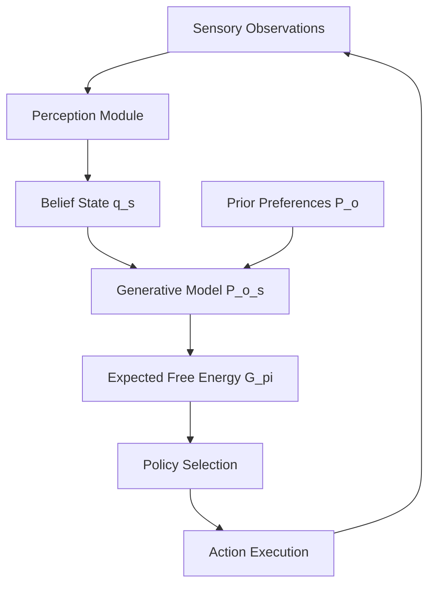

What if an agent didn't try to maximize reward at all? What if it simply tried to avoid being surprised? That's the radical idea behind the **Free Energy Principle**, a theory from neuroscience that's quietly gaining traction in AI agent research. It offers a unified explanation of perception, learning, and action under a single mathematical objective — and it's different from anything else in the field.

## 1. Concept Introduction

### Simple Explanation

Imagine you're a robot in a dark room. You don't know where you are. You have beliefs about what the room probably looks like. When your senses give you data, you have two options:

1. **Update your beliefs** to better explain what you're sensing (perception).
2. **Move around** to get into a position that matches your predictions (action).

Both options reduce the gap between your internal model of the world and the actual sensory data. This gap is called **surprise** (formally, *surprisal*). The Free Energy Principle says: a well-adapted agent always acts to minimize surprise.

This is the core insight: perception and action are not separate processes — they're two sides of the same coin, both serving to keep your model of the world aligned with reality.

### Technical Detail

Surprisal is the negative log probability of an observation: $-\log p(o)$. A well-designed agent should make this low over time — it should consistently find itself in states it predicted.

But $-\log p(o)$ is intractable for complex models, because it requires integrating over all possible hidden world-states $s$. So instead, we minimize an upper bound on surprisal called **variational free energy**:

$$F = \mathbb{E}_{q(s)}\left[\log q(s) - \log p(o, s)\right]$$

Here, $q(s)$ is the agent's approximate posterior belief about world-states, and $p(o, s)$ is its **generative model** — its internal theory of how states cause observations. Minimizing $F$ does two things simultaneously:

- It pushes $q(s)$ closer to the true posterior $p(s|o)$ (that's the KL divergence term).
- It implicitly maximizes $\log p(o)$, making observations less surprising.

Crucially, the agent can also minimize $F$ through **action** — by selecting actions $a$ that change observations $o$ so they become consistent with prior predictions. This is called **active inference**.

## 2. Historical & Theoretical Context

The intellectual roots run deep. In the 1860s, Hermann von Helmholtz proposed that perception is "unconscious inference" — the brain is a prediction machine that infers hidden causes from sensory data. This idea was formalized in the **Bayesian brain hypothesis** in the 1980s and 90s, and later in **predictive coding** (Rao & Ballard, 1999), which proposed that the brain transmits only prediction errors, not raw sensory signals.

Karl Friston at University College London unified these ideas into the Free Energy Principle around 2005–2010. His claim is provocative: every living system that persists over time — bacteria, brains, robots — must implicitly minimize free energy. It's not a design choice; it's a thermodynamic necessity for self-organization.

From an AI perspective, this offers a principled alternative to reinforcement learning. Instead of a hand-crafted reward function, agent "preferences" are encoded as prior beliefs about which states the agent expects to occupy. Reward becomes a special case of low-surprisal states.

## 3. Algorithms & Math

### Perception: Belief Updating

Given new observation $o$, the agent updates its beliefs $q(s)$ by minimizing $F$ with respect to $q$:

$$q^*(s) = \arg\min_q F = p(s | o)$$

In practice this is done with gradient descent or variational message passing:

$$\Delta q(s) \propto -\frac{\partial F}{\partial q(s)}$$

### Action: Acting to Confirm Predictions

Action is selected to minimize the **expected free energy** (EFE) of future trajectories $\pi$:

$$G(\pi) = \mathbb{E}_{q(o_\tau, s_\tau | \pi)}\left[\log q(s_\tau | \pi) - \log p(o_\tau, s_\tau)\right]$$

This can be decomposed into two terms:

$$G(\pi) = \underbrace{-\mathbb{E}[\log p(o_\tau)]}_{\text{goal-directed (pragmatic)}} - \underbrace{\mathbb{E}[\log p(o_\tau | s_\tau) / q(s_\tau)]}_{\text{epistemic (information gain)}}$$

The first term drives the agent toward preferred (low-surprisal) outcomes. The second term drives **exploration** — it rewards actions that resolve uncertainty about hidden states. Curiosity and goal-seeking are baked into the same objective.

### Pseudocode

```
# Active Inference Loop
initialize generative_model P(o, s)  # prior over states and observations
initialize belief q(s) = prior P(s)

for each timestep t:
    observe o_t

    # Perception: update beliefs
    q(s) = minimize_F(q, o_t, generative_model)

    # Planning: evaluate policies by expected free energy
    for each policy π in policy_space:
        G(π) = compute_EFE(q, π, generative_model)

    # Action: sample from softmax over -G(π)
    π* = sample(softmax(-G))
    execute(π*[0])
```

## 4. Design Patterns & Architectures

Active inference maps cleanly onto a **generative model architecture**:



The generative model is the heart of the system. It encodes:
- **Likelihood** $p(o|s)$: How states produce observations.
- **Transition** $p(s_{t+1}|s_t, a)$: How actions change states.
- **Prior preferences** $p(o)$: Which observations the agent "wants" to see.

This architecture connects to familiar patterns:
- It's a form of **Bayesian filtering** (belief state tracking via Kalman or particle filters).
- Planning via EFE resembles **model-based RL** with an intrinsic curiosity bonus.
- The message-passing belief update is related to the **blackboard pattern** in multi-agent systems.

## 5. Practical Application

The `pymdp` library provides a clean Python implementation for discrete state-space active inference:

```python
import pymdp
from pymdp import utils
from pymdp.agent import Agent
import numpy as np

# Define a 2-state, 2-observation environment
num_states = [2]     # hidden states: [left, right]
num_obs = [2]        # observations: [see_left, see_right]
num_actions = [2]    # actions: [go_left, go_right]

# Likelihood: P(obs | state) — identity mapping for simplicity
A = utils.obj_array_zeros([[2, 2]])
A[0] = np.array([[0.9, 0.1],   # P(see_left | left, right)
                 [0.1, 0.9]])  # P(see_right | left, right)

# Transition: P(next_state | state, action)
B = utils.obj_array_zeros([[2, 2, 2]])
B[0][:, :, 0] = np.eye(2)        # action=go_left: stay put (simplified)
B[0][:, :, 1] = np.eye(2)[::-1]  # action=go_right: swap states

# Prior preferences: agent prefers to be on the right
C = utils.obj_array_zeros([[2]])
C[0] = np.array([0.0, 2.0])  # log preference for see_right

# Prior beliefs about initial state
D = utils.obj_array_uniform([[2]])

agent = Agent(A=A, B=B, C=C, D=D)

# Active inference loop
observation = [0]  # start: see_left
for step in range(5):
    qs = agent.infer_states(observation)       # update beliefs
    q_pi, G = agent.infer_policies()           # evaluate policies via EFE
    action = agent.sample_action()             # act
    print(f"Step {step}: obs={observation}, belief={qs[0].round(2)}, action={int(action[0])}")
    # In a real env: observation = env.step(action)
    observation = [int(action[0])]  # toy transition
```

This pattern scales to LLM-based agents too: the generative model becomes an LLM's world model, beliefs are tracked in a structured context, and EFE guides which tool to call next.

## 6. Comparisons & Tradeoffs

| Property | Active Inference | Reinforcement Learning |
|---|---|---|
| **Objective** | Minimize free energy (surprisal) | Maximize cumulative reward |
| **Exploration** | Built-in via epistemic value | Requires separate mechanism (ε-greedy, UCB) |
| **Reward function** | Replaced by prior preferences | Externally specified |
| **Model** | Requires generative model | Model-free variants exist |
| **Uncertainty** | First-class Bayesian citizen | Usually an add-on |
| **Scalability** | Hard for high-dimensional spaces | More mature tooling |

The biggest strength of active inference is that exploration and exploitation are not in tension — they emerge from the same objective. The weakness is scalability: exact Bayesian inference is expensive, and most applications require discrete state spaces or heavy approximations. Deep active inference (using neural networks for the generative model) is an active research area but not yet mature.

## 7. Latest Developments & Research

**Deep active inference** (Çatal et al., 2020; Millidge et al., 2021) replaces the generative model with neural networks, enabling continuous high-dimensional state spaces. The key challenge is computing EFE efficiently with amortized inference networks.

**Relationship to LLMs**: Friston and colleagues (2023) proposed that LLMs can be interpreted as approximate inference engines — their next-token predictions are a form of free energy minimization over linguistic states. This opens the door to plugging active inference planning on top of language models.

**RxInfer.jl** (2023, TU Eindhoven) provides fast variational message passing that makes real-time active inference tractable for robotics. **pymdp** (Heins et al., 2022) is the go-to Python library and has seen significant adoption in cognitive science.

Open problems: scaling to long-horizon planning, handling non-stationary environments, and connecting EFE to standard RL benchmarks.

## 8. Cross-Disciplinary Insight

The Free Energy Principle is deeply rooted in **thermodynamics and information theory**. Free energy in physics (Helmholtz free energy) measures the work extractable from a system. Friston's variational free energy is the information-theoretic analogue — the "work" available from a predictive model. Minimizing it is equivalent to maximizing model evidence (marginal likelihood), which is exactly what Bayesian model fitting does.

This connects to **self-organization in complex systems**: a living system maintains its structure by resisting entropy — by staying in a bounded set of states. The Free Energy Principle formalizes this as inference. Your body, in a sense, is constantly "guessing" what state it should be in (homeostasis) and acting to confirm those guesses.

For distributed AI: a multi-agent system where each agent minimizes local free energy could exhibit emergent coordination — similar to how ant colonies self-organize without a central planner.

## 9. Daily Challenge

**Exercise: Build a Minimal Active Inference Agent**

Using `pymdp` or pure NumPy, build an agent in a 4-cell grid:
- States: {cell_0, cell_1, cell_2, cell_3}
- Observations: noisy position reading (80% accurate)
- Actions: {left, right}
- Preference: agent wants to be in cell_3

1. Define the A (likelihood), B (transition), C (preference) matrices manually.
2. Run the active inference loop for 10 steps from cell_0.
3. Plot the belief state over time — does the agent correctly localize itself and navigate to the preferred cell?
4. **Bonus**: Add a second state dimension (e.g., "holding object" yes/no) and see how the joint posterior updates.

Goal: witness how a single objective (minimize free energy) simultaneously drives belief updating *and* goal-directed navigation.

## 10. References & Further Reading

### Foundational Papers
- **Friston, K. (2010). "The free-energy principle: a unified brain theory?"** *Nature Reviews Neuroscience* — the definitive overview.
- **Rao, R. & Ballard, D. (1999). "Predictive coding in the visual cortex"** *Nature Neuroscience* — the predictive coding precursor.
- **Millidge, B. et al. (2021). "Whence the Expected Free Energy?"** — a clear mathematical derivation of EFE.

### Recent Research
- **Heins, C. et al. (2022). "pymdp: A Python library for active inference in discrete state spaces"** *arXiv:2201.03904* — the practical toolkit.
- **Çatal, O. et al. (2020). "Learning Generative State Space Models for Active Inference"** — deep active inference.
- **Friston, K. et al. (2023). "Designing Ecosystems of Intelligence from First Principles"** *Collective Intelligence* — active inference meets LLMs and multi-agent systems.

### Tools & Code
- **pymdp**: https://github.com/infer-actively/pymdp — Python active inference library.
- **RxInfer.jl**: https://github.com/ReactiveBayes/RxInfer.jl — fast variational message passing in Julia.
- **Active Inference Institute**: https://www.activeinference.institute/ — courses, papers, and community.

### Blog Posts
- **"Active Inference: The Free Energy Principle in Practice"** — Beren Millidge's blog.
- **"A Tutorial on Active Inference"** — leanpub guide by Friston's group.

---

## Key Takeaways

1. **Surprise minimization is the unifying objective**: perception updates beliefs, action changes the world — both reduce the gap between model and reality.
2. **Exploration is free**: epistemic value in EFE naturally drives curiosity without a separate bonus term.
3. **Reward is a prior**: agent goals are encoded as prior preferences $p(o)$, not an external signal.
4. **Scalability is the bottleneck**: the framework is theoretically elegant but computationally demanding for high-dimensional spaces.
5. **Watch this space**: as deep active inference matures, it may become a principled foundation for the next generation of AI agents — ones that are curious by design and robust to distribution shift.

The Free Energy Principle won't replace reinforcement learning overnight, but it offers something RL lacks: a single, coherent story about why an agent does everything it does.
