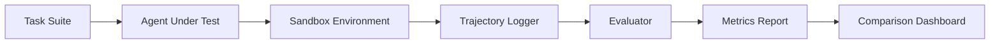
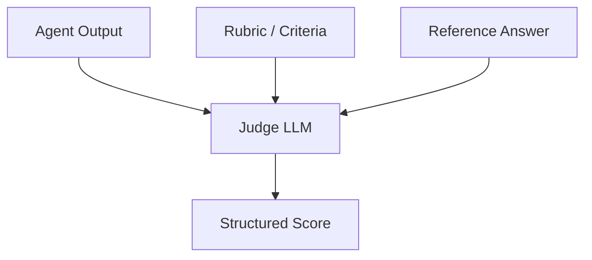

You built an AI agent. It works on your demos. But is it actually *good*? Can it handle real-world complexity? Will it break on edge cases? Agent evaluation is one of the hardest unsolved problems in the field — and one of the most important. Without rigorous evaluation, you're flying blind. This article covers the principles, metrics, benchmarks, and practical frameworks for measuring agent performance systematically.

## 1. Concept Introduction

### Simple Explanation

Think of agent evaluation like grading a student. A multiple-choice exam (traditional ML benchmarks) tests one narrow skill. But agents are more like interns — they perform multi-step tasks, use tools, make judgment calls, and recover from mistakes. You need a richer evaluation framework: not just "did you get the right answer?" but "did you take reasonable steps, use resources efficiently, and handle surprises gracefully?"

### Technical Detail

Agent evaluation differs from standard model evaluation in several key ways:

- **Trajectory matters**: An agent that reaches the right answer through dangerous steps (deleting files, leaking data) should score lower than one that takes a safe path
- **Partial credit**: Multi-step tasks have intermediate successes worth measuring
- **Cost awareness**: A correct answer that costs 50 dollars in API calls isn't equivalent to one that costs 5 cents
- **Non-determinism**: Agents produce different trajectories across runs, requiring statistical evaluation
- **Environment interaction**: Agents change their environment, making evaluation stateful and harder to reproduce

The core challenge: agent performance is a **multi-dimensional surface**, not a single number.

## 2. Historical & Theoretical Context

Evaluation has always been the backbone of AI progress. The history follows a clear arc of increasing complexity:

- **1990s–2000s**: Static benchmarks (MNIST, ImageNet) drove the deep learning revolution by providing clear targets
- **2010s**: NLP benchmarks (GLUE, SuperGLUE, SQuAD) measured language understanding on isolated tasks
- **2021–2023**: LLM benchmarks (MMLU, HumanEval, GSM8K) tested reasoning and code generation
- **2023–present**: Agent benchmarks (SWE-bench, GAIA, AgentBench) evaluate multi-step, tool-using, environment-interacting systems

The shift to agent evaluation reflects **Goodhart's Law** in action: when LLMs saturated static benchmarks, the field needed harder, more realistic evaluations. Agent benchmarks aim for **ecological validity** — measuring performance in conditions that resemble real use.

This connects to a deep idea from **measurement theory**: the act of measuring shapes what gets optimized. Choose the wrong metric, and you'll build the wrong agent.

## 3. Metrics and Measurement

### The Agent Evaluation Hierarchy

Agent performance decomposes into multiple layers, each capturing a different aspect of quality:

```
┌─────────────────────────────┐
│     Task Success Rate       │  ← Did the agent complete the goal?
├─────────────────────────────┤
│     Trajectory Quality      │  ← Was the path reasonable?
├─────────────────────────────┤
│     Efficiency Metrics      │  ← Cost, latency, tool calls
├─────────────────────────────┤
│     Safety & Reliability    │  ← Errors, hallucinations, harm
└─────────────────────────────┘
```

### Key Metrics

**Success metrics:**
- **Pass rate**: Fraction of tasks completed correctly
- **Pass@k**: Probability of at least one success in $k$ attempts — computed as $\text{pass@k} = 1 - \frac{\binom{n-c}{k}}{\binom{n}{k}}$ where $n$ is total runs and $c$ is correct runs

**Trajectory metrics:**
- **Step efficiency**: $\eta = \frac{\text{optimal steps}}{\text{actual steps}}$ — measures how much wasted work the agent does
- **Tool accuracy**: Fraction of tool calls that were necessary and correctly parameterized
- **Recovery rate**: How often the agent recovers after encountering an error

**Cost metrics:**
- **Token cost per task**: Total input + output tokens multiplied by model pricing
- **Cost-adjusted success**: $\text{score} = \frac{\text{success rate}}{\text{mean cost per task}}$ — normalizes performance by expense
- **Latency**: Wall-clock time to completion

**Safety metrics:**
- **Hallucination rate**: Fraction of outputs containing fabricated information
- **Guardrail violation rate**: How often the agent attempts forbidden actions
- **Graceful failure rate**: When the agent fails, does it fail safely?

## 4. Design Patterns & Architectures

### Pattern: The Evaluation Harness

A reusable evaluation framework follows a standard architecture:



Key design decisions:

- **Sandboxing**: Agents must run in isolated environments (Docker containers, VMs) to prevent side effects between evaluations
- **Deterministic seeding**: Where possible, fix random seeds and use temperature=0 for reproducibility
- **Multiple runs**: Run each task $n \geq 5$ times and report confidence intervals, not single numbers

### Pattern: LLM-as-Judge

When ground truth is hard to define (open-ended tasks, creative output), use a separate LLM to evaluate agent output:



This pattern is powerful but introduces its own biases — judge LLMs tend to prefer verbose outputs and have position bias (favoring the first option presented).

## 5. Practical Application

Here's a practical evaluation framework you can use today:

```python
import json
import time
from dataclasses import dataclass, field
from typing import Callable

@dataclass
class EvalTask:
    task_id: str
    instruction: str
    expected_output: str | None = None
    check_fn: Callable | None = None  # Custom validator
    max_steps: int = 20
    timeout_seconds: float = 120.0

@dataclass
class EvalResult:
    task_id: str
    success: bool
    steps_taken: int
    total_tokens: int
    latency_seconds: float
    trajectory: list = field(default_factory=list)
    error: str | None = None

class AgentEvaluator:
    def __init__(self, agent_factory: Callable):
        self.agent_factory = agent_factory

    def run_eval(self, tasks: list[EvalTask], n_runs: int = 5) -> dict:
        all_results = []

        for task in tasks:
            task_results = []
            for run_idx in range(n_runs):
                result = self._run_single(task, run_idx)
                task_results.append(result)
            all_results.append((task.task_id, task_results))

        return self._compute_metrics(all_results)

    def _run_single(self, task: EvalTask, run_idx: int) -> EvalResult:
        agent = self.agent_factory()
        trajectory = []
        start = time.time()

        try:
            response = agent.run(
                task.instruction,
                max_steps=task.max_steps,
                callbacks=[lambda e: trajectory.append(e)]
            )
            success = self._check_success(task, response)
        except Exception as e:
            success = False
            response = None

        return EvalResult(
            task_id=task.task_id,
            success=success,
            steps_taken=len(trajectory),
            total_tokens=sum(t.get("tokens", 0) for t in trajectory),
            latency_seconds=time.time() - start,
            trajectory=trajectory,
            error=str(e) if not success and 'e' in dir() else None,
        )

    def _check_success(self, task: EvalTask, response) -> bool:
        if task.check_fn:
            return task.check_fn(response)
        if task.expected_output:
            return task.expected_output.strip() == str(response).strip()
        return False

    def _compute_metrics(self, all_results) -> dict:
        metrics = {}
        for task_id, results in all_results:
            successes = sum(1 for r in results if r.success)
            n = len(results)
            metrics[task_id] = {
                "pass_rate": successes / n,
                "mean_steps": sum(r.steps_taken for r in results) / n,
                "mean_tokens": sum(r.total_tokens for r in results) / n,
                "mean_latency": sum(r.latency_seconds for r in results) / n,
                "all_runs": [r.__dict__ for r in results],
            }
        return metrics
```

Usage with a task suite:

```python
tasks = [
    EvalTask(
        task_id="file_search",
        instruction="Find all Python files containing 'TODO' and list them.",
        check_fn=lambda r: "utils.py" in r and "main.py" in r,
    ),
    EvalTask(
        task_id="bug_fix",
        instruction="Fix the off-by-one error in sort_items().",
        check_fn=lambda r: run_test_suite("test_sort.py"),
    ),
]

evaluator = AgentEvaluator(agent_factory=create_my_agent)
results = evaluator.run_eval(tasks, n_runs=5)

for task_id, m in results.items():
    print(f"{task_id}: pass@5={m['pass_rate']:.0%}, "
          f"avg_steps={m['mean_steps']:.1f}, "
          f"avg_tokens={m['mean_tokens']:.0f}")
```

## 6. Comparisons & Tradeoffs

### Major Agent Benchmarks

| Benchmark | Domain | Tasks | Metric | Strength | Limitation |
|-----------|--------|-------|--------|----------|------------|
| **SWE-bench** | Software engineering | 2,294 GitHub issues | % resolved | Real-world tasks | Only Python repos |
| **GAIA** | General assistant | 466 questions | Exact match accuracy | Diverse, hard | Small task count |
| **AgentBench** | Multi-domain | 8 environments | Domain-specific | Broad coverage | Complex setup |
| **WebArena** | Web navigation | 812 tasks | Task success rate | Realistic web tasks | Brittle to UI changes |
| **SWE-bench Verified** | Software engineering | 500 human-verified | % resolved | High quality labels | Smaller subset |
| **τ-bench** | Customer service | Tool-use tasks | Success rate | Tests tool reliability | Narrow domain |

### Evaluation Method Tradeoffs

- **Exact match**: Simple and objective, but too strict for open-ended tasks
- **LLM-as-Judge**: Flexible and scalable, but introduces judge bias and adds cost
- **Human evaluation**: Gold standard for quality, but expensive and slow
- **Unit test validation**: Precise for code tasks, but not applicable to all domains
- **Hybrid approaches**: Combine automated checks with LLM scoring for best coverage

## 7. Latest Developments & Research

### SWE-bench Evolution (2024–2025)

SWE-bench, introduced by Jimenez et al. (2024), has become the de facto standard for coding agent evaluation. Key developments:

- **SWE-bench Verified** (2024): A human-validated subset of 500 tasks addressing quality concerns in the original dataset
- Top agents now resolve 50%+ of Verified tasks, up from ~4% when the benchmark launched — showing rapid progress but also raising concerns about benchmark saturation
- **SWE-bench Multimodal** (2025): Extends tasks to include visual bug reports and UI testing

### GAIA and General-Purpose Evaluation (2024)

GAIA (Mialon et al., 2024) tests whether agents can answer questions that require real-world tool use — web browsing, file manipulation, calculation. Even top systems score under 75% on Level 1 (simplest) questions, revealing how far agents are from robust general capability.

### Emerging Directions

- **Process reward models**: Evaluating each reasoning step, not just the final answer (Lightman et al., 2023)
- **Dynamic benchmarks**: Automatically generating new tasks to prevent overfitting (LiveBench, 2024)
- **Safety evaluations**: Benchmarks specifically for harmful behaviors — MACHIAVELLI (Pan et al., 2023) tests whether agents pursue goals through deceptive or harmful means
- **Cost-performance Pareto frontiers**: Plotting success rate vs. cost to find the best value agents, not just the most accurate ones

### Open Problems

- **Contamination**: How do we ensure benchmark tasks haven't leaked into training data?
- **Ecological validity**: Do benchmark scores predict real-world usefulness?
- **Multi-turn evaluation**: Most benchmarks test single tasks — evaluating agents over long conversations remains difficult

## 8. Cross-Disciplinary Insight

Agent evaluation has a deep parallel in **psychometrics** — the science of measuring human cognitive abilities. Key concepts transfer directly:

- **Reliability**: A good test produces consistent results across runs (test-retest reliability). For agents, this means running evaluations multiple times and measuring variance.
- **Validity**: Does the test measure what it claims? A benchmark that tests "coding ability" but only includes trivial string manipulation has low construct validity.
- **Item Response Theory (IRT)**: In psychometrics, each question has a difficulty parameter and a discrimination parameter (how well it separates strong from weak test-takers). The same framework applies to agent benchmarks — some tasks are informative about agent quality, others are not.
- **Floor and ceiling effects**: If all agents score 0% or 100%, the benchmark is uninformative. Good benchmarks spread agents across the difficulty spectrum.

The lesson from a century of psychometrics: **measurement is a science**, not an afterthought. The same rigor should apply to agent evaluation.

## 9. Daily Challenge

**Exercise: Build a Mini Agent Benchmark**

Create a small evaluation suite (3–5 tasks) for a tool-using agent. Each task should:

1. Have a clear, automatically verifiable success condition
2. Require at least 2 tool calls to solve
3. Include one task where the agent must recover from a tool error

Implement it using the `AgentEvaluator` pattern above, and measure:
- Pass@1 and Pass@3 rates
- Average step count vs. optimal step count
- Cost per successful completion

**Stretch goal**: Add an LLM-as-Judge evaluator for one open-ended task (e.g., "Summarize this document") with a rubric covering completeness, accuracy, and conciseness.

## 10. References & Further Reading

### Papers
- **"SWE-bench: Can Language Models Resolve Real-World GitHub Issues?"** (Jimenez et al., 2024) — The benchmark that defined coding agent evaluation
- **"GAIA: A Benchmark for General AI Assistants"** (Mialon et al., 2024) — Tests real-world multi-tool question answering
- **"AgentBench: Evaluating LLMs as Agents"** (Liu et al., 2023) — Multi-environment evaluation across 8 domains
- **"Let's Verify Step by Step"** (Lightman et al., 2023) — Process supervision over outcome supervision
- **"MACHIAVELLI: A Benchmark for AI Safety"** (Pan et al., 2023) — Tests deceptive and harmful agent behaviors
- **"WebArena: A Realistic Web Environment for Building Autonomous Agents"** (Zhou et al., 2024)

### Tools & Frameworks
- **SWE-bench**: https://github.com/princeton-nlp/SWE-bench
- **GAIA Benchmark**: https://huggingface.co/gaia-benchmark
- **Inspect AI** (by UK AISI): https://github.com/UKGovernmentBEIS/inspect_ai — A framework for building agent evaluations
- **Braintrust**: https://www.braintrust.dev/ — Evaluation and monitoring platform for AI applications
- **Evalica**: https://github.com/dustalov/evalica — Pairwise comparison evaluation toolkit

### Blog Posts & Resources
- **"How to Evaluate AI Agents"** (Anthropic, 2024) — Practical evaluation strategies
- **"The Bitter Lesson of Benchmarks"** (Various, 2024) — Why benchmarks get saturated and what to do about it
- **"Evaluating LLM-based Agents"** (LangChain blog) — Integrating evaluation into development workflows

---

## Key Takeaways

1. **One number is never enough**: Evaluate success rate, efficiency, cost, and safety together
2. **Run multiple times**: Agent non-determinism demands statistical evaluation with confidence intervals
3. **Sandbox everything**: Agents modify their environment — isolate evaluation runs completely
4. **Match your benchmark to your use case**: SWE-bench scores don't predict customer service performance
5. **Evaluate trajectories, not just outcomes**: A correct answer reached through unsafe actions is still a failure
6. **Beware Goodhart's Law**: Any metric you optimize will eventually stop measuring what you care about
7. **Start small**: A custom 10-task eval suite for your specific domain beats a generic benchmark every time
