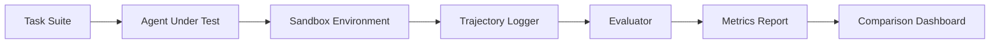
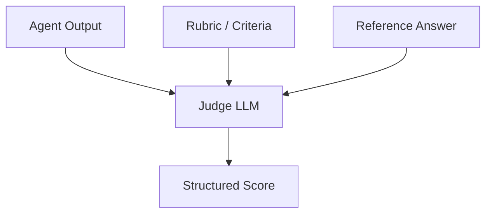

Agent evaluation is one of the hardest unsolved problems in the field and one of the most important. Without rigorous evaluation, you're flying blind. This article covers the principles, metrics, benchmarks, and practical frameworks for measuring agent performance systematically.

## Concept Introduction

Agent evaluation differs from a traditional ML benchmark because agents are not graded on a single right answer. They perform multi-step tasks, use tools, make judgment calls, and recover from mistakes. You need a richer framework: not just "did you get the right answer?" but "did you take reasonable steps, use resources efficiently, and handle surprises gracefully?"

Agent evaluation differs from standard model evaluation in several key ways:

- **Trajectory matters**: An agent that reaches the right answer through dangerous steps (deleting files, leaking data) should score lower than one that takes a safe path
- **Partial credit**: Multi-step tasks have intermediate successes worth measuring
- **Cost awareness**: A correct answer that costs 50 dollars in API calls isn't equivalent to one that costs 5 cents
- **Non-determinism**: Agents produce different trajectories across runs, requiring statistical evaluation
- **Environment interaction**: Agents change their environment, making evaluation stateful and harder to reproduce

The core challenge is that agent performance is a multi-dimensional surface, not a single number.

## Metrics and Measurement

### The Agent Evaluation Hierarchy

Agent performance decomposes into multiple layers, each capturing a different aspect of quality:

```
┌─────────────────────────────┐
│     Task Success Rate       │  ← Did the agent complete the goal?
├─────────────────────────────┤
│     Trajectory Quality      │  ← Was the path reasonable?
├─────────────────────────────┤
│     Efficiency Metrics      │  ← Cost, latency, tool calls
├─────────────────────────────┤
│     Safety & Reliability    │  ← Errors, hallucinations, harm
└─────────────────────────────┘
```

### Key Metrics

**Success metrics:**
- **Pass rate**: Fraction of tasks completed correctly
- **Pass@k**: Probability of at least one success in $k$ attempts, computed as $\text{pass@k} = 1 - \frac{\binom{n-c}{k}}{\binom{n}{k}}$ where $n$ is total runs and $c$ is correct runs

**Trajectory metrics:**
- **Step efficiency**: $\eta = \frac{\text{optimal steps}}{\text{actual steps}}$, measuring how much wasted work the agent does
- **Tool accuracy**: Fraction of tool calls that were necessary and correctly parameterized
- **Recovery rate**: How often the agent recovers after encountering an error

**Cost metrics:**
- **Token cost per task**: Total input + output tokens multiplied by model pricing
- **Cost-adjusted success**: $\text{score} = \frac{\text{success rate}}{\text{mean cost per task}}$, which normalizes performance by expense
- **Latency**: Wall-clock time to completion

**Safety metrics:**
- **Hallucination rate**: Fraction of outputs containing fabricated information
- **Guardrail violation rate**: How often the agent attempts forbidden actions
- **Graceful failure rate**: When the agent fails, does it fail safely?

## Design Patterns & Architectures

A reusable evaluation framework follows a standard architecture:


```mermaid
graph LR
    A[Task Suite] --> B[Agent Under Test]
    B --> C[Sandbox Environment]
    C --> D[Trajectory Logger]
    D --> E[Evaluator]
    E --> F[Metrics Report]
    F --> G[Comparison Dashboard]
```

Key design decisions:

- **Sandboxing**: Agents must run in isolated environments (Docker containers, VMs) to prevent side effects between evaluations
- **Deterministic seeding**: Where possible, fix random seeds and use temperature=0 for reproducibility
- **Multiple runs**: Run each task $n \geq 5$ times and report confidence intervals, not single numbers

When ground truth is hard to define (open-ended tasks, creative output), use a separate LLM to evaluate agent output. This LLM-as-Judge approach works like this:


```mermaid
graph TD
    A[Agent Output] --> B[Judge LLM]
    C[Rubric / Criteria] --> B
    D[Reference Answer] --> B
    B --> E[Structured Score]
```

This pattern is powerful but introduces its own biases: judge LLMs tend to prefer verbose outputs and have position bias (favoring the first option presented).

## Practical Application

A minimal evaluation harness centers on three pieces: an `EvalTask` dataclass (task ID, instruction, success validator), an `EvalResult` dataclass (pass/fail, step count, token usage, latency), and an `AgentEvaluator` class that loops over tasks, runs each `n` times, and aggregates `pass@k`, mean steps, and mean tokens into a metrics dict. The raw Anthropic SDK is the best fit here — no orchestration framework is needed, since evaluation is about observing agent behavior from the outside rather than composing agents together. Data flows from a task list into repeated agent invocations, with each trajectory collected via callbacks and fed into the aggregation step. The evaluator's `_check_success` method accepts either an exact-match string or a callable validator, making it easy to plug in test-suite runners or semantic similarity checks for open-ended tasks.

**Try it**

```
Using the raw Anthropic SDK, build an AgentEvaluator with EvalTask and EvalResult dataclasses.
EvalTask holds: task_id, instruction, optional expected_output string, optional check_fn callable, max_steps, timeout.
EvalResult holds: task_id, success bool, steps_taken, total_tokens, latency_seconds, trajectory list, error string.
AgentEvaluator.run_eval(tasks, n_runs=5) runs each task n times, collects trajectories via callbacks,
and returns a dict of pass_rate, mean_steps, mean_tokens, mean_latency per task_id.
Include inline comments explaining each aggregation step. Make the code runnable end-to-end.
```

## Latest Developments & Research

### SWE-bench Evolution (2024–2025)

SWE-bench, introduced by Jimenez et al. (2024), has become the de facto standard for coding agent evaluation. Key developments:

- **SWE-bench Verified** (2024): A human-validated subset of 500 tasks addressing quality concerns in the original dataset
- Top agents now resolve 50%+ of Verified tasks, up from ~4% when the benchmark launched, showing rapid progress but also raising concerns about benchmark saturation
- **SWE-bench Multimodal** (2025): Extends tasks to include visual bug reports and UI testing

### GAIA and General-Purpose Evaluation (2024)

GAIA (Mialon et al., 2024) tests whether agents can answer questions that require real-world tool use (web browsing, file manipulation, calculation). Even top systems score under 75% on Level 1 questions, revealing how far agents are from robust general capability.

### Emerging Directions

- **Process reward models**: Evaluating each reasoning step, not just the final answer (Lightman et al., 2023)
- **Dynamic benchmarks**: Automatically generating new tasks to prevent overfitting (LiveBench, 2024)
- **Safety evaluations**: Benchmarks specifically for harmful behaviors. MACHIAVELLI (Pan et al., 2023) tests whether agents pursue goals through deceptive or harmful means
- **Cost-performance Pareto frontiers**: Plotting success rate vs. cost to find the best value agents, not just the most accurate ones

### Open Problems

- **Contamination**: How do we ensure benchmark tasks haven't leaked into training data?
- **Ecological validity**: Do benchmark scores predict real-world usefulness?
- **Multi-turn evaluation**: Most benchmarks test single tasks; evaluating agents over long conversations remains difficult

## Cross-Disciplinary Insight

Agent evaluation has a deep parallel in **psychometrics**, the science of measuring human cognitive abilities. Key concepts transfer directly:

- **Reliability**: A good test produces consistent results across runs (test-retest reliability). For agents, this means running evaluations multiple times and measuring variance.
- **Validity**: Does the test measure what it claims? A benchmark that tests "coding ability" but only includes trivial string manipulation has low construct validity.
- **Item Response Theory (IRT)**: In psychometrics, each question has a difficulty parameter and a discrimination parameter (how well it separates strong from weak test-takers). The same framework applies to agent benchmarks: some tasks are informative about agent quality, others are not.
- **Floor and ceiling effects**: If all agents score 0% or 100%, the benchmark is uninformative. Good benchmarks spread agents across the difficulty spectrum.

The lesson from a century of psychometrics: measurement is a science, not an afterthought. The same rigor should apply to agent evaluation.