Every few months, AI gets a new phrase that suddenly shows up everywhere.

Lately, that phrase is agent loop.

You will see people describe agent loops as the future of software, the thing that unlocks autonomy, or the missing ingredient behind useful AI agents. The idea is much less exotic than that.

An agent loop is a repeating cycle:

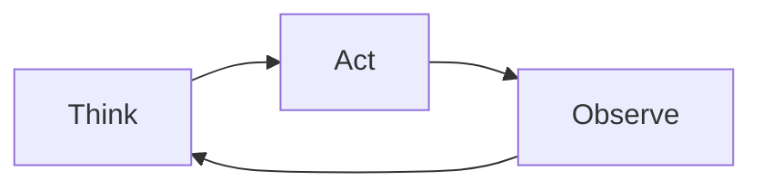

Think. Act. Observe. Repeat.

That is most of it. The important change is not that loops are new. The change is that language models can now take part in the reasoning step inside the loop.

## The difference between an LLM and an agent

A normal LLM call is usually one pass.

A user asks a question. The model writes an answer. The interaction ends.

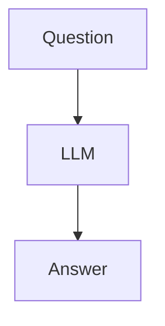

That works when the model already has enough context. If you ask it to summarize text, draft an email, explain a concept, or transform something already in the prompt, one pass may be fine.

It starts to break down when the task needs outside information or intermediate decisions.

For example:

- Investigating a Jira issue
- Looking up customer information
- Researching current events
- Analyzing source code
- Updating records across systems

Those tasks cannot usually be solved by answering from the prompt alone. The model has to inspect something, use the result, decide what to do next, and repeat.

That is where the agent loop appears.

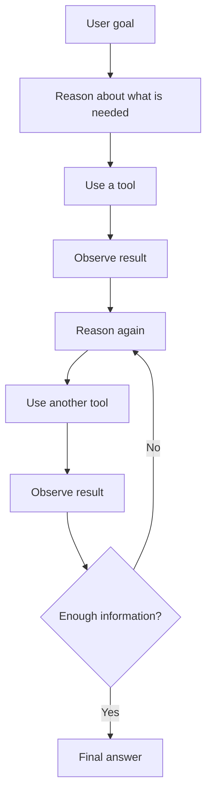

The system keeps cycling until the work is done, blocked, or stopped by a limit.

## A real example

Suppose a user asks:

> What are the top five open Jira bugs affecting enterprise customers?

A plain LLM cannot know that from training data. The answer lives across Jira, customer records, support tickets, escalation notes, and maybe recent incident reports.

An agent might handle it like this:

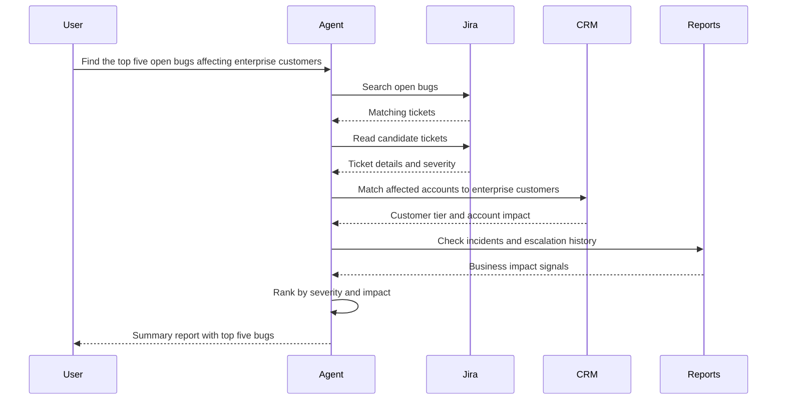

Each step changes what the agent should do next. The Jira search tells it which tickets to read. The ticket details tell it which customers to check. The customer data changes the ranking. The escalation history changes the final answer.

That is the loop doing useful work.

## Why people care now

The pattern itself is old.

What changed is that LLMs can now do some of the reasoning that humans used to do between tool calls.

Older workflows often looked like this:

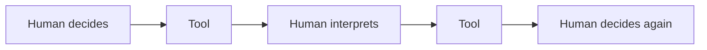

After every result, a person had to decide what to do next.

With an AI agent, the loop can look more like this:

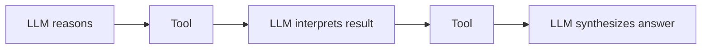

The reasoning is not fully automated, and it should not be treated as if it is. But enough of it can be automated that the system can handle longer tasks than a single prompt ever could.

That still does not make the agent magic. It needs tools, permissions, context, stopping conditions, and a way to check whether it succeeded. The loop is just the skeleton. Most of the real engineering lives around it.

## Agent loops are not new

Software engineers have seen this pattern for years.

Debugging is a loop:

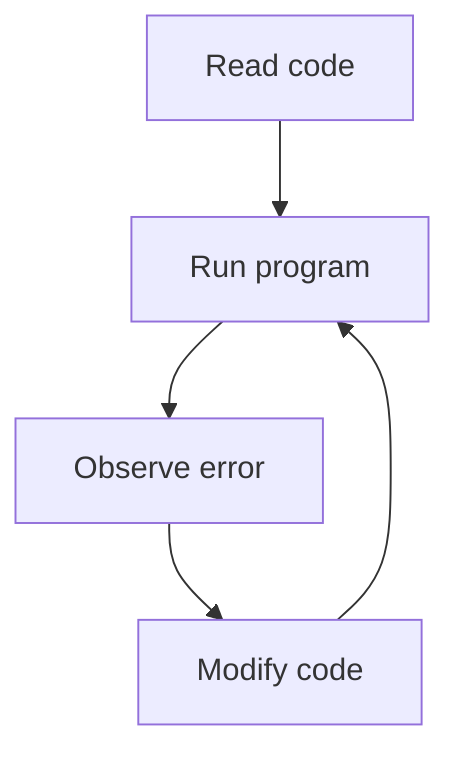

Quality assurance is a loop:

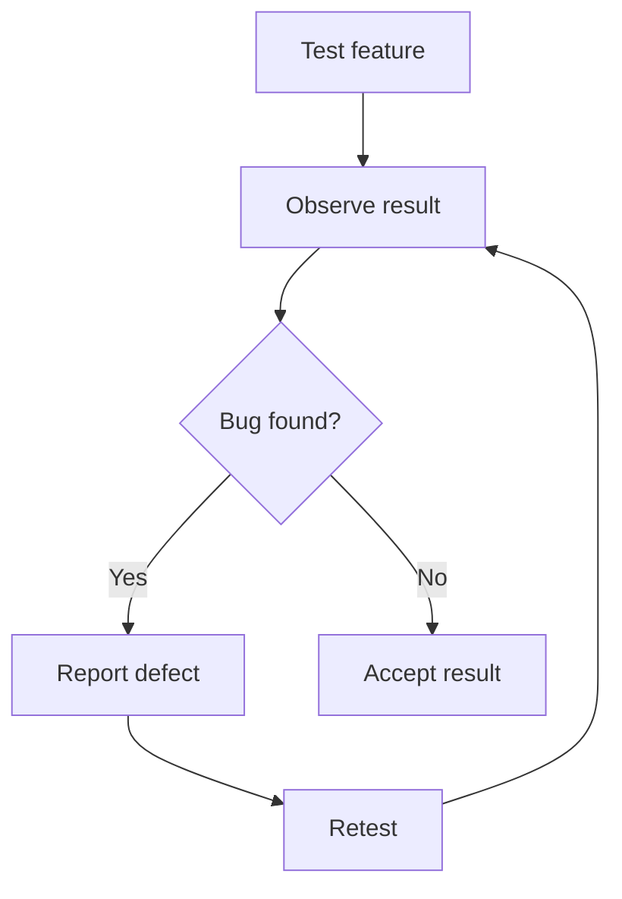

Customer support is a loop:

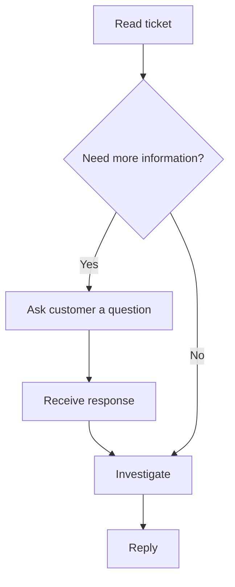

The pattern was already everywhere. The new part is that software can now perform some of the reasoning step instead of waiting for a human at every turn.

## The smallest possible agent loop

Most agent frameworks reduce to something almost boring:

```python
while not task_complete:
    think()
    act()
    observe()
```

Whether you use LangGraph, the OpenAI Agents SDK, Claude Code, or your own loop, the basic shape is the same.

A practical version might look like this:

```python
for step in range(max_steps):
    response = llm(messages)

    if response.type == "final":
        return response.answer

    if response.type == "tool_call":
        result = run_tool(response)
        messages.append(result)
```

The model decides whether it needs more information. If it does, it asks for a tool call. The application runs the tool and feeds the result back into the model. The cycle continues until the model can answer or the system stops it.

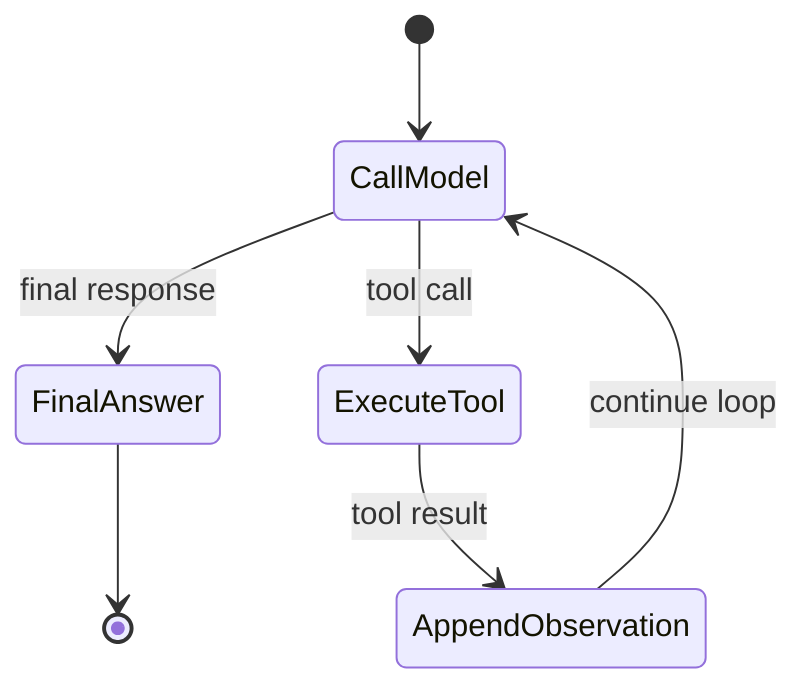

Frameworks add memory, retries, tracing, approvals, streaming, parallel tool calls, and graph-based state transitions. Those features matter. Underneath them, the same loop is still there.

## A project you can build in an afternoon

A Jira investigator is a good first agent because the loop is easy to see.

A user asks:

> Why is customer login failing?

The agent might work through the problem like this:

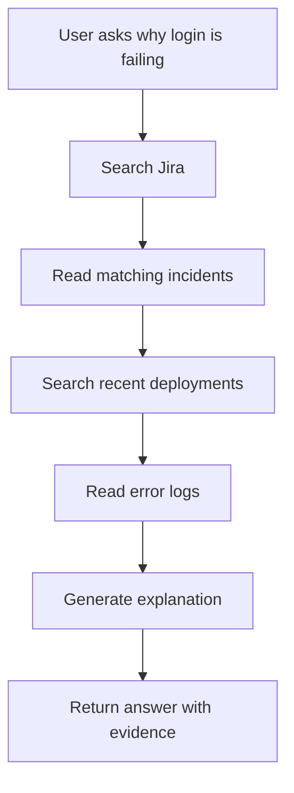

Each step narrows the investigation:

1. Search Jira for related incidents.
2. Read matching tickets.
3. Search recent deployments.
4. Read error logs.
5. Generate an explanation.

The code can be small. The hard parts are connecting reliable tools, handling permissions, and deciding what evidence is enough for the final answer.

## The hard part

Social media often treats the loop itself as the breakthrough.

In practice, the loop is the easy part. The difficult engineering starts once the loop exists.

### When should it stop?

Without limits, an agent can keep going forever. A production agent needs stopping rules: maximum steps, timeouts, confidence thresholds, completion criteria, or explicit handoff rules.

### How many iterations are allowed?

Every pass through the loop costs time and money. A ten-step investigation may be useful. A hundred-step investigation may be slow, expensive, and hard to audit.

### What happens when a tool fails?

External systems are messy. APIs time out. Search results are incomplete. Permissions fail. Agents need recovery strategies, not just happy-path tool calls.

### How do you prevent bad actions?

An agent can call the wrong tool, pass invalid arguments, or misunderstand a result. Tool schemas, validation, constrained action spaces, and human approval gates reduce that risk.

### How do you verify success?

Many tasks need proof, not just a confident final message. It is not enough for an agent to say it completed a migration, updated a record, or found the root cause. The system needs checks that verify the outcome.

### How do multiple agents coordinate?

As systems grow, specialized agents may need to collaborate. Without clear ownership, shared state, and communication rules, multi-agent systems can create more confusion than leverage.

This is where most production engineering time goes.

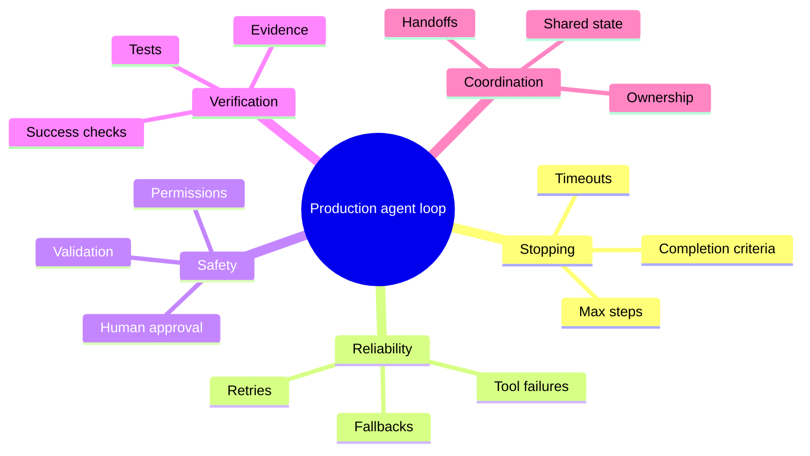

## Why agent loops matter

Agent loops matter because language models can now participate in them.

For decades, humans supplied the reasoning between actions. Now software can handle part of that reasoning, which lets machines run workflows that used to need constant human supervision.

The loop is still simple:

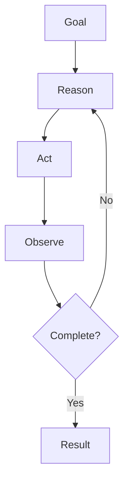

The opportunity is figuring out which useful work fits that shape.

Once you notice the pattern, you start seeing it everywhere: business processes, engineering workflows, support operations, research tasks.

The future of agents probably will not come from inventing a brand-new loop. It will come from mapping more real work onto the loops we already understand, then doing the unglamorous engineering that makes those loops reliable.
