Every few months, a new term starts appearing everywhere in AI discussions.

Recently, that term has been **agent loop**.

You will see posts claiming that agent loops are the future of software, that they unlock autonomous systems, or that they are the missing ingredient behind AI agents.

The reality is much less mysterious.

An agent loop is one of the simplest ideas in computer science. It is a repeating cycle:

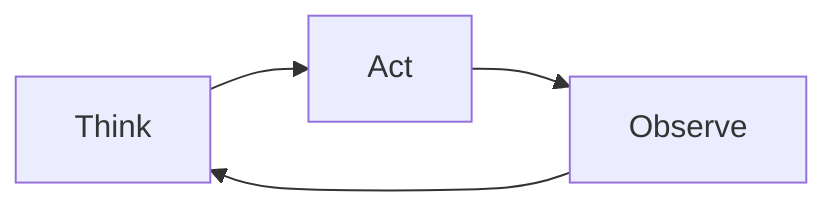

That is the core pattern: **Think -> Act -> Observe -> Repeat**.

Simple as it looks, this loop is responsible for much of what makes modern AI agents useful. The important shift is not that loops are new. It is that language models can now participate in the reasoning step inside the loop.

## The Difference Between an LLM and an Agent

A traditional large language model interaction usually happens in a single pass.

A user asks a question. The model generates an answer. The interaction ends.

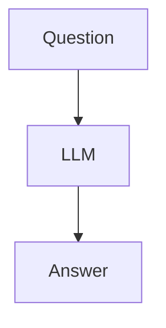

This works well when the model already has enough information to answer. If you ask for a summary, a draft, an explanation, or a transformation of text already in the prompt, a single pass may be enough.

But many real-world tasks require gathering information, interacting with systems, and making decisions based on intermediate results.

Examples include:

- Investigating a Jira issue
- Looking up customer information
- Researching current events
- Analyzing source code
- Updating records across systems

A single prompt is often insufficient for these tasks. The model must perform multiple actions before it can produce a useful answer.

That is where the agent loop appears.

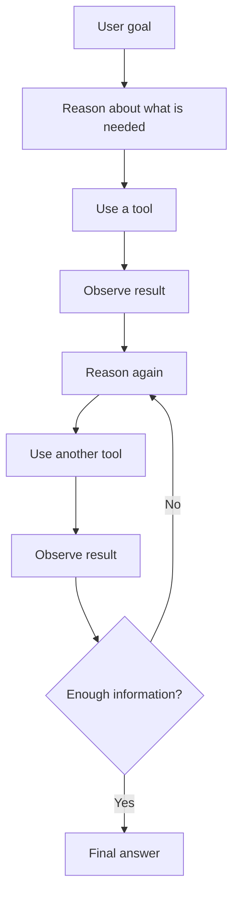

The system keeps cycling until the task is complete, blocked, or stopped by a limit.

## A Real Example

Imagine a user asks:

> What are the top five open Jira bugs affecting enterprise customers?

A standard LLM cannot answer this from its training data. The relevant information lives in Jira, customer records, support tickets, escalation notes, and possibly recent incident reports.

An agent might proceed like this:

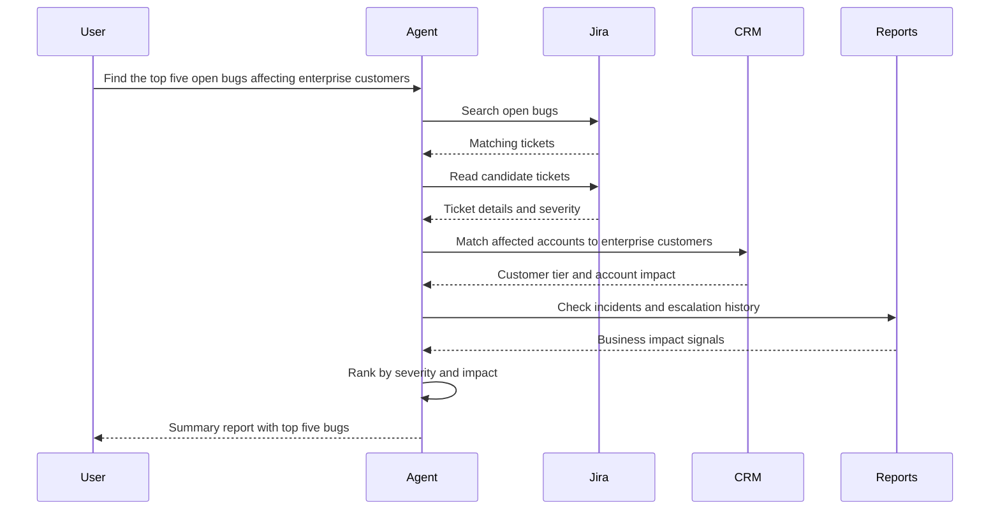

Each step uses the output of the previous step to determine what happens next.

Only after completing these iterations does the agent return a useful answer. Each pass through the cycle is one loop.

## Why Everyone Is Talking About Agent Loops

The idea itself is not new.

What is new is that LLMs can now perform part of the reasoning work that humans historically performed between tool uses.

Older workflows often looked like this:

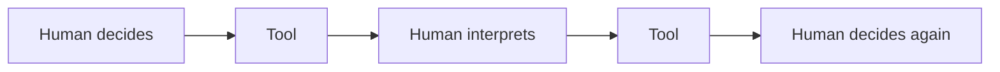

The human was responsible for deciding what to do next after every result.

With an AI agent, the loop can look more like this:

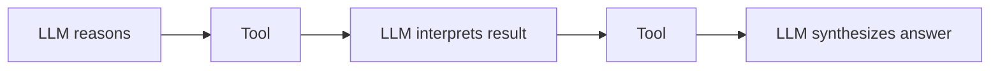

The reasoning process becomes partially automated. That allows systems to handle longer and more complex tasks than a single prompt ever could.

This does not mean the agent is magic. It still needs tools, permissions, useful context, good stopping conditions, and a way to verify whether it succeeded. The loop is only the skeleton. The production system around it is where most of the engineering lives.

## Agent Loops Have Existed for Decades

One reason the hype can be confusing is that software engineers have already seen this pattern many times before.

Debugging is an agent loop:

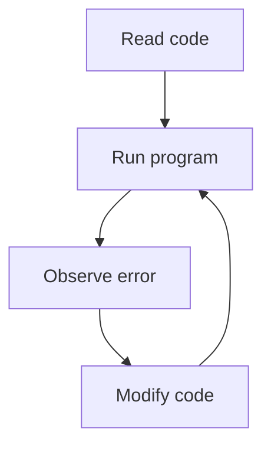

Quality assurance is an agent loop:

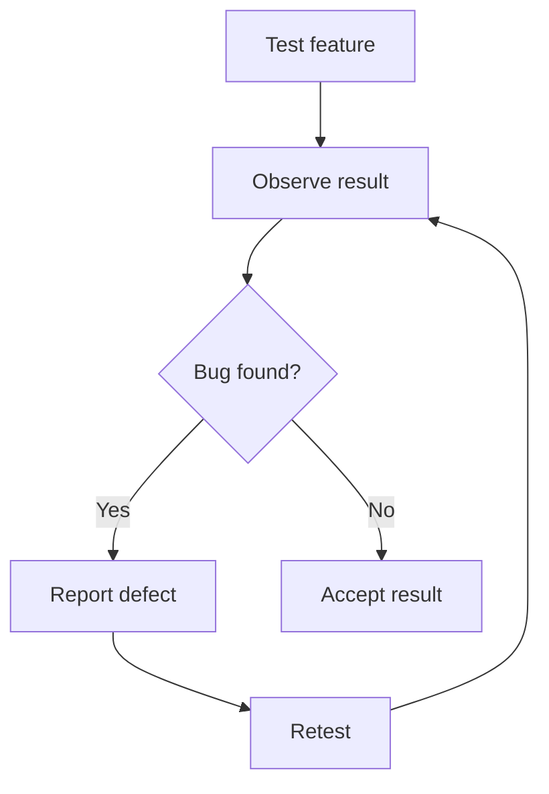

Customer support is an agent loop:

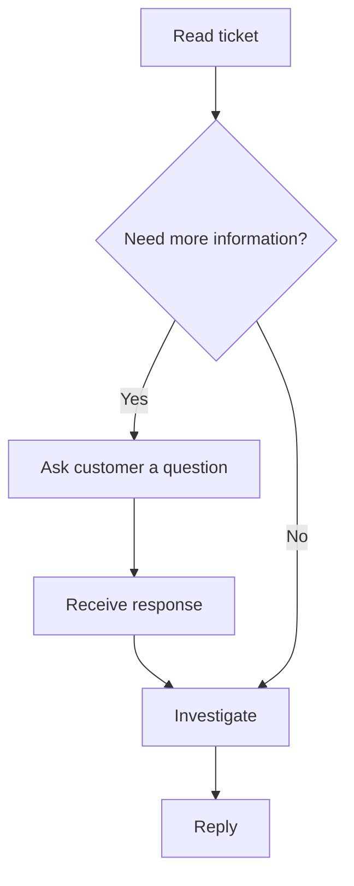

The pattern is everywhere. The difference is that the reasoning step is increasingly being performed by software rather than only by humans.

## The Smallest Possible Agent Loop

Most agent frameworks eventually reduce to something surprisingly small:

```python
while not task_complete:
    think()
    act()
    observe()
```

Whether you use LangGraph, the OpenAI Agents SDK, Claude Code, or your own implementation, the core concept remains the same.

A practical implementation might look like this:

```python
for step in range(max_steps):
    response = llm(messages)

    if response.type == "final":
        return response.answer

    if response.type == "tool_call":
        result = run_tool(response)
        messages.append(result)
```

The model decides whether it needs more information. If it does, it asks to call a tool. The application executes that tool and feeds the result back into the model. The cycle continues until the model can answer or the system stops it.

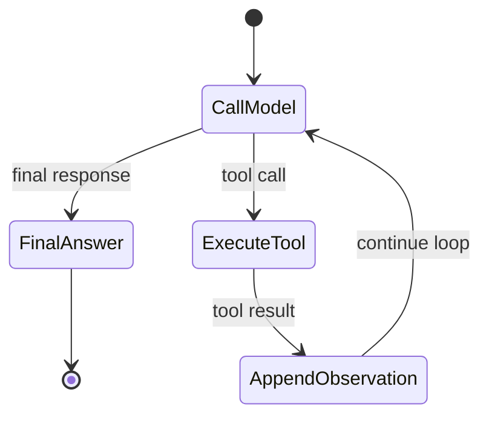

The framework may add memory, retries, tracing, human approval, streaming, parallel tool calls, or graph-based state transitions. But underneath those features, the same loop is still present.

## A Useful Project You Can Build in an Afternoon

One of the simplest real-world agents is a Jira investigator.

A user asks:

> Why is customer login failing?

The loop might work like this:

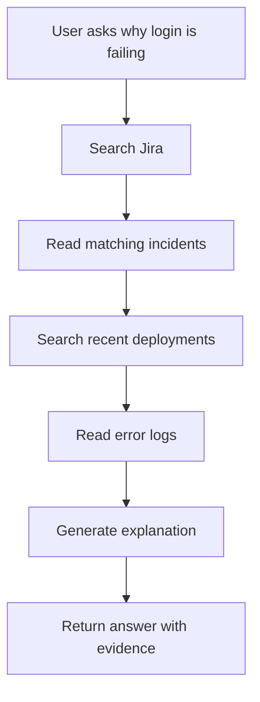

Each step narrows the investigation:

1. Search Jira for related incidents.
2. Read matching tickets.
3. Search recent deployments.
4. Read error logs.
5. Generate an explanation.

The implementation can be surprisingly small. Most of the complexity comes from connecting reliable tools, handling permissions, and deciding what evidence is enough to support the final answer.

## The Hard Part Nobody Talks About

Social media often presents the loop itself as the innovation.

In reality, the loop is usually the easiest part. The difficult engineering challenges begin after the loop exists.

### When Should It Stop?

Without limits, an agent may continue indefinitely. A production agent needs stopping conditions: maximum iterations, timeouts, confidence thresholds, completion criteria, or explicit handoff rules.

### How Many Iterations Are Allowed?

Every iteration costs time and money. A ten-step investigation may be useful. A hundred-step investigation may be slow, expensive, and hard to audit.

### What Happens When a Tool Fails?

External systems are unreliable. APIs time out. Search results are incomplete. Permissions fail. Agents need recovery strategies, not just happy-path tool calls.

### How Do You Prevent Hallucinated Actions?

An agent may call the wrong tool, pass invalid arguments, or misinterpret a result. Tool schemas, validation, constrained action spaces, and human approval gates can reduce this risk.

### How Do You Verify Success?

Many tasks require proof that the outcome is correct. It is not enough for an agent to say it completed a migration, updated a record, or found the root cause. The system needs verification steps.

### How Do Multiple Agents Coordinate?

As systems grow, specialized agents may need to collaborate. Without clear ownership, shared state, and communication rules, multi-agent systems can create more confusion than leverage.

These challenges are where most production engineering effort is spent.

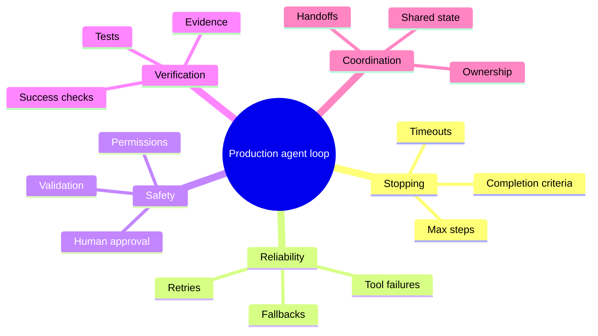

## Why Agent Loops Matter

The significance of agent loops is not that they are a new invention.

The significance is that language models can now participate in them.

For decades, humans provided the reasoning that connected actions together. Now software can perform part of that reasoning. That shift allows machines to execute workflows that previously required constant human supervision.

The loop itself is simple:

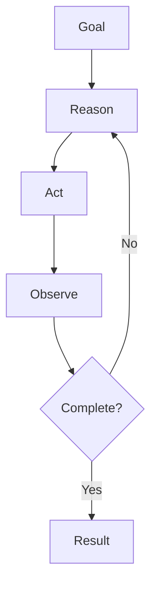

The opportunity comes from deciding what useful work can be expressed in that shape.

Once you start looking for the pattern, you begin to notice it everywhere. Many business processes, engineering workflows, support operations, and research tasks are variations of the same loop.

The future of agents may not come from inventing new loops. It may come from discovering how many existing human workflows can be mapped onto the loops we already understand.
