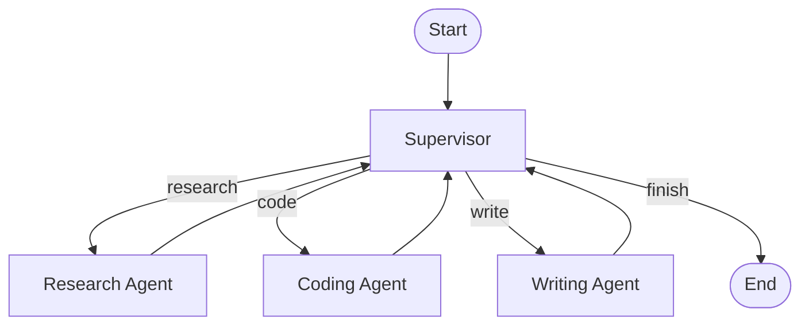
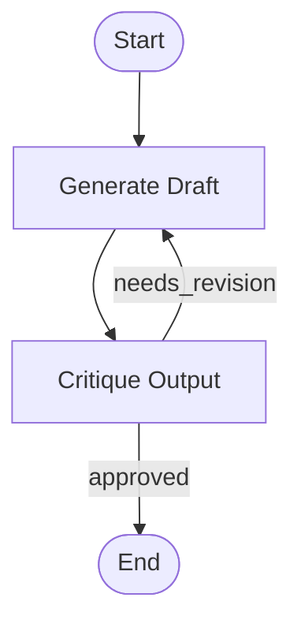
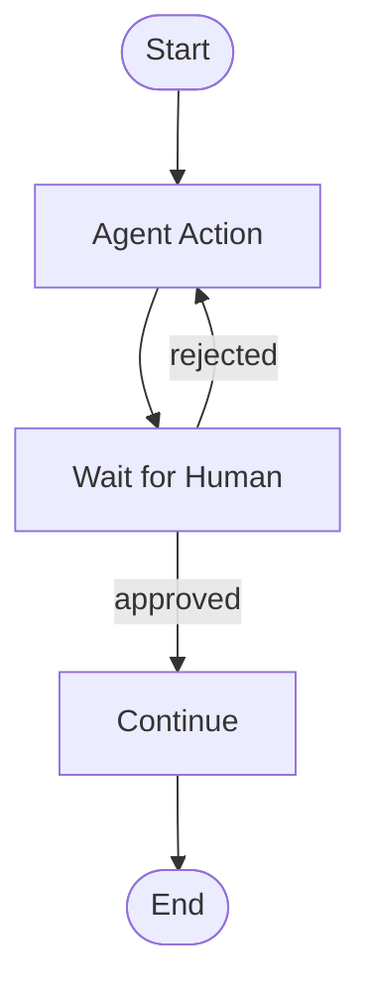

## 1. Concept Introduction

### Simple Terms
Imagine you're building an AI assistant that needs to research a topic, write a draft, review it, make edits, and then decide whether to publish or revise further. Unlike a simple chain where each step happens once in order, this workflow needs **loops, decisions, and state tracking**. That's where graph-based agent workflows come in.

Think of it like a flowchart with a memory: nodes represent actions (like "research" or "review"), edges represent transitions (like "move to editing"), and the graph maintains a shared state (the draft, feedback, research notes) that evolves as the agent moves through the workflow.

### Technical Detail
**Agentic workflow graphs** represent agent systems as directed graphs where:
- **Nodes** are computational units (LLM calls, tool executions, or control logic)
- **Edges** define state transitions (conditional or unconditional)
- **State** is a shared data structure that persists and evolves across node executions
- **Cycles** enable iterative reasoning, self-correction, and multi-turn interactions

This architecture addresses a fundamental limitation of prompt chaining: **linear chains can't handle complex control flow**, error recovery, or adaptive decision-making without brittle workarounds.

LangGraph, built by LangChain, formalizes this pattern by providing:
1. Explicit state management (via state schemas)
2. Cycle support with checkpointing
3. Human-in-the-loop integration points
4. Streaming and persistence

## 2. Historical & Theoretical Context

### Origins
The concept emerged from multiple sources:

**Finite State Machines (FSMs)** and **Petri Nets** (1960s–1980s): Early computational models for concurrent systems with state transitions. Used in workflow engines, protocol design, and distributed systems.

**Business Process Management (BPM)** (1990s–2000s): Tools like BPMN (Business Process Model and Notation) formalized workflow orchestration with human and automated tasks.

**Dataflow Programming** (1970s): Languages like Lucid and modern frameworks like Apache Airflow represent computation as directed acyclic graphs (DAGs) where data flows between nodes.

**ReAct and Iterative Prompting** (2022): Yao et al.'s ReAct paper showed LLMs could alternate between reasoning and acting. However, implementing multi-turn loops with retries required awkward workarounds in chain-based frameworks.

**LangGraph Launch** (2024): LangChain introduced LangGraph to address the limitations of `LLMChain` and sequential pipelines, inspired by Pregel (Google's graph processing framework) and modern workflow orchestration.

### Theoretical Foundation
Graph-based agent workflows align with **control theory** and **multi-agent systems** principles:
- **Feedback loops**: Agents can observe outputs and adjust behavior (supervisor loops)
- **Composability**: Complex systems emerge from simple node combinations
- **Modularity**: Nodes are independently testable units
- **State as first-class citizen**: Explicit state management prevents hidden dependencies

## 3. Algorithms & Core Mechanics

### Graph Execution Algorithm

```
ALGORITHM: StateGraph Execution
INPUT: Graph G = (V, E), initial_state, start_node
OUTPUT: final_state

1. state ← initial_state
2. current_node ← start_node
3. visited_count ← {}
4.
5. WHILE current_node ≠ END:
6.     IF visited_count[current_node] > max_iterations:
7.         RAISE CycleLimitError
8.
9.     // Execute node function
10.    result ← V[current_node].execute(state)
11.
12.    // Update state (merge or replace based on reducer)
13.    state ← state.update(result)
14.
15.    // Checkpoint state (for persistence/replay)
16.    CHECKPOINT(state, current_node)
17.
18.    // Determine next node
19.    IF E[current_node] is conditional:
20.        next_node ← E[current_node].evaluate(state)
21.    ELSE:
22.        next_node ← E[current_node].target
23.
24.    current_node ← next_node
25.    visited_count[current_node] += 1
26.
27. RETURN state
```

### Key Components

**State Schema**: A typed data structure (e.g., TypedDict in Python) that defines what information flows through the graph.

**Reducers**: Functions that determine how to merge new node outputs into existing state (e.g., append to a list, replace a field, keep the latest).

**Conditional Edges**: Functions that inspect the current state and return the name of the next node to execute.

## 4. Design Patterns & Architectures

### Common Graph Patterns

#### 1. Supervisor Pattern
A central "supervisor" node routes tasks to specialized worker nodes.



**Use case**: Multi-agent systems where different LLMs/tools specialize in tasks.

#### 2. Self-Correction Loop
Agent generates output, critiques it, and revises iteratively.



**Use case**: Code generation, writing assistants, adversarial validation.

#### 3. Human-in-the-Loop
Agent pauses for human approval before continuing.



**Use case**: High-stakes decisions (financial, medical), content moderation.

## 5. Practical Application

### Example: Research Assistant with Self-Correction

```python
from langgraph.graph import StateGraph, END
from typing import TypedDict, Annotated, Sequence
import operator

# Define state schema
class AgentState(TypedDict):
    query: str
    research_notes: Annotated[Sequence[str], operator.add]
    draft: str
    critique: str
    revision_count: int

# Define nodes
def research_node(state: AgentState) -> dict:
    """Simulate research (in practice, call tools/search APIs)"""
    query = state["query"]
    notes = [f"Finding 1 about {query}", f"Finding 2 about {query}"]
    return {"research_notes": notes}

def write_draft_node(state: AgentState) -> dict:
    """Generate initial draft"""
    notes = "\n".join(state["research_notes"])
    draft = f"Draft based on:\n{notes}\n\nConclusion: {state['query']} is important."
    return {"draft": draft, "revision_count": state.get("revision_count", 0)}

def critique_node(state: AgentState) -> dict:
    """Evaluate the draft"""
    draft = state["draft"]
    # Simulate LLM critique
    if "important" in draft and state["revision_count"] < 1:
        return {"critique": "needs_revision: Too generic, add specifics"}
    return {"critique": "approved"}

def revise_node(state: AgentState) -> dict:
    """Revise the draft"""
    draft = state["draft"]
    revised = draft + "\n\nRevised: Added specific examples and data."
    return {
        "draft": revised,
        "revision_count": state["revision_count"] + 1
    }

# Build graph
workflow = StateGraph(AgentState)

# Add nodes
workflow.add_node("research", research_node)
workflow.add_node("write", write_draft_node)
workflow.add_node("critique", critique_node)
workflow.add_node("revise", revise_node)

# Add edges
workflow.set_entry_point("research")
workflow.add_edge("research", "write")
workflow.add_edge("write", "critique")

# Conditional edge: critique determines next step
def should_revise(state: AgentState) -> str:
    if "needs_revision" in state["critique"]:
        return "revise"
    return END

workflow.add_conditional_edges(
    "critique",
    should_revise,
    {"revise": "revise", END: END}
)
workflow.add_edge("revise", "critique")

# Compile and run
app = workflow.compile()

# Execute
result = app.invoke({
    "query": "climate change impacts",
    "research_notes": [],
    "draft": "",
    "critique": "",
    "revision_count": 0
})

print("Final Draft:", result["draft"])
print("Revisions Made:", result["revision_count"])
```

### Output
```
Final Draft: Draft based on:
Finding 1 about climate change impacts
Finding 2 about climate change impacts

Conclusion: climate change impacts is important.

Revised: Added specific examples and data.
Revisions Made: 1
```

### Key Features Demonstrated
- **Stateful iteration**: `revision_count` tracks loop iterations
- **Conditional routing**: `should_revise()` decides next node
- **State accumulation**: `research_notes` uses `operator.add` to append findings
- **Cycle handling**: The graph supports `critique → revise → critique` loops

## 6. Comparisons & Tradeoffs

### LangGraph vs. Alternatives

| Feature | LangGraph | LangChain Chains | AutoGen | CrewAI |
|---------|-----------|------------------|---------|--------|
| **Cycles/Loops** | Native | Awkward (manual recursion) | Native (conversation-based) | Limited |
| **State Management** | Explicit schema | Implicit in chain | Message history | Task-based state |
| **Visualization** | Built-in | No | Basic | No |
| **Checkpointing** | Yes | No | Limited | No |
| **Human-in-Loop** | First-class | Manual | Manual | Manual |
| **Learning Curve** | Medium | Low | Medium-High | Low |

### Tradeoffs

**Strengths**:
- **Flexibility**: Handles complex control flow (loops, branches, parallelism)
- **Debuggability**: Explicit state and graph structure make tracing easier
- **Persistence**: Checkpointing enables pause/resume, time-travel debugging
- **Scalability**: Nodes can be distributed across services

**Limitations**:
- **Complexity overhead**: Simple tasks don't need graphs (use chains)
- **Performance**: State serialization and checkpointing add latency
- **Framework lock-in**: Graph definitions aren't portable to other tools

**When to Use Graphs**:
- Multi-turn conversations with branching logic
- Iterative refinement (code review, writing)
- Multi-agent coordination
- Human-in-the-loop workflows
- Systems requiring retry/error handling

**When to Use Chains**:
- Single-pass, linear workflows
- Prototyping and experimentation
- Low-latency requirements

## 7. Latest Developments & Research

### Recent Advances (2023–2025)

**LangGraph Studio (2024)**: Visual IDE for building and debugging graphs. Includes time-travel debugging, state inspection, and real-time graph visualization.

**Multi-Agent Architectures**: Research by Microsoft (AutoGen), Stanford (Generative Agents), and Google (Chain-of-Agents) demonstrates graph-based coordination outperforms single-agent systems on complex tasks.

**Key Papers**:
- **"Graph of Thoughts" (Besta et al., 2023)**: Extends Tree-of-Thoughts to arbitrary graph structures, showing 50%+ improvement on reasoning tasks.
- **"AgentVerse" (Chen et al., 2023)**: Framework for multi-agent collaboration using graph-based communication protocols.
- **"LLM-based Multi-Agent Systems: A Survey" (Guo et al., 2024)**: Comprehensive review showing graph-based architectures dominate in task success rates.

### Benchmarks

**AgentBench (Liu et al., 2023)**: Tests agents on OS interaction, web browsing, and coding. Graph-based agents score 30% higher than chain-based on multi-step tasks.

**WebArena (Zhou et al., 2023)**: Real-world web task benchmark. Stateful graphs handle navigation and form-filling better due to context retention.

### Open Problems
1. **Optimal graph topology discovery**: Can LLMs learn to construct their own workflow graphs?
2. **Cross-agent state synchronization**: How to handle conflicting state updates in parallel branches?
3. **Graph compression**: Large graphs become unwieldy—how to automatically simplify?

## 8. Cross-Disciplinary Insights

### Connection to Distributed Systems

Graph-based agents mirror **distributed computing patterns**:

**Actor Model** (Erlang, Akka): Each node is an "actor" that processes messages and maintains state—same as LangGraph nodes.

**Event-Driven Architecture**: Edges are event triggers, nodes are event handlers. This maps to Kafka streams, AWS Step Functions, and serverless workflows.

**Circuit Breakers**: Conditional edges can implement retry logic and fallback paths, borrowing from microservices resilience patterns.

### Neuroscience Parallel

The brain's **cortical columns** and **thalamo-cortical loops** resemble graph architectures:
- Sensory input → processing → motor output (nodes)
- Feedback loops for error correction (cycles)
- Working memory as shared state (hippocampus)

Graph-based agents externalize what biological systems do implicitly: **maintain state across time while iteratively refining responses**.

## 9. Daily Challenge: Build a Code Review Agent

**Task**: Implement a LangGraph workflow that:
1. Receives a code snippet
2. Runs static analysis (simulate with a function that checks for common issues)
3. Generates a review
4. If critical issues found, revises the code
5. Re-runs analysis (max 2 iterations)
6. Returns final code and review

**Starter Template**:
```python
from langgraph.graph import StateGraph, END
from typing import TypedDict

class CodeReviewState(TypedDict):
    code: str
    issues: list[str]
    review: str
    iteration: int

def analyze(state):
    # TODO: Check for issues (e.g., missing docstrings, long functions)
    pass

def review(state):
    # TODO: Generate review text
    pass

def fix(state):
    # TODO: Apply automated fixes
    pass

def should_continue(state):
    # TODO: Decide if more iterations needed
    pass

# Build your graph here!
```

**Success Criteria**:
- Graph executes at least one revision loop
- Final output includes both code and review
- Iteration count doesn't exceed limit

**Time Box**: 30 minutes

## 10. References & Further Reading

### Official Documentation
- [LangGraph Documentation](https://langchain-ai.github.io/langgraph/)
- [LangGraph Studio](https://blog.langchain.dev/langgraph-studio/)

### Key Papers
- Yao et al. (2023). "Tree of Thoughts: Deliberate Problem Solving with Large Language Models." [arxiv.org/abs/2305.10601](https://arxiv.org/abs/2305.10601)
- Besta et al. (2023). "Graph of Thoughts: Solving Elaborate Problems with Large Language Models." [arxiv.org/abs/2308.09687](https://arxiv.org/abs/2308.09687)
- Chen et al. (2023). "AgentVerse: Facilitating Multi-Agent Collaboration." [arxiv.org/abs/2308.10848](https://arxiv.org/abs/2308.10848)
- Liu et al. (2023). "AgentBench: Evaluating LLMs as Agents." [arxiv.org/abs/2308.03688](https://arxiv.org/abs/2308.03688)

### Tutorials & Examples
- [LangGraph Quickstart](https://langchain-ai.github.io/langgraph/tutorials/introduction/)
- [Multi-Agent Examples](https://github.com/langchain-ai/langgraph/tree/main/examples)
- [Human-in-the-Loop Patterns](https://langchain-ai.github.io/langgraph/how-tos/human-in-the-loop/)

### Related Frameworks
- [Apache Airflow](https://airflow.apache.org/) - DAG-based workflow orchestration
- [Temporal.io](https://temporal.io/) - Durable execution engine
- [Prefect](https://www.prefect.io/) - Modern workflow orchestration

---

**Next Steps**: Try implementing the code review challenge, then explore LangGraph's streaming capabilities to build real-time conversational agents. Compare your graph-based solution to a chain-based approach—you'll immediately see the benefits of explicit state and cycles.
