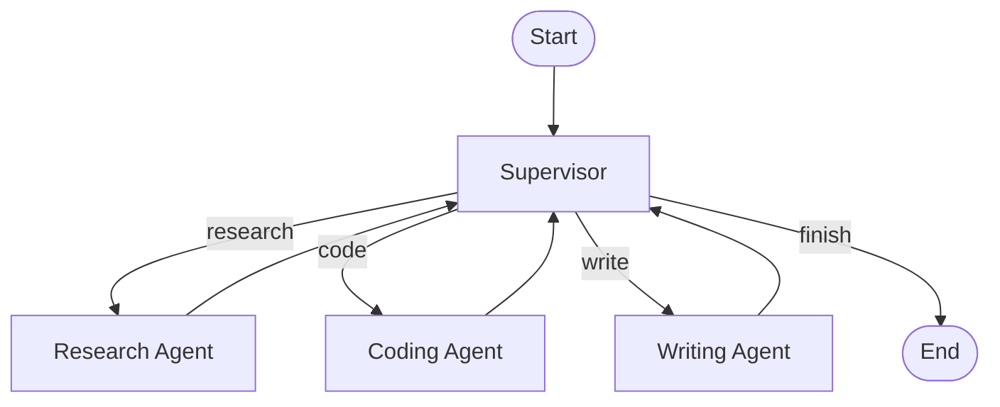
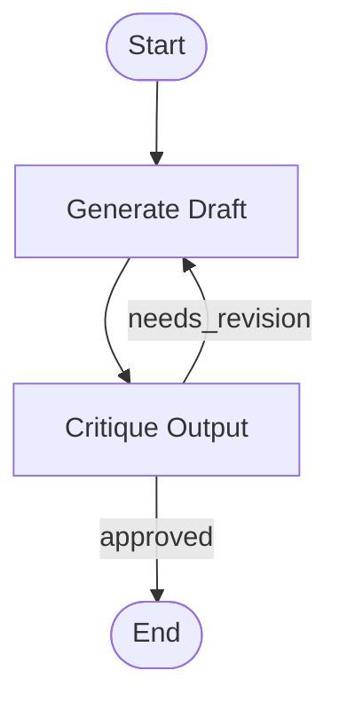
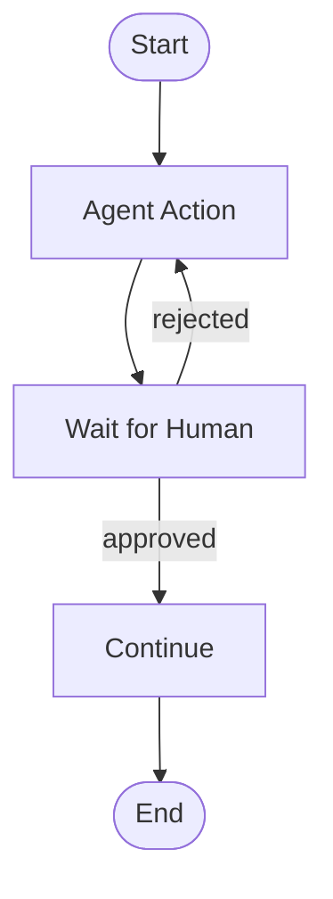

## Concept Introduction

**Agentic workflow graphs** represent agent systems as directed graphs where:
- **Nodes** are computational units (LLM calls, tool executions, or control logic)
- **Edges** define state transitions (conditional or unconditional)
- **State** is a shared data structure that persists and evolves across node executions
- **Cycles** enable iterative reasoning, self-correction, and multi-turn interactions

This architecture addresses a fundamental limitation of prompt chaining: linear chains can't handle complex control flow, error recovery, or adaptive decision-making without brittle workarounds.

LangGraph, built by LangChain, formalizes this pattern by providing:
1. Explicit state management (via state schemas)
2. Cycle support with checkpointing
3. Human-in-the-loop integration points
4. Streaming and persistence

## Algorithms & Core Mechanics

### Graph Execution Algorithm

```
ALGORITHM: StateGraph Execution
INPUT: Graph G = (V, E), initial_state, start_node
OUTPUT: final_state

1. state ← initial_state
2. current_node ← start_node
3. visited_count ← {}
4.
5. WHILE current_node ≠ END:
6.     IF visited_count[current_node] > max_iterations:
7.         RAISE CycleLimitError
8.
9.     // Execute node function
10.    result ← V[current_node].execute(state)
11.
12.    // Update state (merge or replace based on reducer)
13.    state ← state.update(result)
14.
15.    // Checkpoint state (for persistence/replay)
16.    CHECKPOINT(state, current_node)
17.
18.    // Determine next node
19.    IF E[current_node] is conditional:
20.        next_node ← E[current_node].evaluate(state)
21.    ELSE:
22.        next_node ← E[current_node].target
23.
24.    current_node ← next_node
25.    visited_count[current_node] += 1
26.
27. RETURN state
```

### Key Components

**State Schema**: A typed data structure (e.g., TypedDict in Python) that defines what information flows through the graph.

**Reducers**: Functions that determine how to merge new node outputs into existing state (e.g., append to a list, replace a field, keep the latest).

**Conditional Edges**: Functions that inspect the current state and return the name of the next node to execute.

## Design Patterns & Architectures

### Common Graph Patterns

#### Supervisor Pattern
A central "supervisor" node routes tasks to specialized worker nodes.


```mermaid
graph TD
    Start([Start]) --> Supervisor[Supervisor]
    Supervisor -->|research| Research[Research Agent]
    Supervisor -->|code| Coder[Coding Agent]
    Supervisor -->|write| Writer[Writing Agent]
    Research --> Supervisor
    Coder --> Supervisor
    Writer --> Supervisor
    Supervisor -->|finish| End([End])
```

**Use case**: Multi-agent systems where different LLMs/tools specialize in tasks.

#### Self-Correction Loop
Agent generates output, critiques it, and revises iteratively.


```mermaid
graph TD
    Start([Start]) --> Generate[Generate Draft]
    Generate --> Critique[Critique Output]
    Critique -->|needs_revision| Generate
    Critique -->|approved| End([End])
```

**Use case**: Code generation, writing assistants, adversarial validation.

#### Human-in-the-Loop
Agent pauses for human approval before continuing.


```mermaid
graph TD
    Start([Start]) --> Agent[Agent Action]
    Agent --> Wait[Wait for Human]
    Wait -->|approved| Continue[Continue]
    Wait -->|rejected| Agent
    Continue --> End([End])
```

**Use case**: High-stakes decisions (financial, medical), content moderation.

## Practical Application

A minimal LangGraph implementation builds a stateful research-and-revision loop using `StateGraph` with a `TypedDict` schema to hold shared state across nodes. You define discrete nodes — `research_node`, `write_draft_node`, `critique_node`, and `revise_node` — each accepting and returning slices of `AgentState`, with `operator.add` on list fields enabling safe parallel accumulation. A `should_revise` routing function wired via `add_conditional_edges` creates the critique→revise→critique cycle, terminating once a revision threshold is met or the draft is approved. LangGraph is the best fit here because it natively handles cycles, checkpointing, and stateful branching that flat chain frameworks cannot express cleanly.

**Try it**

```
Using LangGraph (langgraph, Python), build a research assistant with a self-correction loop.
Define an AgentState TypedDict with fields: query, research_notes (accumulated with operator.add),
draft, critique, and revision_count. Add nodes for research, write_draft, critique, and revise.
Wire critique to revise via add_conditional_edges — loop back if critique contains "needs_revision",
exit to END otherwise. Cap revisions at 2. Compile and invoke with a sample query.
Include inline comments explaining each node's role and the conditional routing logic.
Produce runnable code.
```

## Latest Developments & Research

### Recent Advances (2023–2025)

**LangGraph Studio (2024)**: Visual IDE for building and debugging graphs. Includes time-travel debugging, state inspection, and real-time graph visualization.

**Multi-Agent Architectures**: Research by Microsoft (AutoGen), Stanford (Generative Agents), and Google (Chain-of-Agents) demonstrates graph-based coordination outperforms single-agent systems on complex tasks.

**Key Papers**:
- **"Graph of Thoughts" (Besta et al., 2023)**: Extends Tree-of-Thoughts to arbitrary graph structures, showing 50%+ improvement on reasoning tasks.
- **"AgentVerse" (Chen et al., 2023)**: Framework for multi-agent collaboration using graph-based communication protocols.
- **"LLM-based Multi-Agent Systems: A Survey" (Guo et al., 2024)**: Comprehensive review showing graph-based architectures dominate in task success rates.

### Benchmarks

**AgentBench (Liu et al., 2023)**: Tests agents on OS interaction, web browsing, and coding. Graph-based agents score 30% higher than chain-based on multi-step tasks.

**WebArena (Zhou et al., 2023)**: Real-world web task benchmark. Stateful graphs handle navigation and form-filling better due to context retention.

### Open Problems
1. **Optimal graph topology discovery**: Can LLMs learn to construct their own workflow graphs?
2. **Cross-agent state synchronization**: How to handle conflicting state updates in parallel branches?
3. **Graph compression**: Large graphs become unwieldy. How to automatically simplify?

## Cross-Disciplinary Insights

### Connection to Distributed Systems

Graph-based agents mirror **distributed computing patterns**:

**Actor Model** (Erlang, Akka): Each node is an "actor" that processes messages and maintains state, the same as LangGraph nodes.

**Event-Driven Architecture**: Edges are event triggers, nodes are event handlers. This maps to Kafka streams, AWS Step Functions, and serverless workflows.

**Circuit Breakers**: Conditional edges can implement retry logic and fallback paths, borrowing from microservices resilience patterns.

### Neuroscience Parallel

The brain's **cortical columns** and **thalamo-cortical loops** resemble graph architectures:
- Sensory input → processing → motor output (nodes)
- Feedback loops for error correction (cycles)
- Working memory as shared state (hippocampus)

Graph-based agents externalize what biological systems do implicitly: maintaining state across time while iteratively refining responses.
