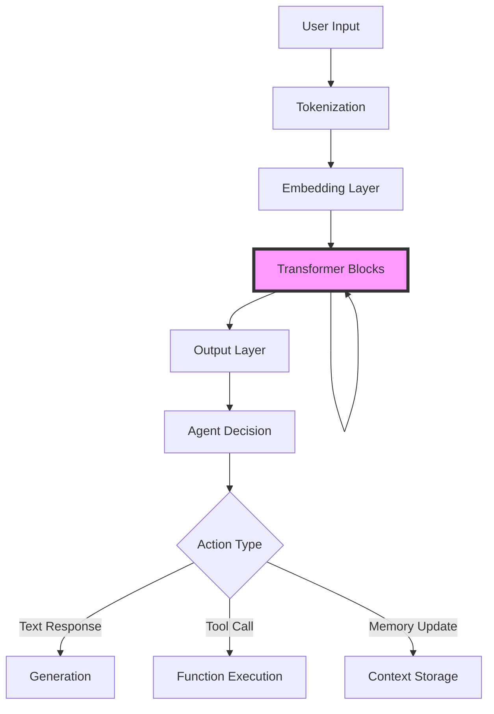

## Introduction: The Cognitive Spotlight

**Simple Explanation:**
Imagine reading a complex legal document. Your eyes don't give equal weight to every word—you focus on key terms, cross-reference earlier clauses, and mentally highlight what matters. This selective focus is exactly what attention mechanisms do for AI agents.

**Technical Detail:**
Attention mechanisms are computational layers that learn to assign different weights (importance scores) to different parts of an input sequence. In the context of AI agents, attention allows the model to dynamically determine which pieces of information—whether from conversation history, tool outputs, or knowledge bases—are most relevant for the current reasoning step.

The transformer architecture, built entirely on attention, has become the backbone of modern AI agents (GPT-4, Claude, Gemini) because it excels at:
- Processing long contexts (thousands of tokens)
- Capturing long-range dependencies
- Enabling parallel computation
- Learning hierarchical representations

## Historical & Theoretical Context

### The Evolution of Attention

**1990s - Early Neural Sequence Models:**
Recurrent Neural Networks (RNNs) and LSTMs processed sequences one token at a time, maintaining a hidden state. This created bottlenecks for long sequences and made parallel training impossible.

**2014 - Bahdanau Attention:**
Dzmitry Bahdanau and colleagues introduced attention for neural machine translation. Instead of compressing an entire sentence into a fixed vector, the decoder could "attend" to different parts of the input for each output word.

**2017 - The Transformer Revolution:**
Vaswani et al.'s paper "Attention Is All You Need" removed recurrence entirely, using only attention mechanisms. This enabled:
- Parallelization across the sequence
- Better gradient flow for training
- Capturing relationships regardless of distance

**2018-Present - The LLM Era:**
Transformers scaled to billions of parameters (GPT-3, GPT-4, Claude), becoming the foundation for conversational agents, tool-using agents, and multi-agent systems.

### Relation to Agent Principles

Attention connects to core agent concepts:
- **Perception:** Agents must filter relevant information from noisy environments
- **Memory:** Attention over past interactions enables context maintenance
- **Reasoning:** Multi-step attention mimics iterative thinking
- **Action Selection:** Attention over available tools/actions helps agents choose appropriately

## The Mechanism: How Attention Works

### Core Concept: Queries, Keys, and Values

Attention operates like a differentiable database lookup:

1. **Query (Q):** What am I looking for?
2. **Key (K):** What does each item represent?
3. **Value (V):** What information does each item contain?

### Mathematical Formulation

For a single attention head:

```
Attention(Q, K, V) = softmax(QK^T / √d_k) V
```

Where:
- `Q` = Query matrix (what we're searching for)
- `K` = Key matrix (what each position offers)
- `V` = Value matrix (the actual content)
- `d_k` = Dimension of keys (scaling factor to stabilize gradients)

**Step-by-step breakdown:**

1. **Compute similarity scores:** `S = QK^T`
   - Measures how relevant each key is to each query
   - Matrix multiplication: (seq_len × d_k) × (d_k × seq_len) = (seq_len × seq_len)

2. **Scale scores:** `S_scaled = S / √d_k`
   - Prevents extreme values that would make softmax too sharp
   - Stabilizes training

3. **Apply softmax:** `A = softmax(S_scaled)`
   - Converts scores to probabilities
   - Each row sums to 1

4. **Weighted sum:** `Output = A × V`
   - Combines values according to attention weights
   - (seq_len × seq_len) × (seq_len × d_v) = (seq_len × d_v)

### Multi-Head Attention

Instead of one attention operation, transformers use multiple "heads" in parallel:

```
MultiHead(Q, K, V) = Concat(head_1, ..., head_h)W^O

where head_i = Attention(QW_i^Q, KW_i^K, VW_i^V)
```

**Why multiple heads?**
- Different heads learn different patterns (syntax vs. semantics, local vs. global)
- Increases model expressiveness
- Allows parallel specialization

### Pseudocode

```python
def scaled_dot_product_attention(Q, K, V, mask=None):
    """
    Q: (batch, seq_len, d_k)
    K: (batch, seq_len, d_k)
    V: (batch, seq_len, d_v)
    """
    d_k = Q.shape[-1]

    # Compute attention scores
    scores = matmul(Q, transpose(K)) / sqrt(d_k)

    # Apply mask (for causal attention in decoders)
    if mask is not None:
        scores = scores.masked_fill(mask == 0, -1e9)

    # Convert to probabilities
    attention_weights = softmax(scores, dim=-1)

    # Apply attention to values
    output = matmul(attention_weights, V)

    return output, attention_weights

def multi_head_attention(x, num_heads, d_model):
    """
    x: (batch, seq_len, d_model)
    """
    d_k = d_model // num_heads

    # Linear projections
    Q = linear(x, W_Q)  # (batch, seq_len, d_model)
    K = linear(x, W_K)
    V = linear(x, W_V)

    # Split into heads
    Q = reshape(Q, (batch, seq_len, num_heads, d_k))
    K = reshape(K, (batch, seq_len, num_heads, d_k))
    V = reshape(V, (batch, seq_len, num_heads, d_k))

    # Transpose for parallel attention
    Q = transpose(Q, (batch, num_heads, seq_len, d_k))
    K = transpose(K, (batch, num_heads, seq_len, d_k))
    V = transpose(V, (batch, num_heads, seq_len, d_k))

    # Apply attention
    output, weights = scaled_dot_product_attention(Q, K, V)

    # Concatenate heads
    output = transpose(output, (batch, seq_len, num_heads, d_k))
    output = reshape(output, (batch, seq_len, d_model))

    # Final linear projection
    output = linear(output, W_O)

    return output
```

## Design Patterns & Architecture

### Where Attention Fits in Agent Systems



### The Transformer Block

Each transformer layer contains:

1. **Multi-Head Self-Attention**
   - Tokens attend to other tokens in the sequence
   - Builds contextual representations

2. **Feed-Forward Network**
   - Two linear layers with activation (typically GELU)
   - Processes each position independently
   - Adds non-linear transformations

3. **Residual Connections + Layer Normalization**
   - Helps gradient flow
   - Stabilizes training

```python
class TransformerBlock:
    def forward(self, x):
        # Self-attention with residual
        attn_output = self.multi_head_attention(x)
        x = self.layer_norm1(x + attn_output)

        # Feed-forward with residual
        ff_output = self.feed_forward(x)
        x = self.layer_norm2(x + ff_output)

        return x
```

### Patterns for Agent Architectures

**1. Causal (Auto-regressive) Attention**
- Used in decoder-only models (GPT, Claude)
- Tokens can only attend to previous positions
- Enables sequential generation
- Perfect for conversational agents

**2. Bidirectional Attention**
- Used in encoder-only models (BERT)
- Tokens attend to entire sequence
- Better for understanding/classification
- Used in agents for input analysis

**3. Cross-Attention**
- Queries from one sequence, keys/values from another
- Used in encoder-decoder models
- Enables tool-augmented generation (attending over tool outputs)

**4. Sparse Attention**
- Reduces O(n²) complexity for long sequences
- Patterns: local windows, strided, global tokens
- Critical for long-context agents

## Practical Application: Building a Mini Attention-Based Agent

Here's a simplified attention mechanism for an agent that processes conversation history:

```python
import torch
import torch.nn as nn
import torch.nn.functional as F
import math

class SimpleAttentionAgent(nn.Module):
    """
    A minimal agent that uses attention to process conversation history
    and decide on the next action.
    """

    def __init__(self, vocab_size, d_model=256, num_heads=4, num_actions=10):
        super().__init__()
        self.d_model = d_model
        self.num_heads = num_heads

        # Embedding layer
        self.embedding = nn.Embedding(vocab_size, d_model)
        self.pos_encoding = PositionalEncoding(d_model)

        # Multi-head attention
        self.attention = nn.MultiheadAttention(d_model, num_heads, batch_first=True)

        # Feed-forward network
        self.ff = nn.Sequential(
            nn.Linear(d_model, d_model * 4),
            nn.GELU(),
            nn.Linear(d_model * 4, d_model)
        )

        # Layer normalization
        self.norm1 = nn.LayerNorm(d_model)
        self.norm2 = nn.LayerNorm(d_model)

        # Action prediction head
        self.action_head = nn.Linear(d_model, num_actions)

    def forward(self, input_ids, attention_mask=None):
        # Embed tokens
        x = self.embedding(input_ids) * math.sqrt(self.d_model)
        x = self.pos_encoding(x)

        # Self-attention with residual connection
        attn_output, attn_weights = self.attention(x, x, x,
                                                    key_padding_mask=attention_mask)
        x = self.norm1(x + attn_output)

        # Feed-forward with residual connection
        ff_output = self.ff(x)
        x = self.norm2(x + ff_output)

        # Take last token representation for action prediction
        last_token = x[:, -1, :]
        action_logits = self.action_head(last_token)

        return action_logits, attn_weights

class PositionalEncoding(nn.Module):
    """Add positional information to embeddings"""

    def __init__(self, d_model, max_len=5000):
        super().__init__()

        # Create positional encoding matrix
        pe = torch.zeros(max_len, d_model)
        position = torch.arange(0, max_len, dtype=torch.float).unsqueeze(1)
        div_term = torch.exp(torch.arange(0, d_model, 2).float() *
                           (-math.log(10000.0) / d_model))

        pe[:, 0::2] = torch.sin(position * div_term)
        pe[:, 1::2] = torch.cos(position * div_term)

        self.register_buffer('pe', pe.unsqueeze(0))

    def forward(self, x):
        return x + self.pe[:, :x.size(1)]

# Example usage
def run_agent_example():
    # Initialize agent
    vocab_size = 10000
    agent = SimpleAttentionAgent(vocab_size=vocab_size, d_model=256,
                                 num_heads=4, num_actions=10)

    # Simulate conversation history (batch of sequences)
    # In practice, this would be tokenized text
    batch_size = 2
    seq_length = 20
    input_ids = torch.randint(0, vocab_size, (batch_size, seq_length))

    # Run forward pass
    action_logits, attention_weights = agent(input_ids)

    # Select action
    actions = torch.argmax(action_logits, dim=-1)

    print(f"Input shape: {input_ids.shape}")
    print(f"Action logits shape: {action_logits.shape}")
    print(f"Attention weights shape: {attention_weights.shape}")
    print(f"Selected actions: {actions}")

    # Visualize attention (for first sample)
    import matplotlib.pyplot as plt

    attn_viz = attention_weights[0].detach().numpy()  # First sample, first head
    plt.figure(figsize=(10, 8))
    plt.imshow(attn_viz, cmap='viridis')
    plt.xlabel('Key Position')
    plt.ylabel('Query Position')
    plt.title('Attention Weights Visualization')
    plt.colorbar()
    plt.savefig('attention_visualization.png')
    print("Attention visualization saved to attention_visualization.png")

if __name__ == "__main__":
    run_agent_example()
```

### Integration with Agent Frameworks

**LangGraph Example:**

```python
from langgraph.graph import StateGraph, END
from langchain_openai import ChatOpenAI
from typing import TypedDict, Annotated
import operator

class AgentState(TypedDict):
    messages: Annotated[list, operator.add]
    context: str

def attention_routing_node(state: AgentState):
    """
    Use attention mechanism to determine which tool to use.
    In practice, LLMs use internal attention to make this decision.
    """
    llm = ChatOpenAI(model="gpt-4", temperature=0)

    # The LLM uses attention over conversation history
    response = llm.invoke(state["messages"])

    return {"messages": [response]}

# Build graph
workflow = StateGraph(AgentState)
workflow.add_node("reasoner", attention_routing_node)
workflow.set_entry_point("reasoner")
workflow.add_edge("reasoner", END)

agent = workflow.compile()
```

**Key Point:** Modern LLM-based frameworks (LangGraph, AutoGen, CrewAI) all leverage transformer attention implicitly. When you call an LLM, attention is determining:
- Which parts of the conversation history matter
- How to weight different tool outputs
- What context to maintain for multi-turn reasoning

## Comparisons & Tradeoffs

### Attention vs. Alternative Approaches

| Approach | Pros | Cons | Use Case |
|----------|------|------|----------|
| **Attention (Transformers)** | Parallel processing, long-range dependencies, state-of-the-art performance | O(n²) complexity, high memory, requires large datasets | General-purpose agents, conversational AI, complex reasoning |
| **RNNs/LSTMs** | Sequential, O(n) memory, good for streaming | Sequential bottleneck, vanishing gradients, poor long-term memory | Real-time processing, limited compute |
| **State Machines** | Deterministic, interpretable, efficient | No learning, manual design, brittle | Rule-based agents, predictable domains |
| **Retrieval (RAG)** | Unlimited context via external memory, efficient | Requires good retrieval, two-stage process | Knowledge-intensive tasks, factual accuracy |

### Scaling Challenges

**Quadratic Complexity:**
- Standard attention is O(n²) in sequence length
- 10k tokens = 100M attention computations
- 100k tokens = 10B computations

**Solutions:**
1. **Sparse Attention** (Longformer, BigBird): Only attend to nearby + global tokens
2. **Linear Attention** (Performers, RWKV): Approximate attention in O(n) time
3. **Hierarchical Processing**: Break long sequences into chunks
4. **State Space Models** (Mamba): Alternative to attention with linear complexity

**Memory Requirements:**
- Storing attention weights: O(n²)
- Gradients during backprop: Also O(n²)
- KV-cache for generation: O(n) per layer

## Latest Developments & Research (2023-2025)

### Breakthrough Papers & Trends

**1. Flash Attention (2022-2024)**
- Dao et al.'s Flash Attention 2 & 3
- Reduces memory from O(n²) to O(n) through clever IO optimization
- 2-3x speedup with no approximation
- Now standard in PyTorch, Hugging Face

**2. Mixture of Depths (2024)**
- Raposo et al., "Mixture-of-Depths: Dynamically allocating compute in transformer-based language models"
- Tokens dynamically choose whether to participate in each layer
- Reduces compute by 50% with minimal quality loss

**3. Multi-Query & Grouped-Query Attention (2023)**
- Shares key/value projections across heads
- Used in Llama 2, GPT-4
- Significantly reduces KV-cache size for generation

**4. Attention Sinks (2023)**
- Xiao et al., "Efficient Streaming Language Models with Attention Sinks"
- Discovered that initial tokens get disproportionate attention
- Enables infinite-length generation by keeping "attention sink" tokens

**5. Agent-Specific Attention Patterns (2024)**
- Research on attention patterns in ReAct-style agents
- Finding: Tool-use agents develop distinct attention patterns
- Opportunity: Design custom attention for agent architectures

### Open Problems

1. **Interpretability:** What do attention heads actually learn?
2. **Efficiency:** Can we break the O(n²) barrier without approximation?
3. **Context Length:** How to scale to millions of tokens?
4. **Multi-Modal Attention:** Optimal fusion of text, image, audio attention?
5. **Agent-Specific Design:** Are general-purpose transformers optimal for agents?

### Recent Benchmarks

- **RULER (2024):** Tests long-context understanding (4k-128k tokens)
  - GPT-4 Turbo: 64k effective context
  - Claude 3: 100k+ effective context

- **AgentBench (2023):** Evaluates agent reasoning
  - Attention over conversation history critical for success
  - Multi-step tasks require 20+ turns of context

- **ToolBench (2023):** Tool-use evaluation
  - Cross-attention between conversation and tool docs crucial
  - Models with better attention generalize better to new tools

## Cross-Disciplinary Insights

### Neuroscience: Biological Attention

**Human Selective Attention:**
- Bottleneck theory (Broadbent, 1958): Limited processing capacity forces selection
- Feature integration theory (Treisman): Attention binds features into objects

**Parallels with AI:**
- Softmax attention = competitive selection (winner-take-all with gradients)
- Multi-head attention = parallel processing streams in visual cortex
- Positional encoding = place cells in hippocampus

**Key Difference:**
- Biological attention is top-down (goal-driven) AND bottom-up (salience)
- Most AI attention is purely bottom-up (data-driven)
- Future work: Incorporating goals into attention (goal-conditioned attention)

### Information Theory

Attention as **information bottleneck:**
- Query defines what information to extract
- Attention weights perform lossy compression
- Output retains only relevant information

**Connection to Shannon's channel capacity:**
- Attention determines which "signals" to amplify
- Softmax ensures probabilistic interpretation
- Cross-entropy loss encourages efficient coding

### Distributed Systems

**Attention as Distributed Database:**
- Keys = database indices
- Queries = search terms
- Values = stored data
- Softmax = soft routing mechanism

**Comparison to MapReduce:**
- Map: Compute all attention scores in parallel
- Reduce: Weighted sum to aggregate information

This perspective helps design efficient attention for multi-agent systems where agents query each other's knowledge.

## Daily Challenge: Implement & Experiment

### Challenge: Visualize Attention in Action

**Goal:** Build a minimal attention layer and visualize how it focuses on different parts of a sequence.

**Task (30 minutes):**

```python
import torch
import torch.nn.functional as F
import matplotlib.pyplot as plt
import numpy as np

def simple_attention(query, key, value):
    """
    Implement scaled dot-product attention from scratch.

    Args:
        query: (seq_len_q, d_k)
        key: (seq_len_k, d_k)
        value: (seq_len_v, d_v)

    Returns:
        output: (seq_len_q, d_v)
        attention_weights: (seq_len_q, seq_len_k)
    """
    # YOUR CODE HERE
    # 1. Compute attention scores (query @ key.T)
    # 2. Scale by sqrt(d_k)
    # 3. Apply softmax
    # 4. Multiply by values
    # 5. Return output and weights
    pass

# Test with a simple example
def test_attention():
    # Create a simple sequence: "The cat sat on the mat"
    # We'll use random embeddings for simplicity
    seq_len = 6
    d_k = 8

    # Create embeddings
    torch.manual_seed(42)
    embeddings = torch.randn(seq_len, d_k)

    # For self-attention, Q=K=V
    output, weights = simple_attention(embeddings, embeddings, embeddings)

    # Visualize attention
    plt.figure(figsize=(8, 6))
    plt.imshow(weights.detach().numpy(), cmap='viridis', aspect='auto')
    plt.colorbar(label='Attention Weight')
    plt.xlabel('Key Position')
    plt.ylabel('Query Position')
    plt.title('Self-Attention Weights')

    words = ['The', 'cat', 'sat', 'on', 'the', 'mat']
    plt.xticks(range(seq_len), words, rotation=45)
    plt.yticks(range(seq_len), words)

    plt.tight_layout()
    plt.savefig('attention_challenge.png')
    print("Visualization saved! Observe which words attend to which.")

    # Analysis questions:
    print("\nAnalysis Questions:")
    print("1. Which word gets the most attention from 'cat'?")
    print("2. Do the two 'the' tokens attend to similar words?")
    print("3. What happens if you increase/decrease d_k?")

if __name__ == "__main__":
    test_attention()
```

**Extension Ideas:**
1. Implement multi-head attention
2. Add a causal mask for decoder-style attention
3. Compare attention patterns with different random seeds
4. Try positional encodings and see how patterns change

**Thought Experiment:**
Design an attention mechanism for a customer service agent. The agent has access to:
- Conversation history (20 turns)
- Product documentation (1000 pages)
- Past customer interactions (database)

How would you structure the attention? Would you use:
- Self-attention over conversation?
- Cross-attention to documentation?
- Sparse attention to similar past cases?
- Hierarchical attention (document → paragraph → sentence)?

Sketch a diagram of your architecture and explain the tradeoffs.

## References & Further Reading

### Foundational Papers

1. **Vaswani et al. (2017)** - "Attention Is All You Need"
   - Original transformer paper
   - https://arxiv.org/abs/1706.03762

2. **Bahdanau et al. (2014)** - "Neural Machine Translation by Jointly Learning to Align and Translate"
   - First attention mechanism
   - https://arxiv.org/abs/1409.0473

3. **Dosovitskiy et al. (2020)** - "An Image is Worth 16x16 Words: Transformers for Image Recognition at Scale"
   - Vision Transformers (ViT)
   - https://arxiv.org/abs/2010.11929

### Recent Advances

4. **Dao et al. (2023)** - "FlashAttention-2: Faster Attention with Better Parallelism and Work Partitioning"
   - https://arxiv.org/abs/2307.08691

5. **Raposo et al. (2024)** - "Mixture-of-Depths: Dynamically allocating compute in transformer-based language models"
   - https://arxiv.org/abs/2404.02258

6. **Xiao et al. (2023)** - "Efficient Streaming Language Models with Attention Sinks"
   - https://arxiv.org/abs/2309.17453

### Tutorials & Implementations

7. **The Annotated Transformer** - Harvard NLP
   - Line-by-line implementation with explanations
   - http://nlp.seas.harvard.edu/annotated-transformer/

8. **Hugging Face Transformers Documentation**
   - https://huggingface.co/docs/transformers/main/en/index

9. **PyTorch nn.Transformer Tutorial**
   - https://pytorch.org/tutorials/beginner/transformer_tutorial.html

### Agent-Specific Resources

10. **LangChain Conceptual Guide - LLMs**
    - How LLMs (and their attention) power agents
    - https://python.langchain.com/docs/concepts/llms/

11. **Anthropic's "Cores & Threads" Explainer**
    - How Claude uses attention for long contexts
    - https://www.anthropic.com/news/claude-3-5-sonnet

### Visualization Tools

12. **BertViz** - Visualize attention in transformer models
    - https://github.com/jessevig/bertviz

13. **Attention Visualization Notebook** - Jay Alammar
    - https://jalammar.github.io/visualizing-neural-machine-translation-mechanics-of-seq2seq-models-with-attention/

### Books

14. **"Speech and Language Processing"** - Jurafsky & Martin (Chapter 10: Transformers and Large Language Models)
    - https://web.stanford.edu/~jurafsky/slp3/

15. **"Deep Learning"** - Goodfellow, Bengio, Courville (Chapter 12: Structured Probabilistic Models)
    - https://www.deeplearningbook.org/

---

## Conclusion: Attention as the Engine of Intelligence

Attention mechanisms have fundamentally transformed AI agents. They enable:
- **Context awareness** - Agents remember and reference relevant history
- **Selective focus** - Agents filter noise from signal
- **Parallel reasoning** - Agents process multiple considerations simultaneously
- **Scalability** - Agents handle increasingly long, complex interactions

As you build AI agents, understanding attention helps you:
- Debug why agents "forget" or "hallucinate"
- Optimize context windows and token usage
- Design better prompts that leverage attention patterns
- Choose appropriate models and architectures

The next generation of agents will likely feature:
- Hybrid attention (sparse + dense)
- Multi-modal attention (text + vision + audio)
- Goal-conditioned attention (task-aware focus)
- Hierarchical attention (reasoning at multiple levels)

Master attention, and you master the foundation of modern agent intelligence.

---

*Next in the series: "From Attention to Reasoning: Chain-of-Thought and Beyond" - How attention enables multi-step reasoning in modern agents.*
