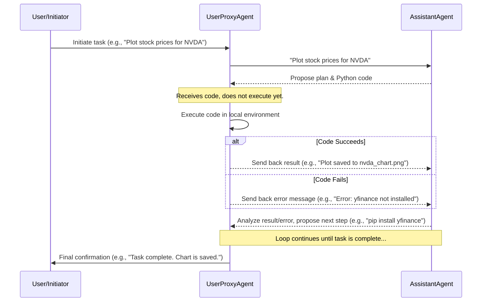

## 1. Concept Introduction

At its core, **AutoGen** is a framework for simplifying the orchestration, optimization, and automation of complex LLM workflows. But what makes it unique is its central metaphor: **conversable agents**.

**Simple Explanation:** Imagine a team of experts in a chat room. You, the user, can talk to a project manager. This manager doesn't do the work itself but knows which expert to talk to—a coder, a data analyst, a writer. The experts can talk to each other, execute code, ask for feedback, and report back. AutoGen allows you to program this "chat room" of AI agents.

**Technical Detail:** AutoGen provides high-level abstractions for building multi-agent applications. The fundamental building blocks are `ConversableAgent`s. These agents are designed to communicate via message passing. They can be configured with different LLMs, prompts, and capabilities. Two key specializations are:

*   **`AssistantAgent`**: A standard AI agent that uses an LLM to reason, chat, and generate code. It acts as the "expert."
*   **`UserProxyAgent`**: A proxy for a human user. It can solicit human input, but more importantly, it can execute code on behalf of the user. This ability to run code (e.g., in a local Python environment) and report back the results is AutoGen's superpower.

The magic happens when you put them together. A `UserProxyAgent` can ask an `AssistantAgent` to write a script. The `AssistantAgent` sends back the code. The `UserProxyAgent` executes it, captures the output (or error), and sends that result back to the `AssistantAgent` for the next step. This loop continues until the task is complete.

## 2. Historical & Theoretical Context

AutoGen was developed by Microsoft Research, emerging from the need to move beyond single-agent, single-turn LLM interactions. It was released in late 2023.

Its intellectual roots lie in several fields:
*   **Multi-Agent Systems (MAS):** The classical AI field focused on how independent agents coordinate to solve problems beyond their individual capabilities.
*   **Blackboard Systems:** An early AI architecture where multiple "knowledge sources" (experts) would read and write to a shared workspace (the blackboard) to solve a problem collaboratively. The conversation history in AutoGen acts as a modern, sequential blackboard.
*   **Human-in-the-Loop (HITL) Computing:** AutoGen formalizes the human's role as just another agent, making it seamless to integrate human feedback, correction, and guidance into the agentic workflow.

## 3. The Core Interaction Loop

There isn't complex math, but the algorithmic flow is key. The conversation is the algorithm. A typical two-agent interaction looks like this:



This turn-based, stateful conversation allows agents to correct mistakes, install dependencies, and iteratively refine their approach—much like a human developer.

## 4. Design Patterns & Architectures

AutoGen embodies the **Conversational Programming** pattern. The control flow is not a rigid script but an emergent property of the conversation. This connects to several architectural concepts:

*   **Event-Driven Architecture:** Each message is an "event" that triggers a response from the next agent in the conversation.
*   **Stateful Agents:** Agents maintain the context of the conversation history to inform their next action.
*   **Proxy Pattern:** The `UserProxyAgent` acts as a proxy for the user, abstracting away the messy details of code execution and environment management.

## 5. Practical Application

Here’s a small Python example of the interaction described above.

```python
# pip install pyautogen
import autogen

# Configure the LLM provider
config_list = autogen.config_list_from_json(
    "OAI_CONFIG_LIST",
    filter_dict={"model": ["gpt-4"]},
)

# 1. Create the AssistantAgent (the coder)
assistant = autogen.AssistantAgent(
    name="Coder",
    llm_config={"config_list": config_list},
)

# 2. Create the UserProxyAgent (the code executor)
user_proxy = autogen.UserProxyAgent(
    name="Executor",
    human_input_mode="NEVER",  # Never ask for human input
    max_consecutive_auto_reply=10,
    is_termination_msg=lambda x: x.get("content", "").rstrip().endswith("TERMINATE"),
    code_execution_config={
        "work_dir": "coding",  # Directory to save files
        "use_docker": False,  # Set to True for sandboxed execution
    },
)

# 3. Start the conversation
user_proxy.initiate_chat(
    assistant,
    message="""
    What is the current date? Compare the year-to-date performance
    of NVIDIA (NVDA) and Tesla (TSLA). Plot the results and save to a file.
    """,
)
```
In this setup, the `Executor` will run any Python code the `Coder` generates in the `./coding` directory, sending back the results until the chart is created and the task is complete.

## 6. Comparisons & Tradeoffs

| Framework | Core Metaphor | Strengths | Weaknesses |
| --- | --- | --- | --- |
| **AutoGen** | **Conversation** | Highly flexible, strong for code-centric tasks, seamless human-in-the-loop. | Can be unpredictable; conversations can loop without careful agent design. |
| **CrewAI** | **Hierarchical Roles** | Structured, process-oriented, good for linear workflows (e.g., research -> write -> review). | Less flexible for dynamic, iterative tasks where the plan might change. |
| **LangGraph** | **State Machine** | Explicit state management, powerful for complex, non-linear workflows with cycles. | Higher learning curve; requires defining a graph structure upfront. |

## 7. Latest Developments & Research

The AutoGen ecosystem is evolving rapidly. Key recent developments include:

*   **GroupChatManager:** A more complex agent to orchestrate conversations between multiple agents (e.g., a Coder, a Critic, and a Product Manager all in one chat). This moves from a two-agent dialogue to a true multi-agent collaboration.
*   **Enhanced Tool Use:** Better integration with function calling, allowing agents to reliably use external tools beyond just writing code.
*   **AutoGen Studio:** A UI for building and configuring AutoGen agent workflows, lowering the barrier to entry.

Research papers are now using AutoGen as a baseline for studying multi-agent behavior, automated software development, and even scientific discovery.

## 8. Cross-Disciplinary Insight

AutoGen's conversational model has a fascinating parallel in **Speech Act Theory**, a concept from the philosophy of language. The theory posits that utterances are not just statements of fact but are themselves *actions*. When an agent sends a message like `{"code": "print('hello')"}`, it's not just sharing information; it's performing the act of *requesting execution*. The `UserProxyAgent`'s response is the act of *reporting a result*. This action-oriented view of language is precisely what makes conversational programming work.

## 9. Daily Challenge / Thought Exercise

In under 30 minutes, do the following:

1.  **Sketch a multi-agent system** for writing and improving documentation.
2.  **Define the agents:** Who are they? (e.g., `DocWriter`, `CodeScanner`, `ExampleGenerator`, `Reviewer`).
3.  **Define their roles:** What is the specific instruction/prompt for each agent?
4.  **Map the conversation flow:** Who talks to whom and in what order? Use a Mermaid diagram if it helps. How does the process start and when does it end?

This exercise will force you to think about task decomposition and agent design, which are the core skills for building with AutoGen.

## 10. References & Further Reading

*   **Paper:** [AutoGen: Enabling Next-Gen LLM Applications via Multi-Agent Conversation](https://arxiv.org/abs/2308.08155)
*   **Official Documentation:** [Microsoft AutoGen Docs](https://microsoft.github.io/autogen/)
*   **GitHub Repository:** [microsoft/autogen](https://github.com/microsoft/autogen)
*   **Blog Post Tutorial:** [AutoGen 101: A First Look](https://towardsai.net/p/programmation/autogen-101-a-first-look-at-microsofts-new-multi-agent-framework-for-llms)
---
