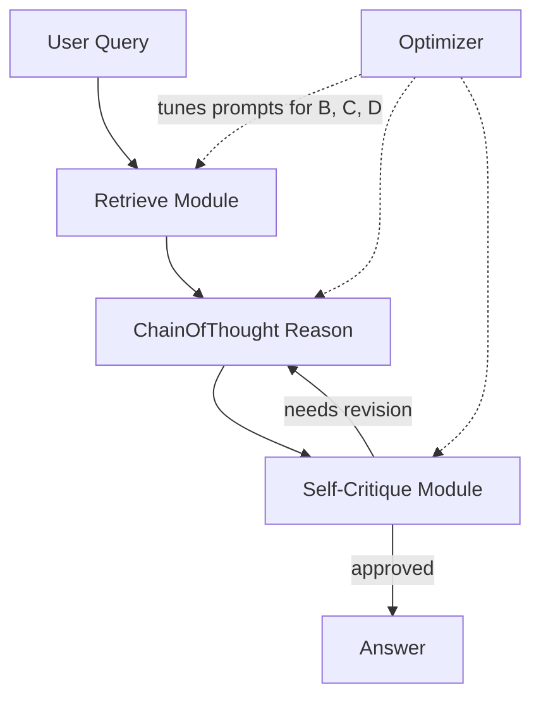

Every serious AI agent builder reaches the same wall. You've wired together a clean pipeline — plan, retrieve, synthesize, respond — but performance plateaus and you're left A/B-testing prompt variations by hand. Change one instruction, re-run evals, change it back, repeat. It's the 1990s hyperparameter tuning problem, dressed in new clothes.

**DSPy** (Declarative Self-improving Python), introduced by Khattab et al. at Stanford in 2023, reframes that wall as an optimization problem. Instead of writing prompts, you write *programs*. Then you let an optimizer find the prompts for you.

---

## 1. Concept Introduction

### Simple Explanation

Imagine building a factory assembly line. You don't bolt every tool in place yourself — you describe *what each station should do* (cut, weld, paint), then a master engineer figures out the exact settings for each machine to maximize output quality.

DSPy works the same way. You describe your agent's logical pipeline — *"take a question, retrieve context, reason step by step, produce an answer"* — and DSPy figures out what instructions and examples to feed each LLM step so that the whole pipeline scores well on your metric.

The key separation DSPy introduces:

- **What the program does** (structure, logic, data flow) → you define this
- **How to prompt the LLM to do it** (instructions, few-shot demos) → DSPy optimizes this

### Technical Detail

DSPy has three core abstractions:

**Signatures** declare typed input/output contracts for an LLM call:
```python
class AnswerFromContext(dspy.Signature):
    """Answer a question based on retrieved context."""
    context: str = dspy.InputField()
    question: str = dspy.InputField()
    answer: str = dspy.OutputField()
```

**Modules** are composable building blocks, analogous to `nn.Module` in PyTorch. The workhorse module `dspy.ChainOfThought` wraps a Signature and elicits step-by-step reasoning. Modules are composable — you nest them to build agents.

**Optimizers** (formerly "teleprompters") take a compiled program, a training set, and a metric, and search for prompts + demonstrations that maximize the metric. The found prompts replace the generic defaults your program started with.

---

## 2. Historical & Theoretical Context

DSPy is the culmination of two decades of work on treating NLP as a programming problem. The genealogy:

- **1990s–2000s**: Compiler-based NLP (parsing, chunking as cascaded classifiers). Explicit structure but brittle.
- **2012–2020**: Deep learning pipelines. Neural but hard to compose or optimize end-to-end across heterogeneous modules.
- **2020–2022**: Prompt engineering emerges. Powerful but manual, brittle to model changes, and unscalable.
- **2023**: DSPy (Khattab et al., Stanford NLP). Prompts become *parameters*, compilation replaces hand-crafting.

The conceptual leap borrows directly from **compiler design**: just as a compiler translates a high-level program into machine code optimized for a target architecture, DSPy *compiles* your abstract pipeline into concrete prompts optimized for your target LLM and metric.

The formal connection: prompt optimization is a **hyperparameter search** over a combinatorial space of natural-language instructions and ordered few-shot example sets. DSPy's optimizers apply techniques from neural architecture search and Bayesian optimization, adapted to the discrete, black-box nature of LLM APIs.

---

## 3. Algorithms and Math

### The Optimization Objective

Given:
- A program $P$ composed of modules $M_1, M_2, \ldots, M_k$
- A training set $\mathcal{D} = \{(x_i, y_i)\}$
- A metric function $\mathcal{M}: \hat{y} \times y \rightarrow [0, 1]$

DSPy seeks parameters $\theta = (\text{instructions}, \text{demonstrations})$ for each module to maximize:

$$\hat{\theta} = \arg\max_{\theta} \frac{1}{|\mathcal{D}|} \sum_{i=1}^{|\mathcal{D}|} \mathcal{M}(P_\theta(x_i),\; y_i)$$

Since $P_\theta$ is a black-box (LLM calls are not differentiable), gradient descent is unavailable. DSPy uses discrete search and bootstrapping instead.

### BootstrapFewShot (the core algorithm)

```
Algorithm: BootstrapFewShot
Input: program P, trainset D, metric M, max_demos k
Output: optimized program P*

1. teacher = P with default (empty) prompts
2. demonstrations = []
3. for each example (x, y) in D:
     trace = execute_with_trace(teacher, x)
     y_hat = trace.final_output
     if M(y_hat, y) > threshold:
         demonstrations.append(trace)  # keep good traces
4. for each module m in P:
     m.demonstrations = sample(demonstrations, k)
5. return P with populated demonstrations
```

The insight: **let the model generate its own few-shot examples** by running on training data and filtering by quality. You bootstrap a student from a teacher's successes.

### MIPROv2 (the advanced optimizer)

MIPROv2 extends BootstrapFewShot with Bayesian optimization over instruction candidates:

1. Generate a pool of candidate instructions per module (using a meta-LLM)
2. Generate a pool of candidate demonstration sets via bootstrapping
3. Use Optuna-style Bayesian search to pick the best (instruction, demo) combination
4. Score each configuration on a held-out validation set

The search space is $(I \times D)^k$ where $I$ is instruction candidates, $D$ is demo set candidates, and $k$ is number of modules — exponential but tractable via Bayesian surrogate models.

---

## 4. Design Patterns and Architectures

DSPy fits naturally into several agent patterns:



**Pattern: Compiled RAG Agent**
The most common DSPy pattern — a retriever-reader pipeline where both the query rewriting step and the synthesis step are optimized jointly. Crucially, DSPy can optimize the query rewriting module using the *downstream* answer metric, propagating signal through retrieval into query construction.

**Pattern: Agentic Loop with Compiled Steps**
In a ReAct-style agent, each action-selection step is a DSPy module. The optimizer tunes the reasoning prompt and the action-parsing prompt independently, something nearly impossible to do systematically by hand.

**Pattern: Multi-Stage Compiler**
Complex pipelines (classify → retrieve → reason → verify) can be compiled in stages: compile the verifier first, then use that as a frozen teacher while compiling the reasoner.

---

## 5. Practical Application

### Core DSPy pipeline

```python
import dspy

# Configure LM
lm = dspy.LM("openai/gpt-4o-mini", temperature=0.0)
dspy.configure(lm=lm)

# --- Define signatures ---
class GenerateSearchQuery(dspy.Signature):
    """Generate a search query to find relevant context."""
    question: str = dspy.InputField()
    query: str = dspy.OutputField()

class SynthesizeAnswer(dspy.Signature):
    """Synthesize a concise answer from retrieved passages."""
    question: str = dspy.InputField()
    context: list[str] = dspy.InputField()
    answer: str = dspy.OutputField()

# --- Compose a module ---
class RAGAgent(dspy.Module):
    def __init__(self, retriever):
        self.retriever = retriever
        self.gen_query = dspy.ChainOfThought(GenerateSearchQuery)
        self.synthesize = dspy.ChainOfThought(SynthesizeAnswer)

    def forward(self, question: str) -> dspy.Prediction:
        query_pred = self.gen_query(question=question)
        passages = self.retriever(query_pred.query)
        answer_pred = self.synthesize(
            question=question,
            context=passages
        )
        return answer_pred

# --- Define metric ---
def exact_match(example, pred, trace=None):
    return int(example.answer.lower() in pred.answer.lower())

# --- Optimize ---
from dspy.teleprompt import MIPROv2

agent = RAGAgent(retriever=my_retriever)
optimizer = MIPROv2(metric=exact_match, auto="medium")

optimized_agent = optimizer.compile(
    agent,
    trainset=train_examples,   # list of dspy.Example objects
    num_trials=30
)

# --- Save and reuse ---
optimized_agent.save("optimized_rag_agent.json")
```

### Using a compiled agent in LangGraph

DSPy modules are callable Python objects. You can wrap them as LangGraph nodes:

```python
from langgraph.graph import StateGraph
import dspy

optimized_agent = dspy.load("optimized_rag_agent.json")

def rag_node(state: dict) -> dict:
    result = optimized_agent(question=state["question"])
    return {"answer": result.answer}

builder = StateGraph(dict)
builder.add_node("rag", rag_node)
builder.set_entry_point("rag")
builder.set_finish_point("rag")

graph = builder.compile()
```

---

## 6. Comparisons and Tradeoffs

| Approach | Control | Effort | Portability | Optimality |
|---|---|---|---|---|
| **Manual prompting** | Full | High, ongoing | Low (model-specific) | Suboptimal |
| **LLM-written prompts** (APE) | Medium | Low | Medium | Better, single-pass |
| **DSPy BootstrapFewShot** | Medium | Low | High | Good, cheap |
| **DSPy MIPROv2** | Low | Low (but costly) | High | Often best |
| **Fine-tuning** | Low | Very high | Very low | Highest potential |

**Strengths:**
- Near-zero manual prompt work after initial setup
- Robust to model swaps — recompile for a new LLM in one command
- Optimizes the whole pipeline, not just individual steps
- Explicit metric-driven development forces you to define success precisely

**Limitations:**
- Requires a labeled training set (20–200 examples is typical)
- Optimization can be expensive — MIPROv2 runs many LLM calls
- Less transparent than a hand-written prompt; the "found" prompts can be verbose
- Complex dynamic agents (long branching loops) are harder to optimize holistically
- Metric quality determines everything — a bad metric produces a bad agent

---

## 7. Latest Developments and Research

**DSPy paper (2023)**: "DSPy: Compiling Declarative Language Model Calls into Self-Improving Pipelines" showed state-of-the-art performance on HotPotQA, GSM8K, and other benchmarks, beating hand-tuned baselines with automatic compilation.

**DSPy 2.0 (2024)**: Introduced typed predictors, structured outputs via Pydantic, and the `dspy.Streamlit` integration for rapid prototyping. MIPROv2 replaced the older MIPRO optimizer, adding a Bayesian meta-learner and better parallelism.

**OPRO (Google, 2023)**: "Optimization by PROmpting" showed that LLMs themselves can propose better instructions when shown gradient-like feedback (scores and previous attempts). DSPy's MIPROv2 incorporates a similar meta-LLM instruction-proposal step.

**TextGrad (2024)**: Uses LLMs as "differentiable functions" to propagate textual feedback backward through pipelines — a kind of natural-language backpropagation. Complementary to DSPy: DSPy handles program structure, TextGrad handles fine-grained iterative refinement.

**Open problem**: How to define good metrics automatically? DSPy optimization is only as good as your metric. Current research explores LLM-as-judge metrics (GPT-4o scoring) as proxies, but these add cost and can have their own biases.

**Open problem**: Continual optimization — as production data shifts, how do you re-optimize without starting from scratch? Warm-starting optimization from previous compilation checkpoints is an active research area.

---

## 8. Cross-Disciplinary Insight

DSPy is essentially a **compiler toolchain** for a new class of programs. The analogy runs surprisingly deep:

| Compiler concept | DSPy concept |
|---|---|
| Source language | Python + Signatures |
| Target architecture | Specific LLM (GPT-4o, Claude, Llama) |
| Compilation | `optimizer.compile(program, trainset)` |
| Optimization passes | BootstrapFewShot, MIPROv2 trials |
| Intermediate representation | Traced execution with labeled I/O |
| Portability (cross-compile) | Recompile same program for a different LLM |

This mirrors how **LLVM** separated language frontends from hardware backends. DSPy separates your agent's *logic* from the *prompt dialect* of any particular model. This has deep implications: as better models arrive, you don't rewrite your agent — you recompile it.

From **automatic control theory**: DSPy is essentially an **auto-tuner** for a feedback control system. The metric is the control objective, the optimizer is the tuner, and each set of prompts+demos is a controller configuration. This framing suggests borrowing ideas like gain scheduling (different prompts for different input distributions) and adaptive control (continuously re-optimizing on live traffic).

---

## 9. Daily Challenge

**Exercise: Compile a Two-Step Agent and Inspect What Changed**

1. Pick a simple task: question answering over a fixed document set, classification, or code generation.
2. Write a minimal 2-module DSPy program (no DSPy knowledge needed — follow the pattern above).
3. Collect 30 labeled examples.
4. Compile with `BootstrapFewShot`.
5. **Inspect the compiled program**: call `optimized_agent.gen_query.demos` to see the bootstrapped demonstrations. What patterns do the selected examples share? Why did the optimizer prefer them?
6. Evaluate both the baseline and compiled agent on a 10-example test set. How much did the metric improve?

**Thought experiment**: Your metric scores an answer as 1 if it's exact-match correct, 0 otherwise. Your agent achieves 70% accuracy. You realize the remaining 30% fail because the answer is *semantically* correct but phrased differently. How would you change the metric, and how would that change what the optimizer discovers?

---

## 10. References and Further Reading

### Papers

- **"DSPy: Compiling Declarative Language Model Calls into Self-Improving Pipelines"** — Khattab et al., Stanford, 2023: https://arxiv.org/abs/2310.03714
- **"Large Language Models Are Human-Level Prompt Engineers"** (APE) — Zhou et al., 2022: https://arxiv.org/abs/2211.01910
- **"Optimization by PROmpting" (OPRO)** — Yang et al., Google DeepMind, 2023: https://arxiv.org/abs/2309.03409
- **"TextGrad: Automatic Differentiation via Text"** — Yuksekgonul et al., 2024: https://arxiv.org/abs/2406.07496

### Documentation & Tutorials

- **DSPy official docs**: https://dspy.ai/
- **DSPy GitHub**: https://github.com/stanfordnlp/dspy
- **DSPy quick-start tutorials**: https://dspy.ai/tutorials/

### Blog Posts

- **"Intro to DSPy: Goodbye Prompting, Hello Programming"** — Leonie Monigatti (Towards Data Science, 2023): A readable first-principles tour
- **"DSPy Explained"** — Connor Shorten (Weaviate blog): Excellent walkthrough with retrieval integration

### Related Frameworks

- **Ax (Meta)** — General-purpose Bayesian optimization: https://ax.dev (the search strategy DSPy MIPROv2 draws on)
- **Optuna** — Hyperparameter tuning library DSPy uses internally: https://optuna.org

---

## Key Takeaways

1. **Prompts are parameters** — treat them as learnable values, not hand-crafted strings
2. **Define your metric first** — the quality of optimization is bounded by the quality of your evaluation
3. **Separate structure from prompts** — write what your agent *does*, let DSPy figure out *how to say it*
4. **Recompile when the model changes** — DSPy's portability is its killer feature in a fast-moving ecosystem
5. **Start cheap, go deep** — `BootstrapFewShot` is free and often good enough; `MIPROv2` is expensive but worth it for production workloads
6. **Inspect the compiled artifacts** — the bootstrapped demos and generated instructions tell you a lot about what makes your task hard

Prompt engineering is a skill that will always matter. But at the pipeline level, DSPy turns it from an art into an engineering discipline — one where effort scales with program structure, not with the number of prompts you need to tune by hand.
