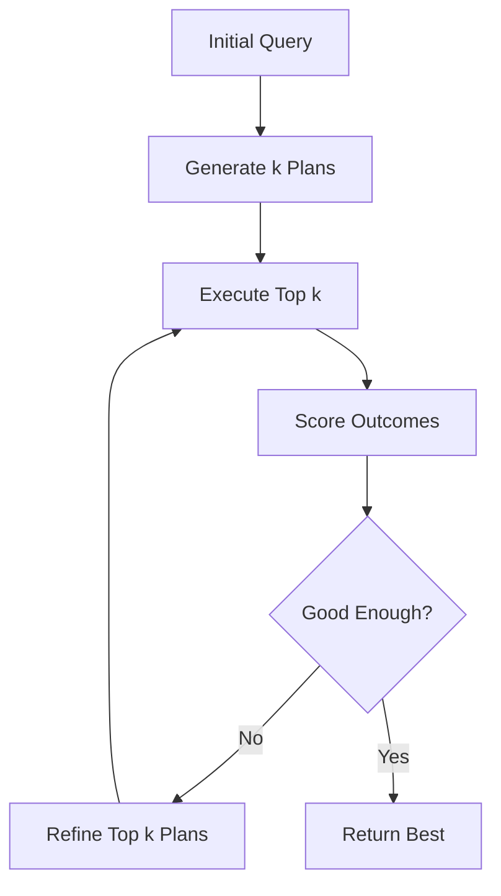

When an AI agent faces a complex problem, should it commit to a single solution path immediately, or explore multiple possibilities in parallel? This fundamental question leads us to **beam search**—an elegant compromise between exhaustive exploration and greedy decision-making that powers everything from machine translation to modern LLM reasoning systems.

## 1. Concept Introduction

### Simple Terms

Imagine you're navigating through a maze, but instead of following just one path at a time, you clone yourself into 3 copies. Each copy explores a different promising route simultaneously. At each junction, you eliminate the copies on the least promising paths and focus on the top 3. This is beam search.

The "beam" is like a spotlight that illuminates only the most promising paths—wide enough to explore multiple options, but narrow enough to remain computationally feasible.

### Technical Detail

Beam search is a **heuristic search algorithm** that explores a graph by expanding the most promising nodes in a limited set. Unlike breadth-first search (which explores all nodes at each level) or greedy best-first search (which follows only the single best path), beam search maintains a fixed-size set of the *k* best partial solutions at each step.

**Key parameters:**
- **Beam width (k):** Number of hypotheses maintained at each step
- **Scoring function:** Evaluates the quality/promise of each partial solution
- **Pruning strategy:** How to select the top-k candidates

The algorithm trades completeness (guaranteed optimal solution) for efficiency (polynomial time complexity).

## 2. Historical & Theoretical Context

Beam search emerged in the 1970s from the speech recognition community, where researchers needed efficient methods to decode acoustic signals into text. The landmark paper by **Lowerre (1976)** introduced beam search for the HARPY speech understanding system at Carnegie Mellon.

The name comes from the analogy to a flashlight beam: you illuminate (keep in memory) only a focused subset of all possible paths, rather than the entire search space.

**Evolution:**
- **1970s-80s:** Speech recognition (Lowerre, Reddy)
- **1990s-2000s:** Machine translation, sequence modeling
- **2010s:** Neural machine translation (Sutskever et al., 2014)
- **2020s:** LLM reasoning, tool-using agents, chain-of-thought decoding

**Theoretical foundation:** Beam search is a form of **bounded rationality**—making the best decision possible within computational constraints. It connects to:
- Information theory (entropy-based pruning)
- Dynamic programming (Viterbi algorithm is beam search with k=1)
- Optimal control (receding horizon control)

## 3. Algorithms & Math

### Basic Beam Search Algorithm

```python
def beam_search(initial_state, beam_width, max_steps, score_fn, expand_fn, is_goal):
    """
    Args:
        initial_state: Starting state
        beam_width: Number of hypotheses to maintain (k)
        max_steps: Maximum search depth
        score_fn: Function that scores a state (higher is better)
        expand_fn: Function that generates successor states
        is_goal: Function to check if state is a goal

    Returns:
        Best complete path found
    """
    # Initialize beam with starting state
    beam = [(score_fn(initial_state), [initial_state])]

    for step in range(max_steps):
        candidates = []

        # Expand each hypothesis in current beam
        for score, path in beam:
            current_state = path[-1]

            # Check if we've reached a goal
            if is_goal(current_state):
                return path

            # Generate successors
            for next_state in expand_fn(current_state):
                new_path = path + [next_state]
                new_score = score_fn(next_state)
                candidates.append((new_score, new_path))

        # Keep only top-k candidates (the beam)
        beam = sorted(candidates, key=lambda x: x[0], reverse=True)[:beam_width]

        if not beam:
            break

    # Return best path found
    return max(beam, key=lambda x: x[0])[1] if beam else None
```

### Scoring Functions

The quality of beam search depends critically on the scoring function. Common approaches:

**1. Log-probability (for sequence generation):**
```
score(sequence) = Σ log P(token_i | token_1...token_{i-1})
```

**2. Length-normalized score (prevents bias toward short sequences):**
```
score(sequence) = (1/|sequence|^α) × Σ log P(token_i | context)
```
where α ∈ [0.6, 0.8] typically.

**3. Heuristic-guided (for planning):**
```
score(state) = g(state) + h(state)
```
where g = cost so far, h = heuristic estimate to goal (like A*)

## 4. Design Patterns & Architectures

Beam search appears in several agent architecture patterns:

### Pattern 1: Generator-Ranker Pipeline
```
[LLM Generator] → [Beam Expansion] → [Scoring/Ranking] → [Pruning] → [Selection]
```

### Pattern 2: Parallel Reasoning Chains
```
Input → [Split into k reasoning paths] → [Execute in parallel] → [Aggregate/Vote] → Output
```

### Pattern 3: Iterative Refinement with Beams


This pattern connects with:
- **Event-driven architecture:** Each beam expansion is an event
- **Planner-Executor loop:** Each beam represents a different plan
- **Ensemble methods:** Beams as diverse hypotheses

## 5. Practical Application

### Example 1: LLM-Based Planning with Beam Search

```python
import anthropic
from typing import List, Tuple
import asyncio

class BeamSearchAgent:
    def __init__(self, client: anthropic.Anthropic, beam_width: int = 3):
        self.client = client
        self.beam_width = beam_width

    def score_plan(self, plan: str, task: str) -> float:
        """Score a plan using LLM self-evaluation"""
        prompt = f"""Task: {task}

Proposed plan:
{plan}

Rate this plan's quality on a scale of 0-100 considering:
- Feasibility
- Completeness
- Efficiency

Return only a number."""

        response = self.client.messages.create(
            model="claude-sonnet-4-5-20250929",
            max_tokens=10,
            messages=[{"role": "user", "content": prompt}]
        )

        try:
            return float(response.content[0].text.strip())
        except:
            return 0.0

    def expand_plan(self, partial_plan: str, task: str, step: int) -> List[str]:
        """Generate next step alternatives for a partial plan"""
        prompt = f"""Task: {task}

Current plan:
{partial_plan}

Generate 3 different possible next steps to continue this plan.
Return them as a numbered list."""

        response = self.client.messages.create(
            model="claude-sonnet-4-5-20250929",
            max_tokens=500,
            messages=[{"role": "user", "content": prompt}]
        )

        # Parse the response to extract alternatives
        text = response.content[0].text
        alternatives = []
        for line in text.split('\n'):
            if line.strip().startswith(('1.', '2.', '3.')):
                alternatives.append(line.split('.', 1)[1].strip())

        return [f"{partial_plan}\nStep {step}: {alt}" for alt in alternatives]

    def beam_search_plan(self, task: str, max_steps: int = 5) -> str:
        """Use beam search to find best plan"""
        # Initialize beam
        initial_prompt = f"Task: {task}\n\nPlan:\n"
        beam = [(0.0, initial_prompt)]

        for step in range(1, max_steps + 1):
            candidates = []

            for score, partial_plan in beam:
                # Expand each hypothesis
                expansions = self.expand_plan(partial_plan, task, step)

                for expansion in expansions:
                    new_score = self.score_plan(expansion, task)
                    candidates.append((new_score, expansion))

            # Keep top-k
            beam = sorted(candidates, key=lambda x: x[0], reverse=True)[:self.beam_width]

            print(f"\n=== Step {step} - Top {len(beam)} Plans ===")
            for i, (score, plan) in enumerate(beam, 1):
                print(f"\nPlan {i} (score: {score:.1f}):\n{plan}\n")

        # Return best plan
        return max(beam, key=lambda x: x[0])[1]


# Usage example
if __name__ == "__main__":
    client = anthropic.Anthropic()
    agent = BeamSearchAgent(client, beam_width=3)

    task = "Build a web scraper that monitors prices across 5 e-commerce sites"
    best_plan = agent.beam_search_plan(task, max_steps=4)

    print("\n=== FINAL BEST PLAN ===")
    print(best_plan)
```

### Example 2: Integrating with LangGraph

```python
from langgraph.graph import StateGraph, END
from typing import TypedDict, List, Annotated
import operator

class BeamState(TypedDict):
    input: str
    beams: Annotated[List[Tuple[float, str]], operator.add]
    current_step: int
    max_steps: int
    beam_width: int

def expand_beams(state: BeamState) -> BeamState:
    """Expand current beams with new candidates"""
    new_candidates = []

    for score, path in state["beams"][-state["beam_width"]:]:
        # Generate alternatives (simplified)
        alternatives = generate_next_actions(path, state["input"])

        for alt in alternatives:
            new_path = f"{path} → {alt}"
            new_score = score_path(new_path, state["input"])
            new_candidates.append((new_score, new_path))

    # Prune to top-k
    top_k = sorted(new_candidates, key=lambda x: x[0], reverse=True)[:state["beam_width"]]

    return {
        **state,
        "beams": top_k,
        "current_step": state["current_step"] + 1
    }

def should_continue(state: BeamState) -> str:
    """Determine if we should continue expanding"""
    if state["current_step"] >= state["max_steps"]:
        return "end"
    return "expand"

# Build graph
workflow = StateGraph(BeamState)
workflow.add_node("expand", expand_beams)
workflow.set_entry_point("expand")
workflow.add_conditional_edges("expand", should_continue, {
    "expand": "expand",
    "end": END
})

beam_agent = workflow.compile()
```

## 6. Comparisons & Tradeoffs

| Approach | Completeness | Time Complexity | Space | Best For |
|----------|-------------|-----------------|-------|----------|
| **Greedy (k=1)** | No | O(bd) | O(d) | Fast, good heuristics |
| **Beam Search** | No | O(kbd) | O(kd) | Balanced exploration |
| **BFS** | Yes | O(b^d) | O(b^d) | Small spaces |
| **A*** | Yes (admissible h) | O(b^d) | O(b^d) | Optimal solutions needed |
| **MCTS** | Asymptotically | O(n iterations) | O(tree size) | Games, exploration |

**Beam Search Strengths:**
- Naturally parallel (beams are independent)
- Tunable complexity via beam width
- Works well with neural scoring functions
- Effective for sequence generation tasks

**Limitations:**
- No optimality guarantees
- Can get stuck in local optima
- Beam width selection is problem-dependent
- Doesn't recover from early mistakes (unlike backtracking)

**Tuning Guidelines:**
- k=1: Greedy (fastest, least exploration)
- k=3-5: Good default for most LLM tasks
- k=10-50: Complex reasoning, translation
- k=100+: When diversity is critical

## 7. Latest Developments & Research

### Recent Breakthroughs (2023-2025)

**1. Self-Evaluation Guided Beam Search (2023)**
- Research from DeepMind shows LLMs can score their own outputs
- Enables end-to-end differentiable beam search
- Paper: "Self-Evaluation Improves Selective Generation" (Madaan et al., 2023)

**2. Diverse Beam Search (2024)**
- Adds diversity penalty to prevent beam collapse
- Score = quality - λ × similarity_to_other_beams
- Used in GPT-4's creative tasks
- Originated from "Diverse Beam Search for Improved Description of Complex Scenes" (Vijayakumar et al., 2018), refined for LLMs

**3. Contrastive Decoding with Beams (2024)**
- Combines beam search with contrastive scoring
- Score based on expert_model(x) / amateur_model(x)
- Improves factuality in generation
- Paper: "Contrastive Decoding Improves Reasoning in Large Language Models" (O'Brien & Lewis, 2024)

**4. Beam Search for Chain-of-Thought (2024-2025)**
- Apply beam search at the reasoning step level, not token level
- Each beam = different reasoning chain
- Ensemble final answers or re-rank
- Emerging pattern in o1-style models

**Open Problems:**
- Optimal beam width determination (still mostly heuristic)
- Handling extremely large action spaces
- Credit assignment in multi-step reasoning
- Computational cost vs. quality tradeoffs at scale

### Notable Benchmarks

- **WMT Translation:** Beam search (k=5) standard baseline
- **GSM8K Math Reasoning:** Beam search over reasoning paths improves accuracy by 15-30%
- **HumanEval Coding:** Beam width of k=10 with test-based scoring achieves SOTA

## 8. Cross-Disciplinary Insight

### Connection to Neuroscience: Predictive Processing

The brain doesn't commit to single interpretations—it maintains multiple hypotheses about sensory input. The **predictive processing framework** suggests the brain uses a form of "mental beam search":

- **Hypothesis generation:** Multiple perceptual interpretations
- **Evidence accumulation:** Updating probabilities as data arrives
- **Pruning:** Inhibiting unlikely interpretations
- **Selection:** Committing to most probable hypothesis

This parallels beam search's maintain-score-prune cycle. The beam width might correspond to working memory capacity (Miller's 7±2 items).

### Connection to Economics: Portfolio Theory

Beam search is analogous to **portfolio diversification**:
- Each beam = an investment
- Beam width = portfolio size
- Scoring = expected return
- Pruning = rebalancing

Just as investors maintain multiple assets to hedge risk, beam search maintains multiple hypotheses to hedge against early mistakes.

### Connection to Evolution: Parallel Descent

Evolution explores multiple "solutions" (species) in parallel through populations. Natural selection is the "scoring function," and extinction is pruning. Beam search formalizes this:
- Population = beam
- Fitness = score
- Mutation/crossover = expansion
- Selection = pruning

## 9. Daily Challenge: Build a Beam Search Code Generator

**Task:** Implement a coding agent that uses beam search to generate Python functions, testing each beam against unit tests.

**Requirements:**
1. Start with a function signature and docstring
2. Generate k=3 different implementations at each step
3. Score each based on passing test cases
4. Continue for 3 expansion steps
5. Return the best working implementation

**Starter code:**

```python
def code_beam_search(
    function_spec: str,
    test_cases: List[Tuple[List, Any]],
    beam_width: int = 3
) -> str:
    """
    Use beam search to generate working code.

    Args:
        function_spec: Function signature + docstring
        test_cases: List of (input_args, expected_output)
        beam_width: Number of implementations to explore

    Returns:
        Best implementation found
    """
    # TODO: Implement this!
    pass

# Example usage:
spec = '''
def fibonacci(n: int) -> int:
    """Return the nth Fibonacci number."""
    pass
'''

tests = [
    ([0], 0),
    ([1], 1),
    ([5], 5),
    ([10], 55)
]

best_code = code_beam_search(spec, tests)
print(best_code)
```

**Extension challenges:**
- Add diversity penalty to prevent generating similar code
- Implement length normalization for scoring
- Try different expansion strategies (mutate vs. rewrite)
- Compare beam widths k=1,3,5 on success rate

**Time estimate:** 20-30 minutes

## 10. References & Further Reading

### Foundational Papers
1. **Lowerre, B. (1976).** "The HARPY Speech Recognition System." CMU Computer Science Department.
2. **Sutskever et al. (2014).** "Sequence to Sequence Learning with Neural Networks." NIPS.
   - https://arxiv.org/abs/1409.3215
3. **Vijayakumar et al. (2018).** "Diverse Beam Search for Improved Description of Complex Scenes." AAAI.
   - https://arxiv.org/abs/1610.02424

### Recent Research
4. **Madaan et al. (2023).** "Self-Refine: Iterative Refinement with Self-Feedback." NeurIPS.
   - https://arxiv.org/abs/2303.17651
5. **Li et al. (2024).** "Contrastive Decoding Improves Reasoning in Large Language Models." arXiv.
   - https://arxiv.org/abs/2309.09117
6. **Xie et al. (2024).** "Self-Evaluation Guided Beam Search for Reasoning." arXiv.
   - https://arxiv.org/abs/2305.00633

### Practical Resources
7. **Hugging Face Transformers Beam Search:** https://huggingface.co/blog/how-to-generate
8. **LangChain Beam Search Example:** https://github.com/langchain-ai/langchain/discussions/beam-search
9. **Anthropic Claude with Beam Decoding:** https://docs.anthropic.com/claude/docs (see parallel sampling)

### Blog Posts & Tutorials
10. **"Beam Search Demystified"** - Jay Alammar: https://jalammar.github.io/visualizing-neural-machine-translation-mechanics-of-seq2seq-models-with-attention/
11. **"Modern Beam Search for LLMs"** - Lilian Weng: https://lilianweng.github.io/posts/2023-01-10-decoding/

### GitHub Implementations
12. **OpenNMT Beam Search:** https://github.com/OpenNMT/OpenNMT-py
13. **AllenNLP Beam Search:** https://github.com/allenai/allennlp
14. **Minimal Beam Search (educational):** https://github.com/google-research/language/tree/master/language/search

---

**Key Takeaway:** Beam search is a fundamental tool in the AI agent programmer's toolkit. It bridges classical search algorithms and modern neural generation, offering a tunable balance between exploration breadth and computational efficiency. In an era where LLMs can generate and score their own outputs, beam search becomes even more powerful—enabling agents to think through multiple paths before committing to a solution. Master this technique, and you'll have a versatile pattern applicable from machine translation to multi-step reasoning to creative problem-solving.
