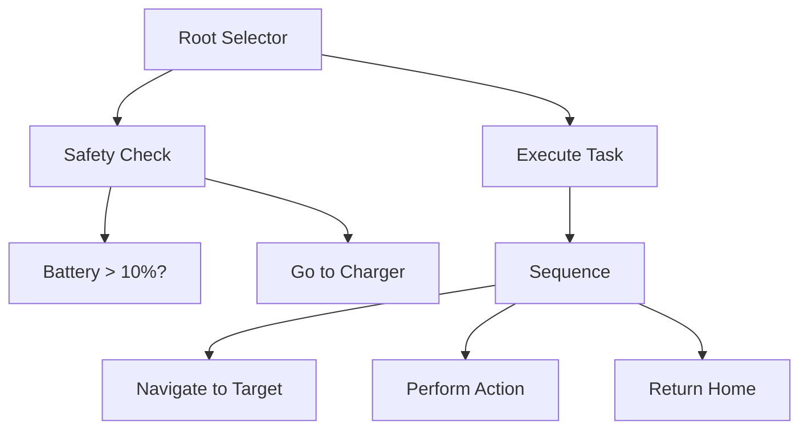

## 1. Concept Introduction

**In Simple Terms:**
Imagine a robot butler that needs to serve breakfast. Its decision process might look like this: First, check if coffee is ready. If not, make coffee. Then, check if toast is ready. If not, make toast. Once both are ready, serve breakfast. If anything fails (e.g., out of coffee beans), try an alternative or report the problem.

This hierarchical, tree-like way of organizing decisions is exactly what a **Behavior Tree** does. It breaks down complex behaviors into small, reusable tasks organized in a tree structure, flowing from top to bottom, left to right.

**Technical Detail:**
A Behavior Tree (BT) is a mathematical model of plan execution represented as a directed acyclic graph (DAG) where each node is a task. The tree is evaluated from the root, with control flowing to child nodes based on their parent's type. Each node returns one of three states: **Success**, **Failure**, or **Running** (for asynchronous tasks).

Unlike finite state machines (FSMs), which can become unwieldy as complexity grows, Behavior Trees are compositional and modular. You can build complex behaviors by combining simple, reusable subtrees. This makes them ideal for AI agents that need to handle dynamic environments with many possible actions.

The tree consists of:
- **Leaf Nodes (Tasks)**: Actual actions or conditions (e.g., `CheckCoffeeReady`, `MakeCoffee`)
- **Control Nodes**: Determine execution flow (Sequence, Selector, Parallel)
- **Decorator Nodes**: Modify behavior of child nodes (Repeat, Invert, Timeout)

## 2. Historical & Theoretical Context

Behavior Trees originated in the **video game industry** in the early 2000s. They were first publicly discussed by Damián Isla of Bungie Studios, who used them for the AI in **Halo 2** (2004). The approach solved a critical problem: traditional finite state machines became spaghetti code as game AI grew more sophisticated.

The theoretical foundation draws from **hierarchical planning systems** in robotics and the **subsumption architecture** proposed by Rodney Brooks in 1986. Brooks' idea was that intelligent behavior emerges from simple, layered behaviors rather than complex symbolic reasoning—a principle that Behavior Trees embody.

By 2010, Behavior Trees had become the standard for game AI, used in major titles like Halo, Spore, and StarCraft II. More recently, they've found applications in robotics (via ROS - Robot Operating System) and are being explored for LLM-based agent orchestration.

## 3. Algorithms & Math

The execution of a Behavior Tree follows a simple depth-first traversal algorithm:

```
function TICK(node):
  if node is Leaf:
    return node.execute()

  if node is Sequence:
    for child in node.children:
      status = TICK(child)
      if status == FAILURE or status == RUNNING:
        return status
    return SUCCESS

  if node is Selector:
    for child in node.children:
      status = TICK(child)
      if status == SUCCESS or status == RUNNING:
        return status
    return FAILURE

  if node is Parallel:
    results = []
    for child in node.children:
      results.append(TICK(child))
    return aggregate(results) // Based on policy
```

**Key Control Nodes:**

1. **Sequence (→)**: Executes children left-to-right. Returns SUCCESS only if all children succeed. Fails immediately on first failure.
   - Use case: "Do A, then B, then C"

2. **Selector (?)**: Executes children left-to-right. Returns SUCCESS on first success. Fails only if all children fail.
   - Use case: "Try A, if it fails try B, if that fails try C"

3. **Parallel (⇉)**: Executes all children concurrently. Returns based on policy (e.g., all must succeed, or at least one).
   - Use case: "Do A and B simultaneously"

**Decorator Examples:**
- **Inverter (!)**: Flips Success ↔ Failure
- **Repeater (×N)**: Runs child N times
- **Retry**: Runs child until success
- **Timeout**: Fails if child takes too long

## 4. Design Patterns & Architectures

Behavior Trees fit naturally into several architectural patterns:

**Layered Architecture:**
BTs excel at representing **hierarchical goal decomposition**. High-level goals (root) decompose into mid-level strategies (branches) which decompose into low-level actions (leaves).

**Blackboard Pattern:**
BTs often work with a shared **blackboard** (or context object) that stores the agent's state, sensor data, and working memory. Each node reads from and writes to this blackboard.

**Subsumption:**
Multiple BTs can run in parallel, with higher-priority trees able to override lower-priority ones. For example, a "Safety" tree runs alongside a "Task Execution" tree, taking control when danger is detected.



In this example, the agent first checks safety conditions. If unsafe, it charges. Otherwise, it executes the task sequence.

## 5. Practical Application

**Python Implementation:**

```python
from enum import Enum
from typing import List, Callable

class Status(Enum):
    SUCCESS = 1
    FAILURE = 2
    RUNNING = 3

class Node:
    def tick(self, context: dict) -> Status:
        raise NotImplementedError

class Action(Node):
    """Leaf node that executes a function"""
    def __init__(self, action_fn: Callable):
        self.action_fn = action_fn

    def tick(self, context: dict) -> Status:
        return self.action_fn(context)

class Condition(Node):
    """Leaf node that checks a condition"""
    def __init__(self, condition_fn: Callable):
        self.condition_fn = condition_fn

    def tick(self, context: dict) -> Status:
        return Status.SUCCESS if self.condition_fn(context) else Status.FAILURE

class Sequence(Node):
    """Runs children until one fails"""
    def __init__(self, children: List[Node]):
        self.children = children

    def tick(self, context: dict) -> Status:
        for child in self.children:
            status = child.tick(context)
            if status != Status.SUCCESS:
                return status
        return Status.SUCCESS

class Selector(Node):
    """Runs children until one succeeds"""
    def __init__(self, children: List[Node]):
        self.children = children

    def tick(self, context: dict) -> Status:
        for child in self.children:
            status = child.tick(context)
            if status != Status.FAILURE:
                return status
        return Status.FAILURE

# Example: Coffee-making agent
def check_coffee_ready(ctx):
    return ctx.get('coffee_ready', False)

def make_coffee(ctx):
    print("Making coffee...")
    ctx['coffee_ready'] = True
    return Status.SUCCESS

def check_toast_ready(ctx):
    return ctx.get('toast_ready', False)

def make_toast(ctx):
    print("Making toast...")
    ctx['toast_ready'] = True
    return Status.SUCCESS

def serve_breakfast(ctx):
    print("Serving breakfast!")
    return Status.SUCCESS

# Build the tree
breakfast_tree = Sequence([
    Selector([
        Condition(check_coffee_ready),
        Action(make_coffee)
    ]),
    Selector([
        Condition(check_toast_ready),
        Action(make_toast)
    ]),
    Action(serve_breakfast)
])

# Execute
context = {}
result = breakfast_tree.tick(context)
print(f"Final status: {result}")
```

**In Modern Agent Frameworks:**

In **LangGraph**, you could represent a Behavior Tree as a state machine where each node is a BT control structure. In **CrewAI**, each crew member could have its own BT for task execution. The modular nature of BTs makes them excellent for orchestrating complex multi-step LLM workflows.

## 6. Comparisons & Tradeoffs

**Behavior Trees vs. Finite State Machines (FSM):**
- **Modularity**: BTs are compositional; you can reuse subtrees. FSMs require duplicating states for similar behaviors.
- **Scalability**: BTs scale better for complex behaviors. FSMs suffer from state explosion.
- **Reactivity**: BTs re-evaluate from the root each tick, naturally adapting to environment changes. FSMs require explicit transition logic.

**Behavior Trees vs. Planning (STRIPS, HTN):**
- **Simplicity**: BTs are simpler to author and debug than classical planners.
- **Determinism**: BTs are deterministic and predictable. Planners can generate surprising behaviors.
- **Flexibility**: Planners can find novel solutions. BTs only execute pre-authored behaviors.

**Strengths:**
- Highly modular and reusable
- Easy to visualize and debug
- Naturally reactive to environment changes
- Composable: complex behaviors from simple parts

**Limitations:**
- Can be verbose for very simple behaviors
- No automatic planning; all behaviors must be pre-authored
- Performance overhead of re-evaluating tree each tick (mitigated by caching)

## 7. Latest Developments & Research

**BTs in Robotics (2020-2024):**
The **BehaviorTree.CPP** library and **Groot** (a visual editor) have become standard tools in ROS2 robotics. Research has focused on:
- **Learning BTs from Demonstration**: Using imitation learning to automatically generate BTs from human demonstrations
- **Genetic Programming for BTs**: Evolving optimal BTs for specific tasks
- **Probabilistic BTs**: Adding uncertainty reasoning to handle stochastic environments

**LLMs and Behavior Trees:**
Recent work explores using LLMs to **generate Behavior Trees dynamically**. For example:
- **"Language Models as Zero-Shot Planners"** (Huang et al., 2022): LLMs can translate natural language goals into structured plans
- **"ProgPrompt"** (Singh et al., 2023): Uses LLMs to generate Python code representing behavior programs

An emerging pattern is using LLMs to **author high-level BT strategies** while keeping low-level execution deterministic and fast. This combines the creativity of LLMs with the reliability of BTs.

**Open Problems:**
- How to balance authored vs. learned behaviors?
- Optimal tree structures for different task domains
- Real-time BT modification without disrupting execution

## 8. Cross-Disciplinary Insight

Behavior Trees share deep connections with **organizational theory** and **business process modeling**. A corporate workflow can be represented as a BT:
- **Sequence**: "Complete form, then get approval, then execute"
- **Selector**: "Try primary vendor, if unavailable try backup"
- **Parallel**: "Legal review and technical review happen simultaneously"

The **Toyota Production System's** concept of **Andon** (stop-the-line quality control) mirrors the BT pattern of having a high-priority safety/quality subtree that can halt normal operations—a design pattern also seen in the subsumption architecture.

In **neuroscience**, the basal ganglia are thought to implement something like a Selector node: they evaluate multiple possible actions and select the most appropriate one based on current context. This is known as **action selection**, a biological analog to BT decision-making.

## 9. Daily Challenge / Thought Exercise

**Task:** Design a Behavior Tree for an AI coding assistant that follows this logic:

1. If there's a failing test, try to fix it
2. If there are no failing tests but there are unimplemented features, implement one
3. If there are no tasks, write documentation
4. If any step takes too long (>5 minutes), ask for help

Draw the tree structure on paper, labeling each node as Sequence, Selector, Action, or Condition. Then implement it using the Python code from Section 5. Bonus: Add a Timeout decorator node.

**Extension:** How would you modify the tree to handle interruptions (e.g., user asks a question mid-task)?

## 10. References & Further Reading

**Foundational:**
- **"Behavior Trees for AI: How they work"** by Chris Simpson (2014) - The definitive introduction from the game AI perspective
- **"A Behavior Language for Story-Based Believable Agents"** by Isla (2005) - The original Halo 2 paper

**Technical:**
- **BehaviorTree.CPP Documentation** - https://www.behaviortree.dev/
- **"Behavior Trees in Robotics and AI"** by Colledanchise & Ögren (2018) - Comprehensive textbook
- **Groot Visual Editor** - https://github.com/BehaviorTree/Groot

**Recent Research:**
- **"Learning Behavior Trees from Demonstration"** (Sprague & Ögren, 2021)
- **"Language Models as Zero-Shot Planners"** (Huang et al., 2022) - https://arxiv.org/abs/2201.07207
- **"ProgPrompt: Program Generation for Situated Robot Task Planning"** (Singh et al., 2023) - https://arxiv.org/abs/2209.11302

**Practical:**
- **py_trees** (Python BT library) - https://github.com/splintered-reality/py_trees
- **ROS2 BT tutorials** - https://navigation.ros.org/behavior_trees/
