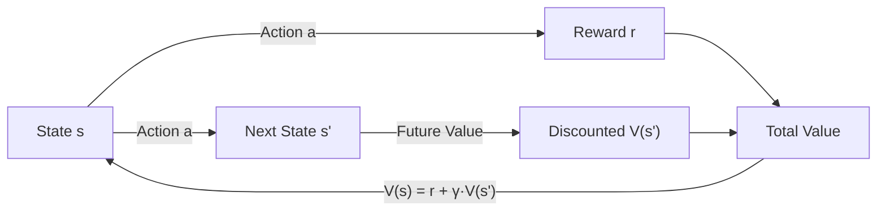

## 1. Concept Introduction

**In Simple Terms:**
Imagine you're playing chess and trying to decide your next move. A beginner might only consider immediate gains ("If I take this pawn, I gain 1 point"). But a master thinks differently: "This move might not win material now, but it positions me perfectly for the next 5 moves, ultimately leading to checkmate."

The master is thinking in terms of **value**—not just immediate reward, but the total expected reward from this position onward, assuming you play optimally. This is exactly what a **value function** captures, and the **Bellman equation** is the mathematical formula that defines how to calculate it.

**Technical Detail:**
A **value function** V(s) assigns a numerical score to each state s, representing the expected cumulative reward an agent can obtain starting from that state and following a particular strategy (policy). The **Bellman equation** expresses a recursive relationship: the value of being in a state equals the immediate reward plus the discounted value of the next state.

Formally, for a policy π:

**V^π(s) = E_π[r_t + γ V^π(s_{t+1}) | s_t = s]**

Where:
- V^π(s) = value of state s under policy π
- r_t = immediate reward
- γ = discount factor (0 ≤ γ < 1)
- s_{t+1} = next state
- E_π = expectation under policy π

The Bellman equation is the cornerstone of **dynamic programming** and **reinforcement learning**, enabling agents to make optimal long-term decisions by breaking them into simpler recursive computations.



## 2. Historical & Theoretical Context

The Bellman equation is named after **Richard Bellman**, who introduced it in his 1957 book *"Dynamic Programming."* Bellman was working on optimization problems for the RAND Corporation during the Cold War, focusing on missile guidance and resource allocation.

Bellman's key insight was the **Principle of Optimality**: "An optimal policy has the property that whatever the initial state and initial decision are, the remaining decisions must constitute an optimal policy with regard to the state resulting from the first decision."

In simpler terms: if you know the optimal way to solve a problem from any future state, you can work backwards to find the optimal solution from your current state.

This principle transformed how we think about sequential decision-making across multiple fields:
- **Operations Research**: Inventory management, scheduling
- **Economics**: Optimal consumption and investment strategies
- **Control Theory**: Optimal control of dynamic systems
- **AI**: Became the foundation of reinforcement learning in the 1980s-90s

The connection to AI was cemented when researchers like **Andrew Barto**, **Richard Sutton**, and **Chris Watkins** showed that Bellman equations could be solved through learning (without knowing the full model of the environment), leading to algorithms like Q-learning and SARSA.

## 3. Algorithms & Math

### The Bellman Equations: Two Variants

**1. Bellman Expectation Equation (for a given policy π):**

```
V^π(s) = Σ_a π(a|s) Σ_{s',r} p(s',r|s,a) [r + γ V^π(s')]
```

This says: "The value of state s under policy π is the sum over all actions (weighted by policy) of the expected immediate reward plus discounted future value."

**2. Bellman Optimality Equation (for the optimal policy π*):**

```
V*(s) = max_a Σ_{s',r} p(s',r|s,a) [r + γ V*(s')]
```

This says: "The optimal value is obtained by taking the action that maximizes expected return."

### Action-Value Function (Q-function)

Instead of valuing states, we can value state-action pairs:

**Q^π(s,a) = E_π[r_t + γ Q^π(s_{t+1}, a_{t+1}) | s_t=s, a_t=a]**

The optimal Q-function satisfies:

**Q*(s,a) = Σ_{s',r} p(s',r|s,a) [r + γ max_{a'} Q*(s',a')]**

This is crucial because if you know Q*(s,a), you can act optimally without knowing the environment dynamics—just pick the action with the highest Q-value!

### Value Iteration Algorithm

```
function VALUE_ITERATION(states, actions, rewards, transitions, γ, θ):
  // Initialize values arbitrarily
  V(s) ← 0 for all s

  repeat:
    Δ ← 0
    for each state s:
      v ← V(s)
      // Bellman update
      V(s) ← max_a Σ_{s'} p(s'|s,a) [r(s,a,s') + γ V(s')]
      Δ ← max(Δ, |v - V(s)|)
  until Δ < θ  // Convergence threshold

  return V
```

### Policy Iteration Algorithm

```
function POLICY_ITERATION(states, actions, rewards, transitions, γ):
  // Initialize policy arbitrarily
  π(s) ← random action for all s

  repeat:
    // Policy Evaluation
    repeat:
      Δ ← 0
      for each state s:
        v ← V(s)
        V(s) ← Σ_{s'} p(s'|s,π(s)) [r(s,π(s),s') + γ V(s')]
        Δ ← max(Δ, |v - V(s)|)
    until Δ < θ

    // Policy Improvement
    policy_stable ← true
    for each state s:
      old_action ← π(s)
      π(s) ← argmax_a Σ_{s'} p(s'|s,a) [r(s,a,s') + γ V(s')]
      if old_action ≠ π(s):
        policy_stable ← false

  until policy_stable
  return π, V
```

## 4. Design Patterns & Architectures

Bellman equations appear in various architectural patterns:

**1. Model-Based Planning Architecture:**
```
┌─────────────┐     ┌──────────────┐     ┌─────────────┐
│ Environment │────>│ World Model  │────>│ Value       │
│   State     │     │  (p, r)      │     │ Function V  │
└─────────────┘     └──────────────┘     └─────────────┘
                                               │
                                               ▼
                                         ┌─────────────┐
                                         │ Policy π    │
                                         │ (Greedy)    │
                                         └─────────────┘
```

**2. Actor-Critic Architecture:**
- **Critic**: Learns V(s) or Q(s,a) using Bellman equations
- **Actor**: Learns policy π directly
- The critic evaluates actions using Bellman error as training signal

**3. Hierarchical RL:**
High-level policies operate over "temporally extended actions" (options), each with their own value functions. Bellman equations apply at multiple time scales.

**4. Multi-Agent Systems:**
Each agent maintains its own value function. The Bellman equation extends to Nash equilibria in competitive settings.

## 5. Practical Application

**Python Example: Grid World with Value Iteration**

```python
import numpy as np

class GridWorld:
    """Simple 4x4 grid world: reach goal (bottom-right), avoid trap."""

    def __init__(self, size=4):
        self.size = size
        self.n_states = size * size
        self.goal = (size-1, size-1)
        self.trap = (size-2, size-2)

        # Actions: up, right, down, left
        self.actions = [(-1,0), (0,1), (1,0), (0,-1)]
        self.action_names = ['UP', 'RIGHT', 'DOWN', 'LEFT']

    def state_to_pos(self, state):
        return (state // self.size, state % self.size)

    def pos_to_state(self, pos):
        return pos[0] * self.size + pos[1]

    def get_next_state(self, state, action_idx):
        """Deterministic transitions"""
        r, c = self.state_to_pos(state)
        dr, dc = self.actions[action_idx]
        new_r, new_c = r + dr, c + dc

        # Wall collision
        if not (0 <= new_r < self.size and 0 <= new_c < self.size):
            return state, -1  # Stay in place, small penalty

        new_state = self.pos_to_state((new_r, new_c))

        # Rewards
        if (new_r, new_c) == self.goal:
            return new_state, 10  # Goal reward
        elif (new_r, new_c) == self.trap:
            return new_state, -10  # Trap penalty
        else:
            return new_state, -0.1  # Step cost

    def is_terminal(self, state):
        pos = self.state_to_pos(state)
        return pos == self.goal or pos == self.trap

def value_iteration(env, gamma=0.9, theta=1e-6):
    """Compute optimal value function and policy"""
    V = np.zeros(env.n_states)
    policy = np.zeros(env.n_states, dtype=int)

    iteration = 0
    while True:
        delta = 0

        for s in range(env.n_states):
            if env.is_terminal(s):
                continue

            v = V[s]

            # Bellman optimality update
            action_values = []
            for a in range(len(env.actions)):
                next_s, reward = env.get_next_state(s, a)
                action_values.append(reward + gamma * V[next_s])

            V[s] = max(action_values)
            policy[s] = np.argmax(action_values)

            delta = max(delta, abs(v - V[s]))

        iteration += 1
        if delta < theta:
            print(f"Converged in {iteration} iterations")
            break

    return V, policy

def print_grid(env, values, policy):
    """Visualize value function and policy"""
    print("\nValue Function:")
    for r in range(env.size):
        for c in range(env.size):
            s = env.pos_to_state((r, c))
            print(f"{values[s]:6.2f}", end=" ")
        print()

    print("\nOptimal Policy:")
    for r in range(env.size):
        for c in range(env.size):
            s = env.pos_to_state((r, c))
            if (r, c) == env.goal:
                print(" GOAL ", end=" ")
            elif (r, c) == env.trap:
                print(" TRAP ", end=" ")
            else:
                print(f" {env.action_names[policy[s]]:4s}", end=" ")
        print()

# Run
env = GridWorld(size=4)
V, policy = value_iteration(env, gamma=0.9)
print_grid(env, V, policy)

# Simulate optimal policy
def simulate(env, policy, start_state=0, max_steps=20):
    """Execute policy from start state"""
    state = start_state
    path = [state]

    for _ in range(max_steps):
        if env.is_terminal(state):
            break
        action = policy[state]
        state, reward = env.get_next_state(state, action)
        path.append(state)

    return [env.state_to_pos(s) for s in path]

path = simulate(env, policy, start_state=0)
print(f"\nOptimal path from (0,0): {path}")
```

**Integration with Modern RL Frameworks:**

In **Stable-Baselines3** (PyTorch RL library), value functions are implemented as neural networks. The Bellman equation becomes the loss function:

```python
# Simplified DQN Bellman update
def compute_bellman_loss(q_network, target_network, batch, gamma=0.99):
    states, actions, rewards, next_states, dones = batch

    # Current Q-values: Q(s, a)
    current_q = q_network(states).gather(1, actions)

    # Target: r + γ max_a' Q_target(s', a')
    with torch.no_grad():
        next_q = target_network(next_states).max(1)[0]
        target_q = rewards + gamma * next_q * (1 - dones)

    # Bellman error
    loss = F.mse_loss(current_q, target_q.unsqueeze(1))
    return loss
```

## 6. Comparisons & Tradeoffs

**Bellman Equations vs. Direct Policy Search:**

| Aspect | Value-Based (Bellman) | Policy-Based |
|--------|----------------------|--------------|
| **What it learns** | V(s) or Q(s,a) | π(a\|s) directly |
| **Optimality** | Finds optimal policy | May converge to local optimum |
| **Sample efficiency** | High (off-policy) | Lower (typically on-policy) |
| **Continuous actions** | Difficult (need discretization) | Natural |
| **Stochastic policies** | Requires additional steps | Native support |

**Value Iteration vs. Policy Iteration:**

- **Value Iteration**: Updates value function directly. Simpler, but can be slower.
- **Policy Iteration**: Alternates between evaluating current policy and improving it. Often faster in practice, but more complex.

**Strengths:**
- **Provably optimal**: Under correct assumptions, converges to optimal policy
- **Sample efficient**: Reuses experiences (especially Q-learning)
- **Interpretable**: Value functions show "how good" each state is
- **Foundation for transfer**: Can transfer value functions across similar tasks

**Limitations:**
- **Curse of dimensionality**: Exact computation infeasible for large state spaces
- **Model dependency**: Classic DP requires full knowledge of transitions
- **Exploration problem**: Greedy policies can get stuck in local optima
- **Continuous spaces**: Requires function approximation (neural networks)

## 7. Latest Developments & Research

**Deep Reinforcement Learning (2013-Present):**
The combination of deep neural networks with Bellman equations revolutionized RL:

- **DQN (2013)**: Mnih et al. used CNNs to approximate Q-functions, achieving human-level Atari game play
- **Double DQN (2015)**: Addressed Q-value overestimation by decoupling action selection and evaluation
- **Dueling DQN (2016)**: Separated V(s) and advantage function A(s,a) in network architecture
- **Rainbow (2017)**: Combined 6+ improvements to DQN into state-of-the-art algorithm

**Distributional RL (2017+):**
Instead of learning E[return], learn the entire distribution of returns:

**Z(s,a) = distribution of returns from (s,a)**

This captures risk and uncertainty. **C51** and **QR-DQN** are leading algorithms.

**Model-Based RL Renaissance (2018+):**
Bellman equations are central to learned world models:

- **MuZero (2019)**: AlphaGo's successor, learns value/policy/model jointly
- **Dreamer (2020)**: Plans in learned latent space using Bellman backups
- **TD-MPC (2022)**: Model-predictive control with learned dynamics

**LLMs and Value Functions (2023+):**
Emerging research explores using Bellman equations with LLM agents:

- **Q-Transformer (2023)**: Uses Q-learning for robot manipulation with vision transformers
- **RLHF (ChatGPT)**: Learns value function (reward model) over language responses
- **Tree-of-Thoughts + Value**: LLMs generate reasoning trees, value functions guide search

**Open Problems:**
- Scaling value-based methods to truly high-dimensional continuous control
- Multi-task value functions that generalize across diverse environments
- Combining symbolic planning with learned value functions
- Interpretable value functions for safety-critical applications

## 8. Cross-Disciplinary Insight

**Economics & Finance:**
The Bellman equation is fundamental to **asset pricing theory**. The price of a stock can be viewed as a value function:

**P_t = E[dividend_t + β P_{t+1}]**

This is exactly the Bellman equation structure! The discount factor β (≈ γ) reflects time preference. Nobel laureate Robert Lucas used Bellman equations to model rational expectations in macroeconomics.

**Neuroscience:**
Dopamine neurons in the brain appear to encode **temporal-difference error**, which is the Bellman error:

**δ_t = r_t + γ V(s_{t+1}) - V(s_t)**

When a reward is unexpectedly good (δ > 0), dopamine spikes. When worse than expected (δ < 0), dopamine dips. This suggests the brain literally implements Bellman updates. Research by **Wolfram Schultz** won the 2017 Brain Prize for this discovery.

**Ecology:**
Animals make foraging decisions using value-like computations. **Optimal foraging theory** predicts when animals should leave a food patch (when its value drops below the average environmental value)—a Bellman-style calculation.

## 9. Daily Challenge / Thought Exercise

**Coding Challenge (20-30 minutes):**

Extend the GridWorld example to include **stochastic transitions**. Modify `get_next_state` so that:
- 80% of the time, the action works as intended
- 10% of the time, the agent moves perpendicular (left)
- 10% of the time, the agent moves perpendicular (right)

Update the value iteration algorithm to handle this stochasticity. How does the optimal policy change? Does the agent avoid risky paths near the trap?

**Thought Exercise:**

Consider an LLM agent solving a coding problem. It can take actions like:
- Write code
- Run tests
- Search documentation
- Refactor

How would you define:
1. The state space?
2. The reward function?
3. The value function V(s) for a partial solution state?

Would value-based RL be suitable for this problem, or would policy-based methods work better? Why?

**Bonus:** Sketch the Bellman equation for this coding agent. What would the "next state" s' represent?

## 10. References & Further Reading

**Foundational Texts:**
- **Bellman, R. (1957).** *Dynamic Programming.* Princeton University Press. [The original source]
- **Sutton, R.S. & Barto, A.G. (2018).** *Reinforcement Learning: An Introduction* (2nd ed.). [Chapters 3-4] - Free online: http://incompleteideas.net/book/the-book-2nd.html

**Classic Papers:**
- **Watkins, C.J. (1989).** "Learning from Delayed Rewards" [PhD Thesis - introduced Q-learning]
- **Bellman, R. (1954).** "The Theory of Dynamic Programming" *Bulletin of AMS*

**Deep RL Breakthrough:**
- **Mnih et al. (2015).** "Human-level control through deep reinforcement learning" *Nature* - https://www.nature.com/articles/nature14236

**Recent Advances:**
- **Bellemare et al. (2017).** "A Distributional Perspective on Reinforcement Learning" *ICML* - https://arxiv.org/abs/1707.06887
- **Schrittwieser et al. (2020).** "Mastering Atari, Go, Chess and Shogi by Planning with a Learned Model" (MuZero) - https://arxiv.org/abs/1911.08265
- **Hansen et al. (2022).** "TD-MPC: Temporal Difference Learning for Model Predictive Control" - https://arxiv.org/abs/2203.04955

**Neuroscience Connection:**
- **Schultz et al. (1997).** "A Neural Substrate of Prediction and Reward" *Science* - Dopamine and TD learning

**Code & Tools:**
- **OpenAI Spinning Up in Deep RL** - https://spinningup.openai.com/en/latest/ [Excellent educational resource]
- **Stable-Baselines3** - https://github.com/DLR-RM/stable-baselines3 [PyTorch RL implementations]
- **RLlib (Ray)** - https://docs.ray.io/en/latest/rllib/ [Scalable RL library]

**Interactive Visualizations:**
- **RL Visualization by Andrej Karpathy** - https://cs.stanford.edu/people/karpathy/reinforcejs/gridworld_dp.html
