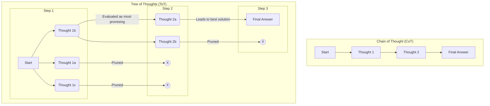

## 1. Concept Introduction

When you solve a simple math problem, you might follow a single, linear sequence of steps. This is like **Chain of Thought (CoT)** reasoning for an AI—a straightforward path from question to answer.

But what about a complex problem, like playing chess, solving a difficult puzzle, or outlining a business strategy? You don't just follow one path. You explore multiple possibilities ("*What if I move my knight here?*"). You evaluate their potential ("*That leads to a weak position.*"). You backtrack when you hit a dead end and pursue more promising avenues.

This is the intuition behind **Tree of Thoughts (ToT)**. Instead of forcing an agent down a single, linear reasoning path, ToT allows it to explore a *tree* of possibilities. It can generate multiple different "thoughts" or next steps at each stage, evaluate them, and decide which branches of the reasoning tree are worth exploring further. This enables a more deliberate, robust, and human-like approach to problem-solving.

## 2. Historical & Theoretical Context

Tree of Thoughts was introduced in a May 2023 paper by researchers from Google DeepMind and Princeton University, *"Tree of Thoughts: Deliberate Problem Solving with Large Language Models"* by Yao et al.

The work is a direct evolution of Chain of Thought prompting. While CoT was a major breakthrough, the authors noted its limitations. A CoT agent is a "greedy" thinker; it always picks the single next step that looks best at the moment. If it makes one mistake early on, it's often stuck on that erroneous path forever. ToT was explicitly designed to overcome this by introducing the ability to explore, evaluate, and backtrack—in short, to be a more deliberate problem solver.

## 3. The Mechanics: Generate, Evaluate, Search

ToT transforms a linear chain into a tree search problem. This involves three key mechanics.



1.  **Thought Generation:** At each node in the tree, the agent doesn't just generate one next thought. It is prompted to generate several distinct possibilities. For example: "Given the current plan, what are three different ways we could proceed?" This creates the branches of the tree.
2.  **State Evaluation:** Each generated thought (a node) is then evaluated. This is a crucial step. A "state evaluator" assesses the partial solution at that node and gives it a score or a classification (e.g., "promising," "likely impossible," "closer to the solution"). This evaluator can be a simple heuristic, a rule-based check, or even another LLM call prompted to act as a judge.
3.  **Search Algorithm:** Based on the evaluations, a search algorithm decides which nodes of the tree to explore next. This is what navigates the tree. Common choices include:
    -   **Breadth-First Search (BFS):** Explore all nodes at the current depth before moving deeper.
    -   **Depth-First Search (DFS):** Follow a single path to its conclusion before backtracking.
    -   The search algorithm uses the state evaluations to **prune** unpromising branches, saving computation and focusing the agent's "attention" on the most fruitful lines of reasoning.

## 4. Design Patterns & Architectures

-   **Deliberate Problem-Solving:** ToT is the quintessential pattern for any task that cannot be solved with a simple, greedy approach. This includes strategic planning, creative ideation, and solving problems with complex constraints where exploration is necessary.
-   **Systematic Self-Correction:** The ToT framework has self-correction built in. If an agent explores a branch and the state evaluator determines it has reached a dead end or violated a constraint, the search algorithm will naturally abandon that branch and backtrack to a more promising, earlier state.
-   **Resource-Bounded Reasoning:** The size of the tree (the "breadth" of the search at each step and the total "depth") can be tuned. This allows you to configure the agent's "thinking budget." For a simple problem, you might use a small tree. for a very hard problem, you can allow the agent to "think harder" by exploring a much larger tree, at the cost of increased latency and expense.

## 5. Practical Application

Let's imagine solving the "Game of 24" puzzle: given four numbers, use arithmetic operations to make 24. The input is `(4, 9, 10, 13)`.

```python
# Conceptual Python for a ToT solver

def generate_thoughts(partial_solution):
    # Prompt an LLM to generate next possible steps
    # e.g., "Given (4, 9, 10, 13), what are some first steps?"
    # LLM might return: ["10 - 4 = 6. Remaining: (6, 9, 13)", "13 - 9 = 4. Remaining: (4, 4, 10)"]
    return ["10 - 4 = 6. Remaining: (6, 9, 13)", "13 - 9 = 4. Remaining: (4, 4, 10)"]

def evaluate_state(partial_solution):
    # Use heuristics or an LLM to evaluate the state
    # e.g., "Is this partial solution likely to lead to 24?"
    # A simple heuristic: are the numbers getting too large or small?
    if "6, 9, 13" in partial_solution: return "promising"
    if "4, 4, 10" in partial_solution: return "promising"
    return "unlikely"

# --- ToT Search Loop ---
root_problem = "Numbers: (4, 9, 10, 13)"
tree = {root_problem: []}
frontier = [root_problem]

for _ in range(3): # Limit search depth
    current_node = frontier.pop(0)
    
    # 1. Generate
    new_thoughts = generate_thoughts(current_node)
    tree[current_node] = new_thoughts
    
    # 2. Evaluate and 3. Search (add promising nodes to frontier)
    for thought in new_thoughts:
        evaluation = evaluate_state(thought)
        if evaluation == "promising":
            frontier.append(thought)
            # Check for solution
            # e.g., if "24" is the final result of the thought's expression
            # if is_solution(thought): return thought

# In a real implementation, this loop would be a proper search algorithm.
# Frameworks like LangGraph are well-suited for implementing these graph-based reasoning structures.
```

## 6. Comparisons & Tradeoffs

**Tree of Thoughts vs. Chain of Thought:**

-   **Performance:** ToT significantly outperforms CoT on complex tasks that require planning, exploration, or creativity.
-   **Cost & Latency:** ToT is much more expensive and slower. A single ToT problem might require dozens of LLM calls (for generation and evaluation), whereas CoT requires only one.
-   **Robustness:** ToT is far more robust to errors. A mistake in a CoT chain is fatal, while a mistake in a ToT branch is simply pruned.

**Limitations:**
-   The effectiveness of ToT is highly dependent on the quality of the **state evaluator**. A poor evaluator can lead the search astray or prune the correct branch.
-   It can be complex to implement the search algorithm and manage the state of the tree correctly.

## 7. Latest Developments & Research

-   **Graph of Thoughts (GoT):** A further generalization of ToT. In a GoT framework, reasoning paths can not only branch but also merge. This allows the agent to synthesize insights from two different lines of reasoning into a new, combined path, making the structure a graph rather than a simple tree.
-   **ToT with Tool Use:** A powerful combination is to allow the agent to use tools at each node of the tree. This means the agent can explore not just different reasoning steps, but different sequences of actions and tool calls, evaluating the real-world results of those calls to guide its search for the best plan.

## 8. Cross-Disciplinary Insight

Tree of Thoughts is a direct application of classic principles from the field of **Artificial Intelligence Search Algorithms**.
-   The process of exploring the tree is analogous to algorithms like **A* search**, which is used for pathfinding in everything from video games to logistics. In A*, a heuristic function guides the search toward the goal, just as the state evaluator guides the ToT search toward a valid solution.
-   It's also conceptually similar to **Monte Carlo Tree Search (MCTS)**, the algorithm that powered AlphaGo. MCTS explores a game tree by simulating thousands of possible game outcomes to decide which move is most promising—a process of generation and evaluation that is philosophically identical to ToT.

## 9. Daily Challenge / Thought Exercise

Pick a personal planning task, like "How should I spend my weekend?"
1.  **CoT Approach:** Write down the first plan that comes to mind in a linear sequence.
2.  **ToT Approach:**
    -   **Step 1 (Generate):** Brainstorm 3 different *themes* for the weekend (e.g., "Relaxing," "Productive," "Social").
    -   **Step 2 (Explore):** For each theme, list 2-3 potential activities.
    -   **Step 3 (Evaluate & Decide):** Look at all the potential activities and construct a final, optimal plan by picking the best options.

Reflect on how the ToT approach encouraged you to explore a wider range of possibilities and likely led to a better plan.

## 10. References & Further Reading

1.  **Yao, S., et al. (2023).** *Tree of Thoughts: Deliberate Problem Solving with Large Language Models.* [https://arxiv.org/abs/2305.10601](https://arxiv.org/abs/2305.10601) (The original paper).
2.  **Besta, M., et al. (2023).** *Graph of Thoughts: Solving Elaborate Problems with Large Language Models.* [https://arxiv.org/abs/2308.09687](https://arxiv.org/abs/2308.09687) (The follow-up paper on Graph of Thoughts).
3.  **Ceste.io - Tree of Thoughts Explained:** [https://ceste.io/work/tree-of-thoughts-explained/](https://ceste.io/work/tree-of-thoughts-explained/) (A good visual blog post explaining the concept).
---
