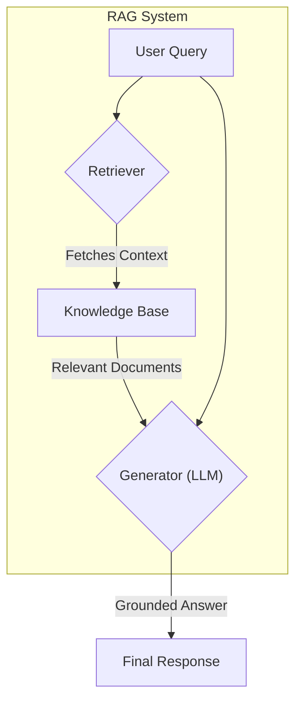

## 1. Concept Introduction

Imagine taking an exam. In a "closed-book" test, you rely solely on what you've memorized. This is like a standard Large Language Model (LLM)—its knowledge is frozen at the end of its training. Now, imagine an "open-book" exam. You can consult your textbook to find relevant information before writing your answer. This is the essence of **Retrieval-Augmented Generation (RAG)**.

RAG gives an AI agent an external knowledge base—a library, a database, a collection of documents—that it can consult in real-time. Instead of just "making things up" from its parametric memory, the agent first **retrieves** relevant facts and then **generates** an answer based on that retrieved context. This makes the agent's responses more factual, up-to-date, and verifiable.

The core flow is simple:
**Query -> Retrieve Relevant Documents -> Augment Query with Documents -> Generate Answer**



## 2. Historical & Theoretical Context

While the idea of combining information retrieval with text generation has been around for decades in open-domain question answering, the term "RAG" was popularized by a 2020 paper from Facebook AI Research (now Meta AI) titled *"Retrieval-Augmented Generation for Knowledge-Intensive NLP Tasks"* by Patrick Lewis et al.

Their work provided a clear and powerful framework for combining pre-trained retrieval systems with pre-trained generator models. It demonstrated that this approach could achieve state-of-the-art results on knowledge-intensive tasks while offering significant advantages in factuality and interpretability over models that rely only on their internal parameters.

## 3. Algorithms & The Core Mechanics

RAG isn't a single algorithm but a pipeline of several. The two key stages are **Indexing** and **Retrieval/Generation**.

### a) Indexing: Creating the Knowledge Base

You can't retrieve from a library if the books aren't organized. Indexing is the one-time, offline process of preparing your knowledge source.
1.  **Chunking:** Documents are broken down into smaller, manageable pieces (e.g., paragraphs or sentences).
2.  **Embedding:** Each chunk is converted into a numerical vector using an embedding model (like Sentence-BERT). This vector captures the semantic meaning of the text. Chunks with similar meanings will have similar vectors.
3.  **Storing:** These vectors (and their corresponding text chunks) are stored in a specialized **vector database** (e.g., FAISS, Pinecone, ChromaDB) that allows for extremely fast similarity searches.

### b) Retrieval & Generation: Answering a Query

This is the real-time process.
1.  **Embed the Query:** The user's query is converted into a vector using the *same* embedding model used for indexing.
2.  **Similarity Search:** The system searches the vector database for the text chunks whose vectors are "closest" to the query vector. The most common way to measure this "closeness" is **Cosine Similarity**.
3.  **Augment the Prompt:** The top-k most relevant chunks (e.g., top 3) are retrieved and formatted into a context string. This context is then prepended to the original query in a prompt that is sent to the LLM.
    - Example Prompt: `"Based on the following context, please answer the user's question.\n\nContext:\n- [Retrieved Chunk 1]\n- [Retrieved Chunk 2]\n\nQuestion: [Original User Query]"`
4.  **Generate:** The LLM generates an answer, now grounded in the provided, factual context.

## 4. Design Patterns & Architectures

RAG is a foundational pattern for building capable AI agents.
- **The Agent's Long-Term Memory:** RAG is the primary mechanism for giving an agent access to a persistent, external memory. The vector database acts as the agent's library.
- **As a Tool in a ReAct Loop:** In a reasoning framework like ReAct (Reason + Act), the entire RAG pipeline can be exposed as a `search_knowledge_base` tool. The agent's reasoning module can decide *when* to call this tool. For example, if the prompt is "What were our Q3 sales figures?", the agent recognizes it doesn't know this internally and decides to `Act: search_knowledge_base("Q3 sales figures")`.
- **Decoupled Knowledge and Logic:** RAG allows you to separate the agent's knowledge from its reasoning ability. You can update the knowledge base continuously without having to retrain or fine-tune the core LLM, keeping your agent perpetually current.

## 5. Practical Application

Here's a simplified Python example using `scikit-learn` for TF-IDF vectorization (a simpler alternative to dense embeddings) to show the core logic.

```python
from sklearn.feature_extraction.text import TfidfVectorizer
from sklearn.metrics.pairwise import cosine_similarity

# 1. Indexing
knowledge_base = [
    "The first AI agent, the Logic Theorist, was created in 1956.",
    "Reinforcement Learning involves an agent learning from rewards in an environment.",
    "RAG stands for Retrieval-Augmented Generation, combining retrieval and generation models.",
    "Vector databases are used to store and efficiently query high-dimensional vectors."
]

vectorizer = TfidfVectorizer()
indexed_vectors = vectorizer.fit_transform(knowledge_base)

# 2. Retrieval
query = "What is RAG?"
query_vector = vectorizer.transform([query])

# Calculate similarity
similarities = cosine_similarity(query_vector, indexed_vectors).flatten()

# Get the most relevant document
most_relevant_idx = similarities.argmax()
retrieved_context = knowledge_base[most_relevant_idx]

print(f"Retrieved Context: {retrieved_context}")

# 3. Augmentation & Generation (simulated)
prompt = f"Context: {retrieved_context}\n\nQuestion: {query}\n\nAnswer:"

print("\n--- Augmented Prompt ---")
print(prompt)

# In a real application, this prompt would be sent to an LLM API.
# llm_answer = call_llm(prompt)
```

Frameworks like **LangChain** and **LlamaIndex** provide powerful, high-level abstractions that handle all of this for you, including connections to hundreds of document loaders and vector databases.

## 6. Comparisons & Tradeoffs

**RAG vs. Fine-Tuning:**
- **Updating Knowledge:** RAG is cheap and fast. Just add a new document to your vector store. Fine-tuning is expensive and slow, requiring a full retraining process.
- **Adding Skills:** Fine-tuning is for teaching an LLM a new *skill*, *style*, or *behavior* (e.g., to always respond in JSON). RAG is for providing new *knowledge*.
- **Factuality:** RAG is less prone to hallucination because it can cite its sources (the retrieved context). Fine-tuning bakes knowledge into the model's parameters, making it a black box.

**Limitations:**
- **Retrieval Quality is Key:** If the retriever fails to find the correct context, the generator will not have the information it needs. The system's performance is capped by the quality of its retrieval.
- **Complex Questions:** RAG struggles with questions that require synthesizing information from many different documents or performing multi-step reasoning.

## 7. Latest Developments & Research

RAG is a rapidly evolving field. Advanced techniques now go beyond the simple "retrieve-then-read" model:
- **Query Transformations:** For complex questions, the agent can rewrite the query, break it down into sub-queries, or generate hypothetical documents to improve retrieval.
- **Hybrid Search:** Combining traditional keyword search (like BM25) with vector search often yields better results than either alone, as it captures both lexical and semantic relevance.
- **Re-ranking:** A common pattern is to retrieve a larger number of documents (e.g., top 50) with a fast model and then use a more powerful, slower cross-encoder model to re-rank them for relevance before sending the best few (e.g., top 3) to the generator.

## 8. Cross-Disciplinary Insight

RAG is analogous to the **dual-process theory of the human mind**, which posits two systems of thinking:
- **System 1 (The Generator):** Fast, intuitive, and automatic. This is like the LLM's pre-trained, parametric knowledge. It can generate fluent responses based on its "instincts."
- **System 2 (The Retriever):** Slow, deliberate, and analytical. This is the RAG process. It involves consciously searching for and evaluating external information before coming to a conclusion.

A capable agent, like a capable human, needs both: a strong intuition and the wisdom to know when to stop and look things up.

## 9. Daily Challenge / Thought Exercise

Pick a short Wikipedia article on a topic you know little about. Read the first paragraph. Now, write down three specific questions whose answers are likely in the rest of the article.

For each question, quickly scan the article and highlight the single sentence or short paragraph that best answers it. You have just manually performed the role of a **retriever**. Notice how you used keywords and semantic understanding to zero in on the relevant context.

## 10. References & Further Reading

1.  **Lewis, P., et al. (2020).** *Retrieval-Augmented Generation for Knowledge-Intensive NLP Tasks.* (The original RAG paper). [https://arxiv.org/abs/2005.11401](https://arxiv.org/abs/2005.11401)
2.  **Pinecone - What is RAG?**: [https://www.pinecone.io/learn/retrieval-augmented-generation/](https://www.pinecone.io/learn/retrieval-augmented-generation/) (A great practical overview).
3.  **LlamaIndex Documentation:** [https://www.llamaindex.ai/](https://www.llamaindex.ai/) (A popular open-source framework for building RAG applications).
4.  **LangChain RAG Documentation:** [https://python.langchain.com/docs/use_cases/question_answering/](https://python.langchain.com/docs/use_cases/question_answering/) (The RAG section of the widely-used LangChain framework).
---