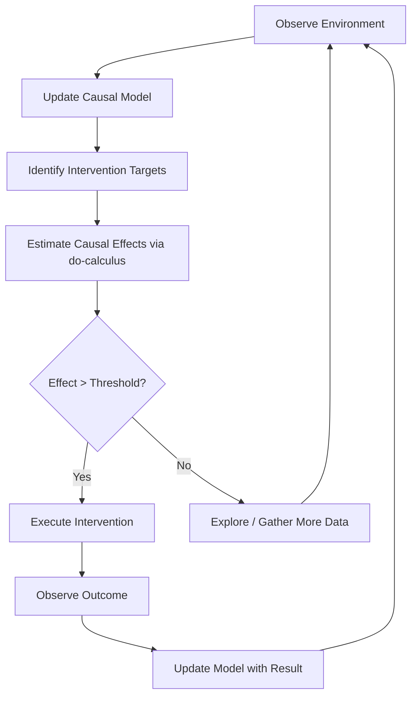

Most AI agents today are extraordinarily good at spotting patterns—but dangerously bad at understanding *why* things happen. An agent that confuses correlation with causation will recommend an umbrella because it noticed people carrying them on days the bus is late, rather than because it's raining. Causal reasoning gives agents the ability to ask "what would happen if I did X?" instead of merely "what usually happens alongside X?" This article explores how causal inference transforms agent planning from pattern matching into genuine understanding.

## 1. Concept Introduction

### Simple Explanation

Imagine you're an agent tasked with improving a website's conversion rate. You notice that users who read the FAQ page convert at 2x the rate. A correlation-based agent would immediately funnel all users to the FAQ. But a causal reasoner would ask: "Does the FAQ *cause* conversions, or do already-interested users just happen to visit it?" The difference between these two questions is the difference between a useful intervention and a waste of effort.

Causal reasoning is the ability to distinguish *seeing* (observation), *doing* (intervention), and *imagining* (counterfactuals)—Judea Pearl's famous three rungs of the "Ladder of Causation."

### Technical Detail

Formally, causal reasoning operates on **Structural Causal Models (SCMs)**, which consist of:

- A set of endogenous variables $V = \{V_1, \ldots, V_n\}$
- A set of exogenous (background) variables $U$
- A set of structural equations $V_i = f_i(PA_i, U_i)$ where $PA_i$ are the parents of $V_i$

The key operator is Pearl's **do-calculus**, which distinguishes observational probabilities $P(Y \mid X)$ from interventional probabilities $P(Y \mid do(X))$. When an agent "does" $X$, it surgically sets $X$ to a value, breaking all incoming causal arrows to $X$—unlike merely observing that $X$ took a value.

## 2. Historical & Theoretical Context

Causal inference has roots in philosophy (Hume's problem of induction, 1739) and statistics (Fisher's randomized experiments, 1920s), but the modern computational framework was shaped by two parallel efforts:

- **Judea Pearl** (UCLA, 1988–2000): Developed Bayesian networks, then the do-calculus and SCMs. His 2000 book *Causality* formalized interventions and counterfactuals. Awarded the Turing Prize in 2011.
- **Donald Rubin** (Harvard, 1974): Developed the potential outcomes framework (Rubin Causal Model), widely used in statistics and econometrics.

For AI agents, causal reasoning connects to core principles in planning and decision theory. Classical AI planners (STRIPS, 1971) already modeled actions as interventions—preconditions and effects are essentially causal statements. Modern causal reasoning brings statistical rigor to this intuition, letting agents reason about uncertainty and partial observability in their causal models.

## 3. Algorithms & Math

### The Adjustment Formula

The most fundamental causal inference tool. Given a causal graph, if $Z$ is a sufficient adjustment set (satisfies the backdoor criterion), then:

$$P(Y \mid do(X)) = \sum_z P(Y \mid X, Z=z) \cdot P(Z=z)$$

This lets an agent compute the effect of an intervention from purely observational data—no experiment required.

### The Backdoor Criterion

A set of variables $Z$ satisfies the backdoor criterion relative to $(X, Y)$ if:
1. No node in $Z$ is a descendant of $X$
2. $Z$ blocks every path between $X$ and $Y$ that contains an arrow *into* $X$

### Causal Discovery Algorithm (PC Algorithm)

```
Input: Observational data D, significance level α
Output: Causal graph skeleton

1. Start with a fully connected undirected graph
2. For each pair (X, Y), test if X ⊥ Y (independent)
   - If independent, remove edge X—Y
3. For each pair (X, Y) with a common neighbor Z:
   - Test if X ⊥ Y | Z (conditionally independent)
   - If independent, remove edge X—Y
4. Orient edges using v-structures:
   - If X—Z—Y with no edge X—Y, orient as X→Z←Y
5. Apply orientation rules to propagate directions
```

The PC algorithm runs in $O(n^d)$ where $n$ is the number of variables and $d$ is the maximum degree—tractable for sparse graphs.

## 4. Design Patterns & Architectures

### Pattern: Causal Planner-Executor Loop

Causal reasoning integrates naturally into the planner-executor-memory architecture:



### Pattern: Counterfactual Memory

Agents can store not just what happened, but what *would* have happened under alternative actions. This is a richer form of episodic memory:

```
Event: Recommended product A to user
Outcome: User did not purchase
Counterfactual: Had we recommended product B, estimated P(purchase) = 0.35
Lesson: Product A's high correlation with purchases was confounded by user demographics
```

### Pattern: Causal Guardrails

Before executing a tool or action, the agent checks the causal graph for unintended side effects—similar to how a doctor checks for drug interactions:

1. Identify all descendants of the intervention node
2. Check if any descendant is a "protected" variable (safety constraint)
3. Estimate the magnitude of downstream effects
4. Proceed only if side effects are within acceptable bounds

## 5. Practical Application

Here's a practical example of an agent that uses causal reasoning to decide which actions will actually improve a metric, built with `dowhy` and integrated into a LangGraph-style workflow:

```python
import dowhy
from dowhy import CausalModel
import pandas as pd
import numpy as np

class CausalReasoningAgent:
    """Agent that uses causal inference to plan interventions."""

    def __init__(self, data: pd.DataFrame, graph_dot: str):
        self.data = data
        self.graph_dot = graph_dot
        self.causal_model = CausalModel(
            data=data,
            treatment=None,  # Set per query
            outcome=None,
            graph=graph_dot
        )

    def estimate_intervention_effect(
        self, treatment: str, outcome: str
    ) -> dict:
        """Estimate what happens if we intervene on treatment."""
        model = CausalModel(
            data=self.data,
            treatment=treatment,
            outcome=outcome,
            graph=self.graph_dot
        )

        # Identify causal effect using backdoor criterion
        identified = model.identify_effect(
            proceed_when_unidentifiable=False
        )

        # Estimate using propensity score matching
        estimate = model.estimate_effect(
            identified,
            method_name="backdoor.propensity_score_matching"
        )

        # Validate with refutation tests
        refutation = model.refute_estimate(
            identified, estimate,
            method_name="random_common_cause"
        )

        return {
            "treatment": treatment,
            "outcome": outcome,
            "estimated_effect": estimate.value,
            "confidence": refutation.estimated_effect,
            "is_robust": refutation.refutation_result
        }

    def rank_interventions(
        self, candidates: list[str], outcome: str
    ) -> list[dict]:
        """Rank possible interventions by causal impact."""
        results = []
        for treatment in candidates:
            effect = self.estimate_intervention_effect(
                treatment, outcome
            )
            results.append(effect)

        # Sort by estimated effect, descending
        results.sort(
            key=lambda x: x["estimated_effect"], reverse=True
        )
        return results


# Example: Website optimization agent
data = pd.DataFrame({
    "page_load_time": np.random.normal(3.0, 1.0, 1000),
    "faq_visited": np.random.binomial(1, 0.4, 1000),
    "user_intent": np.random.binomial(1, 0.5, 1000),
    "converted": np.zeros(1000)
})
# Simulate causal structure: intent -> faq, intent -> converted,
# page_load_time -> converted
data["faq_visited"] = (
    (data["user_intent"] * 0.6 + np.random.normal(0, 0.3, 1000)) > 0.5
).astype(int)
data["converted"] = (
    (data["user_intent"] * 0.5
     - data["page_load_time"] * 0.2
     + np.random.normal(0, 0.3, 1000)) > 0.3
).astype(int)

# Define causal graph
graph = """
digraph {
    user_intent -> faq_visited;
    user_intent -> converted;
    page_load_time -> converted;
}
"""

agent = CausalReasoningAgent(data, graph)
rankings = agent.rank_interventions(
    candidates=["faq_visited", "page_load_time"],
    outcome="converted"
)

for r in rankings:
    print(f"Intervening on {r['treatment']}: "
          f"effect = {r['estimated_effect']:.3f}, "
          f"robust = {r['is_robust']}")
```

This agent would correctly discover that reducing page load time has a genuine causal effect on conversions, while forcing FAQ visits does not—even though FAQ visits are correlated with conversions.

## 6. Comparisons & Tradeoffs

| Approach | Strengths | Weaknesses | Best For |
|----------|-----------|------------|----------|
| **Causal inference (do-calculus)** | Principled, handles confounding, supports counterfactuals | Requires causal graph (may be wrong), computationally heavier | High-stakes decisions, policy optimization |
| **Correlation-based (standard ML)** | Simple, fast, works with any data | Confounded, brittle under distribution shift | Prediction tasks, stable environments |
| **A/B testing** | Gold standard for causal claims | Slow, expensive, can't test everything | Validating specific interventions |
| **Reinforcement learning** | Learns from interaction, handles sequences | Needs many samples, reward hacking | Sequential decision-making |

Key tradeoffs for agents:
- **Graph specification**: Causal reasoning requires a causal graph. Getting this wrong is worse than having none. Agents can use LLMs to *propose* causal graphs from domain knowledge, then validate with data.
- **Identifiability**: Not all causal effects can be estimated from observational data. The agent must know when it *cannot* answer a causal question and needs to run an experiment instead.
- **Scalability**: Do-calculus with many variables becomes computationally expensive. Approximations (like local causal models around the intervention target) help.

## 7. Latest Developments & Research

**LLMs as Causal Reasoners (2023–2025)**: Several papers have explored whether LLMs can perform causal reasoning. Kiciman et al. (2023, "Causal Reasoning and Large Language Models") showed GPT-4 can match or exceed purpose-built algorithms on pairwise causal discovery benchmarks—but struggles with complex multi-variable graphs. Jin et al. (2024, "CLadder") created a benchmark with all three rungs of Pearl's ladder and found that even frontier models falter on counterfactual reasoning without chain-of-thought prompting.

**Causal Agents (2024–2025)**: Recent work combines LLM agents with explicit causal models. CausalGPT (2024) augments an LLM agent with a causal discovery module that builds and updates a causal graph from observations, using it to filter candidate actions. CRAB (Causal Reasoning Agent Benchmark, 2025) provides standardized tasks for evaluating agents on causal reasoning in interactive environments.

**Causal Reinforcement Learning**: The fusion of causal inference with RL is an active frontier. Lu et al. (2024, "Causal Imitation Learning") showed that agents using causal models of expert behavior learn policies that generalize far better under distribution shift than standard imitation learning.

**Open problems**: Causal discovery from high-dimensional data (images, text), combining LLM world knowledge with statistical causal inference, and scaling causal reasoning to real-time agent decision loops.

## 8. Cross-Disciplinary Insight

Causal reasoning in AI agents parallels **evidence-based medicine**. A doctor doesn't prescribe a drug just because patients taking it tend to get better (correlation)—they look for randomized controlled trials (interventions) and consider confounders (age, severity, lifestyle). When RCTs aren't available, they use observational study designs with careful adjustment for confounders—exactly what the backdoor criterion formalizes.

The analogy goes deeper. Doctors maintain mental causal models of disease mechanisms, update them with new evidence, reason about side effects through downstream causal chains, and consider counterfactuals ("would this patient have recovered without treatment?"). An AI agent with causal reasoning capabilities is essentially practicing evidence-based decision-making: never confusing "patients who take aspirin tend to have headaches" with "aspirin causes headaches."

## 9. Daily Challenge

**Exercise: Spot the Confounder**

Given this scenario, build a causal graph and determine whether the proposed intervention will work:

> An e-commerce agent notices that users who use the search bar purchase 3x more often than those who browse categories. The agent proposes adding a prominent search bar pop-up for all users.

1. Draw a causal graph with variables: `user_purchase_intent`, `uses_search`, `purchases`, `time_on_site`
2. Identify the likely confounder
3. Using Python and `dowhy`, simulate data matching this causal structure (100 lines of code max)
4. Estimate the *true* causal effect of `uses_search` on `purchases` using the backdoor adjustment
5. Compare with the naive correlation

**Expected insight**: The search bar pop-up will have a much smaller effect than the 3x correlation suggests, because `user_purchase_intent` confounds both search usage and purchases.

## 10. References & Further Reading

### Papers
- **"Causality"** (Judea Pearl, 2009, 2nd edition): The foundational textbook for computational causal reasoning
- **"Causal Reasoning and Large Language Models"** (Kiciman et al., 2023): Benchmarking LLMs on causal tasks
- **"CLadder: Assessing Causal Reasoning in Language Models"** (Jin et al., 2024): Three-rung evaluation benchmark
- **"Causal Imitation Learning via Inverse Reinforcement Learning"** (Lu et al., 2024): Combining causal models with RL

### Tools & Libraries
- **DoWhy**: https://github.com/py-why/dowhy — Microsoft's causal inference library
- **CausalNex**: https://github.com/quantumblacklabs/causalnex — Bayesian network-based causal reasoning
- **EconML**: https://github.com/py-why/EconML — Heterogeneous treatment effect estimation
- **gCastle**: https://github.com/huawei-noah/trustworthyAI/tree/master/gcastle — Causal discovery toolkit

### Blog Posts & Tutorials
- **"Introduction to Causal Inference"** (Brady Neal, 2020): Free online course with detailed notes
- **"The Book of Why"** (Pearl & Mackenzie, 2018): Accessible introduction to causal reasoning
- **"Causal AI for Real-World Decision Making"** (PyWhy blog): Practical applications of causal inference

---

## Key Takeaways

1. **Correlation is not enough**: Agents that confuse correlation with causation will recommend ineffective or harmful interventions
2. **The do-operator is fundamental**: Understanding $P(Y \mid do(X))$ vs $P(Y \mid X)$ is the single most important conceptual leap
3. **Causal graphs encode assumptions**: They must be validated, not just assumed—agents should refute their own causal claims
4. **LLMs have causal intuition but not rigor**: Use LLMs to hypothesize causal structures, then validate with statistical methods
5. **Counterfactual reasoning enables learning**: Agents that ask "what if I had acted differently?" learn faster and generalize better
6. **Know your limits**: When causal effects aren't identifiable from data, the honest answer is "I need to run an experiment"
