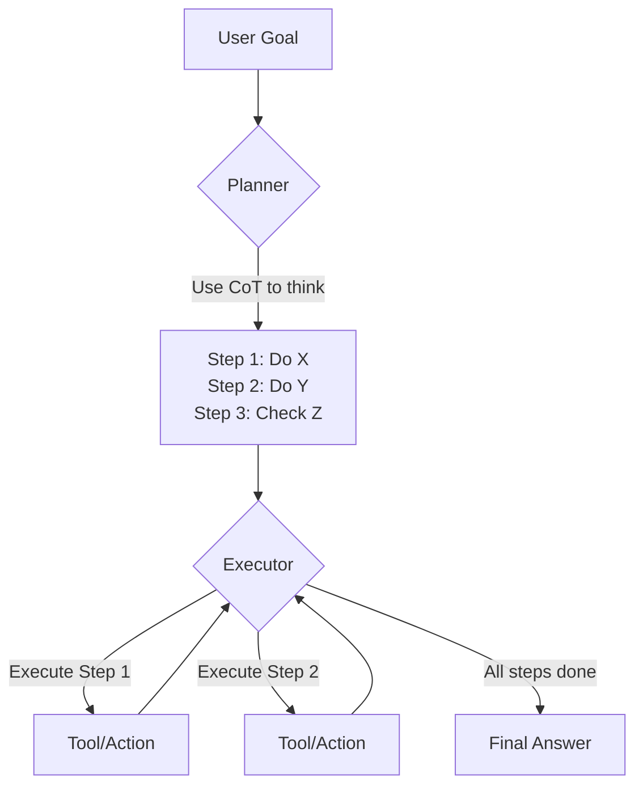

Today, we're exploring one of the most impactful yet simple concepts in modern AI: **Chain-of-Thought (CoT) Reasoning**. Mastering this technique is the first step toward building agents that don't just guess answers, but can actually *reason* their way to a solution.

### 1. Concept Introduction

In simple terms, **Chain-of-Thought is like showing your work on a math problem**. Instead of just writing down the final answer, you write out each step you took to get there. For a Large Language Model (LLM), this means generating intermediate, sequential reasoning steps before outputting the final answer.

Technically, CoT is a prompting strategy that encourages a model to decompose a multi-step problem into the intermediate steps necessary for its solution. This transforms a single, complex query into a series of simpler thoughts. This explicit reasoning process dramatically improves performance on tasks requiring arithmetic, commonsense, and symbolic reasoning.

### 2. Historical & Theoretical Context

The idea was formally introduced by Google Research in the 2022 paper **"Chain-of-Thought Prompting Elicits Reasoning in Large Language Models"** by Wei et al. Before this, models were often prompted directly (zero-shot) and would frequently fail at complex reasoning tasks.

The researchers hypothesized that the failures were not necessarily due to a lack of knowledge, but an inability to allocate "cognitive" effort to break down the problem. By explicitly instructing the model to "think step by step," they discovered that the model's latent reasoning abilities, acquired during training, could be effectively unlocked. This connects to the core AI principle that the *process* of arriving at an answer is often as important as the answer itself.

### 3. Algorithms & Math

Chain-of-Thought is not a formal algorithm but a prompting methodology. Its structure can be represented as a simple comparison between a standard prompt and a CoT prompt.

**Standard Prompt (Zero-Shot):**

```
Question: The cafeteria had 23 apples. If they used 20 to make lunch and bought 6 more, how many apples do they have?
Answer: 29
```

The model often gets this wrong because it pattern-matches "23" and "6" and adds them.

**Chain-of-Thought Prompt (Few-Shot Example):**

```
Question: A farmer has 15 tomatoes. He sells 5 and buys 3 more. How many does he have?
Answer: The farmer starts with 15 tomatoes. He sells 5, so he has 15 - 5 = 10. He buys 3 more, so he has 10 + 3 = 13. The answer is 13.

Question: The cafeteria had 23 apples. If they used 20 to make lunch and bought 6 more, how many apples do they have?
Answer:
```

By providing an example of the *reasoning process*, the model learns to follow the same pattern for the new question.

**Pseudocode for a CoT-enabled query:**

```
function solve_with_cot(problem):
  // Provide one or more examples of step-by-step thinking
  example_prompt = """
  Q: [Example Problem 1]
  A: [Step 1]. [Step 2]. [Step 3]. The answer is [Result 1].
  """

  // Append the actual problem and a trigger phrase
  final_prompt = example_prompt + "\nQ: " + problem + "\nA: Let's think step by step."

  // Send to LLM
  response = llm.generate(final_prompt)
  return response
```

### 4. Design Patterns & Architectures

CoT is a fundamental pattern in modern agent architectures, especially within the **Planner-Executor** loop. The "Planner" component uses CoT to break down a goal into a sequence of executable steps.



The CoT is the internal monologue of the Planner, forming a bridge between a high-level goal and low-level actions.

### 5. Practical Application

Here’s a small Python example using a hypothetical LLM library.

```python
# Assume 'llm' is an initialized LLM client
import llm

def solve_problem_directly(problem_text):
    """Attempts to solve the problem with a standard prompt."""
    prompt = f"Question: {problem_text}\nAnswer:"
    response = llm.complete(prompt)
    return response.text

def solve_with_chain_of_thought(problem_text):
    """Uses a CoT prompt to guide the model's reasoning."""
    cot_prompt = (
        "Question: A jug has 1000ml of water. You pour out 250ml for tea and then "
        "pour out 400ml for coffee. How much is left?\n"
        "Answer: The jug starts with 1000ml. Pouring out 250ml leaves 1000 - 250 = 750ml. "
        "Then pouring out 400ml leaves 750 - 400 = 350ml. The answer is 350.\n\n"
        f"Question: {problem_text}\n"
        "Answer: Let's think step by step."
    )
    response = llm.complete(cot_prompt, stop_sequence="\n\n")
    return response.text

# The Problem
problem = "A library has 5 shelves. Each shelf has 30 books. If a student borrows 12 books, how many books are left in the library?"

# Compare the outputs
print("Direct Answer:", solve_problem_directly(problem))
print("CoT Answer:", solve_with_chain_of_thought(problem))

# Expected Direct Answer (often wrong): "42" or some other incorrect number.
# Expected CoT Answer: "First, calculate the total number of books. 5 shelves * 30 books/shelf = 150 books. A student borrows 12 books. So, 150 - 12 = 138 books are left. The answer is 138."
```

In frameworks like **LangGraph** or **CrewAI**, CoT is implemented within the nodes or tasks. A LangGraph node might be responsible for generating a CoT plan, which is then passed to subsequent nodes for execution.

### 6. Comparisons & Tradeoffs

*   **CoT vs. Direct Prompting**: CoT is more accurate for complex tasks but has higher latency and token cost because the reasoning steps are generated. Direct prompting is faster but brittle.
*   **CoT vs. Tree of Thoughts (ToT)**: CoT follows a single reasoning path. ToT, a more advanced technique, explores multiple reasoning paths simultaneously (like a tree) and uses self-correction and evaluation to choose the best path. CoT is a linear chain; ToT is a branching exploration.

### 7. Latest Developments & Research

The success of CoT has spurred a wave of research into more advanced reasoning techniques:

1.  **Self-Consistency (2022)**: This method runs multiple CoT chains from the same prompt (by increasing temperature) and then takes a majority vote on the final answer. This improves accuracy by mitigating the risk of a single flawed reasoning path.
2.  **Tree of Thoughts (ToT) (2023)**: As mentioned, ToT generalizes CoT by allowing the model to explore multiple reasoning paths. It's more robust for problems where backtracking or exploration is necessary.
3.  **Graph of Thoughts (GoT) (2023)**: This further generalizes reasoning into a graph structure, allowing thoughts to be merged and combined, creating a more flexible and powerful reasoning framework than a simple tree.

The current debate is about how to make these reasoning processes more efficient and less reliant on verbose, token-heavy prompting.

### 8. Cross-Disciplinary Insight

Chain-of-Thought mirrors the concept of **System 2 Thinking** from cognitive psychology, popularized by Daniel Kahneman in his book *Thinking, Fast and Slow*.

*   **System 1** is fast, intuitive, and automatic (like a direct prompt).
*   **System 2** is slow, deliberate, and logical (like a CoT prompt).

By forcing the LLM to "slow down" and articulate its reasoning, we are essentially engaging its equivalent of System 2, preventing it from making impulsive, System 1-style errors.

### 9. Daily Challenge / Thought Exercise

Your challenge today:

1.  Find a multi-step logic puzzle or a word problem online. (e.g., "If Alice is taller than Bob, and Carol is shorter than Alice but taller than Bob, who is the second tallest?")
2.  Open a playground for an LLM (like GPT-4, Claude, or Gemini).
3.  First, prompt it directly with the question and record the answer.
4.  Second, write a CoT prompt. Start with a simple, unrelated example of step-by-step reasoning, then add the puzzle and the trigger phrase "Let's think step by step."
5.  Compare the results. Did the model get it right the first time? Was the CoT response more reliable?

### 10. References & Further Reading

*   **Original CoT Paper**: [Wei, J., et al. (2022). Chain-of-Thought Prompting Elicits Reasoning in Large Language Models.](https://arxiv.org/abs/2201.11903)
*   **Self-Consistency**: [Wang, X., et al. (2022). Self-Consistency Improves Chain of Thought Reasoning in Language Models.](https://arxiv.org/abs/2203.11171)
*   **Tree of Thoughts**: [Yao, S., et al. (2023). Tree of Thoughts: Deliberate Problem Solving with Large Language Models.](https://arxiv.org/abs/2305.10601)
*   **Blog Post Explainer**: [A Deep Dive into Chain-of-Thought Prompting](https://www.promptingguide.ai/techniques/cot)

---