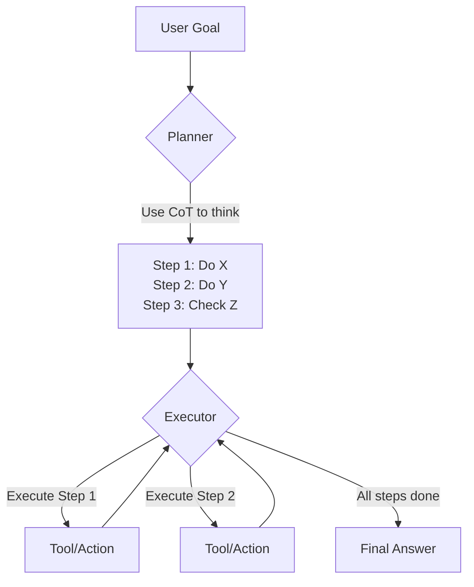

### Concept Introduction

**Chain-of-Thought (CoT) Reasoning** is a prompting strategy that encourages a model to decompose a multi-step problem into the intermediate steps necessary for its solution. Instead of outputting a final answer directly, the model generates sequential reasoning steps first. This explicit reasoning process dramatically improves performance on tasks requiring arithmetic, commonsense, and symbolic reasoning.

### Historical & Theoretical Context

The idea was formally introduced by Google Research in the 2022 paper **"Chain-of-Thought Prompting Elicits Reasoning in Large Language Models"** by Wei et al. Before this, models were often prompted directly (zero-shot) and would frequently fail at complex reasoning tasks.

The researchers hypothesized that failures were not necessarily due to a lack of knowledge, but an inability to allocate "cognitive" effort to break down the problem. By explicitly instructing the model to "think step by step," they found that latent reasoning abilities acquired during training could be unlocked. The *process* of arriving at an answer matters as much as the answer itself.

### Algorithms & Math

Chain-of-Thought is not a formal algorithm but a prompting methodology. Its structure can be represented as a simple comparison between a standard prompt and a CoT prompt.

**Standard Prompt (Zero-Shot):**

```
Question: The cafeteria had 23 apples. If they used 20 to make lunch and bought 6 more, how many apples do they have?
Answer: 29
```

The model often gets this wrong because it pattern-matches "23" and "6" and adds them.

**Chain-of-Thought Prompt (Few-Shot Example):**

```
Question: A farmer has 15 tomatoes. He sells 5 and buys 3 more. How many does he have?
Answer: The farmer starts with 15 tomatoes. He sells 5, so he has 15 - 5 = 10. He buys 3 more, so he has 10 + 3 = 13. The answer is 13.

Question: The cafeteria had 23 apples. If they used 20 to make lunch and bought 6 more, how many apples do they have?
Answer:
```

By providing an example of the *reasoning process*, the model learns to follow the same pattern for the new question.

**Pseudocode for a CoT-enabled query:**

```
function solve_with_cot(problem):
  // Provide one or more examples of step-by-step thinking
  example_prompt = """
  Q: [Example Problem 1]
  A: [Step 1]. [Step 2]. [Step 3]. The answer is [Result 1].
  """

  // Append the actual problem and a trigger phrase
  final_prompt = example_prompt + "\nQ: " + problem + "\nA: Let's think step by step."

  // Send to LLM
  response = llm.generate(final_prompt)
  return response
```

### Design Patterns & Architectures

CoT is a fundamental pattern in modern agent architectures, especially within the **Planner-Executor** loop. The Planner uses CoT to break down a goal into a sequence of executable steps.


```mermaid
graph TD
    A[User Goal] --> B{Planner};
    B -- "Use CoT to think" --> C[Step 1: Do X<br>Step 2: Do Y<br>Step 3: Check Z];
    C --> D{Executor};
    D -- "Execute Step 1" --> E[Tool/Action];
    E --> D;
    D -- "Execute Step 2" --> F[Tool/Action];
    F --> D;
    D -- "All steps done" --> G[Final Answer];
```

The CoT is the internal monologue of the Planner, bridging the gap between a high-level goal and low-level actions.

### Practical Application

A minimal Chain-of-Thought implementation centers on three moving parts: a **prompt builder** that prepends one or two worked examples in the format `Question / Reasoning / Answer`, a **completion call** to the LLM with a trigger phrase such as "Let's think step by step" appended to the user query, and a lightweight **answer extractor** that strips the reasoning trace and returns only the final line. The raw Anthropic SDK is the best fit for a focused demo because the full CoT trace lives inside a single `messages` turn with no orchestration overhead. For pipeline work, a LangGraph graph with two nodes — one that emits the reasoning chain into shared state and a second that reads that state to produce a structured answer — maps naturally onto the generate-then-verify pattern that CoT enables. Data flows as: raw question → prompt builder → `client.messages.create` → raw response text → extractor → final answer, with the intermediate reasoning stored (or logged) for debugging.

**Try it**

```
Using the Anthropic Python SDK, build a chain-of-thought helper.
Define a build_cot_prompt(question) function that prepends one
worked math example (question + step-by-step reasoning + answer)
then appends the new question with "Let's think step by step."
Call claude-sonnet-4-6 via client.messages.create, print the full
reasoning trace, then extract and print only the final answer line.
Add inline comments explaining each step. Return runnable code.
```
