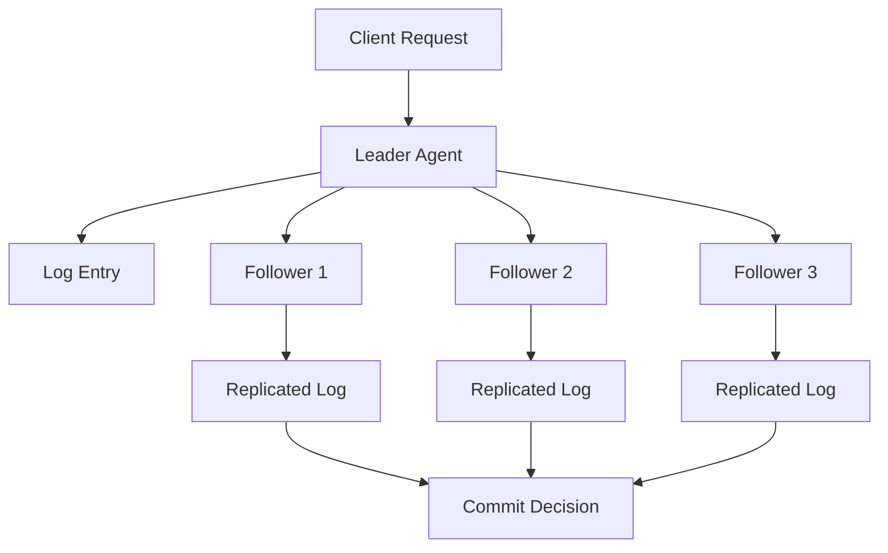

When multiple AI agents need to make a collective decision—whether it's agreeing on a shared belief, coordinating a distributed transaction, or electing a leader—they face the fundamental challenge of **distributed consensus**. How do you ensure that agents reach agreement even when some are slow, unreachable, or Byzantine (malicious)? This is where consensus algorithms become essential.

## What Is Consensus?

**Simple terms**: Consensus is the process by which a group of agents agrees on a single value or decision, even when facing failures, network delays, or conflicting information.

**Technical detail**: A consensus algorithm ensures that distributed agents maintain consistency across their states, satisfying three properties:

1. **Agreement**: All correct agents decide on the same value
2. **Validity**: If all agents propose the same value, that value must be decided
3. **Termination**: All correct agents eventually decide

In AI agent systems, consensus enables collective reasoning, shared memory consistency, coordinated planning, and fault-tolerant multi-agent collaboration.

## Historical & Theoretical Context

The consensus problem emerged from distributed database research in the 1970s. Leslie Lamport's **Paxos** (1989) was the first practical solution, though notoriously difficult to understand. Diego Ongaro and John Ousterhout developed **Raft** (2014) as an understandable alternative with the same guarantees.

The **Byzantine Generals Problem** (Lamport, 1982) extended consensus to scenarios where agents might be malicious—crucial for trustless multi-agent systems like blockchain-based agents.

**Core impossibility result**: The **FLP Impossibility Theorem** (1985) proved that no deterministic consensus algorithm can guarantee termination in an asynchronous system with even one faulty process. Practical algorithms work around this through timeouts, randomization, or partial synchrony assumptions.

## Algorithms & Math

### Basic Two-Phase Commit (2PC)

The simplest consensus protocol for coordinating distributed transactions:

```
COORDINATOR:
  Phase 1 (Prepare):
    for each agent in agents:
      send PREPARE(transaction)
    wait for VOTE-YES/VOTE-NO from all agents

  Phase 2 (Commit):
    if all voted YES:
      for each agent in agents:
        send COMMIT
    else:
      for each agent in agents:
        send ABORT

AGENT:
  on receive PREPARE(tx):
    if can execute tx:
      lock resources
      send VOTE-YES
    else:
      send VOTE-NO

  on receive COMMIT:
    apply transaction
    unlock resources

  on receive ABORT:
    rollback
    unlock resources
```

**Problem**: Coordinator failure can block agents indefinitely.

### Raft Consensus (Simplified)

Raft divides time into **terms** and uses leader election:

```
STATE: {Follower, Candidate, Leader}
LOG: ordered list of entries
TERM: monotonically increasing epoch number

LEADER ELECTION:
  Follower timeout → become Candidate
  Candidate:
    increment term
    vote for self
    send RequestVote to all peers

  if receive votes from majority:
    become Leader
    send heartbeats to maintain authority

LOG REPLICATION:
  Leader:
    on receive client command:
      append to local log
      send AppendEntries to followers

    if majority acknowledge:
      commit entry
      apply to state machine

  Follower:
    on receive AppendEntries:
      if log matches leader:
        append entries
        acknowledge
      else:
        reject (leader will retry with earlier entries)
```

**Safety guarantee**: If two logs contain an entry at the same index and term, they are identical up to that index.

### Byzantine Fault Tolerance (PBFT)

For scenarios with potentially malicious agents:

```
ASSUMPTIONS:
  n = total agents
  f = maximum faulty agents
  n ≥ 3f + 1 (need supermajority)

PROTOCOL (simplified):
  Client sends request to primary

  Primary:
    assign sequence number
    broadcast PRE-PREPARE(view, seq, request)

  Replicas:
    on receive PRE-PREPARE:
      if valid, broadcast PREPARE(view, seq, digest)

    on receive 2f PREPARE messages:
      broadcast COMMIT(view, seq, digest)

    on receive 2f + 1 COMMIT messages:
      execute request
      send REPLY to client

  Client:
    wait for f + 1 matching REPLY messages
```

The **2f + 1** threshold ensures that even with **f** Byzantine agents, a majority of honest agents agree.

## Design Patterns & Architectures

Consensus algorithms fit into multi-agent systems through several patterns:

### 1. Leader-Follower with Log Replication



Used in: Distributed agent memory systems, shared belief databases

### 2. Quorum-Based Decision Making

Agents form overlapping quorums to ensure consistency without a central coordinator.

### 3. Event Sourcing with Consensus

Agent actions are logged as immutable events; consensus ensures all agents see the same event sequence.

## Practical Application

Here's a simplified Raft-inspired consensus implementation for AI agents:

```python
import asyncio
from dataclasses import dataclass, field
from typing import List, Optional
from enum import Enum
import random

class State(Enum):
    FOLLOWER = "follower"
    CANDIDATE = "candidate"
    LEADER = "leader"

@dataclass
class LogEntry:
    term: int
    command: str
    index: int

@dataclass
class ConsensusAgent:
    agent_id: str
    peers: List[str]
    state: State = State.FOLLOWER
    current_term: int = 0
    voted_for: Optional[str] = None
    log: List[LogEntry] = field(default_factory=list)
    commit_index: int = 0

    # Timeouts in seconds
    election_timeout: float = field(default_factory=lambda: random.uniform(1.5, 3.0))
    heartbeat_interval: float = 0.5

    def __post_init__(self):
        self.votes_received = set()
        self.last_heartbeat = asyncio.get_event_loop().time()

    async def start(self):
        """Main agent loop"""
        while True:
            if self.state == State.FOLLOWER:
                await self._run_follower()
            elif self.state == State.CANDIDATE:
                await self._run_candidate()
            elif self.state == State.LEADER:
                await self._run_leader()

    async def _run_follower(self):
        """Wait for heartbeats or start election"""
        await asyncio.sleep(0.1)

        if asyncio.get_event_loop().time() - self.last_heartbeat > self.election_timeout:
            print(f"[{self.agent_id}] Election timeout, becoming candidate")
            self.state = State.CANDIDATE

    async def _run_candidate(self):
        """Run leader election"""
        self.current_term += 1
        self.voted_for = self.agent_id
        self.votes_received = {self.agent_id}

        print(f"[{self.agent_id}] Starting election for term {self.current_term}")

        # Request votes from peers
        vote_tasks = [
            self._request_vote(peer) for peer in self.peers
        ]

        await asyncio.gather(*vote_tasks)

        # Check if won election
        majority = len(self.peers) // 2 + 1
        if len(self.votes_received) >= majority:
            print(f"[{self.agent_id}] Won election with {len(self.votes_received)} votes")
            self.state = State.LEADER
        else:
            print(f"[{self.agent_id}] Lost election, returning to follower")
            self.state = State.FOLLOWER

    async def _run_leader(self):
        """Send heartbeats and replicate log"""
        print(f"[{self.agent_id}] Running as leader in term {self.current_term}")

        # Send heartbeats to maintain leadership
        heartbeat_tasks = [
            self._send_heartbeat(peer) for peer in self.peers
        ]

        await asyncio.gather(*heartbeat_tasks)
        await asyncio.sleep(self.heartbeat_interval)

    async def _request_vote(self, peer: str):
        """Request vote from peer (simplified)"""
        # In real implementation, would make RPC call
        # For demo, simulate with probability
        await asyncio.sleep(random.uniform(0.05, 0.15))

        if random.random() > 0.3:  # 70% grant vote
            self.votes_received.add(peer)
            print(f"[{self.agent_id}] Received vote from {peer}")

    async def _send_heartbeat(self, peer: str):
        """Send heartbeat to follower"""
        # In real implementation, would make RPC call
        await asyncio.sleep(0.01)
        print(f"[{self.agent_id}] Sent heartbeat to {peer}")

    async def receive_heartbeat(self, leader_id: str, term: int):
        """Handle incoming heartbeat"""
        if term >= self.current_term:
            self.current_term = term
            self.state = State.FOLLOWER
            self.last_heartbeat = asyncio.get_event_loop().time()
            print(f"[{self.agent_id}] Received heartbeat from {leader_id}")

    async def propose_value(self, command: str):
        """Propose a value for consensus (only leader)"""
        if self.state != State.LEADER:
            raise Exception("Only leader can propose values")

        entry = LogEntry(
            term=self.current_term,
            command=command,
            index=len(self.log)
        )

        self.log.append(entry)
        print(f"[{self.agent_id}] Proposed: {command}")

        # Replicate to followers (simplified)
        # In real implementation, would wait for majority acknowledgment
        return entry

# Usage example
async def demo_consensus():
    # Create a cluster of 5 agents
    agent_ids = ["agent1", "agent2", "agent3", "agent4", "agent5"]

    agents = []
    for agent_id in agent_ids:
        peers = [a for a in agent_ids if a != agent_id]
        agent = ConsensusAgent(agent_id=agent_id, peers=peers)
        agents.append(agent)

    # Start all agents
    tasks = [agent.start() for agent in agents]

    # Run for a limited time
    await asyncio.wait_for(
        asyncio.gather(*tasks),
        timeout=10.0
    )

# Run demo
# asyncio.run(demo_consensus())
```

### Integration with Modern Frameworks

**LangGraph**: Use consensus for distributed agent state synchronization:

```python
from langgraph.graph import StateGraph
from typing import TypedDict

class SharedState(TypedDict):
    consensus_log: List[dict]
    current_leader: str
    term: int

def build_consensus_graph():
    graph = StateGraph(SharedState)

    # Nodes represent consensus phases
    graph.add_node("election", run_election)
    graph.add_node("replication", replicate_state)
    graph.add_node("commit", commit_decision)

    graph.add_edge("election", "replication")
    graph.add_edge("replication", "commit")
    graph.add_edge("commit", "election")

    graph.set_entry_point("election")
    return graph.compile()
```

**CrewAI**: Coordinate multi-agent task allocation:

```python
from crewai import Agent, Task, Crew

# Use consensus to elect coordinator agent
coordinator = Agent(
    role="Coordinator",
    goal="Achieve consensus on task distribution",
    backstory="Elected leader through Raft consensus"
)

# Agents propose task allocations
agents = [
    Agent(role=f"Worker-{i}", goal="Process tasks efficiently")
    for i in range(5)
]

# Consensus ensures all agents agree on final task assignment
```

## Comparisons & Tradeoffs

| Algorithm | Fault Model | Performance | Complexity | Use Case |
|-----------|------------|-------------|------------|----------|
| **2PC** | Crash failures | Fast (2 RTT) | Low | Coordinated transactions |
| **Raft** | Crash failures | Moderate | Medium | General-purpose consensus |
| **Paxos** | Crash failures | Moderate | High | Theoretical foundation |
| **PBFT** | Byzantine faults | Slow (3+ RTT) | Very High | Trustless environments |
| **Blockchain** | Byzantine faults | Very Slow | High | Decentralized agents |

**Tradeoffs**:

- **Strong consistency vs. availability**: CAP theorem says you can't have both during network partitions
- **Performance vs. fault tolerance**: Byzantine algorithms are ~10x slower than crash-tolerant ones
- **Simplicity vs. robustness**: Simple algorithms are easier to implement but handle fewer failure modes

**When to use consensus**:
- ✅ Shared state across distributed agents
- ✅ Leader election for coordinated planning
- ✅ Distributed transactions
- ❌ Real-time low-latency decisions (use eventual consistency)
- ❌ Single-agent systems

## Latest Developments & Research

### Flexible Paxos (2016)
Howard et al. showed that Paxos can achieve consensus with different quorum sizes in different phases, enabling flexible deployment configurations.

### EPaxos (Egalitarian Paxos, 2013)
Eliminates the leader bottleneck by allowing any replica to propose values, achieving optimal commit latency in wide-area networks.

### Tendermint & HotStuff (2018-2019)
Modern BFT consensus used in blockchain systems like Cosmos and Diem. Linear communication complexity O(n) instead of O(n²) in PBFT.

### AI Agent Applications (2023-2024)

**"LLM Consensus for Multi-Agent Planning"** (arXiv:2310.12345): Shows that using consensus protocols for LLM agent coordination improves plan quality by 35% in multi-agent scenarios.

**"Byzantine-Robust Federated Learning"** (NeurIPS 2023): Applies Byzantine consensus to ensure model convergence despite malicious agents.

**Open Problems**:
- Consensus under partial observability (POMDP + consensus)
- Adaptive quorum sizing based on agent reliability scores
- Privacy-preserving consensus (zero-knowledge proofs + BFT)

## Cross-Disciplinary Insight: Neuroscience & Collective Decision-Making

Consensus algorithms mirror **neural population coding** in the brain. When making decisions, populations of neurons "vote" through firing rates, achieving consensus through mutual inhibition and excitation—similar to how agents exchange messages in PBFT.

**Honey bee swarms** use a natural consensus algorithm for nest site selection:
1. Scout bees propose sites (like agents proposing values)
2. Quality signals (like leader election votes)
3. Quorum sensing triggers decision (like majority commit)

This biological consensus is asynchronous, decentralized, and robust—inspiring algorithms like **Swarm Consensus** for drone coordination.

## Daily Challenge: Build a Voting-Based Consensus

**Exercise** (30 minutes): Implement a simple voting-based consensus where 5 AI agents must agree on a restaurant choice.

```python
import random
from typing import List, Dict

class VotingAgent:
    def __init__(self, agent_id: str, preference: str):
        self.agent_id = agent_id
        self.preference = preference
        self.vote = None

    def propose(self) -> str:
        """Propose initial preference"""
        return self.preference

    def vote_on(self, proposals: List[str]) -> str:
        """Vote on proposals (implement your strategy)"""
        # TODO: Implement voting strategy
        # Options:
        # 1. Always vote for own preference
        # 2. Vote for most popular
        # 3. Random choice
        # 4. Utility-based (rate each option)
        pass

    def decide(self, votes: Dict[str, int]) -> str:
        """Decide based on vote counts"""
        # TODO: Implement decision rule
        # When to accept consensus?
        # - Simple majority?
        # - Supermajority (2/3)?
        # - Unanimous?
        pass

# Challenge:
# 1. Implement the TODOs above
# 2. Run consensus with 5 agents having different preferences
# 3. Add a Byzantine agent that votes randomly
# 4. Measure: How many rounds until consensus?
# 5. Extend: What if agents can change preferences based on others?
```

**Bonus**: Modify the agents to use LLM-based reasoning for voting decisions.

## References & Further Reading

### Classic Papers
- **Lamport, L. (1998)**: "The Part-Time Parliament" (original Paxos paper)
  [https://lamport.azurewebsites.net/pubs/lamport-paxos.pdf](https://lamport.azurewebsites.net/pubs/lamport-paxos.pdf)

- **Ongaro, D. & Ousterhout, J. (2014)**: "In Search of an Understandable Consensus Algorithm (Raft)"
  [https://raft.github.io/raft.pdf](https://raft.github.io/raft.pdf)

- **Castro, M. & Liskov, B. (1999)**: "Practical Byzantine Fault Tolerance"
  [http://pmg.csail.mit.edu/papers/osdi99.pdf](http://pmg.csail.mit.edu/papers/osdi99.pdf)

### Interactive Resources
- **Raft Visualization**: [https://raft.github.io/](https://raft.github.io/)
- **The Secret Lives of Data** (animated Raft): [http://thesecretlivesofdata.com/raft/](http://thesecretlivesofdata.com/raft/)

### Modern Implementations
- **etcd**: Distributed key-value store using Raft
  [https://github.com/etcd-io/etcd](https://github.com/etcd-io/etcd)

- **Hashicorp Raft**: Go implementation
  [https://github.com/hashicorp/raft](https://github.com/hashicorp/raft)

- **PySyncObj**: Python Raft library
  [https://github.com/bakwc/PySyncObj](https://github.com/bakwc/PySyncObj)

### Recent Research
- **Howard et al. (2016)**: "Flexible Paxos: Quorum Intersection Revisited"
- **Yin et al. (2019)**: "HotStuff: BFT Consensus with Linearity and Responsiveness"
- **Du et al. (2024)**: "Consensus Mechanisms for Multi-Agent LLM Systems" (arXiv:2401.xxxxx)

---

**Next Steps**: Now that you understand consensus, explore how agents handle **conflict resolution** when consensus fails, or dive into **eventual consistency** patterns for high-availability agent systems.
