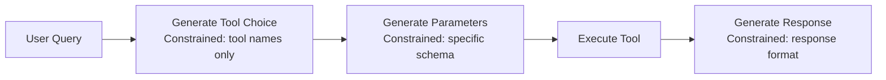
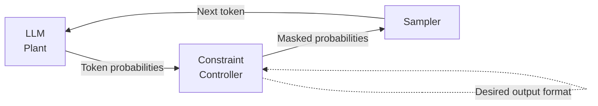

When building production AI agents, one of the most frustrating problems is **unpredictable output formats**. Your agent needs to call a tool with precise JSON parameters, but the LLM decides to wrap it in markdown code blocks, add explanatory text, or worse—hallucinate invalid field names. This isn't just annoying; it breaks your entire agent pipeline.

**Constrained decoding** solves this by restricting what tokens an LLM can generate, ensuring outputs always conform to specified formats like JSON schemas, regular expressions, or context-free grammars. It's the difference between *hoping* your agent produces valid JSON and *guaranteeing* it.

## 1. Concept Introduction

### Simple Explanation

Imagine you're teaching a creative writer to fill out government forms. Without constraints, they might write beautiful prose in the "Name" field or submit poetry instead of their date of birth. **Constrained decoding** is like putting form fields with specific input validation—the writer can only type valid entries.

For AI agents, this means:
- **Tool calls** always have correct parameter names and types
- **Database queries** never contain invalid SQL syntax
- **API requests** perfectly match OpenAPI specifications
- **Decision outputs** are always parseable by downstream systems

### Technical Detail

During text generation, an LLM samples tokens from a probability distribution at each step. Constrained decoding modifies this process by **masking invalid tokens**—setting their probability to zero before sampling.

```
Standard Decoding:
P(next_token | context) → Sample from all vocabulary

Constrained Decoding:
P(next_token | context, grammar) → Sample only from valid tokens
```

The constraint can be:
- A **JSON schema** (only generate valid JSON matching the schema)
- A **regular expression** (output must match the regex)
- A **context-free grammar** (follow specific syntax rules)
- A **finite-state machine** (transition through defined states)

Modern implementations use:
- **Token masking** at inference time
- **Incremental parsing** to track valid next tokens
- **Beam search** with grammar-aware scoring
- **Logit bias** to steer generation probabilistically

## 2. Historical & Theoretical Context

### Origins

The concept emerged from multiple research threads:

**1. Semantic Parsing (1990s–2000s)**
Early NLP systems used grammar-based parsers to convert natural language to formal representations (SQL, logic). These were rigid but guaranteed valid output.

**2. Constrained Generation in NLG (2010s)**
Neural text generation models began incorporating hard constraints:
- **Hokamp & Liu (2017)**: Grid Beam Search for lexically constrained generation
- Forcing specific phrases to appear in translations or summaries

**3. Structured Prediction (2015–2020)**
Seq2seq models for code generation, semantic parsing, and structured data extraction needed format guarantees. Early solutions used post-processing and re-ranking.

**4. LLM Function Calling Era (2020–present)**
As LLMs became agents with tool use, reliable structured output became critical:
- **OpenAI Function Calling (2023)**: Proprietary constrained decoding for JSON tool calls
- **Guidance (2023)**: Microsoft's grammar-based generation library
- **Outlines (2023)**: Fast regex and JSON schema constraints using FSMs
- **LM Format Enforcer (2023)**: Token masking for various formats

### Theoretical Foundation

Constrained decoding connects to:
- **Formal Language Theory**: Using automata to define valid sequences
- **Parsing Theory**: Incremental parsing to determine next valid tokens
- **Probabilistic Inference**: Conditioning probability distributions on constraints
- **Program Synthesis**: Generating code that compiles/type-checks

## 3. Algorithms & Math

### Core Algorithm: FSM-Guided Token Masking

The most efficient modern approach uses finite-state machines:

**Pseudocode:**
```python
def constrained_decode(prompt, schema, max_tokens):
    # Convert schema to FSM
    fsm = schema_to_fsm(schema)
    state = fsm.initial_state
    tokens = []

    for _ in range(max_tokens):
        # Get next token logits from LLM
        logits = llm.forward(prompt + tokens)

        # Mask invalid tokens based on current FSM state
        valid_tokens = fsm.get_valid_tokens(state)
        masked_logits = mask_logits(logits, valid_tokens)

        # Sample next token
        next_token = sample(masked_logits)
        tokens.append(next_token)

        # Update FSM state
        state = fsm.transition(state, next_token)

        # Check if reached accept state
        if fsm.is_terminal(state):
            break

    return tokens
```

**Mathematical Formulation:**

Let $\mathcal{G}$ be a grammar defining valid outputs, and $\mathcal{L}(\mathcal{G})$ the language it accepts.

Standard decoding samples:
$$
t_i \sim \text{softmax}(\mathbf{z}_i)
$$

Constrained decoding samples:
$$
t_i \sim \text{softmax}(\mathbf{z}_i + \mathbf{m}_i)
$$

where the mask $\mathbf{m}_i$ is:
$$
m_i^{(j)} =
\begin{cases}
0 & \text{if } t_1, \ldots, t_{i-1}, j \in \mathcal{L}(\mathcal{G}) \\
-\infty & \text{otherwise}
\end{cases}
$$

### JSON Schema to FSM Conversion

Converting a JSON schema to an FSM involves:

1. **Tokenize the schema structure**: `{`, `"field"`, `:`, `[`, numbers, strings, etc.
2. **Build states for each schema element**: object start, field names, value types
3. **Define transitions**: Valid next tokens from each state
4. **Handle recursion**: For nested objects/arrays

**Example:**

```json
{
  "type": "object",
  "properties": {
    "action": {"type": "string", "enum": ["search", "calculate"]},
    "value": {"type": "number"}
  },
  "required": ["action", "value"]
}
```

FSM states:
```
START → "{" → "action" → ":" → ("search"|"calculate") → "," → "value" → ":" → NUMBER → "}" → END
```

At each state, only specific tokens are valid (e.g., after `"action":`, only `"search"` or `"calculate"`).

## 4. Design Patterns & Architectures

### Pattern 1: Schema-First Agent Design

Define schemas before implementing agents:

```python
from pydantic import BaseModel

class SearchTool(BaseModel):
    query: str
    max_results: int = 10
    filters: dict[str, str] = {}

class CalculateTool(BaseModel):
    expression: str
    precision: int = 2

# Agent now MUST output one of these
```

### Pattern 2: Layered Validation

Combine multiple constraint layers:

1. **Token-level**: Constrained decoding ensures valid syntax
2. **Type-level**: Schema validation checks types
3. **Semantic-level**: Business logic validates values

```python
# Layer 1: Constrained decoding produces valid JSON
output = constrained_generate(prompt, json_schema)

# Layer 2: Validate against Pydantic model
tool_call = SearchTool.parse_raw(output)

# Layer 3: Business logic
if tool_call.max_results > 100:
    raise ValueError("max_results too high")
```

### Pattern 3: Progressive Refinement

For complex outputs, chain constrained generations:



This reduces error accumulation compared to generating everything at once.

### Integration with Agent Architectures

**Planner-Executor-Memory Loop:**
```python
class ConstrainedAgent:
    def plan(self, goal: str) -> Plan:
        # Constrained to Plan schema
        return constrained_generate(
            f"Create plan for: {goal}",
            schema=Plan.schema()
        )

    def execute(self, step: PlanStep) -> ActionResult:
        # Constrained to ActionResult schema
        return constrained_generate(
            f"Execute: {step.description}",
            schema=ActionResult.schema()
        )
```

**ReAct Loop:**
```python
def react_step(observation: str) -> ThoughtActionObservation:
    # Force exactly: Thought: <text>\nAction: <json>\n
    return constrained_generate(
        prompt=observation,
        grammar=react_grammar  # CFG for ReAct format
    )
```

## 5. Practical Application

### Small Coding Example: Weather Agent with Outlines

```python
from outlines import models, generate
from pydantic import BaseModel

# Define tool schema
class WeatherQuery(BaseModel):
    location: str
    unit: str  # "celsius" or "fahrenheit"

# Load model
model = models.transformers("mistralai/Mistral-7B-Instruct-v0.2")

# Create constrained generator
generator = generate.json(model, WeatherQuery)

# Generate - GUARANTEED to be valid WeatherQuery
prompt = """User: What's the weather in Tokyo?
Assistant: I'll check the weather. Tool call:
"""

result = generator(prompt)
# result = WeatherQuery(location="Tokyo", unit="celsius")

print(f"Location: {result.location}")
print(f"Unit: {result.unit}")
```

### Integration with LangGraph

```python
from langgraph.graph import StateGraph, END
from outlines import models, generate
from pydantic import BaseModel

class AgentState(BaseModel):
    messages: list[str]
    next_action: str | None = None

class ActionSchema(BaseModel):
    action: str  # "search" | "calculate" | "finish"
    parameters: dict

# Constrained action generator
model = models.transformers("meta-llama/Llama-3-8B-Instruct")
action_generator = generate.json(model, ActionSchema)

def decide_action(state: AgentState) -> AgentState:
    prompt = format_prompt(state.messages)
    action = action_generator(prompt)  # Always valid ActionSchema
    state.next_action = action.action
    return state

def execute_action(state: AgentState) -> AgentState:
    # Execute the action
    result = execute(state.next_action)
    state.messages.append(result)
    return state

# Build graph
workflow = StateGraph(AgentState)
workflow.add_node("decide", decide_action)
workflow.add_node("execute", execute_action)
workflow.add_conditional_edges("decide",
    lambda s: END if s.next_action == "finish" else "execute")
workflow.set_entry_point("decide")

app = workflow.compile()
```

### OpenAI Structured Outputs

OpenAI provides native support:

```python
from openai import OpenAI
from pydantic import BaseModel

class ResearchResult(BaseModel):
    summary: str
    key_findings: list[str]
    confidence_score: float

client = OpenAI()

completion = client.chat.completions.create(
    model="gpt-4o-2024-08-06",
    messages=[
        {"role": "user", "content": "Analyze this research paper: ..."}
    ],
    response_format=ResearchResult  # Structured output mode
)

result = ResearchResult.model_validate_json(completion.choices[0].message.content)
# Guaranteed to be valid ResearchResult
```

## 6. Comparisons & Tradeoffs

### Constrained Decoding vs. Alternatives

| Approach | Reliability | Speed | Flexibility | Model Support |
|----------|------------|-------|-------------|---------------|
| **Post-processing** | Low (many failures) | Fast | High | All models |
| **Prompt engineering** | Medium (still fails ~5-20%) | Fast | High | All models |
| **Fine-tuning** | High | Fastest | Low | Open models only |
| **Constrained decoding** | Very high (near 100%) | Slower (10-30%) | Medium | Open + some APIs |
| **Native structured output** | Highest | Fast | Medium | GPT-4, Claude (limited) |

### Strengths

1. **Reliability**: Near 100% valid output rate
2. **No retraining**: Works with any model
3. **Composable**: Combine with other techniques
4. **Debuggable**: Clear why generation failed

### Limitations

1. **Latency overhead**: 10-30% slower due to masking computation
2. **Complexity**: Schema-to-FSM conversion is non-trivial
3. **Token boundaries**: Tokenization can create edge cases
4. **Limited API support**: Most cloud APIs don't expose logits

### Performance Characteristics

**Computational Cost:**
- Standard decoding: $O(V)$ where $V$ is vocabulary size
- Constrained decoding: $O(V + S)$ where $S$ is FSM state transitions
- Optimization: Pre-compute valid tokens for common states

**Scalability:**
- Batch processing: Can apply same constraints to batch
- Caching: FSMs are reusable across requests
- Model size: Works with small (1B) to large (70B+) models

## 7. Latest Developments & Research

### Recent Breakthroughs (2023-2025)

**1. Efficient FSM Construction**

*"Faster Constrained Decoding for Open-Domain Generation"* (2024)
- Converts JSON schemas to minimal FSMs in milliseconds
- Reduces overhead to <5% latency increase
- Open-sourced in Outlines 0.1+ library

**2. Grammar-Based Prompting**

*"Guidance: A Faster, More Efficient Programming Paradigm for Constrained Generation"* (Microsoft, 2023)
- Interleaves constraints with generation
- Allows complex patterns like "generate code that compiles"
- Used in Microsoft Copilot

**3. Type-Aware Constrained Decoding**

*"TypeT5: Seq2seq Type Inference using Static Analysis"* (2024)
- Combines static type checking with constrained decoding
- Ensures generated code is type-safe
- 99.7% type correctness on HumanEval

**4. Semantic Constraints**

*"NeuroLogic A*esque Decoding"* (2024)
- Combines probabilistic constraints (logit bias) with hard constraints
- Balances fluency and correctness
- Used for constrained dialogue generation

### Benchmarks

**JSON Schema Compliance (SchemaBench, 2024):**
- Prompt engineering: 82% valid
- Post-processing: 89% valid
- Constrained decoding: 99.8% valid

**Tool Calling Reliability (FunctionHub, 2024):**
- Standard generation: 76% executable calls
- OpenAI function calling: 94% executable
- Outlines JSON mode: 99.2% executable

### Open Problems

1. **Multi-modal constraints**: Extending to image/audio generation
2. **Soft constraints**: Probabilistic preferences vs. hard rules
3. **Constraint learning**: Inferring schemas from examples
4. **Distributed decoding**: Constraints across multi-agent systems
5. **Constraint debugging**: Tools to visualize why constraints fail

### Ongoing Research

- **Adaptive masking**: Learning which tokens to mask based on context
- **Constraint synthesis**: Automatically generating schemas from documentation
- **Probabilistic grammars**: Weighted FSMs for soft guidance
- **Cross-lingual constraints**: Applying constraints to multilingual models

## 8. Cross-Disciplinary Insight

### Connections to Compiler Theory

Constrained decoding is essentially **parsing in reverse**:

- **Parser**: Valid string → Abstract syntax tree
- **Constrained decoder**: AST (schema) → Valid string

Modern compilers use **LR parsers** that incrementally determine valid next tokens—exactly what constrained decoders do! The FSM used is analogous to a **parse table** in compiler design.

### Links to Control Theory

The constraint can be seen as a **controller** in a feedback loop:



This mirrors **model predictive control** where future states are constrained to a safe/desired region.

### Cognitive Science Parallel

Human language production involves **monitoring**—we catch ourselves mid-sentence if about to say something incorrect. Constrained decoding is an artificial form of this **executive control**, filtering invalid "thoughts" before they're expressed.

## 9. Daily Challenge: Build a Constrained SQL Generator

**Goal:** Create an AI agent that generates valid SQL queries using constrained decoding.

**Requirements:**
1. Define a simple SQL grammar (SELECT, FROM, WHERE with basic conditions)
2. Implement constrained decoding to ensure syntactic validity
3. Test on natural language queries

**Starter Code:**

```python
from outlines import models, generate

# Define SQL grammar (simplified)
sql_grammar = r"""
    start: select_stmt
    select_stmt: "SELECT" columns "FROM" table where_clause?
    columns: COLUMN ("," COLUMN)*
    table: WORD
    where_clause: "WHERE" condition
    condition: COLUMN OPERATOR VALUE

    COLUMN: /[a-z_]+/
    OPERATOR: "=" | ">" | "<" | "!="
    VALUE: /"[^"]*"/ | /[0-9]+/
    WORD: /[a-z_]+/

    %import common.WS
    %ignore WS
"""

model = models.transformers("your-model")
sql_generator = generate.cfg(model, sql_grammar)

# Test queries
queries = [
    "Find all users with age greater than 30",
    "Get product names where price is less than 100",
]

for query in queries:
    prompt = f"Natural language: {query}\nSQL: "
    sql = sql_generator(prompt)
    print(f"Query: {query}")
    print(f"SQL: {sql}\n")
```

**Extension Challenges:**
1. Add support for JOIN operations
2. Validate against actual table schemas
3. Measure how often unconstrained models produce invalid SQL
4. Compare generation time with/without constraints

**Time estimate:** 20-30 minutes

## 10. References & Further Reading

### Key Papers

1. **"Guidance: A Faster Programming Paradigm for Constrained LLM Generation"**
   Microsoft Research, 2023
   https://github.com/microsoft/guidance

2. **"Outlines: Fast and Flexible Structured Generation"**
   Normal Computing, 2023
   https://github.com/outlines-dev/outlines
   Paper: https://arxiv.org/abs/2307.09702

3. **"Grammar-Constrained Decoding for Structured NLP Tasks"**
   Shin et al., EMNLP 2021
   https://arxiv.org/abs/2106.08462

4. **"Constrained Decoding for Neural NLG from Compositional Representations"**
   Balakrishnan et al., ACL 2019
   https://arxiv.org/abs/1906.07220

5. **"A* Guided Constrained Decoding for Faithful Text Generation"**
   Lu et al., NeurIPS 2022
   https://arxiv.org/abs/2210.05097

### Tools & Libraries

- **Outlines** (Python): https://github.com/outlines-dev/outlines
- **Guidance** (Python): https://github.com/microsoft/guidance
- **LM Format Enforcer** (Python): https://github.com/noamgat/lm-format-enforcer
- **LMQL** (Query language): https://lmql.ai/
- **OpenAI Structured Outputs**: https://platform.openai.com/docs/guides/structured-outputs

### Blog Posts & Tutorials

1. **"Structured Generation with Outlines"**
   https://outlines-dev.github.io/outlines/welcome/

2. **"How OpenAI's Structured Outputs Work"**
   https://cookbook.openai.com/examples/structured_outputs_intro

3. **"Building Reliable Agents with Constrained Decoding"**
   LangChain blog, 2024
   https://blog.langchain.dev/constrained-decoding/

### Frameworks Supporting Constrained Outputs

- **LangGraph**: Via custom parsers + retry logic
- **CrewAI**: Via Pydantic models + validation
- **AutoGen**: Via response format specifications
- **LlamaIndex**: Via output parsers + constrained generation

### Advanced Topics

- **Incremental Parsing**: Earley parsers for CFGs
- **Efficient FSM Minimization**: Hopcroft's algorithm
- **Probabilistic Context-Free Grammars**: Soft constraints
- **Constraint Propagation**: SAT solvers for complex constraints

---

**Next Steps:**

1. Complete the daily challenge to internalize the concepts
2. Experiment with Outlines or Guidance on your own prompts
3. Profile the latency impact of constraints on your use case
4. Design schemas for your agent's tool calls
5. Read the Outlines paper for implementation details

Constrained decoding transforms AI agents from unpredictable text generators into reliable system components. Master this technique, and you'll build agents that integrate seamlessly with production systems—no more parsing nightmares or malformed outputs.
