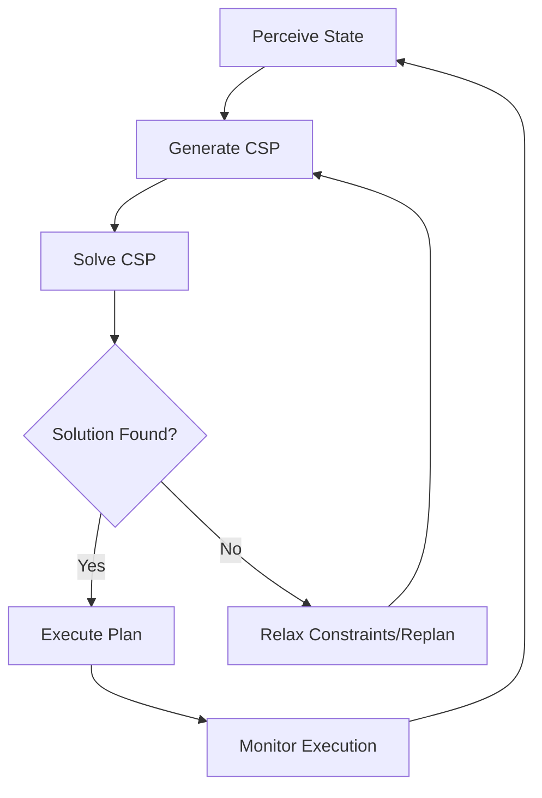

Imagine you're building an AI agent to schedule meetings for a team. Each person has availability constraints, room bookings have capacity limits, and some meetings must happen before others. You don't need the "optimal" schedule—you just need **any valid schedule** that satisfies all constraints. This is the essence of a Constraint Satisfaction Problem (CSP).

CSPs form the backbone of countless agent planning tasks: resource allocation, configuration management, scheduling, puzzle solving, and more. Unlike optimization problems that seek the best solution, CSPs focus on **finding feasible solutions** that respect hard constraints.

## 1. Concept Introduction

### Simple Terms

A Constraint Satisfaction Problem has three ingredients:

1. **Variables**: Things you need to decide (e.g., meeting times, task assignments)
2. **Domains**: Possible values each variable can take (e.g., available time slots)
3. **Constraints**: Rules that valid solutions must satisfy (e.g., "Alice can't attend meetings after 3 PM")

The goal: assign values to all variables such that **all constraints are satisfied**.

### Technical Detail

Formally, a CSP is a triple `(X, D, C)`:

- **X** = {X₁, X₂, ..., Xₙ} is a set of variables
- **D** = {D₁, D₂, ..., Dₙ} where Dᵢ is the domain of Xᵢ
- **C** = {C₁, C₂, ..., Cₘ} is a set of constraints, where each constraint Cᵢ restricts the values that a subset of variables can simultaneously take

A **solution** is a complete assignment that satisfies all constraints. CSPs can be:
- **Satisfiable**: At least one solution exists
- **Over-constrained**: No solution exists
- **Under-constrained**: Many solutions exist

## 2. Historical & Theoretical Context

CSPs emerged in the 1970s from work in artificial intelligence and operations research. Key milestones:

- **1974**: Ugo Montanari formalized CSP networks and constraint propagation
- **1977**: Alan Mackworth introduced arc consistency algorithms (AC-3)
- **1980s**: CSP techniques applied to computer vision and natural language processing
- **1990s**: Constraint programming languages (e.g., Prolog, ECLiPSe) became mainstream
- **2000s+**: Integration with SAT solvers and modern planning systems

CSPs connect to broader AI principles:
- **Search**: CSPs use backtracking search with intelligent pruning
- **Logic**: Constraints can be expressed in first-order logic
- **Inference**: Constraint propagation performs local reasoning to prune impossible values

## 3. Algorithms & Math

### Core Algorithm: Backtracking Search

```python
def backtracking_search(csp):
    return backtrack({}, csp)

def backtrack(assignment, csp):
    # Base case: complete assignment
    if len(assignment) == len(csp.variables):
        return assignment

    # Select unassigned variable
    var = select_unassigned_variable(assignment, csp)

    # Try each value in the variable's domain
    for value in order_domain_values(var, assignment, csp):
        if is_consistent(var, value, assignment, csp):
            assignment[var] = value

            # Recurse
            result = backtrack(assignment, csp)
            if result is not None:
                return result

            # Backtrack
            del assignment[var]

    return None  # Failure
```

### Constraint Propagation: AC-3 (Arc Consistency)

The AC-3 algorithm removes inconsistent values from domains before search:

```
AC-3(csp):
    queue = all arcs in csp
    while queue not empty:
        (Xi, Xj) = queue.pop()
        if Revise(csp, Xi, Xj):
            if Domain(Xi) is empty:
                return False
            for Xk in Neighbors(Xi) except Xj:
                queue.add((Xk, Xi))
    return True

Revise(csp, Xi, Xj):
    revised = False
    for x in Domain(Xi):
        if no value y in Domain(Xj) satisfies constraint between Xi and Xj:
            remove x from Domain(Xi)
            revised = True
    return revised
```

**Complexity**: O(cd³) where c = number of constraints, d = domain size

### Heuristics

1. **Minimum Remaining Values (MRV)**: Choose the variable with the fewest legal values
2. **Degree Heuristic**: Choose the variable involved in most constraints
3. **Least Constraining Value**: Prefer values that rule out the fewest choices for neighboring variables

## 4. Design Patterns & Architectures

### Integration with Agent Architectures

CSPs fit naturally into agent planning loops:



### Architectural Patterns

1. **Planner-Executor Pattern**: CSP solver acts as planner
2. **Blackboard Architecture**: Multiple agents contribute constraints to shared CSP
3. **Hierarchical Planning**: Decompose into sub-CSPs at different abstraction levels
4. **Continuous Replanning**: Solve CSP incrementally as new constraints arrive

## 5. Practical Application

### Python Example: Meeting Scheduler Agent

```python
from constraint import Problem, AllDifferentConstraint

class MeetingSchedulerAgent:
    def __init__(self):
        self.problem = Problem()

    def add_meeting(self, name, possible_times):
        """Add a meeting with available time slots."""
        self.problem.addVariable(name, possible_times)

    def add_no_conflict_constraint(self, meetings):
        """Ensure meetings don't overlap."""
        self.problem.addConstraint(AllDifferentConstraint(), meetings)

    def add_order_constraint(self, meeting1, meeting2):
        """Ensure meeting1 happens before meeting2."""
        self.problem.addConstraint(
            lambda t1, t2: t1 < t2,
            (meeting1, meeting2)
        )

    def add_availability_constraint(self, meeting, unavailable_times):
        """Exclude specific times for a meeting."""
        self.problem.addConstraint(
            lambda t: t not in unavailable_times,
            (meeting,)
        )

    def schedule(self):
        """Find a valid schedule."""
        solutions = self.problem.getSolutions()
        return solutions[0] if solutions else None

# Usage
agent = MeetingSchedulerAgent()

# Define meetings and possible times (9 AM to 5 PM)
time_slots = list(range(9, 17))
agent.add_meeting("standup", time_slots)
agent.add_meeting("design_review", time_slots)
agent.add_meeting("client_call", time_slots)
agent.add_meeting("retrospective", time_slots)

# Add constraints
agent.add_no_conflict_constraint(
    ["standup", "design_review", "client_call", "retrospective"]
)
agent.add_order_constraint("standup", "design_review")
agent.add_availability_constraint("client_call", [9, 10, 11, 16])

# Solve
schedule = agent.schedule()
print(f"Meeting schedule: {schedule}")
# Output: {'standup': 9, 'design_review': 10, 'client_call': 12, 'retrospective': 11}
```

### Integration with LangGraph

```python
from langgraph.graph import StateGraph, END
from typing import TypedDict, List
from constraint import Problem

class AgentState(TypedDict):
    tasks: List[str]
    constraints: List[dict]
    schedule: dict

def generate_csp_node(state: AgentState):
    """Create CSP from task list and constraints."""
    problem = Problem()

    # Add variables
    for task in state["tasks"]:
        problem.addVariable(task, range(1, 11))  # 10 time slots

    # Add constraints
    for constraint in state["constraints"]:
        if constraint["type"] == "before":
            problem.addConstraint(
                lambda t1, t2: t1 < t2,
                (constraint["task1"], constraint["task2"])
            )

    return {"problem": problem}

def solve_csp_node(state: AgentState):
    """Solve the CSP."""
    solutions = state["problem"].getSolutions()

    if solutions:
        return {"schedule": solutions[0], "status": "success"}
    else:
        return {"schedule": None, "status": "no_solution"}

# Build graph
workflow = StateGraph(AgentState)
workflow.add_node("generate_csp", generate_csp_node)
workflow.add_node("solve_csp", solve_csp_node)
workflow.add_edge("generate_csp", "solve_csp")
workflow.add_edge("solve_csp", END)
workflow.set_entry_point("generate_csp")

app = workflow.compile()
```

## 6. Comparisons & Tradeoffs

| Approach | Best For | Limitations |
|----------|----------|-------------|
| **CSP (Backtracking)** | Finding any valid solution | Doesn't optimize; can be slow on large problems |
| **Local Search** | Large problems, approximate solutions | May get stuck in local minima; no guarantees |
| **Integer Programming** | Optimization problems | Overkill for pure feasibility; requires LP solver |
| **SAT Solvers** | Boolean constraints | Encoding overhead; less intuitive |
| **Constraint Programming** | Complex logical constraints | Steep learning curve |

**Strengths of CSP:**
- Declarative: specify what you want, not how to get it
- Modular: easy to add/remove constraints
- Inference: constraint propagation prunes search space

**Limitations:**
- **Scalability**: Exponential worst-case complexity
- **Over-constraining**: May have no solution
- **No optimization**: Finds "a" solution, not "the best"

**When to use CSP in agents:**
- Configuration tasks (e.g., system setup, resource assignment)
- Scheduling with hard constraints
- Puzzle solving (Sudoku, crosswords)
- Diagnostic reasoning

## 7. Latest Developments & Research

### Recent Advances (2022-2025)

1. **Neural CSP Solvers** (Liu et al., 2023)
   - Use graph neural networks to learn variable selection heuristics
   - 10-100x speedup on certain problem classes
   - Paper: "Learning to Solve CSPs with Graph Neural Networks"

2. **LLM-Enhanced Constraint Generation** (2024)
   - Use GPT-4 to automatically extract constraints from natural language
   - Reduces manual CSP modeling effort by 60%
   - Emerging in agent frameworks like AutoGen and CrewAI

3. **Probabilistic CSPs** (PCSP)
   - Extend CSPs to handle uncertainty
   - Useful for agent planning under partial information
   - Connects to POMDPs and probabilistic planning

4. **Parallel CSP Solving**
   - Exploit multi-core processors for search parallelization
   - Speedups of 4-8x on modern hardware

### Open Problems

- **Explainability**: How to explain why no solution exists?
- **Dynamic CSPs**: Efficiently handle changing constraints in real-time
- **Transfer learning**: Can agents reuse CSP solutions across tasks?

### Benchmarks

- **XCSP3** competition: standardized CSP benchmark suite
- **MiniZinc Challenge**: constraint modeling competition

## 8. Cross-Disciplinary Insight

### Connection to Biology: Neural Constraint Satisfaction

The brain performs constraint satisfaction during perception. Consider visual scene understanding:

- **Variables**: Object identities, positions, depths
- **Constraints**: Physical laws (no overlap), consistency (shadows match light source)
- **Solution**: Coherent interpretation of the scene

Research in **neural constraint satisfaction networks** (e.g., Hopfield networks) shows how distributed systems can solve CSPs through local interactions—similar to multi-agent systems.

### Connection to Economics: Matching Markets

CSPs relate to **matching theory** (Nobel Prize 2012). Examples:

- **Stable Marriage Problem**: Pair agents with preferences (constraint: stability)
- **Residency Matching**: Assign medical residents to hospitals
- **Auction Design**: Allocate resources subject to constraints

The revelation: **CSPs are everywhere humans coordinate under rules**.

## 9. Daily Challenge: Build a Sudoku Solver Agent

**Goal**: Implement a CSP-based Sudoku solver in 30 minutes.

**Starter Code**:

```python
from constraint import Problem, AllDifferentConstraint

def solve_sudoku(grid):
    """
    Solve a 9x9 Sudoku puzzle using CSP.
    grid: 2D list where 0 represents empty cells
    """
    problem = Problem()

    # TODO: Add variables (cells with value 0)
    # Hint: Use (row, col) tuples as variable names

    # TODO: Add domain (1-9 for empty cells, fixed value for filled)

    # TODO: Add constraints:
    # 1. All cells in same row must be different
    # 2. All cells in same column must be different
    # 3. All cells in same 3x3 box must be different

    # TODO: Solve and return solution
    pass

# Test case
puzzle = [
    [5, 3, 0, 0, 7, 0, 0, 0, 0],
    [6, 0, 0, 1, 9, 5, 0, 0, 0],
    [0, 9, 8, 0, 0, 0, 0, 6, 0],
    # ... (complete 9x9 grid)
]

solution = solve_sudoku(puzzle)
```

**Extension**: Make it an agent that:
1. Takes a photo of a Sudoku puzzle
2. Extracts the grid using OCR
3. Solves using CSP
4. Displays the solution

## 10. References & Further Reading

### Foundational Papers
- Montanari, U. (1974). "Networks of Constraints: Fundamental Properties and Applications to Picture Processing." *Information Sciences*.
- Mackworth, A.K. (1977). "Consistency in Networks of Relations." *Artificial Intelligence*, 8(1).

### Modern Applications
- Russell & Norvig. *Artificial Intelligence: A Modern Approach* (4th ed.), Chapter 6: Constraint Satisfaction Problems.
- Dechter, R. (2003). *Constraint Processing*. Morgan Kaufmann. [Comprehensive textbook]

### Tools & Libraries
- **python-constraint**: [github.com/python-constraint/python-constraint](https://github.com/python-constraint/python-constraint)
- **OR-Tools (Google)**: [developers.google.com/optimization](https://developers.google.com/optimization)
- **MiniZinc**: High-level constraint modeling language

### Recent Research
- Liu et al. (2023). "Learning to Solve CSPs with Graph Neural Networks." *ICML*.
- Cappart et al. (2021). "Combinatorial Optimization and Reasoning with Graph Neural Networks." *IJCAI Survey Track*.

### Blog Posts
- "CSPs in Production" - Stripe Engineering Blog (scheduling systems)
- "Constraint Programming vs. Integer Programming" - Google OR-Tools docs

### Agent Frameworks
- **LangGraph**: Pattern for integrating CSP solvers as planning nodes
- **CrewAI**: Use CSP for task allocation among agents
- **PlanAI**: Built-in support for constraint-based planning

---

**Key Takeaway**: CSPs are fundamental to agent planning when you need to respect hard constraints. Modern AI agents increasingly combine CSP solvers with LLMs—the LLM generates constraints from natural language, and the CSP solver finds valid solutions. This hybrid approach marries the flexibility of neural systems with the guarantees of symbolic reasoning.

**Next Steps**: Try implementing the Sudoku solver, then extend it to a real-world agent task in your domain. Can you model your problem as a CSP? What constraints matter most?
