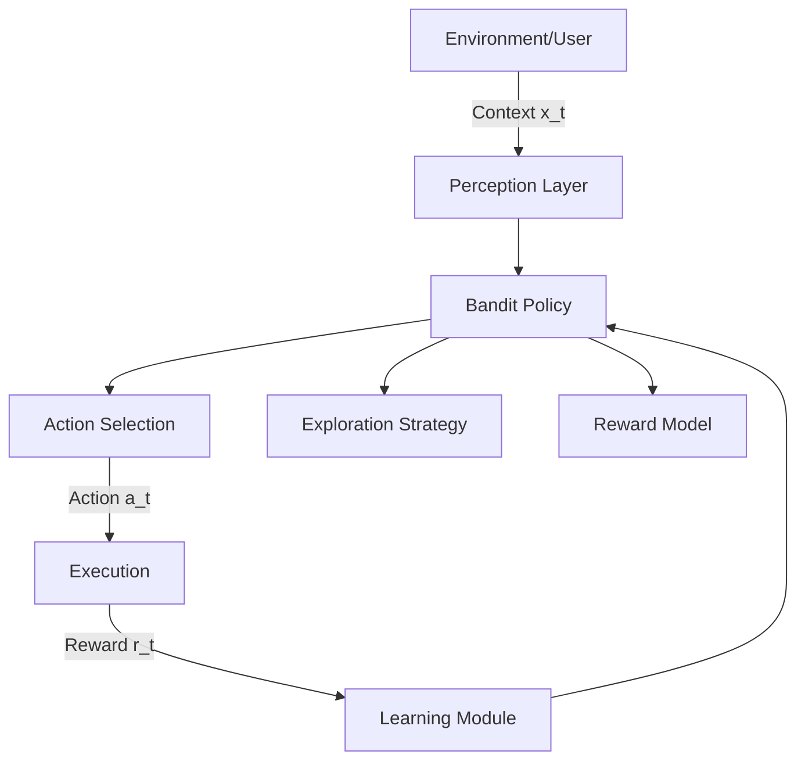

## 1. Concept Introduction

### Simple Explanation

Imagine you're at a new restaurant with 10 dishes on the menu. You want to find your favorite, but you only have 5 visits. Do you order the same dish that seemed good on visit 1, or keep trying new ones? This is the **exploration vs. exploitation dilemma**.

Now add a twist: the "best" dish depends on context—your mood, time of day, weather. A **contextual bandit** is an algorithm that learns which action (dish) to take given the current context (your state), balancing trying new options (exploration) with choosing known good ones (exploitation).

### Technical Detail

A **contextual bandit** is a sequential decision-making framework where:
- At each time step *t*, an agent observes a **context** (state) *x_t*
- Selects an **action** *a_t* from a finite set *A*
- Receives a **reward** *r_t(a_t)*
- The goal is to maximize cumulative reward over time

Unlike full reinforcement learning (RL), bandits assume:
- **No state transitions**: each decision is independent
- **Immediate feedback**: reward is observed right after the action
- **No delayed consequences**: today's action doesn't affect tomorrow's state

This makes bandits simpler than RL but powerful enough for many real-world problems: content recommendations, clinical trials, ad placement, and dynamic pricing.

---

## 2. Historical & Theoretical Context

### Origin

The **multi-armed bandit** (MAB) problem was first formalized by **William Thompson** in 1933 and named after slot machines (one-armed bandits). The term "bandit" refers to the machine "stealing" your money while you learn which arm has the best payout.

- **1952**: Herbert Robbins introduced the sequential decision framework
- **1985**: Lai & Robbins proved optimal regret bounds for stochastic bandits
- **2002**: John Langford introduced **contextual bandits** (bandits with side information)
- **2011**: Li et al. published the **LinUCB** algorithm, widely adopted in industry

### Core Principle: The Exploration-Exploitation Tradeoff

Every learning agent faces this fundamental tension:
- **Exploitation**: Choose the action that seems best based on current knowledge
- **Exploration**: Try other actions to gain information that might lead to better rewards later

Contextual bandits formalize this tradeoff mathematically through **regret minimization**—the difference between your cumulative reward and what an oracle (who knows the best action for each context) would achieve.

---

## 3. Algorithms & Mathematics

### Key Metric: Regret

Cumulative regret after *T* rounds:

```
R(T) = Σ[t=1 to T] [r*(x_t) - r_t(a_t)]
```

Where:
- *r*(x_t)* = reward of the optimal action for context *x_t*
- *r_t(a_t)* = reward received from chosen action *a_t*

Good algorithms achieve **sublinear regret**: *R(T) = O(√T)* or *O(log T)*.

### Popular Algorithms

#### 1. ε-Greedy (Baseline)

**Pseudocode:**
```
Input: ε ∈ [0,1] (exploration rate)

For each round t:
  Observe context x_t
  With probability ε:
    Choose random action a_t
  Otherwise:
    Choose a_t = argmax_a Q(x_t, a)  // best known action

  Observe reward r_t
  Update Q(x_t, a_t) ← Q(x_t, a_t) + α[r_t - Q(x_t, a_t)]
```

**Pros**: Simple, easy to implement
**Cons**: Wasteful exploration (explores randomly, not intelligently)

#### 2. Upper Confidence Bound (UCB)

**Idea**: Choose action with highest **optimistic estimate** = mean reward + uncertainty bonus.

```
a_t = argmax_a [μ_a + √(2 log t / n_a)]
```

Where:
- *μ_a* = empirical mean reward of action *a*
- *n_a* = number of times action *a* was chosen
- Uncertainty decreases as *n_a* grows

#### 3. LinUCB (Linear UCB) — Industry Standard

**Assumption**: Reward is a linear function of context features.

```
r(x, a) = θ_a^T x + noise
```

**Algorithm:**
```
For each action a, maintain:
  A_a = I_d (identity matrix)
  b_a = 0 (zero vector)

For each round t:
  Observe x_t
  For each action a:
    θ_a = A_a^(-1) b_a
    UCB_a = θ_a^T x_t + α√(x_t^T A_a^(-1) x_t)

  Choose a_t = argmax_a UCB_a
  Observe reward r_t

  Update:
    A_a ← A_a + x_t x_t^T
    b_a ← b_a + r_t x_t
```

**Regret**: *O(d√T log T)* where *d* = feature dimension.

#### 4. Thompson Sampling (Bayesian Approach)

**Idea**: Sample from posterior distribution over reward functions, pick action optimal for that sample.

```
For each action a, maintain posterior P(θ_a | data)

For each round t:
  For each action a:
    Sample θ̃_a ~ P(θ_a | data)
  Choose a_t = argmax_a θ̃_a^T x_t

  Observe reward r_t
  Update posterior P(θ_a | data)
```

**Advantage**: Natural exploration—actions with high uncertainty are sampled more often.

---

## 4. Design Patterns & Architectures

### Agent Architecture: Bandit as a Policy Component



### Integration Patterns

1. **Event-Driven Pattern**: Bandit reacts to each user interaction
   - User arrives → observe context → select action → observe reward → update

2. **Batch Update Pattern**: Collect data, update offline
   - Useful when online updates are expensive
   - Example: Update recommendation model nightly

3. **Ensemble Pattern**: Run multiple bandit algorithms, meta-learn which to trust
   - Example: Combine LinUCB + Thompson Sampling + Neural bandit

4. **Hierarchical Pattern**: Use bandits at multiple levels
   - Top-level: choose agent strategy (greedy vs. exploratory)
   - Low-level: choose specific action within strategy

---

## 5. Practical Application

### Python Example: Content Recommendation

```python
import numpy as np

class LinUCB:
    def __init__(self, n_actions, n_features, alpha=1.0):
        self.n_actions = n_actions
        self.n_features = n_features
        self.alpha = alpha

        # Initialize for each action
        self.A = [np.identity(n_features) for _ in range(n_actions)]
        self.b = [np.zeros(n_features) for _ in range(n_actions)]

    def select_action(self, context):
        """Select action with highest UCB."""
        ucb_values = []

        for a in range(self.n_actions):
            # Estimate theta_a
            A_inv = np.linalg.inv(self.A[a])
            theta = A_inv @ self.b[a]

            # Calculate UCB
            mean_reward = theta @ context
            uncertainty = self.alpha * np.sqrt(context @ A_inv @ context)
            ucb = mean_reward + uncertainty

            ucb_values.append(ucb)

        return np.argmax(ucb_values)

    def update(self, action, context, reward):
        """Update model after observing reward."""
        self.A[action] += np.outer(context, context)
        self.b[action] += reward * context

# Example: Recommend one of 3 articles
bandit = LinUCB(n_actions=3, n_features=5, alpha=1.0)

# Simulate 1000 user interactions
for t in range(1000):
    # Context: [time_of_day, user_age_group, is_weekend, device_type, season]
    context = np.random.randn(5)

    # Select article
    article = bandit.select_action(context)

    # Simulate user engagement (higher reward for article 1 when context[0] > 0)
    true_reward = 0.5 + 0.3 * (article == 1 and context[0] > 0)
    observed_reward = true_reward + np.random.randn() * 0.1

    # Update bandit
    bandit.update(article, context, observed_reward)

    if t % 200 == 0:
        print(f"Round {t}: Selected article {article}")
```

### Integration with LangGraph

```python
from langgraph.graph import StateGraph
from typing import TypedDict, Annotated
import numpy as np

class AgentState(TypedDict):
    user_context: np.ndarray
    selected_action: int
    reward: float
    iteration: int

def observe_context(state: AgentState) -> AgentState:
    """Perceive user state."""
    state["user_context"] = get_user_features()  # e.g., embeddings, metadata
    return state

def bandit_policy(state: AgentState, bandit: LinUCB) -> AgentState:
    """Select action using bandit algorithm."""
    state["selected_action"] = bandit.select_action(state["user_context"])
    return state

def execute_action(state: AgentState) -> AgentState:
    """Take action and observe reward."""
    action = state["selected_action"]
    state["reward"] = execute_and_measure_reward(action)
    return state

def learn(state: AgentState, bandit: LinUCB) -> AgentState:
    """Update bandit model."""
    bandit.update(
        state["selected_action"],
        state["user_context"],
        state["reward"]
    )
    state["iteration"] += 1
    return state

# Build graph
workflow = StateGraph(AgentState)
workflow.add_node("perceive", observe_context)
workflow.add_node("decide", lambda s: bandit_policy(s, bandit))
workflow.add_node("act", execute_action)
workflow.add_node("learn", lambda s: learn(s, bandit))

workflow.set_entry_point("perceive")
workflow.add_edge("perceive", "decide")
workflow.add_edge("decide", "act")
workflow.add_edge("act", "learn")
workflow.add_edge("learn", "perceive")  # Loop

app = workflow.compile()
```

---

## 6. Comparisons & Tradeoffs

| Algorithm | Regret Bound | Pros | Cons |
|-----------|--------------|------|------|
| ε-Greedy | O(T^(2/3)) | Simple, fast | Poor exploration |
| UCB | O(√T log T) | Principled, no tuning | Assumes stationarity |
| LinUCB | O(d√T log T) | Efficient with features | Assumes linear rewards |
| Thompson Sampling | O(√T) | Bayesian, elegant | Computationally expensive |
| Neural Bandits | Sublinear (empirical) | Handles complex patterns | Needs lots of data, slow |

### When to Use Bandits vs. Full RL

| Use Bandits When | Use Full RL When |
|------------------|------------------|
| Actions have immediate rewards | Actions affect future states |
| No long-term dependencies | Sequential dependencies matter |
| Fast feedback loops | Delayed rewards |
| Stationary or slow-changing environment | Complex environment dynamics |
| Example: Ad clicks, recommendations | Example: Game AI, robotics |

### Limitations

1. **Stationarity assumption**: Most bandits assume reward distributions don't change over time
   - **Solution**: Sliding window, discounted updates, or non-stationary bandits
2. **Linear assumption** (LinUCB): Real rewards may be nonlinear
   - **Solution**: Neural bandits, kernel methods
3. **No safety guarantees**: May explore dangerous actions
   - **Solution**: Safe exploration with constraints

---

## 7. Latest Developments & Research

### Recent Advances (2022–2025)

1. **Neural Contextual Bandits** (Zhou et al., 2020; Zhang et al., 2021)
   - Use deep neural networks instead of linear models
   - Handle complex feature interactions
   - Challenge: Maintaining theoretical guarantees

2. **Off-Policy Evaluation** (Dudík et al., 2014; Su et al., 2020)
   - Evaluate a new policy using logged data from an old policy
   - Critical for production systems (can't A/B test everything)
   - Techniques: Inverse propensity scoring, doubly robust estimation

3. **Combinatorial Bandits** (Chen et al., 2013; Kveton et al., 2015)
   - Choose a *set* of actions (e.g., rank top-5 items)
   - Used in slate recommendations (YouTube, Netflix)

4. **Adversarial Bandits** (Auer et al., 2002; Bubeck & Cesa-Bianchi, 2012)
   - No stochastic assumptions—rewards can be adversarial
   - Algorithms: EXP3, EXP4

5. **Bandits with Graph Feedback** (Mannor & Shamir, 2011; Alon et al., 2015)
   - Observing one action gives partial info about similar actions
   - Example: Recommending similar products

### Benchmarks

- **OpenML-CC18**: Classification datasets adapted for contextual bandits
- **RecSim** (Google, 2019): Realistic recommendation simulation
- **RecoGym** (CRITEO, 2018): Benchmarking bandit algorithms for recommendations

### Open Problems

1. **Cold start**: How to handle new users/items with no data?
2. **Fair exploration**: Ensure exploration doesn't discriminate
3. **Scalability**: Billions of actions (all YouTube videos)
4. **Non-stationary environments**: Rewards change over time

---

## 8. Cross-Disciplinary Insights

### Economics: Multi-Armed Bandits = Information Economics

The exploration-exploitation tradeoff mirrors **information acquisition** in economics:
- Exploration = costly information gathering (market research)
- Exploitation = acting on current knowledge (production)

**Gittins Index** (1979): Optimal solution to bandit problems, used in resource allocation and project scheduling.

### Neuroscience: Dopamine & Bandits

The brain's dopamine system implements a form of **temporal difference learning** (related to bandits):
- Dopamine neurons fire when reward > expected reward (exploration bonus!)
- Basal ganglia balances exploration/exploitation via norepinephrine levels

**Connection**: Uncertainty bonus in UCB ≈ neural exploration noise.

### Distributed Systems: Bandits for Load Balancing

Cloud systems use bandit algorithms to route traffic:
- Actions = servers
- Context = request type, time, server load
- Reward = negative latency

**Example**: Google uses bandits for selecting data center locations for queries.

### A/B Testing Evolution

Traditional A/B testing wastes traffic on inferior variants. **Bandit-based A/B testing**:
- Start with equal traffic split
- Gradually shift traffic to winning variant
- Reduce regret while maintaining statistical validity

---

## 9. Daily Challenge

### Coding Exercise (30 minutes)

**Task**: Implement Thompson Sampling for a 3-armed bandit and compare with ε-greedy.

```python
import numpy as np
import matplotlib.pyplot as plt

class ThompsonSampling:
    def __init__(self, n_actions):
        # Beta distribution parameters for each action
        self.alpha = np.ones(n_actions)
        self.beta = np.ones(n_actions)

    def select_action(self):
        # TODO: Sample from Beta(alpha_a, beta_a) for each action
        # Return action with highest sample
        pass

    def update(self, action, reward):
        # TODO: Update Beta distribution
        # If reward=1: alpha += 1, else: beta += 1
        pass

# Simulate a 3-armed bandit
# True probabilities: [0.2, 0.5, 0.7]
true_probs = [0.2, 0.5, 0.7]

# Compare Thompson Sampling vs ε-greedy over 1000 rounds
# Plot cumulative regret for both algorithms
```

**Hints**:
- `np.random.beta(alpha, beta)` samples from Beta distribution
- Regret at time *t* = `max(true_probs) - true_probs[chosen_action]`

### Thought Experiment

You're building a medical treatment recommendation agent. Each patient has context (age, symptoms, history), and you must choose one of 5 treatments. Some treatments are risky.

**Questions**:
1. How would you modify UCB to avoid risky treatments during exploration?
2. What if patient context is partially observable (privacy concerns)?
3. How would you handle the fact that some treatments have delayed effects (e.g., 30 days)?

---

## 10. References & Further Reading

### Foundational Papers

1. **Auer, P., Cesa-Bianchi, N., & Fischer, P. (2002).** "Finite-time Analysis of the Multiarmed Bandit Problem." *Machine Learning*, 47(2-3), 235-256.
2. **Langford, J., & Zhang, T. (2008).** "The Epoch-Greedy Algorithm for Multi-armed Bandits with Side Information." *NIPS*.
3. **Li, L., Chu, W., Langford, J., & Schapire, R. E. (2010).** "A Contextual-Bandit Approach to Personalized News Article Recommendation." *WWW*.
   - [Paper Link](https://arxiv.org/abs/1003.0146)

### Modern Surveys

4. **Lattimore, T., & Szepesvári, C. (2020).** *Bandit Algorithms*. Cambridge University Press.
   - [Free Online](https://tor-lattimore.com/downloads/book/book.pdf)
5. **Slivkins, A. (2019).** "Introduction to Multi-Armed Bandits." *Foundations and Trends in Machine Learning*, 12(1-2), 1-286.
   - [ArXiv](https://arxiv.org/abs/1904.07272)

### Practical Implementations

6. **Vowpal Wabbit**: Industry-grade bandit library (Microsoft)
   - [GitHub](https://github.com/VowpalWabbit/vowpal_wabbit)
7. **PyMC & Bambi**: Bayesian modeling for Thompson Sampling
   - [Docs](https://www.pymc.io/projects/docs/en/stable/)
8. **RecSim**: Google's recommendation simulation framework
   - [GitHub](https://github.com/google-research/recsim)

### Recent Research

9. **Foster, D. J., & Rakhlin, A. (2020).** "Beyond UCB: Optimal and Efficient Contextual Bandits with Regression Oracles." *ICML*.
10. **Riquelme, C., Tucker, G., & Snoek, J. (2018).** "Deep Bayesian Bandits Showdown: An Empirical Comparison of Bayesian Deep Networks for Thompson Sampling." *ICLR*.
    - [ArXiv](https://arxiv.org/abs/1802.09127)

### Blog Posts & Tutorials

11. **Lilian Weng's Blog**: "The Multi-Armed Bandit Problem and Its Solutions"
    - [Link](https://lilianweng.github.io/posts/2018-01-23-multi-armed-bandit/)
12. **Google Research Blog**: "Bandits at Large Scale"
    - [Link](https://ai.googleblog.com/2018/01/the-google-vizier-black-box.html)

---

## Summary

Contextual bandits sit at the sweet spot between simplicity and power:
- **Simpler than full RL**: No state transitions, immediate rewards
- **More powerful than supervised learning**: Active learning, adapts to feedback
- **Proven in production**: Powers recommendations at Google, Microsoft, Netflix

Master bandits, and you'll understand:
- How to balance exploration and exploitation
- The foundations of reinforcement learning
- Real-world machine learning deployment challenges

**Next steps**: Implement LinUCB on a real dataset (MovieLens, news recommendations), then explore neural bandits for nonlinear patterns.

Now go forth and optimize your decisions—one context at a time.
