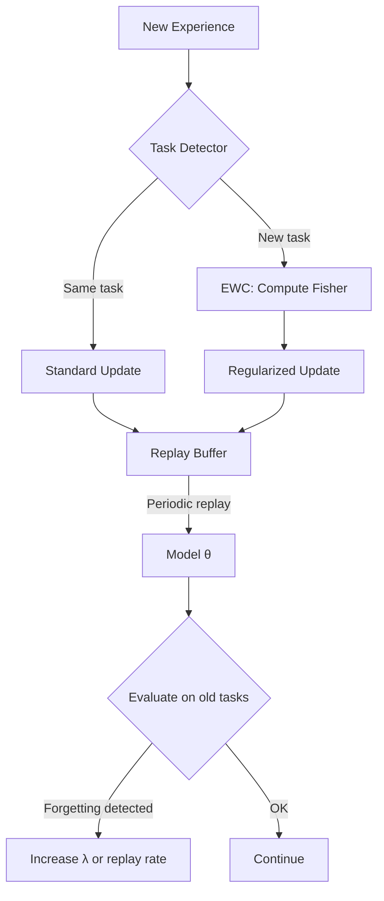

Neural networks have a pathological relationship with sequential learning. Fine-tune a well-trained agent on a new task and it can completely lose the ability to perform the old one. Not "slightly worse," but *completely lost*. This is **catastrophic forgetting**, and solving it is one of the deepest unsolved problems in AI.

## Concept Introduction

**Continual learning** (also called *lifelong learning* or *sequential learning*) asks how a system can learn new things without destroying old knowledge. For AI agents deployed in changing environments (new users, new tools, new goals) this is not academic. It's survival.

Formally, we have a sequence of tasks $\mathcal{T}_1, \mathcal{T}_2, \ldots, \mathcal{T}_n$, each with its own data distribution $\mathcal{D}_t$. After training on task $t$, we want the model to still perform well on all prior tasks $1, \ldots, t-1$, without storing all previous data.

Neural networks fail at this because gradient descent updates weights globally. Weights that were tuned for $\mathcal{T}_1$ get overwritten when the optimizer minimizes loss on $\mathcal{T}_2$. The network has no mechanism to say "these weights are important for a previous task, don't touch them."

Three broad families of solutions exist:
- **Regularization-based**: Penalize changes to important weights
- **Rehearsal-based**: Replay a buffer of old examples
- **Architecture-based**: Grow or partition the network per task

## Historical & Theoretical Context

The problem was formally described by McCloskey and Cohen in 1989 studying connectionist models of human memory. In 1999, Robert French gave it the name "catastrophic interference" and surveyed why it's fundamental, not accidental: distributed representations are efficient precisely because weights are shared, and sharing is what causes interference.

The modern revival came in 2017 when Kirkpatrick et al. at DeepMind published **Elastic Weight Consolidation (EWC)**, which used ideas from Bayesian inference and Fisher information to selectively protect important weights. This made the problem tractable at scale.

The connection to neuroscience is profound. The brain's solution to this problem is the **Complementary Learning Systems (CLS) theory** (McClelland et al., 1995): a fast-learning hippocampus stores episodic memories and slowly "replays" them to a slow-learning neocortex during sleep. Modern rehearsal-based methods are essentially engineering that same architecture.

## Algorithms & Math

### Elastic Weight Consolidation (EWC)

After training on task $A$, EWC estimates which weights mattered most using the **Fisher Information Matrix** $F$. When training on task $B$, it adds a regularization term to protect those weights:

$$\mathcal{L}_{EWC} = \mathcal{L}_B(\theta) + \frac{\lambda}{2} \sum_i F_i \left(\theta_i - \theta_A^*\right)^2$$

Where:
- $\mathcal{L}_B(\theta)$ is the loss on the new task $B$
- $\theta_A^*$ are the optimal weights after training on task $A$
- $F_i$ is the Fisher information for parameter $i$ (how sensitive the model's output is to that parameter)
- $\lambda$ controls how strongly we protect old weights

The Fisher information $F_i$ is approximated as the expected squared gradient of the log-likelihood:

$$F_i = \mathbb{E}\left[\left(\frac{\partial \log p(y | x, \theta)}{\partial \theta_i}\right)^2\right]$$

Intuitively: if a weight had large gradients during task A training, it was important, so penalize moving it.

### Experience Replay (Pseudocode)

```
Initialize model θ, memory buffer M = []

For each new task t:
    For each batch (x, y) from task t:
        If M is not empty:
            Sample replay batch (x_r, y_r) from M
            Combined loss = L(θ, x, y) + α * L(θ, x_r, y_r)
        Else:
            Combined loss = L(θ, x, y)

        Update θ via gradient descent on combined loss

    Add representative samples from task t to M
    (evict old samples if M exceeds capacity)
```

The key design choice is **what to store in M**: random samples, "hard" examples, or (in **Generative Replay**) a generative model that synthesizes old examples on demand rather than storing them.

### Progressive Neural Networks

An architecture approach: when a new task arrives, freeze all existing columns and add a new network column with lateral connections to prior columns. New tasks can read features from old tasks via the lateral connections, but cannot corrupt them.

$$h_k^{(t)} = f\left(W_k^{(t)} h_{k-1}^{(t)} + \sum_{j < t} U_k^{(j:t)} h_{k-1}^{(j)}\right)$$

Where $U_k^{(j:t)}$ are the lateral ("adapter") connections from column $j$ to column $t$ at layer $k$.

## Design Patterns & Architectures

Continual learning integrates with agent architectures in several natural ways:



**Key patterns:**

- **Memory-augmented agent loop**: The agent's episodic memory buffer (for RAG/retrieval) doubles as a replay source for continual fine-tuning
- **Task-conditioned heads**: Share a backbone but use separate output heads per task, identified by a task embedding
- **Adapter layers**: Freeze the base model; train lightweight adapter modules per task (this is how LoRA-based continual learning works)
- **Meta-continual learning**: Use MAML or similar to find initializations that are easy to fine-tune without forgetting

## Practical Application

Here's a minimal EWC implementation that wraps a PyTorch model, enabling continual fine-tuning across tasks:

```python
import torch
import torch.nn as nn
from copy import deepcopy

class EWCAgent:
    def __init__(self, model: nn.Module, lambda_ewc: float = 5000.0):
        self.model = model
        self.lambda_ewc = lambda_ewc
        self.fisher: dict[str, torch.Tensor] = {}
        self.optimal_params: dict[str, torch.Tensor] = {}

    def compute_fisher(self, data_loader, num_samples: int = 200):
        """Estimate Fisher information after finishing a task."""
        self.model.eval()
        fisher = {n: torch.zeros_like(p) for n, p in self.model.named_parameters()}

        for i, (x, y) in enumerate(data_loader):
            if i >= num_samples:
                break
            self.model.zero_grad()
            output = self.model(x)
            loss = nn.functional.cross_entropy(output, y)
            loss.backward()
            for n, p in self.model.named_parameters():
                if p.grad is not None:
                    fisher[n] += p.grad.detach() ** 2

        # Average over samples
        self.fisher = {n: f / num_samples for n, f in fisher.items()}
        # Snapshot current weights as optimal for this task
        self.optimal_params = {
            n: p.detach().clone() for n, p in self.model.named_parameters()
        }

    def ewc_penalty(self) -> torch.Tensor:
        """Regularization term that protects important weights."""
        if not self.fisher:
            return torch.tensor(0.0)
        penalty = torch.tensor(0.0)
        for n, p in self.model.named_parameters():
            if n in self.fisher:
                penalty += (self.fisher[n] * (p - self.optimal_params[n]) ** 2).sum()
        return self.lambda_ewc / 2 * penalty

    def train_step(self, x, y, optimizer):
        """One training step with EWC regularization."""
        self.model.train()
        optimizer.zero_grad()
        output = self.model(x)
        task_loss = nn.functional.cross_entropy(output, y)
        total_loss = task_loss + self.ewc_penalty()
        total_loss.backward()
        optimizer.step()
        return total_loss.item()


# Usage pattern for a continual learning agent
model = nn.Sequential(nn.Linear(784, 256), nn.ReLU(), nn.Linear(256, 10))
agent = EWCAgent(model, lambda_ewc=10000)
optimizer = torch.optim.Adam(model.parameters(), lr=1e-3)

# Train on Task 1
for x, y in task1_loader:
    agent.train_step(x, y, optimizer)

# Consolidate: compute Fisher BEFORE moving to Task 2
agent.compute_fisher(task1_loader)

# Train on Task 2 — Task 1 performance is now protected
for x, y in task2_loader:
    agent.train_step(x, y, optimizer)
```

For LLM-based agents, the same idea applies through **LoRA continual learning**: train a separate LoRA adapter per task, store them, and merge or route between them at inference time. Libraries like `PEFT` make this straightforward.

## Latest Developments & Research

**Dark Experience Replay++ (DER++, 2020)**: Rather than replaying raw (x, y) pairs, store the model's *logits* $z$ from the previous task at replay time. The loss becomes:

$$\mathcal{L} = \mathcal{L}_{CE}(x_{new}, y_{new}) + \alpha \cdot \mathcal{L}_{MSE}(z_{replay}, f(x_{replay}))$$

This "knowledge distillation" from past self is dramatically more sample-efficient than label replay.

**CLIP-based task-free continual learning (2023)**: Using vision-language models as frozen feature extractors virtually eliminates forgetting, because the features that matter are already learned. Fine-tuning only classification heads makes continual learning nearly trivial.

**Continual Instruction Tuning (2024)**: Researchers from Stanford and CMU showed that instruction-tuned LLMs suffer severe forgetting when fine-tuned on new instruction sets, but LoRA with replay buffers of 500–1000 examples nearly eliminates the problem. This is now the default approach for production LLM agents that require domain adaptation.

**TRACE benchmark (2024)**: A new benchmark specifically for evaluating continual learning in LLM agents across 8 diverse tasks. Top methods still show 15–30% degradation on early tasks after sequential fine-tuning, indicating the problem is far from solved.

**Open problems**: Task-free continual learning (no task boundaries), continual learning with sparse rewards in RL, and understanding when pre-training scale makes continual learning trivially easy vs. surprisingly hard.

## Cross-Disciplinary Insight

The CLS theory from neuroscience maps beautifully here. The brain uses **two complementary memory systems**:

1. **Hippocampus**: Fast-learning, pattern-separated, stores specific episodes. Corresponds to your replay buffer (exact memories, low capacity).
2. **Neocortex**: Slow-learning, pattern-completed, extracts statistical regularities. Corresponds to your base model weights (general knowledge, high capacity).

During sleep, the hippocampus "replays" recent experiences to the neocortex via sharp-wave ripples, which is exactly what experience replay does algorithmically. The brain even has a mechanism analogous to EWC: **synaptic tagging and capture**, where synapses involved in recent learning are chemically "tagged" and protected from interference for a consolidation window.

This isn't just a cute analogy. It suggests that **memory replay combined with slow consolidation** is likely the right general solution — and it is precisely what the best continual learning systems implement today.

## Daily Challenge

**Exercise: Measure forgetting on a simple two-task experiment**

1. Take a small MLP (or use a pre-trained sentence encoder with a linear head).
2. Train it on Task A (e.g., sentiment classification on movie reviews).
3. Train it sequentially on Task B (e.g., topic classification on news articles).
4. Measure accuracy on Task A before and after Task B training. Record the **forgetting metric**: $F = \text{Acc}_A^{before} - \text{Acc}_A^{after}$.
5. Now implement one mitigation:
   - **Option 1**: Add a replay buffer with 100 Task A examples mixed into Task B training.
   - **Option 2**: Implement the EWC penalty from the code above.
6. Re-run and compare $F$ across baseline, replay, and EWC.

**Thought experiment**: If your agent operates in a world where task boundaries are unknown (the distribution shifts gradually), how would you detect that forgetting is happening and trigger remediation? What signals would you monitor?

## References & Further Reading

### Foundational Papers
- **"Catastrophic Interference in Connectionist Networks"** — McCloskey & Cohen (1989): The original problem statement
- **"Overcoming Catastrophic Forgetting in Neural Networks"** — Kirkpatrick et al., DeepMind (2017): EWC; the paper that reignited the field
- **"Complementary Learning Systems"** — McClelland et al. (1995): The neuroscience theory that inspired replay methods
- **"Progressive Neural Networks"** — Rusu et al. (2016): Architecture-based solution with guaranteed no forgetting

### Modern Work
- **"Dark Experience Replay++"** — Buzzega et al. (2020): State-of-the-art replay method
- **"Continual Learning with Pre-trained Models"** — Wang et al. (2024): Survey of how large pre-trained models change the continual learning landscape
- **"TRACE: A Benchmark for Continual Learning in LLM Agents"** — Wang et al. (2024): arXiv:2310.06762

### Tools & Resources
- **Avalanche** (ContinualAI): https://github.com/ContinualAI/avalanche — The primary library for continual learning experiments in PyTorch
- **Sequoia**: https://github.com/lebrice/Sequoia — Framework unifying continual learning settings
- **PEFT library** (Hugging Face): LoRA-based continual learning for LLMs
- **Survey**: "Three Scenarios for Continual Learning" (van de Ven & Tolias, 2019) — Essential taxonomy of continual learning problem settings

---
