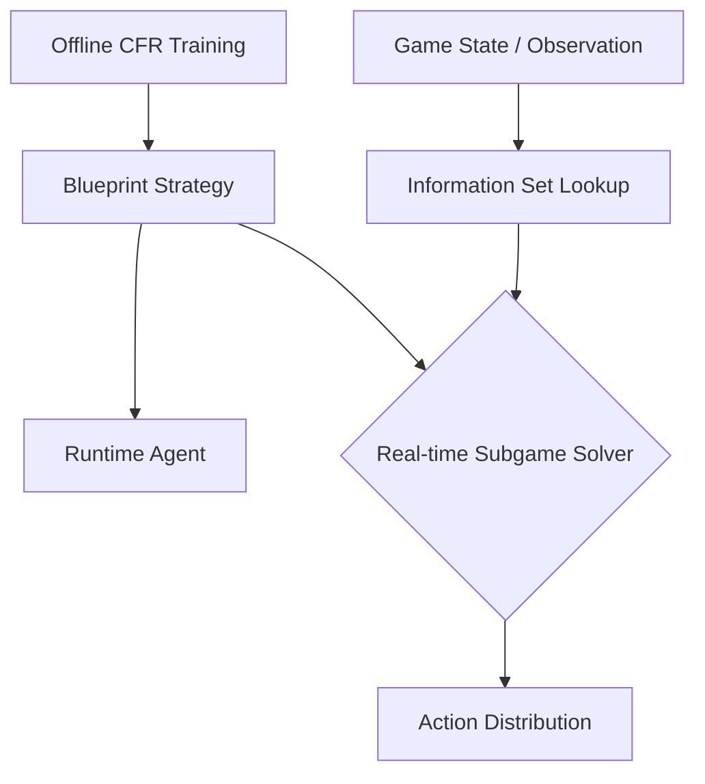

Chess and Go have complete information; every player sees the whole board. But most real-world agent problems don't. Negotiation, cybersecurity, auctions, medical triage: information is partial, private, or hidden. Counterfactual Regret Minimization (CFR) is the algorithm that cracked this class of problems, producing the first superhuman poker agents and reshaping how we think about strategic reasoning under uncertainty.

## Concept Introduction

CFR operates on **extensive-form games**, the formal representation for sequential games with hidden information. Unlike normal-form games (payoff matrices), extensive-form games encode the game tree explicitly: who acts when, what they can observe, and what the payoffs are.

The central concept is the **information set**: the set of all game states that a player cannot distinguish given their observations. A strategy maps information sets to distributions over actions, not individual states to actions. CFR decomposes the global regret minimization problem into local, per-information-set problems that can be solved independently.

At each decision point, CFR asks: what would my payoff have been if I had played differently? It accumulates this counterfactual regret over iterations, then nudges the strategy toward the actions that would have done better. Repeat long enough, and the average strategy converges to a **Nash equilibrium**.

## Historical & Theoretical Context

CFR was introduced by Zinkevich, Johanson, Bowling, and Piccione at NeurIPS 2007. It built on **regret matching**, an older online learning algorithm, extending it to the sequential setting.

The timeline of impact:

- **2007**: CFR paper: theoretical guarantee, small poker variants
- **2015**: CFR+ by Tammelin: dramatically faster convergence with positive regrets
- **2017**: Libratus (CMU) beats top human poker players at heads-up no-limit Texas Hold'em using a CFR-based blueprint strategy
- **2019**: Pluribus (CMU/Facebook) extends CFR to six-player poker, an order-of-magnitude harder problem
- **2024**: CFR variants appear in multi-agent LLM negotiation and cybersecurity simulation research

The game-theoretic foundation comes from von Neumann's minimax theorem and Nash's equilibrium concept. CFR operationalizes Nash equilibrium computation for games too large for LP solvers.

## Algorithms and Math

### Extensive-Form Game Setup

A game has:
- A game tree with nodes $h$, player-to-act function $P(h)$, and terminal payoffs $u_i(z)$
- Information sets $\mathcal{I}_i$ partitioning nodes for player $i$
- A strategy $\sigma_i(I, a)$, the probability of action $a$ at information set $I$

The **reach probability** to node $h$ under strategy profile $\sigma$:

$$\pi^\sigma(h) = \prod_{h' \cdot a \sqsubseteq h} \sigma_{P(h')}(h', a)$$

Split into player $i$'s contribution $\pi^\sigma_i(h)$ and the rest $\pi^\sigma_{-i}(h)$.

### Counterfactual Value and Regret

The **counterfactual value** at information set $I$ for action $a$ is the expected payoff *as if player $i$ had tried to reach $I$*:

$$v_i^\sigma(I, a) = \sum_{h \in I} \pi^\sigma_{-i}(h) \sum_{z \succ h \cdot a} \pi^\sigma(h \cdot a, z) \cdot u_i(z)$$

The **instantaneous counterfactual regret** for not playing action $a$ at $I$:

$$r^t(I, a) = v_i^{\sigma^t}(I, a) - v_i^{\sigma^t}(I)$$

**Cumulative regret** over $T$ iterations:

$$R^T(I, a) = \sum_{t=1}^{T} r^t(I, a)$$

### CFR Strategy Update (Regret Matching)

At each iteration, play proportional to positive cumulative regret:

$$\sigma^{T+1}(I, a) = \frac{\max(R^T(I, a),\ 0)}{\sum_{a'} \max(R^T(I, a'),\ 0)}$$

If all regrets are non-positive, play uniformly.

### Pseudocode

```
function CFR(history h, player i, t):
    if h is terminal:
        return u_i(h)
    if h is chance node:
        return sum over actions a: P(a) * CFR(h·a, i, t)

    I = information_set(h)
    strategy = regret_match(R[I])
    value = 0
    action_values = {}

    for a in actions(h):
        action_values[a] = CFR(h·a, i, t)
        value += strategy[a] * action_values[a]

    if P(h) == i:
        for a in actions(h):
            R[I][a] += counterfactual_reach(h) * (action_values[a] - value)

    return value

repeat for T iterations:
    for each player i:
        CFR(root, i, t)
final_strategy = average over all iterations
```

The **average strategy** (not the final strategy) converges to Nash equilibrium. The average regret shrinks as $O(1/\sqrt{T})$.

## Design Patterns and Architectures

CFR fits into agent architectures in several ways:

**Blueprint + Real-time Search**: Libratus uses CFR offline to produce a coarse blueprint strategy, then refines it online during play with nested subgame solving. The offline planning, online refinement pattern generalizes broadly.



**Abstraction Layer**: Real games like Texas Hold'em have $10^{160}$ nodes. CFR requires **abstraction**: grouping similar cards, bet sizes, or board states. The agent computes CFR on the abstract game and translates actions back.

**Connection to MCTS**: Both MCTS and CFR traverse game trees iteratively, but MCTS samples trajectories while CFR computes exact counterfactuals. For very large trees, Monte Carlo CFR (MCCFR) samples subsets of nodes, combining both ideas.

## Practical Application

Here is a minimal CFR implementation for **Kuhn Poker** (a tiny 3-card game that captures the core structure of Texas Hold'em):

```python
import numpy as np
from collections import defaultdict

CARDS = [1, 2, 3]  # J, Q, K
NUM_ACTIONS = 2    # 0=pass, 1=bet

# Cumulative regret and strategy sum per info set
regret_sum = defaultdict(lambda: np.zeros(NUM_ACTIONS))
strategy_sum = defaultdict(lambda: np.zeros(NUM_ACTIONS))

def get_strategy(info_set, realization_weight):
    regrets = regret_sum[info_set]
    strategy = np.maximum(regrets, 0)
    total = strategy.sum()
    if total > 0:
        strategy /= total
    else:
        strategy = np.ones(NUM_ACTIONS) / NUM_ACTIONS
    strategy_sum[info_set] += realization_weight * strategy
    return strategy

def cfr(cards, history, p0, p1):
    plays = len(history)
    player = plays % 2
    opponent = 1 - player

    # Terminal conditions for Kuhn Poker
    if plays >= 2:
        if history[-1] == 0:  # last action was pass
            if history[-2] == 1:  # opponent bet, I passed -> fold
                return 1 if player == 1 else -1
            else:  # both passed -> showdown
                return 1 if cards[player] > cards[opponent] else -1
        elif history[-1] == 1 and history[-2] == 1:  # both bet -> showdown
            return 1 if cards[player] > cards[opponent] else -1

    info_set = f"{cards[player]}{''.join(map(str, history))}"
    reach = p0 if player == 0 else p1
    cfr_reach = p1 if player == 0 else p0

    strategy = get_strategy(info_set, reach)
    action_values = np.zeros(NUM_ACTIONS)

    for a in range(NUM_ACTIONS):
        next_history = history + [a]
        if player == 0:
            action_values[a] = -cfr(cards, next_history, p0 * strategy[a], p1)
        else:
            action_values[a] = -cfr(cards, next_history, p0, p1 * strategy[a])

    node_value = strategy @ action_values
    regret_sum[info_set] += cfr_reach * (action_values - node_value)
    return node_value

def train(iterations=10000):
    import random
    total_util = 0
    for _ in range(iterations):
        cards = random.sample(CARDS, 2)
        total_util += cfr(cards, [], 1.0, 1.0)
    print(f"Average game value: {total_util / iterations:.4f}")
    print("\nNash equilibrium strategies:")
    for info_set, ssum in sorted(strategy_sum.items()):
        total = ssum.sum()
        if total > 0:
            norm = ssum / total
            print(f"  {info_set}: pass={norm[0]:.2f} bet={norm[1]:.2f}")

train(50000)
```

In a LangGraph agent, CFR-derived strategies become **policy lookup tables** or neural networks that map observation histories to action distributions, enabling rational behavior in information-asymmetric negotiations or adversarial tool-use scenarios.

## Latest Developments and Research

**Deep CFR** (Brown et al., 2019): Replaces the regret tables with neural networks. Achieves superhuman performance in heads-up no-limit hold'em without hand-crafted abstractions.

**ReBeL** (Brown et al., 2020, NeurIPS): Combines CFR with deep RL value functions, generalizing the blueprint + subgame approach into a unified framework. Works for games beyond poker.

**Player of Games** (Schmid et al., 2023, Science): A single algorithm combining MCTS and CFR that achieves strong performance on perfect-information games (Chess, Go) and imperfect-information games (poker, Scotland Yard), a step toward truly general game-playing agents.

**CFR in LLM multi-agent settings** (2024): Emerging research explores CFR-style regret minimization in natural language negotiation, where information sets correspond to conversation histories and actions are utterances.

Open problems: scaling CFR to continuous action spaces, handling non-stationary opponents, and combining CFR with language model priors for grounded strategic reasoning.

## Cross-Disciplinary Insight

CFR is a form of **online learning with regret guarantees**, deeply connected to the **no-regret learning** literature in economics and operations research. Economists use similar frameworks in mechanism design and auction theory.

The information set structure mirrors **signal processing**: what you observe is a noisy, partial view of ground truth, and your decisions must be robust to that uncertainty. Shannon's information theory quantifies how much is unknown; CFR operationalizes rational behavior under that uncertainty.

In neuroscience, there's growing evidence that the prefrontal cortex maintains something like counterfactual values, simulating "what would have happened if I'd acted differently," to update decision-making policies. CFR formalizes this as an algorithm.

## Daily Challenge

Implement **one-card poker** (simpler than Kuhn): each player gets a card from 1–10, player 1 acts first (bet or check), player 2 sees player 1's action and responds. Run CFR for 10,000 iterations. Then:

1. Print the Nash equilibrium strategy for player 1 at each card value.
2. Observe the **bluffing threshold**: at what card value does player 1 switch from mostly checking to mostly betting?
3. Now hand-craft a "naive" strategy (always bet if card > 5). Measure how much value CFR extracts against it compared to Nash play.

**Thought experiment**: In a three-way negotiation between AI agents (each with private information about their true preferences), how would you define "information sets"? What would convergence to Nash look like, and is Nash equilibrium even the right solution concept here?

## References and Further Reading

- Zinkevich et al., [Regret Minimization in Games with Incomplete Information](https://poker.cs.ualberta.ca/publications/NIPS07-cfr.pdf) (NeurIPS 2007) — the original CFR paper
- Brown & Sandholm, [Superhuman AI for heads-up no-limit poker: Libratus beats top professionals](https://www.science.org/doi/10.1126/science.aao1733) (Science 2017)
- Brown et al., [Superhuman AI for multiplayer poker](https://www.science.org/doi/10.1126/science.aay2400) (Science 2019) — Pluribus
- Brown et al., [Deep Counterfactual Regret Minimization](https://arxiv.org/abs/1811.00164) (ICML 2019)
- Schmid et al., [Player of Games](https://arxiv.org/abs/2112.03178) (2023) — unified CFR + MCTS
- [OpenSpiel](https://github.com/google-deepmind/open_spiel) — Google DeepMind's library for game-theoretic RL, includes CFR implementations
- [Nerd](https://arxiv.org/abs/2206.01461) (2022) — DeepMind's CFR-based algorithm for general-sum games
- [An Introduction to Counterfactual Regret Minimization](http://modelai.gettysburg.edu/2013/cfr/cfr.pdf) — accessible tutorial by Neller & Lanctot
