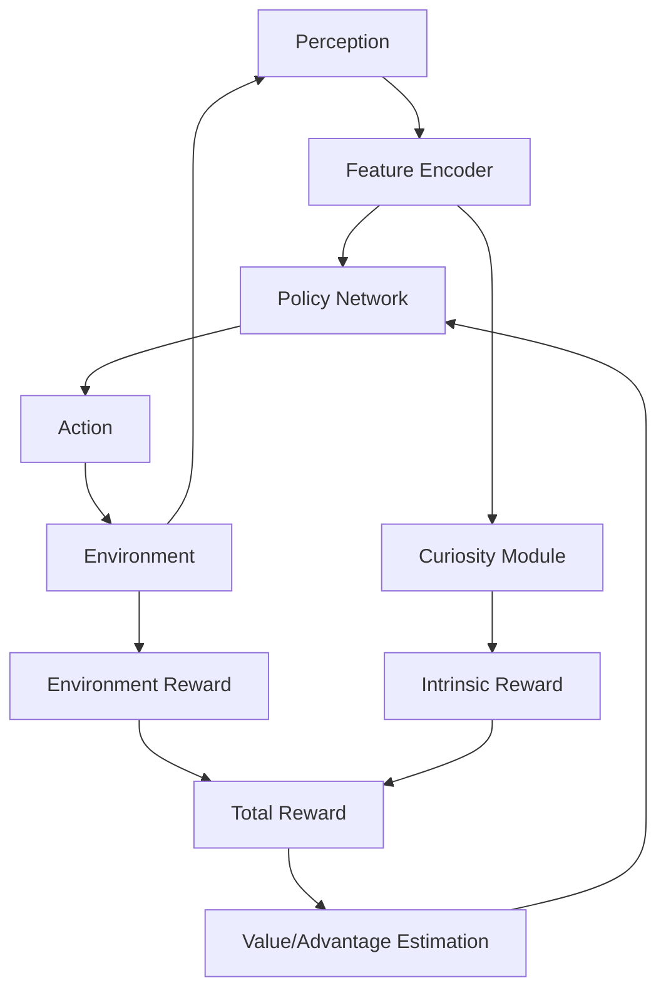

A toddler doesn't need external rewards to explore their environment. They touch objects, open drawers, and stack blocks driven by pure **curiosity**—an internal drive to understand the world. What if AI agents could learn the same way?

Traditional reinforcement learning agents are reward addicts. Without frequent external rewards, they wander aimlessly, never learning. But curiosity-driven agents generate their own **intrinsic rewards** based on novelty, surprise, or learning progress. This self-motivation enables them to explore intelligently, discover skills without supervision, and solve tasks with sparse rewards that stump traditional methods.

## 1. Concept Introduction

### Simple Terms

**Curiosity-driven learning** means an agent rewards itself for discovering new, interesting things. Instead of only caring about external goals (extrinsic rewards like points or wins), the agent gets excited by:

- **Novelty**: "I've never seen this before!"
- **Surprise**: "This outcome wasn't what I predicted!"
- **Learning progress**: "I'm getting better at predicting this!"

This intrinsic motivation pushes agents to explore systematically rather than randomly, building skills and knowledge even without external rewards.

### Technical Detail

**Intrinsic motivation** augments the standard RL reward signal with an internally generated bonus:

```
Total Reward = Extrinsic Reward + β × Intrinsic Reward
```

Where β controls the curiosity strength.

The most common formulations:

1. **Count-based**: Reward visiting rare states (bonus ∝ 1/√count(s))
2. **Prediction error**: Reward unpredictable states (bonus = ||predicted - actual||)
3. **Learning progress**: Reward states where prediction is improving
4. **Empowerment**: Reward states that maximize future control/influence

**Key insight**: Instead of hand-crafting rewards for every task, we give agents a universal drive to understand their environment. They naturally discover useful behaviors as a byproduct.

## 2. Historical & Theoretical Context

### Origins in Psychology

The concept traces to **developmental psychology** in the 1950s-60s:

- **Berlyne (1960)**: Proposed animals have an innate curiosity drive
- **White (1959)**: "Effectance motivation"—organisms seek to master their environment
- **Piaget**: Children learn through self-directed exploration and play

### AI History

- **1991**: Schmidhuber's "curiosity-driven learning" - agents maximize learning progress
- **2003**: Singh et al. formalize intrinsic motivation in RL
- **2015**: Pathak et al. introduce ICM (Intrinsic Curiosity Module) using prediction error
- **2017-2018**: Curiosity enables agents to play video games without external rewards
- **2019**: Burda et al.'s RND (Random Network Distillation) achieves strong exploration
- **2023-2024**: LLM agents use curiosity for autonomous skill acquisition

### Theoretical Foundation

Connects to:
- **Information theory**: Curiosity as information gain maximization
- **Optimal control**: Exploration-exploitation tradeoff
- **Predictive coding**: Brain's prediction error minimization
- **Free energy principle** (Friston): Organisms minimize surprise about their environment

## 3. Algorithms & Math

### Intrinsic Curiosity Module (ICM)

The most influential modern approach. Uses **prediction error in a learned feature space**:

```
Intrinsic Reward = η × ||φ̂(s_{t+1}) - φ(s_{t+1})||²
```

Where:
- φ(s) = learned feature representation of state s
- φ̂(s_{t+1}) = predicted next state features given (s_t, a_t)
- η = scaling factor

**Why feature space?** Raw pixel differences can be unpredictable but uninteresting (e.g., TV static, random noise). Learning features filters for controllable, relevant novelty.

### ICM Architecture (Pseudocode)

```python
# Three neural networks
forward_model(s_t, a_t) → ŝ_{t+1}     # Predicts next state features
inverse_model(s_t, s_{t+1}) → â_t     # Predicts action taken
feature_encoder(s) → φ(s)             # Extracts features

# Training loop
for transition (s_t, a_t, r_t, s_{t+1}) in buffer:
    # 1. Extract features
    phi_t = feature_encoder(s_t)
    phi_t1 = feature_encoder(s_{t+1})

    # 2. Forward model: predict next features
    phi_t1_pred = forward_model(phi_t, a_t)

    # 3. Inverse model: predict action
    a_pred = inverse_model(phi_t, phi_t1)

    # 4. Compute intrinsic reward (prediction error)
    r_intrinsic = η * ||phi_t1_pred - phi_t1||²

    # 5. Total reward
    r_total = r_t + β * r_intrinsic

    # 6. Update policy with r_total
    update_policy(s_t, a_t, r_total)

    # 7. Update curiosity module
    loss_forward = ||phi_t1_pred - phi_t1||²
    loss_inverse = CrossEntropy(a_pred, a_t)
    loss = loss_forward + loss_inverse
    update_curiosity_networks(loss)
```

### Random Network Distillation (RND)

A simpler, more stable alternative:

```
Intrinsic Reward = ||f(s; θ_target) - f̂(s; θ_pred)||²
```

Where:
- f(s; θ_target) = fixed random network (never trained)
- f̂(s; θ_pred) = predictor network (trained to match target)

**Intuition**: Novel states are hard to predict. As the agent visits states, the predictor learns them, and the bonus decreases. The random target provides a stationary, non-adversarial prediction objective.

### Count-Based Exploration

For discrete state spaces:

```
r_intrinsic(s) = β / √(N(s) + 0.01)
```

Where N(s) = visit count of state s.

For continuous spaces, use **pseudo-counts** via density models:
```
r_intrinsic(s) = β / √(ρ(s))
```
Where ρ(s) is estimated density (VAE, flow model, etc.).

## 4. Design Patterns & Architectures

### Integration with Agent Architectures



### Key Patterns

1. **Dual Reward Streams**: Separate value functions for intrinsic and extrinsic rewards
2. **Reward Normalization**: Prevent intrinsic rewards from dominating
3. **Episodic vs. Non-Episodic**: Some methods track novelty within episodes, others globally
4. **Curriculum Learning**: Gradually decrease curiosity as skills develop

### Architectural Variants

**Separated Architectures** (Burda et al., 2019):
- One policy optimized for extrinsic + intrinsic rewards
- Separate value functions: V_extrinsic and V_intrinsic
- Prevents intrinsic rewards from overwhelming long-term goals

**Hierarchical Curiosity**:
- Low-level: Curious about state transitions
- High-level: Curious about achieving subgoals
- Enables better exploration in complex tasks

## 5. Practical Application

### Python Implementation: ICM in PyTorch

```python
import torch
import torch.nn as nn
import torch.nn.functional as F

class FeatureEncoder(nn.Module):
    """Encode states into learned feature space."""
    def __init__(self, obs_dim, feature_dim=256):
        super().__init__()
        self.net = nn.Sequential(
            nn.Linear(obs_dim, 256),
            nn.ReLU(),
            nn.Linear(256, feature_dim)
        )

    def forward(self, obs):
        return self.net(obs)

class ForwardModel(nn.Module):
    """Predict next state features given current features and action."""
    def __init__(self, feature_dim, action_dim):
        super().__init__()
        self.net = nn.Sequential(
            nn.Linear(feature_dim + action_dim, 256),
            nn.ReLU(),
            nn.Linear(256, feature_dim)
        )

    def forward(self, features, action):
        x = torch.cat([features, action], dim=-1)
        return self.net(x)

class InverseModel(nn.Module):
    """Predict action taken given current and next features."""
    def __init__(self, feature_dim, action_dim):
        super().__init__()
        self.net = nn.Sequential(
            nn.Linear(feature_dim * 2, 256),
            nn.ReLU(),
            nn.Linear(256, action_dim)
        )

    def forward(self, features_t, features_t1):
        x = torch.cat([features_t, features_t1], dim=-1)
        return self.net(x)

class ICM(nn.Module):
    """Intrinsic Curiosity Module."""
    def __init__(self, obs_dim, action_dim, feature_dim=256, eta=0.5, beta=0.2):
        super().__init__()
        self.encoder = FeatureEncoder(obs_dim, feature_dim)
        self.forward_model = ForwardModel(feature_dim, action_dim)
        self.inverse_model = InverseModel(feature_dim, action_dim)
        self.eta = eta
        self.beta = beta

    def compute_intrinsic_reward(self, obs_t, action_t, obs_t1):
        """Compute curiosity bonus based on prediction error."""
        with torch.no_grad():
            # Encode states
            features_t = self.encoder(obs_t)
            features_t1 = self.encoder(obs_t1)

            # Predict next features
            features_t1_pred = self.forward_model(features_t, action_t)

            # Intrinsic reward = prediction error
            intrinsic_reward = self.eta * F.mse_loss(
                features_t1_pred, features_t1, reduction='none'
            ).mean(dim=-1)

        return intrinsic_reward

    def compute_loss(self, obs_t, action_t, obs_t1):
        """Compute ICM training loss."""
        # Encode states
        features_t = self.encoder(obs_t)
        features_t1 = self.encoder(obs_t1)

        # Forward model loss
        features_t1_pred = self.forward_model(features_t, action_t)
        forward_loss = F.mse_loss(features_t1_pred, features_t1.detach())

        # Inverse model loss
        action_pred = self.inverse_model(features_t, features_t1)
        inverse_loss = F.cross_entropy(action_pred, action_t.argmax(dim=-1))

        # Combined loss
        total_loss = (1 - self.beta) * inverse_loss + self.beta * forward_loss

        return total_loss, forward_loss, inverse_loss

# Usage in training loop
icm = ICM(obs_dim=84, action_dim=4, feature_dim=256)
optimizer = torch.optim.Adam(icm.parameters(), lr=1e-3)

def train_step(obs_t, action_t, reward_t, obs_t1, done):
    # 1. Compute intrinsic reward
    r_intrinsic = icm.compute_intrinsic_reward(obs_t, action_t, obs_t1)

    # 2. Combine with extrinsic reward
    r_total = reward_t + r_intrinsic

    # 3. Update policy with r_total (using your RL algorithm)
    # update_policy(obs_t, action_t, r_total, obs_t1, done)

    # 4. Update curiosity module
    icm_loss, fwd_loss, inv_loss = icm.compute_loss(obs_t, action_t, obs_t1)
    optimizer.zero_grad()
    icm_loss.backward()
    optimizer.step()

    return r_total, icm_loss.item()
```

### Integration with LangGraph Agents

```python
from langgraph.graph import StateGraph, END
from typing import TypedDict, List, Dict
import numpy as np

class ExplorationState(TypedDict):
    observation: str
    visited_states: List[str]
    knowledge_base: Dict[str, any]
    curiosity_score: float

def compute_novelty(state: ExplorationState) -> float:
    """Simple count-based novelty for text states."""
    obs = state["observation"]
    visit_count = state["visited_states"].count(obs)
    return 1.0 / (1 + np.sqrt(visit_count))

def curiosity_node(state: ExplorationState):
    """Generate intrinsic reward based on novelty."""
    novelty = compute_novelty(state)

    # Bonus for discovering new facts
    new_facts = extract_new_facts(state["observation"], state["knowledge_base"])
    learning_bonus = len(new_facts) * 0.5

    curiosity_score = novelty + learning_bonus

    return {
        "curiosity_score": curiosity_score,
        "visited_states": state["visited_states"] + [state["observation"]],
        "knowledge_base": update_knowledge(state["knowledge_base"], new_facts)
    }

def action_selection_node(state: ExplorationState):
    """Choose action balancing curiosity and goal-directed behavior."""
    if state["curiosity_score"] > 0.7:
        # High curiosity: explore
        action = "investigate_novel_area"
    else:
        # Low curiosity: exploit known paths
        action = "pursue_goal"

    return {"action": action}

# Build graph
workflow = StateGraph(ExplorationState)
workflow.add_node("compute_curiosity", curiosity_node)
workflow.add_node("select_action", action_selection_node)
workflow.add_edge("compute_curiosity", "select_action")
workflow.add_edge("select_action", END)
workflow.set_entry_point("compute_curiosity")

agent = workflow.compile()
```

### Real-World Example: Autonomous Documentation Agent

```python
class DocumentationExplorerAgent:
    """Agent that explores a codebase driven by curiosity."""

    def __init__(self, codebase_path):
        self.codebase = codebase_path
        self.visited_files = {}
        self.understanding_model = {}  # Stores learned patterns

    def compute_file_interest(self, filepath):
        """Compute intrinsic reward for exploring a file."""
        # Novelty: inverse visit frequency
        visit_count = self.visited_files.get(filepath, 0)
        novelty = 1.0 / (1 + np.sqrt(visit_count))

        # Surprise: how different is this file from our model?
        if filepath in self.understanding_model:
            predicted_complexity = self.understanding_model[filepath]
            actual_complexity = self._analyze_complexity(filepath)
            surprise = abs(predicted_complexity - actual_complexity)
        else:
            surprise = 1.0  # Unknown files are maximally surprising

        # Learning progress: are we getting better at this type of file?
        filetype = filepath.split('.')[-1]
        progress = self._learning_progress(filetype)

        return novelty + 0.5 * surprise + 0.3 * progress

    def explore(self, max_steps=100):
        """Autonomously explore codebase driven by curiosity."""
        for step in range(max_steps):
            # Find most interesting file to explore
            candidates = self._get_unexplored_files()
            interests = [(f, self.compute_file_interest(f)) for f in candidates]
            next_file = max(interests, key=lambda x: x[1])[0]

            # Explore the file
            self._analyze_file(next_file)
            self.visited_files[next_file] = self.visited_files.get(next_file, 0) + 1

            # Update understanding
            self._update_model(next_file)

            print(f"Step {step}: Explored {next_file} (interest={interests[0][1]:.2f})")
```

## 6. Comparisons & Tradeoffs

| Approach | Pros | Cons | Best For |
|----------|------|------|----------|
| **ICM** | Learns what's controllable; robust to noise | Requires training 3 networks; can be unstable | Complex environments with distractors |
| **RND** | Simple; stable; stationary target | Less theoretically motivated; hyperparameter sensitive | General exploration in RL |
| **Count-Based** | Theoretically grounded; simple | Scales poorly to high dimensions | Discrete/tabular settings |
| **Empowerment** | Maximizes control; principled | Computationally expensive | Hierarchical agents |
| **Learning Progress** | Aligns with skill acquisition | Hard to measure accurately | Curriculum learning |

### When to Use Curiosity

**Good scenarios:**
- Sparse reward environments (exploration needed)
- Open-ended learning (no specific task)
- Discovering skills without supervision
- Environments with rich, varied states

**Poor scenarios:**
- Dense rewards already guide exploration
- Dangerous exploration (safety-critical systems)
- Adversarial environments (curiosity can be exploited)
- Simple, well-understood tasks

### Key Tradeoff: Exploration vs. Exploitation

Too much curiosity → agent never focuses on goals ("eternal student")
Too little curiosity → agent gets stuck in local optima ("one-trick pony")

**Solution**: Anneal curiosity coefficient β over time, or use separate value functions.

## 7. Latest Developments & Research

### Recent Breakthroughs (2022-2025)

**1. Agent57 Surpasses Humans on All Atari Games (2020→2022+)**
- Combines curiosity with meta-learning over exploration strategies
- Uses Never Give Up (NGU) intrinsic motivation
- First agent to exceed human performance on all 57 Atari games

**2. LLM Agents with Curiosity-Driven Tool Discovery (2023-2024)**
- Agents autonomously discover and learn to use new API tools
- Voyager (2023): Minecraft agent that discovers skills through curiosity
- AutoGPT variants use novelty bonuses to explore action spaces

**3. ELLM (Exploring Large Language Models, 2024)**
- Uses prediction error in embedding space as curiosity signal
- Enables LLM agents to ask questions and explore knowledge gaps
- Applied to scientific discovery and automated research

**4. Safe Curiosity (2024)**
- Constrained curiosity that respects safety boundaries
- Critical for real-world deployment (robotics, autonomous vehicles)
- Combines curiosity with risk-aware exploration

**5. Multi-Agent Curiosity (2023)**
- Agents use social curiosity: "What can others do that I can't?"
- Enables emergent communication and collaboration
- Applied in swarm robotics and multi-agent games

### Open Problems

- **Derailment**: Curiosity can lead agents astray (the "noisy TV problem")
- **Scalability**: Computing intrinsic rewards can be expensive
- **Alignment**: How to align curiosity with human values?
- **Transfer**: Can curiosity learned in one domain help in another?

### Key Benchmarks

- **MiniGrid**: Sparse reward navigation tasks
- **VizDoom**: 3D exploration with visual observations
- **NetHack Learning Environment**: Extreme exploration challenge
- **Crafter**: Minecraft-like survival requiring diverse skills

## 8. Cross-Disciplinary Insight

### Neuroscience: Dopamine and Prediction Error

Curiosity-driven learning mirrors the brain's **dopamine reward system**:

- Dopamine neurons fire when outcomes are **better than predicted** (positive prediction error)
- This is exactly the intrinsic reward signal in ICM!
- Novelty and surprise trigger dopamine → motivation to explore
- Learning reduces prediction error → dopamine decreases → habituation

**Implication**: Curiosity-driven AI uses the same computational principle as biological brains.

### Developmental Psychology: Play and Mastery

Children's play is intrinsically motivated exploration:
- **Sensorimotor play** (infants): Discovering cause-effect (forward models)
- **Exploratory play** (toddlers): Testing boundaries (count-based curiosity)
- **Constructive play** (children): Building complexity (empowerment)

AI agents with curiosity recapitulate these developmental stages.

### Economics: Information Value

Curiosity is related to **value of information** in decision theory:
- Exploring has immediate cost but long-term benefit
- Optimal curiosity balances information gain vs. opportunity cost
- Connects to multi-armed bandits and Bayesian optimization

## 9. Daily Challenge: Build a Curious Maze Explorer

**Goal**: Implement a simple curiosity-driven agent that explores a maze more efficiently than random exploration.

**Setup** (15-20 minutes):

```python
import numpy as np
import matplotlib.pyplot as plt

# Simple grid maze
maze = np.array([
    [0, 0, 0, 0, 0],
    [0, 1, 1, 1, 0],
    [0, 0, 0, 1, 0],
    [0, 1, 0, 0, 0],
    [0, 0, 0, 1, 0],
])  # 0 = free, 1 = wall

class CuriousAgent:
    def __init__(self, maze):
        self.maze = maze
        self.position = (0, 0)
        self.visit_counts = np.zeros_like(maze)
        self.trajectory = [self.position]

    def get_curiosity_bonus(self, state):
        """TODO: Implement count-based curiosity.

        Return higher values for less-visited states.
        Formula: 1 / sqrt(1 + visit_count)
        """
        pass

    def get_valid_actions(self):
        """Return list of valid (dx, dy) moves."""
        x, y = self.position
        actions = []
        for dx, dy in [(0,1), (1,0), (0,-1), (-1,0)]:
            nx, ny = x + dx, y + dy
            if (0 <= nx < self.maze.shape[0] and
                0 <= ny < self.maze.shape[1] and
                self.maze[nx, ny] == 0):
                actions.append((dx, dy))
        return actions

    def choose_action(self, epsilon=0.2):
        """TODO: Implement curiosity-driven action selection.

        1. Get valid actions
        2. For each action, compute resulting state
        3. Get curiosity bonus for each resulting state
        4. Choose action with highest bonus (with ε-random exploration)
        """
        pass

    def step(self):
        """Take one step in the maze."""
        action = self.choose_action()
        dx, dy = action
        x, y = self.position
        self.position = (x + dx, y + dy)
        self.visit_counts[self.position] += 1
        self.trajectory.append(self.position)

    def explore(self, steps=100):
        """Explore the maze for N steps."""
        for _ in range(steps):
            self.step()

    def visualize(self):
        """Plot the maze with visit heatmap."""
        plt.figure(figsize=(10, 4))

        plt.subplot(1, 2, 1)
        plt.title("Maze")
        plt.imshow(self.maze, cmap='binary')

        plt.subplot(1, 2, 2)
        plt.title("Visit Counts (Curiosity-Driven)")
        plt.imshow(self.visit_counts, cmap='hot')
        plt.colorbar()

        plt.tight_layout()
        plt.show()

# Test your implementation
agent = CuriousAgent(maze)
agent.explore(steps=200)
agent.visualize()

# Compare to random exploration
# TODO: Implement random agent and compare coverage
```

**Evaluation**:
1. Count unique states visited in 200 steps
2. Compare curious agent vs. random agent
3. Visualize the difference in exploration patterns

**Bonus Challenge**: Add a "learning progress" bonus—reward states where your prediction of neighboring states is improving.

## 10. References & Further Reading

### Foundational Papers

- **Schmidhuber, J. (1991)**: "Curious model-building control systems." *Neural Networks*. [Original curiosity framework]
- **Pathak et al. (2017)**: "Curiosity-driven Exploration by Self-supervised Prediction." *ICML*. [ICM paper - highly influential]
  - https://arxiv.org/abs/1705.05363
  - Code: https://github.com/pathak22/noreward-rl

- **Burda et al. (2018)**: "Exploration by Random Network Distillation." *ICLR*. [RND - simpler and often better than ICM]
  - https://arxiv.org/abs/1810.12894
  - Code: https://github.com/openai/random-network-distillation

### Recent Advances

- **Badia et al. (2020)**: "Agent57: Outperforming the Atari Human Benchmark." *ICML*.
  - https://arxiv.org/abs/2003.13350

- **Wang et al. (2023)**: "Voyager: An Open-Ended Embodied Agent with Large Language Models." *arXiv*.
  - https://arxiv.org/abs/2305.16291
  - Minecraft agent that uses curiosity to discover skills

- **Colas et al. (2022)**: "Augmenting Autotelic Agents with Large Language Models." *CoLLAs*.
  - Combines LLMs with curiosity for open-ended learning

### Books & Surveys

- **Oudeyer & Kaplan (2007)**: "What is Intrinsic Motivation? A Typology of Computational Approaches." *Frontiers in Neurorobotics*. [Excellent taxonomy]
- **Aubret et al. (2023)**: "A Survey on Intrinsic Motivation in Reinforcement Learning." [Comprehensive recent survey]

### Implementation Resources

- **Stable-Baselines3**: RL library with curiosity support
  - https://github.com/DLR-RM/stable-baselines3
  - Tutorial: https://stable-baselines3.readthedocs.io/

- **CleanRL**: Minimal RL implementations including ICM/RND
  - https://github.com/vwxyzjn/cleanrl

- **Curiosity-Driven RL Tutorial** (Spinning Up in Deep RL):
  - https://spinningup.openai.com/en/latest/

### Blogs & Tutorials

- **Pathak's Blog**: "Curiosity-driven Learning made easy"
  - https://pathak22.github.io/noreward-rl/

- **Lilian Weng**: "Exploration Strategies in Deep RL"
  - https://lilianweng.github.io/posts/2020-06-07-exploration-drl/

- **Andrej Karpathy**: "The Unreasonable Effectiveness of Recurrent Neural Networks" (discusses curiosity in char-RNN)

### Agent Frameworks

- **LangGraph**: Pattern for curiosity-driven exploration in LLM agents
- **AutoGPT**: Uses novelty bonuses for task discovery
- **Voyager**: Open-source curious Minecraft agent

---

**Key Takeaway**: Curiosity transforms passive agents into active learners. By generating their own learning objectives, curious agents can explore, discover skills, and adapt to new situations without constant external guidance. As we build more autonomous AI systems, intrinsic motivation will be essential for creating agents that can learn continually and handle the unexpected.

**Next Steps**: Implement the maze explorer challenge. Then consider: where in your projects could curiosity help? Could your agent discover new tools, explore design spaces, or learn skills without explicit rewards? The future of AI agents is not just following instructions—it's learning to want to learn.
