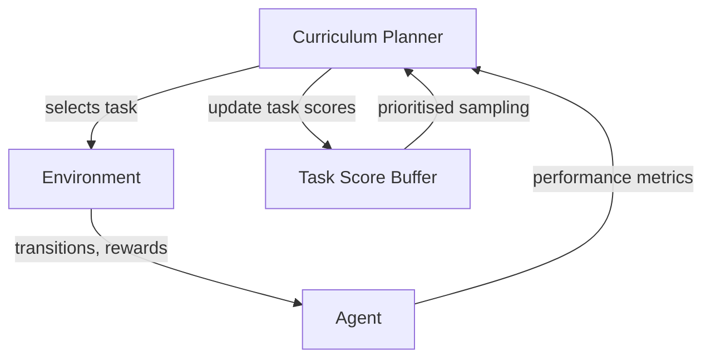

A child learning to ride a bike doesn't start on a mountain trail. They begin with training wheels, then a flat path, then gentle slopes. This deceptively simple idea — **order matters when learning** — turns out to be one of the most powerful, underexplored tools in reinforcement learning. Curriculum learning teaches agents progressively, and its modern variants automate the whole process.

## 1. Concept Introduction

### Simple Explanation

Imagine you're training an agent to navigate a maze. You could throw it into a massive labyrinth from day one — but most of its experience will be random wandering, and the reward signal is so sparse it barely learns. Alternatively, you give it a tiny maze first. Once it masters that, you present bigger, more complex mazes. Progress is faster, more stable, and generalises better.

That's curriculum learning: **arranging a sequence of training tasks so the agent builds skills incrementally**, with each task being just hard enough to stretch its current ability without overwhelming it.

### Technical Detail

Formally, a curriculum is a sequence of tasks or environment configurations $\mathcal{T}_1, \mathcal{T}_2, \ldots, \mathcal{T}_K$ drawn from a task space $\Lambda$. At each training stage $k$, the agent is trained on $\mathcal{T}_k$ until some progression criterion is met, then advances. The final goal is robust performance on a **target distribution** $p^*(\lambda)$.

The key insight: because RL agents learn by trial-and-error, the *distribution of experience* during training is as important as the final objective. A curriculum shapes that distribution deliberately.

## 2. Historical & Theoretical Context

Curriculum learning was popularised in supervised learning by Bengio et al. (2009), drawing on insights from cognitive science: humans and animals learn faster when examples progress from easy to hard. The underlying principle traces back to Vygotsky's **Zone of Proximal Development** (ZPD) from 1930s educational psychology — the sweet spot just beyond current mastery where learning is most efficient.

In RL, early curricula were hand-crafted: researchers manually staged environments in games like Montezuma's Revenge or robot locomotion tasks. The field matured around 2019–2022 when **automatic curriculum learning (ACL)** emerged — methods that generate or select tasks dynamically based on the agent's current competence, eliminating expert knowledge from curriculum design.

The theoretical underpinning is the **learning progress hypothesis**: training is most efficient when the agent is making measurable progress, neither stagnating on tasks too hard nor on tasks already mastered.

## 3. Algorithms & Math

### Learning Progress as a Curriculum Signal

A simple ACL criterion is **absolute learning progress (ALP)**: select tasks where the agent's value estimate is changing most rapidly.

$$\text{LP}(\lambda, t) = \left| V_\theta(\lambda, t) - V_\theta(\lambda, t - \Delta) \right|$$

Tasks with high $\text{LP}$ are in the agent's ZPD. Tasks with near-zero LP are either too easy (mastered) or too hard (no learning signal).

### Regret-Based Difficulty

A more principled criterion uses **regret**: the gap between what an optimal policy would achieve and what the current agent achieves on task $\lambda$.

$$\text{REGRET}(\lambda) = V^*(\lambda) - V_\theta(\lambda)$$

High regret means the agent has room to improve on task $\lambda$. A curriculum that maximises expected regret trains the agent most efficiently. The challenge: computing $V^*$ is usually intractable, so we use **surrogate estimates**.

### PAIRED: Adversarial Environment Design

**PAIRED** (Dennis et al., 2020) frames curriculum generation as a three-player game:

- **Protagonist** $\pi_P$: the agent we want to train
- **Antagonist** $\pi_A$: a second agent trained alongside, also on the generated environment
- **Environment Generator** $\phi$: trained to maximise the *regret* of the protagonist

The generator's objective:

$$\max_\phi \left[ V_{\pi_A}(\phi) - V_{\pi_P}(\phi) \right]$$

This regret proxy is clever: if the environment is trivially easy, both agents solve it and regret is zero. If it's impossibly hard, neither solves it and regret is still zero. The generator is forced to produce environments that are **just hard enough** for the protagonist, given what the antagonist can already do.

```
Pseudocode: PAIRED Training Loop

for each iteration:
    env_params ← Generator.generate()

    r_P ← rollout(Protagonist, env_params)
    r_A ← rollout(Antagonist, env_params)

    regret_estimate = mean(r_A) - mean(r_P)

    update Protagonist to maximise r_P
    update Antagonist to maximise r_A
    update Generator to maximise regret_estimate
```

### Prioritized Level Replay (PLR)

**PLR** (Jiang et al., 2021) takes a different angle: instead of generating new environments, it maintains a replay buffer of previously-seen levels and selects which ones to revisit based on their learning potential.

$$P(\lambda_i) \propto \left( \text{score}(\lambda_i) \right)^{1/\beta}$$

where $\text{score}(\lambda_i)$ combines regret estimates and staleness (how long since the level was last visited). New levels are sampled at rate $\rho$ to ensure coverage; old levels with high score are replayed.

## 4. Design Patterns & Architectures

Curriculum learning slots naturally into the **planner-executor** pattern: a curriculum planner decides the training distribution; the executor (the RL agent) runs in whichever environment is selected.



**Key patterns:**
- **Self-paced scheduling**: agent controls its own curriculum via performance thresholds
- **Adversarial generation** (PAIRED, POET): a generator network is co-trained with the agent
- **Replay-based selection** (PLR): a buffer of seen environments is replayed selectively
- **Goal-space curricula**: in goal-conditioned RL, curriculum defines the distribution over goals — harder goals are unlocked as easier ones are mastered

## 5. Practical Application

Here's a minimal curriculum scheduler that tracks learning progress per task and biases sampling toward the ZPD:

```python
import numpy as np
from collections import defaultdict

class CurriculumScheduler:
    def __init__(self, task_pool, window=20, temperature=1.0):
        self.tasks = task_pool           # list of (difficulty, env_fn) tuples
        self.scores = defaultdict(list)  # recent returns per task
        self.window = window
        self.temp = temperature

    def _learning_progress(self, task_id):
        returns = self.scores[task_id]
        if len(returns) < 2:
            return 1.0   # unknown → high priority
        recent = np.mean(returns[-self.window//2:])
        older  = np.mean(returns[:self.window//2])
        return abs(recent - older)

    def select_task(self):
        priorities = np.array([
            self._learning_progress(i) for i in range(len(self.tasks))
        ])
        # Softmax with temperature
        priorities = np.exp(priorities / self.temp)
        probs = priorities / priorities.sum()
        return np.random.choice(len(self.tasks), p=probs)

    def record(self, task_id, episode_return):
        self.scores[task_id].append(episode_return)
        if len(self.scores[task_id]) > self.window:
            self.scores[task_id].pop(0)


# Usage with a simple gym-style setup
tasks = [(0.1, easy_env), (0.3, medium_env), (0.6, hard_env), (1.0, target_env)]
scheduler = CurriculumScheduler(tasks)

for episode in range(10_000):
    task_id = scheduler.select_task()
    difficulty, make_env = tasks[task_id]
    env = make_env()

    ret = run_episode(agent, env)
    scheduler.record(task_id, ret)
    agent.update()
```

In **LangGraph**, the same principle applies to LLM agents: start with simple sub-tasks (short context, clear instructions), measure success rate, and progressively introduce harder variants (longer context, ambiguous instructions, multi-step dependencies). The curriculum scheduler becomes a node in the graph that selects the next task distribution.

## 6. Comparisons & Tradeoffs

| Method | Automation | Sample Efficiency | Requires | Weakness |
|---|---|---|---|---|
| **Hand-crafted curriculum** | None | High (if expert is good) | Domain expert | Expensive, brittle |
| **Domain randomisation** | Full | Moderate | Wide env space | No targeting of ZPD |
| **ALP / Learning Progress** | High | High | Return history | LP estimation noise |
| **PAIRED** | Full | Very high | 3× compute | Complex to stabilise |
| **PLR** | High | High | Level buffer | No new level generation |
| **POET** | Full | Very high | Evolutionary infra | Expensive, complex |

**Domain randomisation** (randomly sample environment parameters each episode) is the simplest baseline — it's robust but wasteful, spending training time on both trivially easy and impossibly hard configurations. Curricula target the middle.

**PAIRED** produces the tightest guarantees (minimax regret) but requires co-training two agents and a generator, tripling computational cost. **PLR** is more practical: it reuses the existing training infrastructure and adds only a scoring buffer.

## 7. Latest Developments & Research

**ACCEL** (Parker-Holder et al., 2022) combines PLR with PAIRED's generative approach: it edits high-regret levels from the PLR buffer rather than generating from scratch, inheriting both methods' strengths and achieving state-of-the-art on MiniGrid navigation benchmarks.

**MAESTRO** (2023) extends curriculum ideas to multi-task RL, learning a shared encoder across a curriculum of tasks and showing that curriculum-induced representations transfer significantly better than single-task or randomly-sampled baselines.

In LLM agent research, **AgentBench** (2023) and **WebArena** (2023) exposed a stark curriculum problem: LLM agents trained only on simple tasks catastrophically fail on complex real-world ones. This has sparked work on **automatic task synthesis** for LLM agents — using LLMs themselves to generate progressively complex tasks, analogous to PAIRED but in the language domain.

**Open problems:**
- How to measure "difficulty" in high-dimensional, structured task spaces?
- Can curriculum methods automatically identify *what skills* are bottlenecks?
- How to prevent curriculum overfitting — optimising for the curriculum, not the target distribution?

## 8. Cross-Disciplinary Insight

Educational psychology calls this **scaffolding** — temporary support structures that are gradually withdrawn as competence grows. Vygotsky's ZPD predates deep learning by 80 years, yet it precisely describes what effective curriculum methods try to approximate.

In **control theory**, this maps to gain scheduling: a controller with parameters tuned for the current operating regime, gradually shifted as the system state changes. You don't apply full-authority control to a system that's still unstable.

Most compellingly, **developmental neuroscience** shows that the human brain's myelination schedule — the order in which neural pathways mature — acts as a biological curriculum. Sensorimotor circuits develop before prefrontal executive function, ensuring primitive competencies are in place before complex planning is attempted. Evolution, it turns out, solved curriculum design long before we did.

## 9. Daily Challenge

**Exercise: Build a Maze Curriculum**

Use OpenAI's MiniGrid (pip install minigrid) to set up a curriculum over maze sizes:

1. Train a simple DQN agent on `MiniGrid-Empty-5x5-v0` until it achieves 90% success.
2. Advance to `MiniGrid-Empty-8x8-v0`, then `MiniGrid-FourRooms-v0`.
3. **Track** learning curves at each stage — how does the curriculum compare to training directly on `FourRooms`?
4. **Bonus**: Implement the ALP scheduler above and let it automatically select between the three environments. Does it match your hand-crafted progression?

```python
import gymnasium as gym
import minigrid  # registers MiniGrid envs

envs = [
    "MiniGrid-Empty-5x5-v0",
    "MiniGrid-Empty-8x8-v0",
    "MiniGrid-FourRooms-v0",
]
# Your curriculum agent here
```

Compare final performance and total sample count. The curriculum version almost always wins on both metrics.

## 10. References & Further Reading

### Foundational Papers
- **"Curriculum Learning"** — Bengio et al. (2009): The paper that named the idea in supervised learning
- **"Automatic Curriculum Learning for Deep RL: A Short Survey"** — Portelas et al. (2020): The definitive survey of ACL methods
- **"Emergent Complexity via Multi-Agent Competition"** — Bansal et al. (2018): Self-play as an implicit curriculum

### Key Algorithms
- **PAIRED**: Dennis et al., "Emergent Complexity and Zero-shot Transfer via Unsupervised Environment Design" (NeurIPS 2020)
- **PLR**: Jiang et al., "Prioritized Level Replay" (ICML 2021)
- **POET**: Wang et al., "Paired Open-Ended Trailblazer" (2019)
- **ACCEL**: Parker-Holder et al., "Evolving Curricula with Regret-Based Environment Design" (ICML 2022)

### Practical Resources
- **MiniGrid / BabyAI**: https://github.com/Farama-Foundation/MiniGrid — canonical curriculum RL benchmark suite
- **Syllabus library**: https://github.com/RyanNavillus/Syllabus — drop-in curriculum learning for PettingZoo/Gymnasium
- **"Curriculum for Reinforcement Learning"** (Lilian Weng blog): Excellent conceptual overview with diagrams

---

## Key Takeaways

1. **Order of training matters**: the right task at the right time can cut sample requirements by an order of magnitude
2. **Learning progress is your ZPD signal**: high progress means you're in the sweet spot; track it cheaply from return history
3. **PAIRED gives guarantees**: minimax regret framing is principled, but costly — use PLR as a practical alternative
4. **Curricula aren't just for locomotion**: LLM agents, reasoning chains, and code-writing agents all benefit from progressively staged tasks
5. **The curriculum can be the environment**: adversarial environment generation (PAIRED, ACCEL) produces emergent complexity for free
6. **Beware curriculum overfitting**: always evaluate on the target distribution, not the training curriculum
