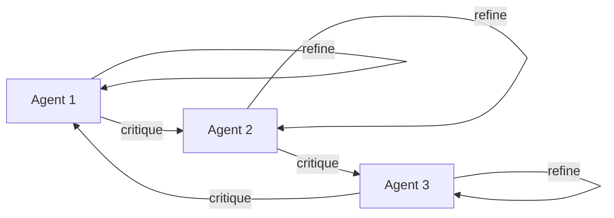
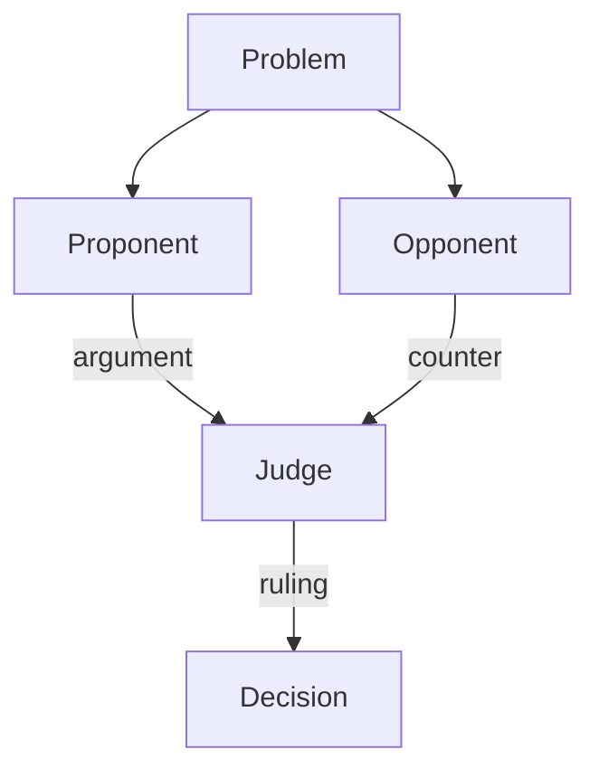
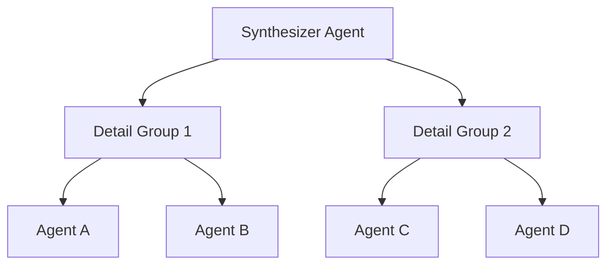

## The Wisdom of Disagreement

Imagine you're making a critical decision. Would you trust a single advisor, or would you prefer to hear multiple perspectives—even conflicting ones—before choosing? This intuition underlies **multi-agent debate**: a pattern where multiple AI agents with different viewpoints deliberate to reach better conclusions than any single agent could achieve alone.

Unlike simple voting or averaging, debate involves **iterative argumentation**. Agents don't just state opinions; they respond to each other, refine their positions, and sometimes change their minds. The result? More robust reasoning, reduced hallucinations, and decisions that account for edge cases a lone agent might miss.

## Historical & Theoretical Context

### Origins in Human Deliberation

The idea of deliberative decision-making has deep roots:

- **Ancient Philosophy**: Socratic dialogue (5th century BCE) used question-and-answer to refine ideas
- **Legal Systems**: Adversarial procedures (prosecution vs. defense) emerged to surface truth
- **Parliamentary Debate**: Structured rules for multi-party argumentation (17th century onwards)

### From Multi-Agent Systems to LLMs

In AI, debate-like mechanisms appeared in several waves:

1. **Classical MAS (1980s-1990s)**: Negotiation protocols for distributed problem-solving (see Contract Net Protocol)
2. **Argumentation Theory (1990s-2000s)**: Formal frameworks for reasoning with conflicting information (Dung's argumentation frameworks, 1995)
3. **LLM Era (2018-present)**:
   - **Self-Consistency** (Wang et al., 2022): Sample multiple reasoning paths, vote on answers
   - **Multi-Agent Debate** (Du et al., 2023): Agents iteratively critique each other
   - **Society of Mind** (Park et al., 2023): Simulating diverse personas to surface perspectives

The key insight: **LLMs can simulate multiple viewpoints**, making debate practical without physically distinct agents.

## How Debate Works: The Protocol

### Basic Debate Loop

```python
# Simplified debate protocol
def multi_agent_debate(problem, num_agents=3, rounds=3):
    agents = [Agent(role=f"Agent-{i}") for i in range(num_agents)]

    # Round 0: Initial proposals
    proposals = [agent.propose(problem) for agent in agents]

    # Iterative deliberation
    for round in range(rounds):
        critiques = []
        for i, agent in enumerate(agents):
            # Each agent sees others' proposals
            other_proposals = [p for j, p in enumerate(proposals) if j != i]
            critique = agent.critique(problem, other_proposals)
            critiques.append(critique)

        # Agents refine based on critiques
        proposals = [
            agent.refine(problem, proposals[i], critiques)
            for i, agent in enumerate(agents)
        ]

    # Final aggregation
    return aggregate_proposals(proposals)
```

### Key Components

1. **Initialization**: Agents start with diverse prompts (e.g., "You are optimistic", "You are skeptical")
2. **Iteration**: Multiple rounds allow convergence toward truth
3. **Visibility**: Agents see each other's reasoning (unlike isolated sampling)
4. **Aggregation**: Final step combines proposals (voting, judge agent, or consensus)

## The Mathematics of Deliberation

### Why Does Debate Work?

From an information-theoretic view, debate increases **coverage** of the hypothesis space:

Let $H$ be the space of possible solutions. A single agent samples $h_1 \sim P_\theta(H | x)$, where $x$ is the problem and $\theta$ is the model. With debate:

$$
\text{Debate}(x) = \arg\max_{h \in H} \sum_{t=1}^{T} P_\theta(h | x, \{h_1^{t-1}, \ldots, h_n^{t-1}\})
$$

Each round $t$ conditions on previous proposals, allowing agents to:
- **Correct errors**: If $h_1$ is wrong, $h_2$ can identify flaws
- **Explore alternatives**: Different initializations → different $h_i$
- **Converge**: Iterative refinement reduces variance

### Convergence Properties

Unlike adversarial games (Minimax), cooperative debate seeks **Pareto improvements**. Under certain conditions:
- Agents converge to a consensus (if one exists)
- Quality improves monotonically (each round ≥ previous)
- Dissent is productive (highlights genuine ambiguity)

## Design Patterns & Architectures

### 1. **Symmetric Debate** (Peer-to-Peer)

All agents are equals. Used when no ground truth is available.



**Best for**: Open-ended problems (design, strategy, creative tasks)

### 2. **Judge-Mediated Debate**

A separate judge agent evaluates proposals and declares a winner.



**Best for**: Factual questions, math problems (judge verifies correctness)

### 3. **Hierarchical Deliberation**

Agents at different abstraction levels. Low-level agents debate details; high-level agents synthesize.



**Best for**: Complex, multi-faceted problems (policy analysis, architectural decisions)

## Practical Application: LLM Debate in Python

Here's a working example using OpenAI's API:

```python
from openai import OpenAI
import json

client = OpenAI()

class DebateAgent:
    def __init__(self, name, perspective):
        self.name = name
        self.perspective = perspective  # Bias/role instruction

    def respond(self, problem, history):
        messages = [
            {"role": "system", "content": f"You are {self.name}. {self.perspective}"},
            {"role": "user", "content": f"Problem: {problem}"}
        ]

        # Add debate history
        for turn in history:
            messages.append({"role": "assistant" if turn['agent'] == self.name else "user",
                           "content": turn['content']})

        response = client.chat.completions.create(
            model="gpt-4",
            messages=messages,
            temperature=0.7
        )
        return response.choices[0].message.content

def run_debate(problem, agents, rounds=3):
    history = []

    for round_num in range(rounds):
        print(f"\n=== Round {round_num + 1} ===")
        for agent in agents:
            response = agent.respond(problem, history)
            history.append({'agent': agent.name, 'content': response})
            print(f"{agent.name}: {response[:200]}...")

    # Judge aggregates
    judge_prompt = f"Problem: {problem}\n\nDebate history:\n"
    for turn in history:
        judge_prompt += f"{turn['agent']}: {turn['content']}\n\n"
    judge_prompt += "Based on this debate, what is the best answer? Synthesize the arguments."

    final = client.chat.completions.create(
        model="gpt-4",
        messages=[{"role": "user", "content": judge_prompt}],
        temperature=0.3
    )
    return final.choices[0].message.content

# Example usage
agents = [
    DebateAgent("Optimist", "You tend to see possibilities and upsides."),
    DebateAgent("Skeptic", "You critically examine assumptions and risks."),
    DebateAgent("Pragmatist", "You focus on feasibility and concrete steps.")
]

result = run_debate(
    "Should our startup build our own LLM or use third-party APIs?",
    agents,
    rounds=2
)
print("\n=== Final Decision ===")
print(result)
```

### Integration with Frameworks

**LangGraph Example**:

```python
from langgraph.graph import StateGraph

class DebateState(TypedDict):
    problem: str
    proposals: List[str]
    round: int

def agent_node(state, agent_id):
    # Each node is an agent in the debate
    other_proposals = [p for i, p in enumerate(state['proposals']) if i != agent_id]
    new_proposal = debate_agent.refine(state['problem'], state['proposals'][agent_id], other_proposals)
    state['proposals'][agent_id] = new_proposal
    return state

workflow = StateGraph(DebateState)
workflow.add_node("agent_0", lambda s: agent_node(s, 0))
workflow.add_node("agent_1", lambda s: agent_node(s, 1))
workflow.add_node("agent_2", lambda s: agent_node(s, 2))

# Cycle through agents for N rounds
for _ in range(3):
    workflow.add_edge("agent_0", "agent_1")
    workflow.add_edge("agent_1", "agent_2")
    workflow.add_edge("agent_2", "agent_0")
```

## Comparisons & Tradeoffs

| Approach | Strengths | Weaknesses |
|----------|-----------|------------|
| **Single Agent** | Fast, cheap, simple | Narrow perspective, prone to errors |
| **Self-Consistency** (voting) | No interaction needed | Wastes compute on redundant paths |
| **Debate** | Deep exploration, error correction | Slower (multiple rounds), more tokens |
| **Ensemble** (parallel agents) | Diversity without interaction | No refinement, may miss synthesis |

### When to Use Debate

✅ **Use debate when:**
- Correctness > speed
- Problem has ambiguity or multiple valid approaches
- You can afford 3–5x token cost vs. single agent
- Explanation/justification is important (traceable reasoning)

❌ **Avoid debate when:**
- Problem is trivial or has clear correct answer
- Real-time response needed
- Budget-constrained (debate is expensive)

## Latest Developments & Research

### Recent Breakthroughs (2023-2025)

1. **"Improving Factuality with Multi-Agent Debate"** (Du et al., 2023)
   - Showed debate reduces hallucinations in math/reasoning tasks by 15-30%
   - Key finding: Even identical models debating (no diversity) helps via self-correction

2. **"Debating with More Persuasive LLMs Leads to More Truthful Answers"** (Khan et al., 2024)
   - Studied human judges watching LLM debates
   - Found: Stronger debaters → humans pick correct answer more often
   - Concern: Persuasiveness ≠ truth (AI safety issue)

3. **"ReConcile: LLM-Based Debate for Cross-Document Consistency"** (Chen et al., 2024)
   - Applied debate to fact-checking across multiple sources
   - Agents argue about which source is authoritative

4. **"Constitutional AI via Debate"** (Anthropic, 2024)
   - Used red team vs. blue team debate to improve harmlessness
   - Red team attacks, blue team defends → safer final model

### Open Problems

- **Termination conditions**: When to stop debating? (Diminishing returns unclear)
- **Collusion**: Can agents "agree to be wrong" together?
- **Scalability**: How many agents is optimal? (More ≠ always better)
- **Heterogeneity**: Should agents use different models, or just different prompts?

## Cross-Disciplinary Insight: Jury Deliberation

The legal concept of **jury deliberation** offers a parallel:

- **Diversity**: Jurors bring different backgrounds (cf. agent roles)
- **Sequestration**: Prevents outside influence during deliberation (cf. controlled agent context)
- **Unanimity vs. Majority**: Different thresholds for decision (cf. consensus algorithms)

Research on human juries shows:
- Initial minority opinions often sway final verdict (debate surfaces hidden insights)
- "Shared information bias": Groups overweight commonly known facts (agents can counter this by being adversarial)

**Lesson for AI**: Explicitly design agents to surface **non-obvious** perspectives, not just restate the majority view.

## Daily Challenge: Build a Debate System

**Task**: Implement a 3-agent debate to answer this question:

> "Is it better to use microservices or a monolith for a new SaaS product with 5 engineers?"

**Steps**:
1. Create 3 agents with different biases:
   - Agent A: "Prefer simplicity and speed to market"
   - Agent B: "Prefer scalability and future-proofing"
   - Agent C: "Neutral, focus on team size and skills"

2. Run 2 rounds of debate (proposal → critique → revision)

3. Add a judge agent to synthesize the final recommendation

**Extension**: Track how proposals change round-to-round. Do agents converge or stay polarized?

**Bonus**: Try with a factual question (e.g., math problem). Does debate improve accuracy?

## References & Further Reading

### Foundational Papers

- **Dung, P. M.** (1995). "On the acceptability of arguments and its fundamental role in nonmonotonic reasoning, logic programming and n-person games." *Artificial Intelligence*, 77(2), 321-357.
  - Classic work on argumentation frameworks

- **Du, Y., Li, S., Torralba, A., Tenenbaum, J. B., & Mordatch, I.** (2023). "Improving Factuality and Reasoning in Language Models through Multiagent Debate." *arXiv:2305.14325*
  - [Paper](https://arxiv.org/abs/2305.14325)

- **Khan, A., Xu, J., & Steinhardt, J.** (2024). "Debating with More Persuasive LLMs Leads to More Truthful Answers." *arXiv:2402.06782*
  - [Paper](https://arxiv.org/abs/2402.06782)

### Practical Resources

- **LangGraph Multi-Agent Examples**: [GitHub](https://github.com/langchain-ai/langgraph/tree/main/examples/multi_agent)
- **AutoGen Debate Framework**: [Docs](https://microsoft.github.io/autogen/)
- **CrewAI Hierarchical Processes**: [Docs](https://docs.crewai.com/)

### Related Articles

- "Strategic Minds: Understanding Multi-Agent Behavior with Game Theory and Nash Equilibrium" (game-theoretic foundations)
- "The Power of Many: Solving Complex Problems with AI Agent Swarms" (coordination without debate)
- "Reflection and Self-Critique: Teaching Agents to Learn from Mistakes" (single-agent introspection vs. multi-agent critique)

---

**Key Takeaway**: Disagreement isn't a bug in multi-agent systems—it's a feature. By designing agents to argue constructively, we tap into the same deliberative processes that make human institutions robust. The next time you build an AI agent, ask: *Who would disagree with this answer, and why?*
