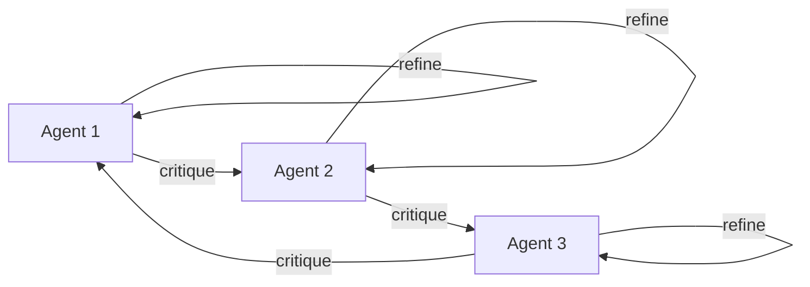
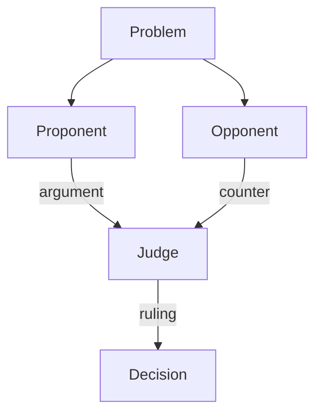
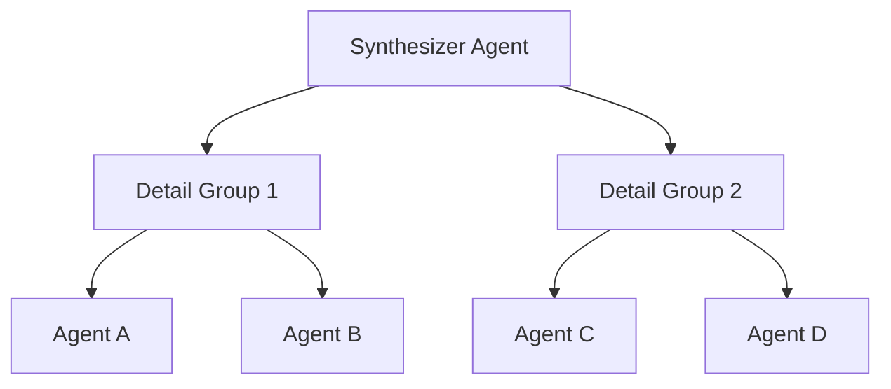

## The Wisdom of Disagreement

**Multi-agent debate** is a pattern where multiple AI agents with different viewpoints deliberate to reach better conclusions than any single agent could achieve alone. Unlike simple voting or averaging, it involves iterative argumentation: agents respond to each other, refine their positions, and sometimes change their minds. The result is more robust reasoning, reduced hallucinations, and decisions that account for edge cases a lone agent might miss.

## How Debate Works: The Protocol

### Basic Debate Loop

```python
# Simplified debate protocol
def multi_agent_debate(problem, num_agents=3, rounds=3):
    agents = [Agent(role=f"Agent-{i}") for i in range(num_agents)]

    # Round 0: Initial proposals
    proposals = [agent.propose(problem) for agent in agents]

    # Iterative deliberation
    for round in range(rounds):
        critiques = []
        for i, agent in enumerate(agents):
            # Each agent sees others' proposals
            other_proposals = [p for j, p in enumerate(proposals) if j != i]
            critique = agent.critique(problem, other_proposals)
            critiques.append(critique)

        # Agents refine based on critiques
        proposals = [
            agent.refine(problem, proposals[i], critiques)
            for i, agent in enumerate(agents)
        ]

    # Final aggregation
    return aggregate_proposals(proposals)
```

### Key Components

1. **Initialization**: Agents start with diverse prompts (e.g., "You are optimistic", "You are skeptical")
2. **Iteration**: Multiple rounds allow convergence toward truth
3. **Visibility**: Agents see each other's reasoning (unlike isolated sampling)
4. **Aggregation**: Final step combines proposals (voting, judge agent, or consensus)

## The Mathematics of Deliberation

### Why Does Debate Work?

From an information-theoretic view, debate increases **coverage** of the hypothesis space:

Let $H$ be the space of possible solutions. A single agent samples $h_1 \sim P_\theta(H | x)$, where $x$ is the problem and $\theta$ is the model. With debate:

$$
\text{Debate}(x) = \arg\max_{h \in H} \sum_{t=1}^{T} P_\theta(h | x, \{h_1^{t-1}, \ldots, h_n^{t-1}\})
$$

Each round $t$ conditions on previous proposals, allowing agents to:
- **Correct errors**: If $h_1$ is wrong, $h_2$ can identify flaws
- **Explore alternatives**: Different initializations → different $h_i$
- **Converge**: Iterative refinement reduces variance

### Convergence Properties

Unlike adversarial games (Minimax), cooperative debate seeks **Pareto improvements**. Under certain conditions:
- Agents converge to a consensus (if one exists)
- Quality improves monotonically (each round ≥ previous)
- Dissent is productive (highlights genuine ambiguity)

## Design Patterns & Architectures

### Symmetric Debate (Peer-to-Peer)

All agents are equals. Used when no ground truth is available.


```mermaid
graph LR
    A1[Agent 1] -->|critique| A2[Agent 2]
    A2 -->|critique| A3[Agent 3]
    A3 -->|critique| A1
    A1 -->|refine| A1
    A2 -->|refine| A2
    A3 -->|refine| A3
```

**Best for**: Open-ended problems (design, strategy, creative tasks)

### Judge-Mediated Debate

A separate judge agent evaluates proposals and declares a winner.


```mermaid
graph TD
    P[Problem] --> A1[Proponent]
    P --> A2[Opponent]
    A1 -->|argument| J[Judge]
    A2 -->|counter| J
    J -->|ruling| Decision
```

**Best for**: Factual questions, math problems (judge verifies correctness)

### Hierarchical Deliberation

Agents at different abstraction levels. Low-level agents debate details; high-level agents synthesize.


```mermaid
graph TB
    S[Synthesizer Agent]
    S --> G1[Detail Group 1]
    S --> G2[Detail Group 2]
    G1 --> A1[Agent A]
    G1 --> A2[Agent B]
    G2 --> A3[Agent C]
    G2 --> A4[Agent D]
```

**Best for**: Complex, multi-faceted problems (policy analysis, architectural decisions)

## Practical Application: LLM Debate in Python

Here's a working example using OpenAI's API:

```python
from openai import OpenAI
import json

client = OpenAI()

class DebateAgent:
    def __init__(self, name, perspective):
        self.name = name
        self.perspective = perspective  # Bias/role instruction

    def respond(self, problem, history):
        messages = [
            {"role": "system", "content": f"You are {self.name}. {self.perspective}"},
            {"role": "user", "content": f"Problem: {problem}"}
        ]

        # Add debate history
        for turn in history:
            messages.append({"role": "assistant" if turn['agent'] == self.name else "user",
                           "content": turn['content']})

        response = client.chat.completions.create(
            model="gpt-4",
            messages=messages,
            temperature=0.7
        )
        return response.choices[0].message.content

def run_debate(problem, agents, rounds=3):
    history = []

    for round_num in range(rounds):
        print(f"\n=== Round {round_num + 1} ===")
        for agent in agents:
            response = agent.respond(problem, history)
            history.append({'agent': agent.name, 'content': response})
            print(f"{agent.name}: {response[:200]}...")

    # Judge aggregates
    judge_prompt = f"Problem: {problem}\n\nDebate history:\n"
    for turn in history:
        judge_prompt += f"{turn['agent']}: {turn['content']}\n\n"
    judge_prompt += "Based on this debate, what is the best answer? Synthesize the arguments."

    final = client.chat.completions.create(
        model="gpt-4",
        messages=[{"role": "user", "content": judge_prompt}],
        temperature=0.3
    )
    return final.choices[0].message.content

# Example usage
agents = [
    DebateAgent("Optimist", "You tend to see possibilities and upsides."),
    DebateAgent("Skeptic", "You critically examine assumptions and risks."),
    DebateAgent("Pragmatist", "You focus on feasibility and concrete steps.")
]

result = run_debate(
    "Should our startup build our own LLM or use third-party APIs?",
    agents,
    rounds=2
)
print("\n=== Final Decision ===")
print(result)
```

### Integration with Frameworks

**LangGraph Example**:

```python
from langgraph.graph import StateGraph

class DebateState(TypedDict):
    problem: str
    proposals: List[str]
    round: int

def agent_node(state, agent_id):
    # Each node is an agent in the debate
    other_proposals = [p for i, p in enumerate(state['proposals']) if i != agent_id]
    new_proposal = debate_agent.refine(state['problem'], state['proposals'][agent_id], other_proposals)
    state['proposals'][agent_id] = new_proposal
    return state

workflow = StateGraph(DebateState)
workflow.add_node("agent_0", lambda s: agent_node(s, 0))
workflow.add_node("agent_1", lambda s: agent_node(s, 1))
workflow.add_node("agent_2", lambda s: agent_node(s, 2))

# Cycle through agents for N rounds
for _ in range(3):
    workflow.add_edge("agent_0", "agent_1")
    workflow.add_edge("agent_1", "agent_2")
    workflow.add_edge("agent_2", "agent_0")
```

## Latest Developments & Research

### Recent Breakthroughs (2023-2025)

1. **"Improving Factuality with Multi-Agent Debate"** (Du et al., 2023)
   - Showed debate reduces hallucinations in math/reasoning tasks by 15-30%
   - Key finding: Even identical models debating (no diversity) helps via self-correction

2. **"Debating with More Persuasive LLMs Leads to More Truthful Answers"** (Khan et al., 2024)
   - Studied human judges watching LLM debates
   - Found: Stronger debaters → humans pick correct answer more often
   - Concern: Persuasiveness ≠ truth (AI safety issue)

3. **"ReConcile: LLM-Based Debate for Cross-Document Consistency"** (Chen et al., 2024)
   - Applied debate to fact-checking across multiple sources
   - Agents argue about which source is authoritative

4. **"Constitutional AI via Debate"** (Anthropic, 2024)
   - Used red team vs. blue team debate to improve harmlessness
   - Red team attacks, blue team defends → safer final model

### Open Problems

- **Termination conditions**: When to stop debating? (Diminishing returns unclear)
- **Collusion**: Can agents "agree to be wrong" together?
- **Scalability**: How many agents is optimal? (More ≠ always better)
- **Heterogeneity**: Should agents use different models, or just different prompts?

## Cross-Disciplinary Insight: Jury Deliberation

The legal concept of **jury deliberation** offers a parallel:

- **Diversity**: Jurors bring different backgrounds (cf. agent roles)
- **Sequestration**: Prevents outside influence during deliberation (cf. controlled agent context)
- **Unanimity vs. Majority**: Different thresholds for decision (cf. consensus algorithms)

Research on human juries shows:
- Initial minority opinions often sway final verdict (debate surfaces hidden insights)
- "Shared information bias": Groups overweight commonly known facts (agents can counter this by being adversarial)

The implication for AI: explicitly design agents to surface non-obvious perspectives, not just restate the majority view.
