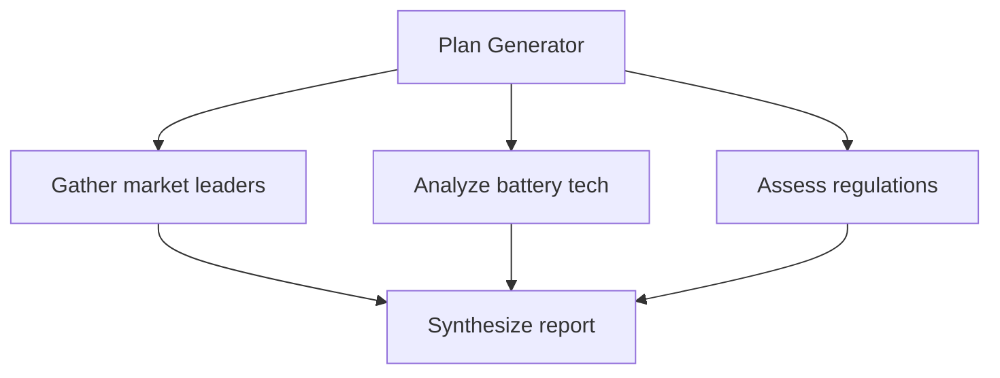

When a planner outputs a list of steps, the naive executor runs them one by one. Most plans have structure that sequential execution ignores: some tasks depend on each other, and others are completely independent. Treating a plan as a list when it is actually a graph wastes time and makes failure handling more brittle than necessary.

## Concept Introduction

A task dependency graph represents a plan as a directed acyclic graph (DAG), where each node is a task and each directed edge means "this must complete before that can start." Tasks with no incoming edges are immediately ready to run. Tasks whose dependencies have all completed become ready. Everything else waits.

The executor's job shifts from "run step N then step N+1" to "find all tasks whose dependencies are satisfied, run them in parallel, and update the ready set as completions arrive." This enables three things that sequential execution cannot:

- Independent tasks run simultaneously instead of waiting in a queue behind each other.
- When a task fails, only its dependents are blocked, not the entire downstream pipeline.
- New tasks can be inserted into the graph mid-execution as long as they do not create cycles.

The key insight is that **dependency relationships are the real plan structure**. Ordering that is not justified by a data or causal dependency is artificial and costs you throughput for nothing.

## Historical and Theoretical Context

This is not a new idea. Stuart Feldman's `make` utility (1976) solved exactly this problem for software builds: a Makefile is a DAG of targets and their prerequisites, and `make` parallelizes independent targets with the `-j` flag. The same structure appeared in scientific workflow systems throughout the 1990s.

The project management world developed the **Critical Path Method (CPM)** in the late 1950s for scheduling complex engineering projects. CPM asks: what is the longest chain of dependent tasks? That chain, the critical path, determines the minimum completion time regardless of how much you parallelize everything else. All the slack in the schedule lives in the non-critical tasks.

CPM reasoning transfers directly to agent pipelines. Given a task DAG, the critical path is the bottleneck. Parallelizing tasks not on the critical path helps, but reducing the duration of any task on the critical path is where real gains live.

In the data engineering space, Apache Airflow (2015) and Prefect popularized DAG-based workflow orchestration at scale, bringing dependency-aware scheduling into mainstream production engineering. The concepts in those systems map almost directly onto what a sophisticated agent executor needs to do.

## Algorithms and Math

The executor runs a variant of Kahn's algorithm for topological sort, adapted for parallel execution:

```
Initialize:
  ready_queue = { tasks with no dependencies }
  completed = {}
  results = {}

While tasks remain:
  Grab all tasks currently in ready_queue
  Execute them in parallel
  For each completed task t:
    completed.add(t.id)
    results[t.id] = t.output
    For each task s that depends on t:
      If all of s.dependencies ⊆ completed:
        ready_queue.add(s)
```

The critical path length $L$ determines the theoretical minimum wall-clock time, where $w_i$ is the duration of task $i$:

$$L = \max_{\text{path } p} \sum_{i \in p} w_i$$

Everything else is parallelizable overhead. In practice, LLM tool-call latency dominates, so even modest parallelism across two or three independent branches cuts end-to-end latency substantially.

## Design Patterns

The clearest pattern is **fan-out and fan-in**: a planner produces multiple independent research or retrieval subtasks (fan-out), each runs in parallel, and a synthesis step collects their outputs (fan-in). This pattern appears constantly in research agents, report generators, and multi-source data pipelines.

A subtler pattern is the **conditional branch**: a task's output determines which downstream tasks are added to the graph. This makes the DAG dynamic rather than static. The constraint is that you cannot add a task that creates a cycle, so you need a cycle-detection check on insertion. In practice this is rarely an issue because LLM-generated plans almost never produce circular dependencies, but defensive checking costs almost nothing.

A third pattern involves **graceful degradation under failure**. When a task fails, you can mark it as failed and propagate a sentinel value to its dependents rather than halting the whole pipeline. Dependents receive context that one of their inputs failed and can produce a degraded-but-useful result rather than throwing an exception. This transforms hard failures into soft degradation.



## Practical Application

The example below builds a research agent in LangGraph that generates a task DAG, executes independent tasks in parallel with `asyncio.gather`, and synthesizes the results. The planner asks an LLM to emit the dependency structure as JSON; the executor uses Kahn's algorithm to schedule work.

```python
import asyncio
import json
from dataclasses import dataclass, field
from typing import TypedDict

from langchain_core.messages import HumanMessage, SystemMessage
from langchain_openai import ChatOpenAI
from langgraph.graph import END, START, StateGraph

llm = ChatOpenAI(model="gpt-4o-mini", temperature=0)


@dataclass
class Task:
    id: str
    description: str
    depends_on: list[str]
    status: str = "pending"   # pending | done | failed
    result: str = ""


class AgentState(TypedDict):
    goal: str
    tasks: dict          # id -> Task
    completed: set
    results: dict        # id -> result string
    final_answer: str


def ready_tasks(tasks: dict, completed: set) -> list[str]:
    """IDs of pending tasks whose dependencies are all satisfied."""
    return [
        tid for tid, t in tasks.items()
        if t.status == "pending" and all(d in completed for d in t.depends_on)
    ]


async def run_task(task: Task, prior: dict) -> str:
    """Execute one task, given a dict of prior task outputs it depends on."""
    context = "\n".join(f"[{k}]: {v}" for k, v in prior.items()) or "None"
    resp = await llm.ainvoke([
        SystemMessage(content="You are a research assistant. Complete the assigned task concisely."),
        HumanMessage(content=f"Task: {task.description}\n\nPrior results:\n{context}"),
    ])
    return resp.content


async def plan_node(state: AgentState) -> AgentState:
    """Ask the LLM to produce a dependency-annotated task list as JSON."""
    resp = await llm.ainvoke([
        SystemMessage(content=(
            "You are a planning agent. Given a goal, output a JSON object with a 'tasks' array. "
            "Each task: {id, description, depends_on}. "
            "Only add a dependency when the output is strictly required. "
            "Prefer parallel tasks. Output only valid JSON."
        )),
        HumanMessage(content=f"Goal: {state['goal']}"),
    ])
    raw = json.loads(resp.content)
    tasks = {
        t["id"]: Task(t["id"], t["description"], t.get("depends_on", []))
        for t in raw["tasks"]
    }
    return {**state, "tasks": tasks, "completed": set(), "results": {}}


async def execute_node(state: AgentState) -> AgentState:
    """Run tasks in waves: each wave is a batch of newly-ready tasks."""
    tasks = dict(state["tasks"])
    completed = set(state["completed"])
    results = dict(state["results"])

    while True:
        batch = ready_tasks(tasks, completed)
        if not batch:
            break  # all tasks are done or blocked by failures

        # Build per-task context from the dependencies that are already done
        coros = [
            run_task(tasks[tid], {d: results[d] for d in tasks[tid].depends_on if d in results})
            for tid in batch
        ]
        outputs = await asyncio.gather(*coros, return_exceptions=True)

        for tid, output in zip(batch, outputs):
            if isinstance(output, Exception):
                tasks[tid].status = "failed"
                results[tid] = f"[failed: {output}]"
            else:
                tasks[tid].status = "done"
                results[tid] = output
                completed.add(tid)

    return {**state, "tasks": tasks, "completed": completed, "results": results}


async def synthesize_node(state: AgentState) -> AgentState:
    """Combine all task results into a final coherent answer."""
    summary = "\n\n".join(f"[{tid}]\n{r}" for tid, r in state["results"].items())
    resp = await llm.ainvoke([
        SystemMessage(content="Synthesize these task results into a single coherent answer."),
        HumanMessage(content=f"Goal: {state['goal']}\n\nResults:\n{summary}"),
    ])
    return {**state, "final_answer": resp.content}


graph = StateGraph(AgentState)
graph.add_node("plan", plan_node)
graph.add_node("execute", execute_node)
graph.add_node("synthesize", synthesize_node)
graph.add_edge(START, "plan")
graph.add_edge("plan", "execute")
graph.add_edge("execute", "synthesize")
graph.add_edge("synthesize", END)
app = graph.compile()


async def main():
    result = await app.ainvoke({
        "goal": (
            "Write a market analysis on electric vehicles: "
            "profile the leading manufacturers, assess battery technology trends, "
            "and summarize the regulatory landscape."
        ),
        "tasks": {},
        "completed": set(),
        "results": {},
        "final_answer": "",
    })
    print(result["final_answer"])


asyncio.run(main())
```

The three research subtasks (manufacturers, battery technology, regulations) have no dependencies on each other and run in a single parallel wave. The synthesis node fires only after all three complete. On a task like this, where each subtask involves a real LLM call, the parallel approach cuts wall-clock time by roughly two-thirds compared to sequential execution.

## Latest Developments and Research

Task graph execution has moved from a background infrastructure concern to a first-class research topic in agent systems. Microsoft's TaskWeaver (2023) represents agent plans explicitly as code snippets connected by data flow, effectively making the DAG implicit in the variable bindings between steps. The paper "TaskBench: Benchmarking Large Language Models for Task Automation" (Shen et al., NeurIPS 2023) introduced a benchmark specifically for evaluating whether LLMs can correctly generate dependency structures for complex goals, finding significant variance across models.

More recent work on "compound AI systems" from the Berkeley Sky Computing Lab (2024) argues that multi-component agent pipelines should be treated as distributed systems and optimized with the same tools: profiling critical paths, batching where possible, and caching intermediate results. The LATS framework ("Language Agent Tree Search," Zhou et al., 2024) uses tree search over execution traces but also spawns parallel branches at decision points, which is a form of speculative DAG execution.

An open problem is **dynamic DAG validation**: when a mid-execution LLM call proposes adding new tasks, the system must check that the additions do not create cycles and do not violate commitments already made. Current systems mostly skip this check and rely on well-behaved planners. That assumption breaks under adversarial or distribution-shifted inputs.

## Cross-Disciplinary Insight

The critical path method was invented by Dupont engineers in 1957 to manage chemical plant construction projects. They realized that throwing more workers at non-critical tasks did nothing to move the completion date. The only lever was shortening the critical path itself.

The same logic applies to agent pipelines. Profiling which tasks sit on the critical path tells you where to invest: fewer dependencies, faster tools, or smarter caching. Profiling tasks off the critical path tells you what is already "free" from a latency perspective. This is a useful mental model for reasoning about agent performance that borrows directly from industrial project management, with no ML theory required.

Operating systems schedulers handle a similar problem: ready queues, priority levels, and resource constraints. The difference is that OS tasks are CPU-bound and measured in microseconds, while agent tasks are IO-bound and measured in seconds. The longer latencies actually make the parallelism more valuable, not less, since you are hiding expensive LLM round-trips rather than memory accesses.

## Daily Challenge

Take an existing sequential agent pipeline you have built or have access to. Map out the actual dependency structure: which steps genuinely require the output of the previous step, and which just happen to run after it out of habit? Draw the true DAG. Then estimate the critical path latency versus the sequential latency. If the critical path is less than 60% of the sequential runtime, there is a meaningful parallelism gain available without changing any of the task logic.

Bonus: implement the parallel executor and measure actual latency improvement on a real workload.

## References and Further Reading

- **"TaskBench: Benchmarking Large Language Models for Task Automation"** (Shen et al., NeurIPS 2023): Systematic evaluation of LLM task graph generation quality across a range of automation scenarios.

- **"TaskWeaver: A Code-First Agent Framework"** (Qiao et al., Microsoft Research, 2023): Represents agent plans as code with implicit data-flow dependencies rather than explicit DAG annotations.

- **"Efficient Inference, Serving, and Optimization of LLMs"** (Zhong et al., SOSP 2024): Discusses batching and parallelism strategies for compound AI systems, including multi-step agent pipelines.

- **"Language Agent Tree Search Unifies Reasoning, Acting, and Planning in Language Models"** (Zhou et al., ICML 2024): Parallel branch execution as a form of speculative DAG traversal.

- **"The Critical Path Method"** (Kelley and Walker, 1959): Original CPM paper, surprisingly readable, with direct analogues to modern workflow scheduling.

- **Apache Airflow documentation** (airflow.apache.org): Production-grade DAG scheduling with extensive treatment of dependency management, retries, and observability.
