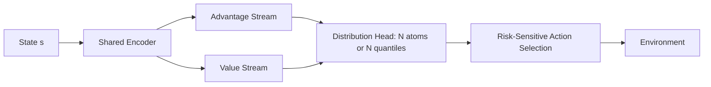

Most reinforcement learning courses teach agents to maximize one number: the *expected* cumulative reward. But reality is messier. Two paths to the same expected reward might look completely different. One is a safe, consistent path; the other is a high-variance gamble. Standard RL agents are blind to this difference. **Distributional RL** fixes that by making agents learn the entire probability distribution over returns, not just the mean.

## Concept Introduction

Standard Q-learning collapses the return to a single expected value. Distributional RL keeps the full picture, learning the shape of the return distribution, not just its center. Two actions with identical expected rewards can look very different when you model the full distribution: one might be consistently moderate, the other a high-variance gamble.

In standard RL, the action-value function is defined as:

$$Q(s, a) = \mathbb{E}\left[ G_t \mid s_t = s, a_t = a \right]$$

where $G_t = \sum_{k=0}^{\infty} \gamma^k r_{t+k}$ is the discounted return.

Distributional RL replaces this scalar with a **random variable** $Z(s, a)$ such that:

$$Q(s, a) = \mathbb{E}[Z(s, a)]$$

The agent learns the full distribution $Z(s, a)$: its mean, variance, skew, and tail behavior. This requires a new Bellman equation and new loss functions, but the payoff is significant: richer agent behavior, better stability, and natural risk-awareness.

## Historical & Theoretical Context

The distributional perspective on RL was formalized by Marc Bellemare, Will Dabney, and Rémi Munos in their landmark 2017 paper, **"A Distributional Perspective on Reinforcement Learning"** (Bellemare et al., 2017). This introduced the **C51** algorithm (Categorical 51-atom) and won a best paper award at ICML.

The key theoretical insight was the **Distributional Bellman Equation**:

$$Z(s, a) \stackrel{D}{=} R(s, a) + \gamma Z(S', A')$$

The $\stackrel{D}{=}$ notation means equality in *distribution*, not just in expectation. The right-hand side is a new random variable: the immediate reward $R$ plus the discounted future return. This equation is a contraction in the **Wasserstein metric**, with a unique fixed point: the true return distribution.

Earlier work on risk-sensitive RL (Heger 1994, Sobel 1982) touched related ideas, but distributional RL unified the theory and produced a practical, scalable algorithm that beat DQN across Atari benchmarks.

## Algorithms & Math

### The Distributional Bellman Equation

Let $\mathcal{T}^\pi Z(s, a)$ denote the distributional Bellman operator:

$$(\mathcal{T}^\pi Z)(s, a) \stackrel{D}{=} R(s,a) + \gamma Z(S', \pi(S'))$$

The goal is to find $Z^*$ such that $\mathcal{T}^* Z^* = Z^*$.

### C51: Categorical Distribution

C51 discretizes the return into $N = 51$ fixed atoms $\{z_1, \ldots, z_N\}$ spanning $[V_{\min}, V_{\max}]$. The network outputs probabilities $p_i(s, a)$ over these atoms. After a Bellman update, the projected distribution is computed and minimized via **KL divergence**:

$$\mathcal{L} = -\sum_i \hat{p}_i(s, a) \log p_i(s, a)$$

```
C51 Update:
  1. Sample transition (s, a, r, s')
  2. Compute target atoms: tz_i = clip(r + γ·z_i, V_min, V_max)
  3. Distribute probability mass of tz_i onto nearest atoms (projection)
  4. Minimize KL divergence between projected target and predicted distribution
```

### QR-DQN: Quantile Regression

**Quantile Regression DQN** (Dabney et al., 2018) avoids fixed atoms by learning N quantile values $\theta_\tau(s,a)$ where $\tau \in [0, 1]$ are quantile levels. The loss is the **asymmetric Huber loss** (quantile regression loss):

$$\mathcal{L}_\tau(\delta) = |\tau - \mathbf{1}(\delta < 0)| \cdot \ell_\kappa(\delta)$$

where $\delta$ is the TD error and $\ell_\kappa$ is the Huber loss. QR-DQN is more flexible than C51 and achieves tighter theoretical guarantees (contraction in 1-Wasserstein distance).

### IQN: Implicit Quantile Networks

**IQN** (Dabney et al., 2018b) goes further, learning a continuous mapping from quantile level $\tau$ to return quantile using a neural network $Z_\tau(s,a) = f(s, a, \tau)$. At inference, you sample multiple $\tau$ values to get the full distribution dynamically. This is the most expressive of the three.

## Design Patterns & Architectures

Distributional RL plugs naturally into existing architectures with one key change: the output head produces a distribution instead of a scalar.



**Risk-sensitive action selection** is where distributional RL shines. Instead of $\arg\max_a \mathbb{E}[Z(s,a)]$, you can choose the action maximizing Conditional Value-at-Risk (expected return in the worst $\alpha$% of outcomes) for safety-critical agents, take the 90th-percentile return to encourage exploration, or simply take the mean to match classical Q-learning while often benefiting from the richer representation.

## Practical Application

```python
import torch
import torch.nn as nn
import numpy as np

class QRDQNNetwork(nn.Module):
    """Quantile Regression DQN — learns N quantiles of the return distribution."""

    def __init__(self, state_dim: int, n_actions: int, n_quantiles: int = 51):
        super().__init__()
        self.n_quantiles = n_quantiles
        self.n_actions = n_actions

        self.encoder = nn.Sequential(
            nn.Linear(state_dim, 128),
            nn.ReLU(),
            nn.Linear(128, 128),
            nn.ReLU(),
        )
        # Output: N quantile values per action
        self.quantile_head = nn.Linear(128, n_actions * n_quantiles)

    def forward(self, state: torch.Tensor) -> torch.Tensor:
        """Returns shape: (batch, n_actions, n_quantiles)"""
        x = self.encoder(state)
        quantiles = self.quantile_head(x)
        return quantiles.view(-1, self.n_actions, self.n_quantiles)

    def greedy_action(self, state: torch.Tensor) -> torch.Tensor:
        """Standard greedy: maximize mean return."""
        with torch.no_grad():
            quantiles = self.forward(state)          # (batch, actions, quantiles)
            mean_returns = quantiles.mean(dim=-1)    # (batch, actions)
            return mean_returns.argmax(dim=-1)

    def cvar_action(self, state: torch.Tensor, alpha: float = 0.2) -> torch.Tensor:
        """Risk-averse: maximize CVaR at level alpha (worst alpha fraction)."""
        with torch.no_grad():
            quantiles = self.forward(state)          # (batch, actions, quantiles)
            k = max(1, int(alpha * self.n_quantiles))
            # CVaR = mean of lowest k quantiles
            worst_k, _ = quantiles.topk(k, dim=-1, largest=False)
            cvar = worst_k.mean(dim=-1)              # (batch, actions)
            return cvar.argmax(dim=-1)


def quantile_huber_loss(
    pred_quantiles: torch.Tensor,
    target_quantiles: torch.Tensor,
    tau: torch.Tensor,
    kappa: float = 1.0,
) -> torch.Tensor:
    """
    pred_quantiles: (batch, n_quantiles)
    target_quantiles: (batch, n_quantiles) — Bellman targets
    tau: (n_quantiles,) — quantile levels
    """
    td_errors = target_quantiles.unsqueeze(1) - pred_quantiles.unsqueeze(2)
    huber = torch.where(
        td_errors.abs() <= kappa,
        0.5 * td_errors ** 2,
        kappa * (td_errors.abs() - 0.5 * kappa)
    )
    indicator = (td_errors < 0).float()
    quantile_loss = (tau - indicator).abs() * huber
    return quantile_loss.mean()


# Risk-aware agent selection example
net = QRDQNNetwork(state_dim=4, n_actions=2, n_quantiles=51)
state = torch.randn(1, 4)

safe_action = net.cvar_action(state, alpha=0.1)   # Very risk-averse
greedy_action = net.greedy_action(state)           # Standard greedy

print(f"Safe action (CVaR 10%): {safe_action.item()}")
print(f"Greedy action (mean): {greedy_action.item()}")
```

In a **LangGraph** multi-agent system, distributional RL can be used to select between tool-calling strategies: an orchestrator agent learns a return distribution for each tool, and can switch between risk-seeking (during exploration phases) and risk-averse (during deployment) behavior simply by changing the quantile level used for action selection.

## Latest Developments & Research

**Ensemble Distributional Actor-Critic (EDAC, 2021)** combines distributional returns with ensemble Q-networks for offline RL, achieving state-of-the-art on D4RL benchmarks by penalizing high-variance actions out-of-distribution.

**Distributional Soft Actor-Critic (DSAC, 2023)** extends the approach to continuous action spaces by combining IQN-style return modeling with entropy regularization, outperforming SAC on MuJoCo locomotion tasks.

**Safety and Risk-Sensitive Agents (2023–2025):** A wave of robotics and autonomous driving work uses CVaR policies derived from distributional RL to produce agents that are both performant and safe, with formal bounds on worst-case behavior, connecting to the broader field of **constrained RL**.

**Open questions:** How to best represent multimodal distributions (where the return can take two very different values depending on environment stochasticity)? How to scale distributional critics to very large action spaces efficiently?

## Cross-Disciplinary Insight

Distributional RL has deep roots in **financial risk management**. The Conditional Value-at-Risk (CVaR) measure used in distributional RL is borrowed directly from quantitative finance, where portfolio managers optimize not for expected return but for tail-risk-adjusted return. The Markowitz mean-variance framework (1952) is a simplified version of this idea.

In **neuroscience**, dopamine neurons in the brain appear to encode a distributional signal, not just the mean reward prediction error (Dabney et al., 2020, *Nature*). Different dopamine neurons appear to represent optimistic and pessimistic quantile estimates, strong evidence that biological agents use something like distributional RL internally.

## Daily Challenge / Thought Exercise

**Exercise:** Take a classic CartPole environment and implement both a standard DQN and a C51 agent (you can use stable-baselines3 or a minimal PyTorch implementation).

1. Train both agents for 50,000 steps.
2. Plot not just the reward curve, but also the **standard deviation of the learned return distribution** at the initial state over training.
3. Observe: does the variance decrease as the agent converges? What happens at states the agent rarely visits?

**Thought experiment:** You're building a trading agent. Would you use:
- A greedy distributional policy (maximize mean)?
- A CVaR policy (protect against catastrophic loss)?
- An optimistic policy (maximize 90th percentile returns)?

How would your choice change depending on the agent's mandate (hedge fund vs. pension fund)?

## References & Further Reading

- **Bellemare, Dabney, Munos (2017)** — [A Distributional Perspective on Reinforcement Learning](https://arxiv.org/abs/1707.06887) — the foundational C51 paper
- **Dabney et al. (2018)** — [Distributional Reinforcement Learning with Quantile Regression (QR-DQN)](https://arxiv.org/abs/1710.10044)
- **Dabney et al. (2018b)** — [Implicit Quantile Networks for Distributional Reinforcement Learning (IQN)](https://arxiv.org/abs/1806.06923)
- **Dabney et al. (2020)** — [A distributional code for value in dopamine-based reinforcement learning](https://www.nature.com/articles/s41586-019-1924-6) (*Nature*)
- **An & Thomas (2021)** — [EDAC: Uncertainty-Based Offline Reinforcement Learning with Diversified Q-Ensemble](https://arxiv.org/abs/2110.01548)
- **dopamine library** — [Google's distributional RL research framework](https://github.com/google/dopamine)
- [**Blog: "Distributional RL" by Lilian Weng**](https://lilianweng.github.io/posts/2023-01-17-distributional-rl/)
