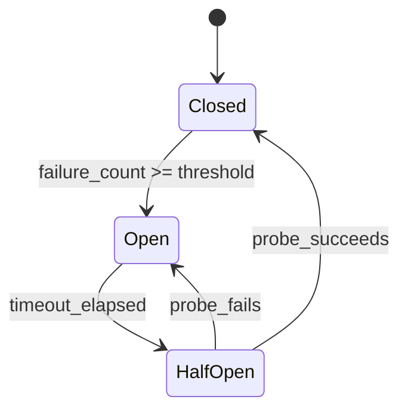
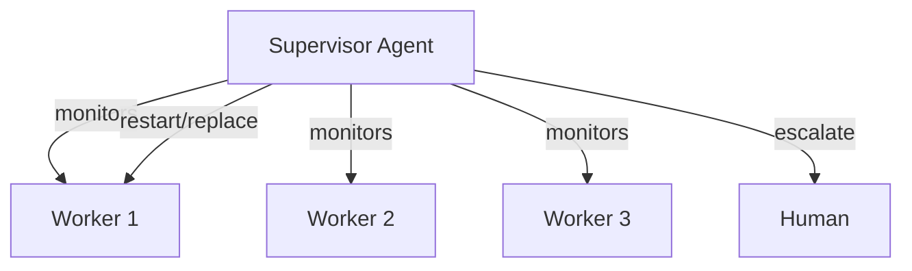

Your AI agent works perfectly in development. Then it hits production: the LLM API times out, a tool returns garbage, the agent hallucinates a function that doesn't exist, and the whole pipeline collapses. What now?

Error recovery and graceful degradation are the difference between a demo and a production system. This article covers the patterns, algorithms, and practical techniques that make AI agents resilient.

## 1. Concept Introduction

### Simple Explanation

Think of graceful degradation like a car losing its GPS. A fragile car would stop driving entirely. A resilient car switches to stored maps, then to road signs, then asks the passenger for directions. The car keeps moving—just with less convenience at each level.

AI agents face similar cascading failures: API timeouts, hallucinated tool calls, context window overflows, and malformed outputs. **Error recovery** means detecting these failures and taking corrective action. **Graceful degradation** means falling back to simpler but still useful behavior when full capability is unavailable.

### Technical Detail

Agent error recovery operates at three levels:

- **Operation-level**: Retrying individual LLM calls or tool invocations with strategies like exponential backoff
- **Step-level**: Re-planning or substituting alternative actions when a step in the agent loop fails
- **System-level**: Falling back to simpler models, cached responses, or human escalation when major components are unavailable

The core challenge is that agents are **stateful and context-dependent**. Unlike stateless microservices, an agent mid-way through a reasoning chain carries accumulated context that cannot simply be "retried from scratch" without cost.

## 2. Historical & Theoretical Context

Fault tolerance in computing dates back to the 1960s with NASA's redundant flight systems for the Apollo program. The key ideas—redundancy, failover, and graceful degradation—were formalized in dependability theory by Jean-Claude Laprie in the 1980s.

In distributed systems, these ideas evolved into patterns like the **circuit breaker** (Michael Nygard, *Release It!*, 2007) and **bulkhead isolation**. The Erlang programming language (1986) pioneered the "let it crash" philosophy: instead of preventing all failures, build supervision trees that detect crashes and restart components cleanly.

Modern AI agent systems face a unique combination of these challenges:

- **Non-determinism**: The same input can produce different outputs from an LLM
- **Semantic failures**: The agent "succeeds" technically but produces wrong or nonsensical results
- **Cascading context corruption**: One bad reasoning step poisons all subsequent steps

This makes traditional retry-and-restart insufficient. Agent recovery must also reason about **semantic correctness**, not just operational success.

## 3. Algorithms & Patterns

### The Retry Hierarchy

A layered approach to recovery, from least to most disruptive:

```
Level 0: Retry     → Same call, same parameters (transient errors)
Level 1: Rephrase  → Same intent, different prompt/parameters
Level 2: Reroute   → Different tool or model for the same task
Level 3: Replan    → Abandon current plan, generate a new one
Level 4: Escalate  → Hand off to human or return partial results
```

### Exponential Backoff with Jitter

For transient failures (rate limits, timeouts), the standard algorithm:

$$t_{\text{wait}} = \min\left( t_{\text{max}},\; t_{\text{base}} \cdot 2^{n} + \text{random}(0, t_{\text{jitter}}) \right)$$

Where $n$ is the retry attempt number. The jitter prevents thundering herd problems when many agents retry simultaneously.

### Circuit Breaker State Machine

For persistent failures, the circuit breaker pattern prevents wasting resources on a broken dependency:



- **Closed**: Normal operation, failures are counted
- **Open**: All calls fail immediately, no actual requests made
- **Half-Open**: A single probe request is allowed through to test recovery

## 4. Design Patterns & Architectures

### Pattern 1: Tiered Model Fallback

When your primary LLM fails or is too slow, fall back through a chain of increasingly simpler models:

```
GPT-4o (full capability)
  → Claude Haiku (faster, cheaper)
    → Local small model (no network dependency)
      → Cached/template response (deterministic)
```

This connects to the **Chain of Responsibility** pattern from software engineering—each handler either processes the request or passes it to the next.

### Pattern 2: Checkpoint-and-Resume

For long-running agent workflows, periodically save state so that failures don't lose all progress:

```
[Step 1: Research] → checkpoint → [Step 2: Analyze] → checkpoint → [Step 3: Write]
         ↑                                  ↑
     resume here                       resume here
     if step 2 fails                   if step 3 fails
```

This mirrors the **saga pattern** from distributed transactions—each step has a defined compensation action.

### Pattern 3: Supervisor Agent

A dedicated agent monitors worker agents and takes corrective action:



This is directly inspired by Erlang's supervision trees and maps naturally to multi-agent frameworks.

## 5. Practical Application

Here is a resilient agent executor with tiered fallback and circuit breaking in Python:

```python
import time
import random
from enum import Enum
from dataclasses import dataclass

class CircuitState(Enum):
    CLOSED = "closed"
    OPEN = "open"
    HALF_OPEN = "half_open"

@dataclass
class CircuitBreaker:
    failure_threshold: int = 3
    recovery_timeout: float = 30.0
    state: CircuitState = CircuitState.CLOSED
    failure_count: int = 0
    last_failure_time: float = 0.0

    def record_failure(self):
        self.failure_count += 1
        self.last_failure_time = time.time()
        if self.failure_count >= self.failure_threshold:
            self.state = CircuitState.OPEN

    def record_success(self):
        self.failure_count = 0
        self.state = CircuitState.CLOSED

    def can_execute(self) -> bool:
        if self.state == CircuitState.CLOSED:
            return True
        if self.state == CircuitState.OPEN:
            if time.time() - self.last_failure_time > self.recovery_timeout:
                self.state = CircuitState.HALF_OPEN
                return True
            return False
        return True  # HALF_OPEN: allow one probe


class ResilientAgent:
    def __init__(self, models: list[dict], max_retries: int = 3):
        self.models = models  # [{"name": ..., "client": ..., "breaker": ...}]
        self.max_retries = max_retries
        self.checkpoints: dict[str, dict] = {}

    def invoke_with_fallback(self, prompt: str, task_id: str = "") -> str:
        """Try each model in order, with retries and circuit breaking."""
        last_error = None

        for model in self.models:
            breaker: CircuitBreaker = model["breaker"]

            if not breaker.can_execute():
                continue  # Skip this model, circuit is open

            for attempt in range(self.max_retries):
                try:
                    result = model["client"].invoke(prompt)
                    breaker.record_success()

                    # Save checkpoint on success
                    if task_id:
                        self.checkpoints[task_id] = {
                            "result": result,
                            "model": model["name"],
                            "timestamp": time.time(),
                        }
                    return result

                except Exception as e:
                    last_error = e
                    breaker.record_failure()
                    wait = min(60, 2 ** attempt + random.uniform(0, 1))
                    time.sleep(wait)

        raise RuntimeError(
            f"All models exhausted after fallback chain. Last error: {last_error}"
        )

    def resume_from_checkpoint(self, task_id: str) -> dict | None:
        """Resume a task from its last successful checkpoint."""
        return self.checkpoints.get(task_id)
```

### Using it with LangGraph

In a LangGraph workflow, you can wrap nodes with recovery logic:

```python
from langgraph.graph import StateGraph

def resilient_research_node(state: dict) -> dict:
    agent = ResilientAgent(models=[
        {"name": "gpt-4o", "client": gpt4_client,
         "breaker": CircuitBreaker()},
        {"name": "claude-haiku", "client": haiku_client,
         "breaker": CircuitBreaker()},
    ])

    try:
        result = agent.invoke_with_fallback(
            state["query"], task_id="research"
        )
        return {**state, "research": result, "error": None}
    except RuntimeError:
        return {**state, "research": None, "error": "research_failed"}

def route_after_research(state: dict) -> str:
    if state.get("error"):
        return "fallback_node"  # Simplified response path
    return "analysis_node"      # Continue normal flow

graph = StateGraph(dict)
graph.add_node("research", resilient_research_node)
graph.add_node("analysis_node", analysis_node)
graph.add_node("fallback_node", fallback_node)
graph.add_conditional_edges("research", route_after_research)
```

## 6. Comparisons & Tradeoffs

| Strategy | Latency Cost | Complexity | Best For |
|---|---|---|---|
| **Simple retry** | Low (adds wait time) | Minimal | Transient network errors |
| **Model fallback** | Medium (different models) | Moderate | LLM availability issues |
| **Checkpoint-resume** | Low (avoids rework) | High | Long-running workflows |
| **Supervisor agent** | High (extra LLM calls) | High | Multi-agent systems |
| **Human escalation** | Very high | Low | Safety-critical decisions |

**Key tradeoff**: Every layer of recovery adds latency and complexity. A system with five fallback levels might be "resilient" but also slow and hard to debug. Start with simple retries and add layers only as production data reveals actual failure modes.

**Anti-pattern to avoid**: Infinite retry loops. If an agent keeps retrying a hallucinated tool call, it burns tokens and never recovers. Always cap retries and classify errors as transient vs. permanent.

## 7. Latest Developments & Research

**AWS Agentic Resilience Patterns (2025)**: AWS published architecture guidance for building resilient generative AI agents, recommending circuit breakers between agent clusters rather than individual connections, improving fault containment in distributed systems.

**LangGraph Checkpointing (2024–2025)**: LangGraph's `MemorySaver` and persistent checkpointers allow workflows to resume from any node after failure, making checkpoint-and-resume a first-class framework feature rather than custom infrastructure.

**Adaptive Retry Research (2025)**: Recent work explores using lightweight classifiers to predict whether a failure is transient or permanent *before* retrying, reducing wasted API calls by up to 40% in production pipelines.

**Open problems**:
- **Semantic failure detection**: How do you detect that an LLM produced a plausible-sounding but wrong answer? This remains largely unsolved without human evaluation or a stronger verifier model.
- **Context corruption recovery**: When a bad intermediate result corrupts the agent's reasoning chain, simple retries don't help—the agent needs to "forget" the corrupted context and re-derive from a clean state.

## 8. Cross-Disciplinary Insight

Agent error recovery maps directly to **biological resilience**. The human immune system operates on a tiered response model strikingly similar to agent fallback chains:

1. **Skin/barriers** (input validation) — prevent problems from entering
2. **Innate immune response** (retries, circuit breakers) — fast, generic response
3. **Adaptive immune response** (replanning, supervisor agents) — slower but targeted
4. **Fever/inflammation** (graceful degradation) — sacrifice performance to contain damage

Both systems share a key principle: **don't over-react to minor issues, but escalate aggressively when something is genuinely wrong**. An agent that escalates every timeout to human review is like a body that triggers a fever for a paper cut—costly and unnecessary.

## 9. Daily Challenge

**Exercise: Build a Fault-Tolerant Tool Executor**

Create a `ResilientToolRunner` class that:

1. Accepts a list of tools with the same capability (e.g., three different search APIs)
2. Tries the primary tool first with exponential backoff (max 3 retries)
3. Falls back to secondary tools if the primary's circuit breaker opens
4. Returns a structured result that includes which tool succeeded and how many attempts were needed
5. Logs all failures for observability

Test it by simulating random failures:

```python
import random

def unreliable_search(query: str) -> str:
    if random.random() < 0.6:  # 60% failure rate
        raise TimeoutError("Search API timed out")
    return f"Results for: {query}"

# Build your ResilientToolRunner and run it 20 times.
# Track: success rate, average attempts, fallback frequency.
```

**Bonus**: Add a "semantic validation" step that checks if the tool's output actually answers the query, and retries with a different tool if it doesn't.

## 10. References & Further Reading

### Architecture Guides
- **"Build Resilient Generative AI Agents"** — AWS Architecture Blog (2025)
- **"Release It!"** by Michael Nygard — The definitive book on production resilience patterns (circuit breakers, bulkheads, timeouts)
- **"Multi-Agent AI Failure Recovery That Actually Works"** — Galileo AI Blog

### Papers
- **"Voyager: An Open-Ended Embodied Agent with Large Language Models"** (Fan et al., 2023) — Demonstrates skill library with error recovery in Minecraft agents
- **"Language Agent Tree Search"** (Zhou et al., 2024) — Uses backtracking as a form of error recovery in reasoning
- **"SWE-agent: Agent-Computer Interfaces"** (Yang et al., 2024) — Production error handling patterns for code-editing agents

### Tools & Frameworks
- **LangGraph Checkpointing**: https://langchain-ai.github.io/langgraph/ — Built-in persistence and resume
- **Tenacity** (Python): https://github.com/jd/tenacity — Production-grade retry library with circuit breaker support
- **Pydantic**: https://docs.pydantic.dev/ — Structured output validation to catch malformed LLM responses

### Related Concepts in This Series
- [Agent Debugging and Observability](/ai-agents/agent-debugging-and-observability/) — You can't recover from failures you can't see
- [Planning with Backtracking and Replanning](/ai-agents/planning-with-backtracking-and-replanning-building-resilient-adaptive-agents/) — Replanning as a recovery strategy
- [Verification and Validation Loops](/ai-agents/verification-and-validation-loops-ensuring-agent-reliability-through-runtime-checks/) — Catching errors before they cascade

---

## Key Takeaways

1. **Classify errors first**: Transient errors deserve retries; permanent errors need fallback or escalation
2. **Use circuit breakers**: Stop hammering a broken service and give it time to recover
3. **Checkpoint long workflows**: Never lose more progress than one step
4. **Degrade, don't crash**: A simpler response is always better than no response
5. **Cap your retries**: Infinite loops burn tokens and never recover
6. **Design for the failure modes you observe**: Add recovery layers based on production data, not speculation
7. **Semantic failures are the hardest**: An agent that confidently returns wrong answers is worse than one that admits failure

Build for the failures you'll actually see, not the ones you imagine. Production will teach you which recovery patterns matter most.
