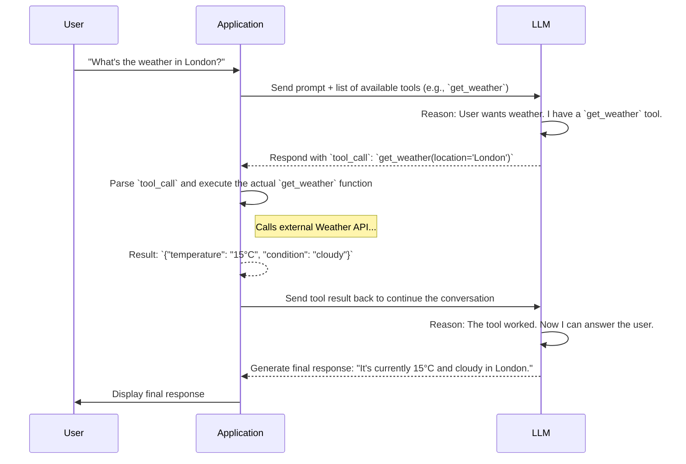

## Concept Introduction

**Tool Use** is the mechanism that allows a language model to interact with and affect the outside world through code. The modern implementation of this is often called **Function Calling**: the LLM acts as a reasoning engine that translates a user's natural language request into a structured, executable function call, which the application then runs and feeds back into the conversation.

When you ask a voice assistant "What's the weather in London?", it doesn't magically know the answer. It recognizes that you want weather data, calls an external API with "London" as a parameter, and formulates a response from the result. That three-step loop is function calling in its simplest form.

## Historical & Theoretical Context

The dream of controlling computers with natural language is as old as AI itself. Early attempts, like Natural Language Interfaces to Databases (NLIDB), tried to map human questions directly to SQL queries. These systems were powerful but brittle, often relying on complex, hand-crafted rules and grammars that were difficult to scale.

The game-changer was the development of Large Language Models that could be specifically fine-tuned to produce reliable, structured output. In 2023, OpenAI standardized this capability with its "Function Calling" feature. Instead of just hoping the model would format its output correctly, developers could now provide a strict schema for the functions they wanted the model to be able to call. The model, in turn, was trained to generate a JSON object matching this schema when it recognized a user's intent to use a tool. This shift from unstructured text parsing to structured data generation made tool use dramatically more reliable and robust.

## The Mechanics: A Two-Way Conversation

Function calling is not a single action but a multi-step loop between your application and the LLM.


```mermaid
sequenceDiagram
    participant User
    participant Application
    participant LLM

    User->>Application: "What's the weather in London?"
    Application->>LLM: Send prompt + list of available tools (e.g., `get_weather`)
    
    LLM->>LLM: Reason: User wants weather. I have a `get_weather` tool.
    LLM-->>Application: Respond with `tool_call`: `get_weather(location='London')`
    
    Application->>Application: Parse `tool_call` and execute the actual `get_weather` function
    Note right of Application: Calls external Weather API...
    Application-->>Application: Result: `{"temperature": "15°C", "condition": "cloudy"}`
    
    Application->>LLM: Send tool result back to continue the conversation
    LLM->>LLM: Reason: The tool worked. Now I can answer the user.
    LLM-->>Application: Generate final response: "It's currently 15°C and cloudy in London."
    
    Application->>User: Display final response
```

The key steps are:
1.  **Define Your Tools:** You declare your available functions to the LLM using a specific format, often JSON Schema. This includes the function's name, a clear description of what it does, and its parameters (name, type, description, required).
2.  **First API Call:** You send the user's prompt *and* the list of tool definitions to the LLM.
3.  **LLM Identifies a Tool:** The LLM analyzes the prompt. If it determines that one of the tools can help fulfill the user's request, it doesn't return a text message. Instead, it returns a `tool_calls` object specifying the function name and the arguments it inferred from the prompt.
4.  **Your Code Executes the Tool:** Your application receives this object. **Crucially, the LLM does not execute any code.** Your code is responsible for looking up the requested function (e.g., your `get_weather` Python function) and running it with the provided arguments.
5.  **Second API Call:** You call the LLM *again*, this time including the output from your function call. This "closes the loop," giving the LLM the information it requested.
6.  **LLM Generates the Final Answer:** Now equipped with the tool's output, the LLM synthesizes a final, user-facing response in natural language.

## Design Patterns & Architectures

- **The Engine of ReAct:** Function calling is the concrete implementation of the **Act** step in the ReAct (Reason + Act) cognitive loop. The LLM first "reasons" about what it needs to do (e.g., "I need to find the current weather"), and then it "acts" by generating the `tool_call` object.
- **Hierarchical Agents:** A "tool" doesn't have to be a simple function. It can be another, more specialized AI agent. A high-level "manager" agent given tools to call a "database agent" or a "creative writing agent" enables complex, hierarchical multi-agent systems.
- **Self-Correction:** If a tool call fails (e.g., an API is down or the arguments are wrong), the error message can be sent back to the LLM in step 5. A capable agent can then attempt to correct its mistake, perhaps by calling the function with different arguments or trying an alternative tool.

## Practical Application

Here’s a Python example using the `openai` library to illustrate the flow.

```python
import openai
import json

client = openai.OpenAI(api_key="YOUR_API_KEY")

# Define a dummy function and its schema
def get_current_weather(location, unit="celsius"):
    """Get the current weather in a given location."""
    weather_info = {
        "location": location,
        "temperature": "15",
        "unit": unit,
        "forecast": ["cloudy", "chance of rain"],
    }
    return json.dumps(weather_info)

tools = [
    {
        "type": "function",
        "function": {
            "name": "get_current_weather",
            "description": "Get the current weather in a given location",
            "parameters": {
                "type": "object",
                "properties": {
                    "location": {
                        "type": "string",
                        "description": "The city and state, e.g. San Francisco, CA",
                    },
                    "unit": {"type": "string", "enum": ["celsius", "fahrenheit"]},
                },
                "required": ["location"],
            },
        },
    }
]

# Initial call to the model
messages = [{"role": "user", "content": "What's the weather like in London?"}]
response = client.chat.completions.create(
    model="gpt-4-turbo",
    messages=messages,
    tools=tools,
    tool_choice="auto",
)

response_message = response.choices[0].message
tool_calls = response_message.tool_calls

# Check if the model wants to call a tool
if tool_calls:
    # 4. Execute the function
    available_functions = {"get_current_weather": get_current_weather}
    function_name = tool_calls[0].function.name
    function_to_call = available_functions[function_name]
    function_args = json.loads(tool_calls[0].function.arguments)
    
    function_response = function_to_call(
        location=function_args.get("location"),
        unit=function_args.get("unit"),
    )
    
    # 5. Send the result back to the model
    messages.append(response_message) # Add the assistant's tool request
    messages.append(
        {
            "tool_call_id": tool_calls[0].id,
            "role": "tool",
            "name": function_name,
            "content": function_response,
        }
    )
    
    second_response = client.chat.completions.create(
        model="gpt-4-turbo",
        messages=messages,
    )
    
    # 6. Get the final, user-facing response
    print(second_response.choices[0].message.content)
```

## Latest Developments & Research

- **Parallel Function Calling:** The newest models can request multiple, independent tool calls in a single turn. For example, if you ask, "What's the weather in London and Paris?", the model can issue two `get_weather` calls simultaneously. Your application can execute these in parallel and send both results back, reducing overall latency.
- **Autonomous Tool Onboarding:** A key research area is creating agents that can learn to use new tools by reading their API documentation, rather than requiring a developer to manually write the JSON schema. This would allow agents to dynamically expand their own capabilities.

## Cross-Disciplinary Insight

Function calling is deeply connected to the field of **Linguistics**, specifically **Speech Act Theory**. This theory posits that when we speak, we are not just uttering words (a "locutionary act") but performing actions: making requests, asking questions, issuing commands. The underlying purpose of an utterance is its "illocutionary act."

A function-calling LLM identifies the illocutionary act within a user's prompt. "What's the weather?" is not just a string of words. It is a request for information that maps to a concrete action: calling a weather service.

## Daily Challenge / Thought Exercise

Look at a common app on your phone, like a music streaming service or a food delivery app. Choose one core feature.
1.  Define it as a function that an AI agent could call. Give it a clear name (e.g., `play_song`, `order_food`).
2.  Write a one-sentence description for it.
3.  List the parameters it would need. What is their type (string, number, boolean)? Which ones are required?
This exercise of creating a tool definition is the first and most important step in building a tool-using agent.

## References & Further Reading

1.  **OpenAI API Documentation on Function Calling:** [https://platform.openai.com/docs/guides/function-calling](https://platform.openai.com/docs/guides/function-calling) (The official guide from the pioneers of the modern approach).
2.  **LangChain Documentation on Tools:** [https://python.langchain.com/docs/modules/tools/](https://python.langchain.com/docs/modules/tools/) (Shows how to create a standardized tool interface that can be used across many different models).
3.  **Google AI Blog on Tool Use:** [https://ai.google/discover/llms-tool-use/](https://ai.google/discover/llms-tool-use/) (Provides context on Google's approach with models like Gemini).
---
