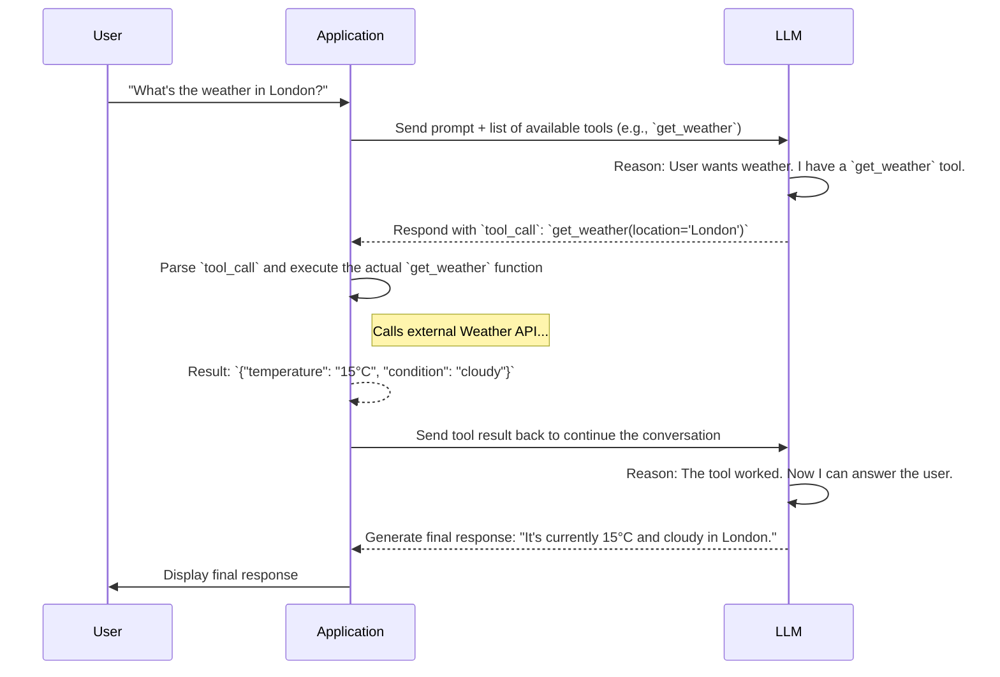

## Concept Introduction

**Tool Use** is the mechanism that allows a language model to interact with and affect the outside world through code. The modern implementation of this is often called **Function Calling**: the LLM acts as a reasoning engine that translates a user's natural language request into a structured, executable function call, which the application then runs and feeds back into the conversation.

When you ask a voice assistant "What's the weather in London?", it doesn't magically know the answer. It recognizes that you want weather data, calls an external API with "London" as a parameter, and formulates a response from the result. That three-step loop is function calling in its simplest form.

## The Mechanics: A Two-Way Conversation

Function calling is not a single action but a multi-step loop between your application and the LLM.


```mermaid
sequenceDiagram
    participant User
    participant Application
    participant LLM

    User->>Application: "What's the weather in London?"
    Application->>LLM: Send prompt + list of available tools (e.g., `get_weather`)
    
    LLM->>LLM: Reason: User wants weather. I have a `get_weather` tool.
    LLM-->>Application: Respond with `tool_call`: `get_weather(location='London')`
    
    Application->>Application: Parse `tool_call` and execute the actual `get_weather` function
    Note right of Application: Calls external Weather API...
    Application-->>Application: Result: `{"temperature": "15°C", "condition": "cloudy"}`
    
    Application->>LLM: Send tool result back to continue the conversation
    LLM->>LLM: Reason: The tool worked. Now I can answer the user.
    LLM-->>Application: Generate final response: "It's currently 15°C and cloudy in London."
    
    Application->>User: Display final response
```

The key steps are:
1.  **Define Your Tools:** You declare your available functions to the LLM using a specific format, often JSON Schema. This includes the function's name, a clear description of what it does, and its parameters (name, type, description, required).
2.  **First API Call:** You send the user's prompt *and* the list of tool definitions to the LLM.
3.  **LLM Identifies a Tool:** The LLM analyzes the prompt. If it determines that one of the tools can help fulfill the user's request, it doesn't return a text message. Instead, it returns a `tool_calls` object specifying the function name and the arguments it inferred from the prompt.
4.  **Your Code Executes the Tool:** Your application receives this object. **Crucially, the LLM does not execute any code.** Your code is responsible for looking up the requested function (e.g., your `get_weather` Python function) and running it with the provided arguments.
5.  **Second API Call:** You call the LLM *again*, this time including the output from your function call. This "closes the loop," giving the LLM the information it requested.
6.  **LLM Generates the Final Answer:** Now equipped with the tool's output, the LLM synthesizes a final, user-facing response in natural language.

## Design Patterns & Architectures

- **The Engine of ReAct:** Function calling is the concrete implementation of the **Act** step in the ReAct (Reason + Act) cognitive loop. The LLM first "reasons" about what it needs to do (e.g., "I need to find the current weather"), and then it "acts" by generating the `tool_call` object.
- **Hierarchical Agents:** A "tool" doesn't have to be a simple function. It can be another, more specialized AI agent. A high-level "manager" agent given tools to call a "database agent" or a "creative writing agent" enables complex, hierarchical multi-agent systems.
- **Self-Correction:** If a tool call fails (e.g., an API is down or the arguments are wrong), the error message can be sent back to the LLM in step 5. A capable agent can then attempt to correct its mistake, perhaps by calling the function with different arguments or trying an alternative tool.

## Practical Application

A minimal function-calling implementation centers on three moving parts: a tool schema registry (a list of JSON Schema objects describing each callable), a dispatch loop that inspects the model's response for `tool_use` content blocks, and the actual Python functions that get invoked and return results. The cleanest fit for a standalone demo is the raw Anthropic SDK — no orchestration layer needed — where `anthropic.Anthropic().messages.create()` accepts a `tools` list and returns either a final `text` block or a `tool_use` block naming the function and its arguments. The agent loop calls the model, checks `stop_reason == "tool_use"`, runs the matching local function, appends a `tool_result` message, and calls the model again until it produces a plain text reply. For production use, LangGraph wraps this same loop as a stateful graph with nodes for `call_model` and `call_tools`, making it straightforward to add retries, parallel tool calls, and conversation memory without rewriting the core dispatch logic.

**Try it**

```
Using the Anthropic Python SDK (anthropic package), build a minimal tool-calling agent loop.
Define two dummy tools — get_weather(city) and get_time(timezone) — with JSON Schema descriptors.
The agent should call client.messages.create with the tools list, detect tool_use stop_reason,
dispatch to the right Python function, append the tool_result, and loop until the model returns
a final text reply. Keep it under 60 lines with inline comments explaining each step.
```

## Latest Developments & Research

- **Parallel Function Calling:** The newest models can request multiple, independent tool calls in a single turn. For example, if you ask, "What's the weather in London and Paris?", the model can issue two `get_weather` calls simultaneously. Your application can execute these in parallel and send both results back, reducing overall latency.
- **Autonomous Tool Onboarding:** A key research area is creating agents that can learn to use new tools by reading their API documentation, rather than requiring a developer to manually write the JSON schema. This would allow agents to dynamically expand their own capabilities.

## Cross-Disciplinary Insight

Function calling is deeply connected to the field of **Linguistics**, specifically **Speech Act Theory**. This theory posits that when we speak, we are not just uttering words (a "locutionary act") but performing actions: making requests, asking questions, issuing commands. The underlying purpose of an utterance is its "illocutionary act."

A function-calling LLM identifies the illocutionary act within a user's prompt. "What's the weather?" is not just a string of words. It is a request for information that maps to a concrete action: calling a weather service.
