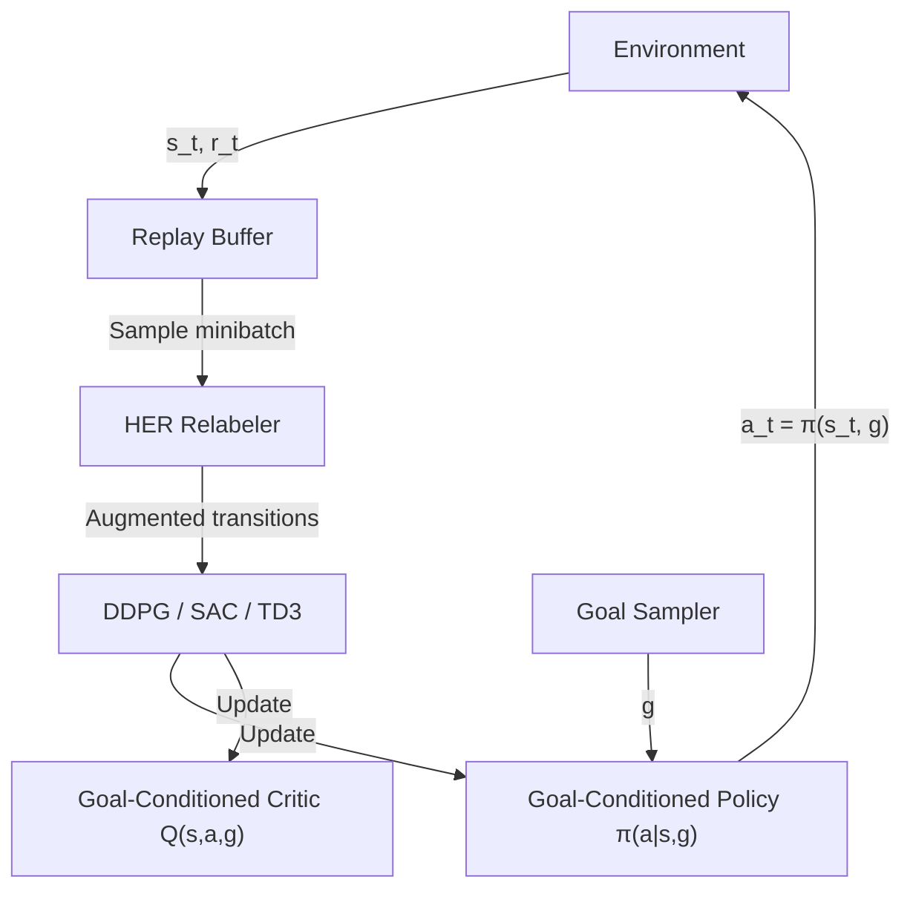

A robot arm swings, misses the cube, and the reward is zero. Again. And again. For thousands of episodes. This is the brutal reality of sparse-reward reinforcement learning: the agent almost never succeeds, so it almost never learns. Hindsight Experience Replay (HER) is one of the most elegant ideas in modern RL — instead of discarding failed trajectories, it asks: *what goal was the agent secretly achieving all along?*

## 1. Concept Introduction

### Simple Explanation

Imagine a toddler trying to stack a block on top of another. They miss, but the block lands somewhere. A smart parent doesn't just say "you failed." They say: "You successfully moved the block to *that* spot — now let's build on that."

HER applies the same logic to RL agents. When an agent fails to reach goal $g$, the trajectory is replayed with the *achieved* state substituted as the goal. The agent "learns that it could have succeeded — if that was the destination." Over millions of such relabelings, it builds rich intuition for goal-directed behavior.

### Technical Detail

Goal-conditioned RL augments the standard MDP with an explicit goal $g \in \mathcal{G}$. The policy becomes $\pi(a \mid s, g)$ and the reward becomes $r(s, a, g)$ — typically $0$ if the goal is not achieved and $-1$ otherwise (sparse), or a shaped version of goal proximity.

The value function becomes **goal-conditioned**:

$$Q^\pi(s, a, g) = \mathbb{E}_\pi \left[ \sum_{t=0}^{\infty} \gamma^t r(s_t, a_t, g) \mid s_0 = s, a_0 = a \right]$$

This is the **Universal Value Function Approximator (UVFA)** framework (Schaul et al., 2015): a single neural network takes $(s, g)$ as input and generalizes across goals.

HER's key contribution: during replay, replace $g$ with $g' = s_T$ (the final achieved state) and recompute the reward as $r(s_t, a_t, g')$. The transition is now a *success* for a different goal.

## 2. Historical & Theoretical Context

The foundations trace to two distinct ideas:

- **Dyna architecture (Sutton, 1991)**: agents can learn from simulated (replayed) experience, not just real interactions.
- **Universal Value Function Approximators (Schaul et al., 2015, DeepMind)**: a value function that generalizes over both states *and* goals.

HER itself was introduced by Andrychowicz et al. at OpenAI in 2017 ("Hindsight Experience Replay," NeurIPS 2017). It was motivated by robotic manipulation: tasks like moving objects to target positions produce near-zero reward almost always when using sparse signals, making standard deep RL methods like DDPG completely fail.

The central insight echoes psychology: humans learn from counterfactuals ("what if that had been my goal?"). This is sometimes called **retrospective goal assignment**.

## 3. Algorithms & Math

### The HER Algorithm

```
Algorithm: HER with DDPG
---
Initialize replay buffer B, actor π, critic Q

For each episode:
  Sample a goal g ~ G
  Observe initial state s₀
  For t = 0..T-1:
    Select action aₜ = π(sₜ, g) + noise
    Execute aₜ, observe sₜ₊₁, rₜ = r(sₜ, aₜ, g)
    Store (sₜ, aₜ, rₜ, sₜ₊₁, g) in B   ← standard replay

  # HER relabeling phase
  For each transition t in episode:
    Sample K future states: g' ∈ {s_{t+1}, ..., s_T}   ← "future" strategy
    For each g':
      r' = r(sₜ, aₜ, g')
      Store (sₜ, aₜ, r', sₜ₊₁, g') in B   ← hindsight replay

  Sample minibatch from B, update π and Q via DDPG
```

### Goal Relabeling Strategies

Different strategies for choosing $g'$:

- **Final**: use $s_T$ only — the state at episode end
- **Future** (best empirically): sample uniformly from states *after* $t$ in the same episode
- **Episode**: sample from anywhere in the episode
- **Random**: sample from random goals in the replay buffer

The reward relabeling is what makes this work. For binary goal achievement:

$$r(s, a, g) = \begin{cases} 0 & \text{if } \|f(s) - g\|_2 < \epsilon \\ -1 & \text{otherwise} \end{cases}$$

where $f(s)$ extracts goal-relevant features (e.g., object position).

### Why It Works: Sample Efficiency View

Without HER, nearly every transition in a sparse environment gives reward $-1$, providing no gradient signal about which actions are better. HER manufactures positive reward signal by recontextualizing. In expectation, with $K$ relabelings per transition, the effective dataset size grows by a factor of $K+1$.

## 4. Design Patterns & Architectures

Goal-conditioned RL integrates cleanly with several agent patterns:



**Planner-Executor Pattern**: a high-level planner proposes subgoals $g_1, g_2, \ldots$ and a goal-conditioned executor handles each. HER trains the executor; the planner can use model-based search or LLM reasoning.

**Hierarchical RL Connection**: HER pairs naturally with the Options Framework (covered separately). A manager sets goals; HER-trained subpolicies achieve them. This is the basis of **HIRO** (Hierarchical Reinforcement Learning with Off-Policy Correction, 2018).

## 5. Practical Application

Here's a self-contained HER implementation compatible with any `gymnasium`-style `GoalEnv`:

```python
import numpy as np
import random
from collections import deque

class HERBuffer:
    """Hindsight Experience Replay buffer with 'future' strategy."""

    def __init__(self, capacity: int = 100_000, k_goals: int = 4):
        self.buffer: deque = deque(maxlen=capacity)
        self.episode_buffer: list = []  # current episode transitions
        self.k = k_goals

    def store_step(self, state, action, reward, next_state, goal, done):
        self.episode_buffer.append((state, action, reward, next_state, goal))
        if done:
            self._flush_episode()

    def _flush_episode(self):
        episode = self.episode_buffer
        T = len(episode)

        for t, (s, a, r, s_next, g) in enumerate(episode):
            # Store original transition
            self.buffer.append((s, a, r, s_next, g))

            # HER: sample k future achieved goals as hindsight goals
            future_indices = random.sample(range(t, T), min(self.k, T - t))
            for idx in future_indices:
                g_prime = episode[idx][3]  # achieved state as new goal
                r_prime = self._compute_reward(s_next, g_prime)
                self.buffer.append((s, a, r_prime, s_next, g_prime))

        self.episode_buffer = []

    def _compute_reward(self, achieved_state, goal, threshold=0.05):
        """Binary sparse reward: 0 if goal reached, -1 otherwise."""
        dist = np.linalg.norm(achieved_state[:3] - goal[:3])
        return 0.0 if dist < threshold else -1.0

    def sample(self, batch_size: int):
        batch = random.sample(self.buffer, batch_size)
        states, actions, rewards, next_states, goals = zip(*batch)
        return (np.array(states), np.array(actions),
                np.array(rewards), np.array(next_states), np.array(goals))

    def __len__(self):
        return len(self.buffer)


# Integration sketch with a goal-conditioned policy
class GoalConditionedAgent:
    """Minimal DDPG-style agent using HER."""

    def __init__(self, state_dim, action_dim, goal_dim):
        self.her_buffer = HERBuffer(k_goals=4)
        # In practice: actor/critic are neural nets (e.g. PyTorch)
        self.state_dim = state_dim
        self.action_dim = action_dim
        self.goal_dim = goal_dim

    def select_action(self, state, goal, noise=0.1):
        # Concatenate state and goal as input to policy
        obs = np.concatenate([state, goal])
        # policy_output = self.actor(obs)  ← your neural net here
        action = np.random.randn(self.action_dim)  # placeholder
        return action + noise * np.random.randn(self.action_dim)

    def train_step(self, batch_size=256):
        if len(self.her_buffer) < batch_size:
            return
        states, actions, rewards, next_states, goals = \
            self.her_buffer.sample(batch_size)
        # Concatenate goals into observations for actor/critic update
        obs = np.concatenate([states, goals], axis=-1)
        next_obs = np.concatenate([next_states, goals], axis=-1)
        # ... standard DDPG/SAC update using obs, next_obs, actions, rewards
```

In LangGraph-style agentic settings, HER is useful for **subgoal reaching**: each node in the graph is a subgoal, and HER trains a low-level executor policy offline.

## 6. Comparisons & Tradeoffs

| Method | Sparse Reward? | Sample Efficiency | Flexibility | Use Case |
|---|---|---|---|---|
| **Vanilla DDPG/SAC** | Struggles | Low | High | Dense reward tasks |
| **HER** | Excellent | High | Medium | Goal-reaching, manipulation |
| **Reward shaping** | Moderate | Medium | Low | When domain knowledge exists |
| **Curriculum learning** | Good | Medium | High | Progressive difficulty tasks |
| **Model-based RL** | Good | Very high | Complex | Learned world model available |

**Strengths of HER:**
- Dramatic improvement in sparse-reward efficiency with virtually no extra computation
- No domain knowledge needed beyond a goal-achievement check
- Combines with any off-policy algorithm (DDPG, SAC, TD3)

**Limitations:**
- Requires a `GoalEnv` structure: observations must expose `achieved_goal` and `desired_goal`
- The future relabeling strategy assumes goals are states the agent can reach — not always true
- Goal space must be bounded and meaningful; random goals can introduce misleading signal
- Does not handle non-Markovian goals well (e.g., "visit A before B")

## 7. Latest Developments & Research

**GCSL (Goal-Conditioned Supervised Learning, 2021)**: Ghosh et al. reframe HER as a supervised learning problem — no value functions, just predict actions that lead to hindsight goals. Much simpler and surprisingly competitive.

**HIQL (Hierarchical Implicit Q-Learning, 2023)**: Combines HER-style relabeling with IQL (Implicit Q-Learning) in a hierarchical structure. State-of-the-art on offline goal-reaching benchmarks.

**LEXA (2021)**: Uses HER with a world model to imagine trajectories and relabel them without any environment interaction. Enables *zero-shot* goal reaching in new environments.

**Open Problems:**
- **Goal representation learning**: what makes a good goal space? Raw pixels? Learned embeddings?
- **Multi-modal goals**: goals specified as language, images, or demonstrations rather than states
- **Long-horizon goals**: HER struggles when many subgoals are needed in sequence
- **LLM + HER**: using language models to propose meaningful goals and evaluate achievement — active research area

## 8. Cross-Disciplinary Insight

HER mirrors a concept from **cognitive science** called **counterfactual thinking** — the human tendency to mentally simulate alternative outcomes ("if I had aimed slightly left..."). Psychologists find that near-misses activate learning more strongly than outright failures, because counterfactual alternatives are easier to construct.

In **control theory**, this is analogous to **set-point reconfiguration**: if the system can't reach target $g$, you analyze the trajectory toward an alternative attractor and use that to refine the controller.

In **economics**, HER echoes **regret minimization**: you replay decisions in light of what actually happened, then update your strategy. This is formalized in online learning as the **Follow-the-Regularized-Leader** (FTRL) algorithm — learn from what was achievable, not just what was aimed for.

## 9. Daily Challenge

**Exercise: Implement HER on FetchReach**

OpenAI Gymnasium includes `FetchReach-v3`, a robotic arm goal-reaching task with a perfect sparse reward and exposed `GoalEnv` interface.

1. Install: `pip install gymnasium[robotics]`
2. Run vanilla DDPG for 50 episodes and measure success rate
3. Add HER relabeling using the buffer above
4. Compare learning curves

Starter:

```python
import gymnasium as gym

env = gym.make("FetchReach-v3", render_mode=None)
obs, info = env.reset()

# obs contains:
print(obs["observation"].shape)       # robot state
print(obs["achieved_goal"].shape)     # where end-effector is now
print(obs["desired_goal"].shape)      # where we want it to go

# At each step:
action = env.action_space.sample()
obs, reward, terminated, truncated, info = env.step(action)
print(f"Reward: {reward}, Success: {info['is_success']}")
```

**Bonus**: implement the "final" strategy (only relabel with the last achieved state) and compare it to the "future" strategy. The difference is significant.

## 10. References & Further Reading

### Papers
- **"Hindsight Experience Replay"** — Andrychowicz et al., NeurIPS 2017. The original HER paper.
- **"Universal Value Function Approximators"** — Schaul et al., ICML 2015. The goal-conditioned value function framework.
- **"Learning to Reach Goals via Iterated Supervised Learning"** — Ghosh et al., ICLR 2021. GCSL — HER without RL.
- **"HIQL: Offline Goal-Conditioned RL with Latent States as Actions"** — Park et al., NeurIPS 2023.
- **"Discovering and Achieving Goals via World Models"** — Mendonca et al., NeurIPS 2021. LEXA.

### Tutorials & Code
- **Stable-Baselines3 HER**: https://stable-baselines3.readthedocs.io/en/master/modules/her.html — plug-and-play HER with SAC/DDPG/TD3
- **CleanRL HER implementation**: https://github.com/vwxyzjn/cleanrl — minimal, readable HER+DDPG
- **OpenAI Robotics environments**: https://robotics.farama.org/ — FetchReach, FetchPush, FetchSlide, HandManipulate

### Blog Posts
- **"Hindsight Experience Replay Explained"** (Lilian Weng, OpenAI blog): deep dive with visualizations
- **"Goal-Conditioned RL: A Survey"** (arXiv 2022): comprehensive overview of the field

---

## Key Takeaways

1. **Sparse rewards kill standard RL** — HER is the cleanest solution for goal-reaching tasks
2. **Relabel, don't discard** — every failed trajectory contains implicit success toward some goal
3. **Future strategy wins** — sampling hindsight goals from later in the episode outperforms other strategies
4. **UVFA is the foundation** — the goal-conditioned $Q(s, a, g)$ generalizes across the entire goal space
5. **HER + hierarchical RL** = a powerful combo for long-horizon agent planning
6. **LLM agents can benefit** — goal-conditioned subpolicies trained with HER can serve as reliable executors in hybrid LLM + RL systems

Every failure is data. HER just knows how to use it.
