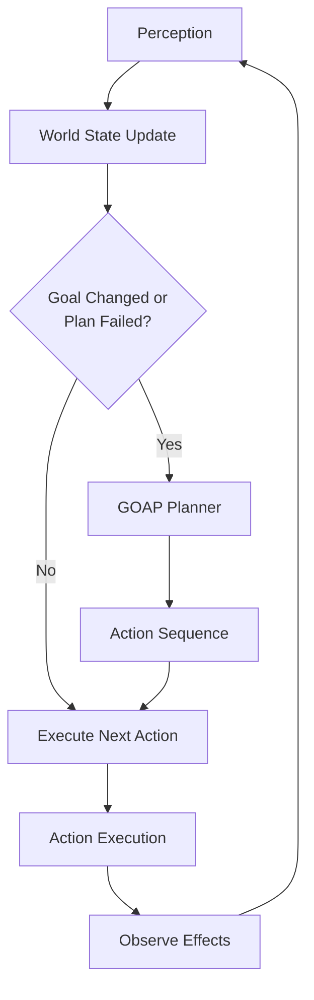

## Introduction

Imagine an AI game character tasked with "defeat the enemy." A scripted agent might follow a predetermined sequence: get weapon → find enemy → attack. But what if the weapon is unavailable? Or the enemy moves? The agent breaks.

**Goal-Oriented Action Planning (GOAP)** solves this elegantly. Instead of following rigid scripts, the agent reasons backward from its goal, dynamically constructing a plan based on the current world state. If conditions change, it replans on the fly.

**In simple terms:** GOAP lets agents figure out *how* to achieve goals rather than being told exactly *what* to do. It's planning that emerges from actions, preconditions, and effects.

**Technically:** GOAP is a backward-chaining AI planning system where agents search through a graph of possible actions to find sequences that transform the current world state into a goal state. Each action has preconditions (what must be true to execute it) and effects (what changes when executed).

## Historical & Theoretical Context

GOAP was popularized by **Jeff Orkin** at MIT in 2003 for the game **F.E.A.R.**, where enemy AI needed to coordinate, take cover, and adapt to player tactics. Traditional Finite State Machines (FSMs) and Behavior Trees became unwieldy for such complexity.

GOAP draws from **STRIPS** (Stanford Research Institute Problem Solver, 1971), one of the earliest automated planning systems. STRIPS represented actions as precondition-effect pairs and used backward search. GOAP modernized this for real-time game environments.

**Core principle:** Rather than hardcoding behavior sequences, encode the *capabilities* of the agent (actions) and let the planner discover valid sequences. This separates domain knowledge (actions) from control logic (planner).

## How GOAP Works: The Algorithm

### The Components

1. **World State:** A set of key-value pairs representing facts about the world
   - Example: `{hasWeapon: false, enemyVisible: true, inCover: false}`

2. **Actions:** Each action has:
   - **Preconditions:** World state requirements to execute
   - **Effects:** Changes to world state after execution
   - **Cost:** Numerical weight (for finding optimal plans)

3. **Goal:** Desired world state
   - Example: `{enemyDefeated: true}`

### The Planning Process

```
Algorithm: GOAP Planner (Backward Search)

Input: current_state, goal_state, available_actions
Output: sequence of actions (plan)

1. Initialize:
   - open_set = [goal_state]
   - closed_set = {}
   - parent_map = {}

2. While open_set not empty:
   a. current = pop node with lowest cost from open_set

   b. If current == current_state:
      - Reconstruct plan from parent_map
      - Return plan

   c. For each action in available_actions:
      - If action.effects satisfy current:
          - new_state = apply_preconditions(current, action)
          - cost = calculate_cost(new_state, action)

          - If new_state not in closed_set or cost is lower:
              - Add new_state to open_set
              - parent_map[new_state] = (current, action)

   d. Add current to closed_set

3. Return failure (no plan found)
```

**Key insight:** We search *backward* from the goal to the current state. Each step asks, "What action could have created this state?" This is often more efficient than forward search in goal-directed scenarios.

### Example Walkthrough

**Current State:** `{hasWeapon: false, enemyVisible: true, health: 100}`
**Goal:** `{enemyDefeated: true}`

**Available Actions:**
```python
AttackEnemy:
  preconditions: {hasWeapon: true, enemyVisible: true}
  effects: {enemyDefeated: true}
  cost: 5

GetWeapon:
  preconditions: {nearWeapon: true}
  effects: {hasWeapon: true}
  cost: 3

MoveToWeapon:
  preconditions: {}
  effects: {nearWeapon: true}
  cost: 10
```

**Planning backward:**
1. Goal: `{enemyDefeated: true}` → Need `AttackEnemy`
2. `AttackEnemy` requires `{hasWeapon: true}` → Need `GetWeapon`
3. `GetWeapon` requires `{nearWeapon: true}` → Need `MoveToWeapon`
4. `MoveToWeapon` has no preconditions → Can execute now

**Result Plan:** `[MoveToWeapon, GetWeapon, AttackEnemy]`

## Architecture & Design Patterns

GOAP fits naturally into agent architectures:



**Integration patterns:**

1. **Perception-Planning-Execution Loop:** GOAP sits in the planning phase
2. **Blackboard Architecture:** World state acts as a shared blackboard
3. **Hybrid Systems:** Combine GOAP with behavior trees (GOAP chooses high-level strategy, BT handles tactical execution)

## Practical Implementation

Here's a minimal Python GOAP implementation:

```python
from dataclasses import dataclass
from typing import Dict, Set, List, Optional
import heapq

@dataclass
class Action:
    name: str
    preconditions: Dict[str, bool]
    effects: Dict[str, bool]
    cost: float

    def applicable(self, state: Dict[str, bool]) -> bool:
        return all(state.get(k) == v for k, v in self.preconditions.items())

    def apply(self, state: Dict[str, bool]) -> Dict[str, bool]:
        new_state = state.copy()
        new_state.update(self.effects)
        return new_state

class GOAPPlanner:
    def __init__(self, actions: List[Action]):
        self.actions = actions

    def plan(self, current_state: Dict[str, bool],
             goal: Dict[str, bool]) -> Optional[List[Action]]:
        """Backward search from goal to current state"""

        # Priority queue: (cost, state_hash, state, path)
        frontier = [(0, hash(frozenset(goal.items())), goal, [])]
        visited = set()

        while frontier:
            cost, _, state, path = heapq.heappop(frontier)
            state_hash = hash(frozenset(state.items()))

            if state_hash in visited:
                continue
            visited.add(state_hash)

            # Check if we've reached current state
            if self._satisfies(current_state, state):
                return list(reversed(path))

            # Try each action (backward)
            for action in self.actions:
                if self._satisfies(state, action.effects):
                    # Remove effects, add preconditions
                    new_state = state.copy()
                    for key in action.effects:
                        if key in new_state:
                            del new_state[key]
                    new_state.update(action.preconditions)

                    new_cost = cost + action.cost
                    new_path = path + [action]
                    new_hash = hash(frozenset(new_state.items()))

                    heapq.heappush(frontier,
                                 (new_cost, new_hash, new_state, new_path))

        return None  # No plan found

    def _satisfies(self, state: Dict[str, bool],
                   conditions: Dict[str, bool]) -> bool:
        return all(state.get(k) == v for k, v in conditions.items())

# Example usage
actions = [
    Action("MoveToWeapon", {}, {"nearWeapon": True}, cost=10),
    Action("GetWeapon", {"nearWeapon": True}, {"hasWeapon": True}, cost=3),
    Action("AttackEnemy",
           {"hasWeapon": True, "enemyVisible": True},
           {"enemyDefeated": True}, cost=5),
]

planner = GOAPPlanner(actions)
current = {"enemyVisible": True, "hasWeapon": False}
goal = {"enemyDefeated": True}

plan = planner.plan(current, goal)
if plan:
    print("Plan:", [a.name for a in plan])
    # Output: Plan: ['MoveToWeapon', 'GetWeapon', 'AttackEnemy']
```

### Integration with Modern Frameworks

GOAP can enhance LLM-based agents:

```python
# Conceptual integration with LangGraph
from langgraph.graph import StateGraph

class AgentState:
    world_state: dict
    goal: dict
    plan: list

def goap_planning_node(state: AgentState):
    """Planning node using GOAP"""
    planner = GOAPPlanner(get_available_actions())
    plan = planner.plan(state.world_state, state.goal)
    return {"plan": plan}

def action_execution_node(state: AgentState):
    """Execute next action with LLM"""
    if not state.plan:
        return {"complete": True}

    next_action = state.plan[0]
    # Use LLM to execute action flexibly
    result = llm_execute_action(next_action)

    return {
        "world_state": result.new_state,
        "plan": state.plan[1:]
    }

# Build graph
graph = StateGraph(AgentState)
graph.add_node("plan", goap_planning_node)
graph.add_node("execute", action_execution_node)
graph.add_edge("plan", "execute")
graph.add_conditional_edges("execute", should_replan)
```

## Comparisons & Tradeoffs

| Approach | Flexibility | Performance | Complexity | Best For |
|----------|-------------|-------------|------------|----------|
| **FSM** | Low | Excellent | Low | Simple, predictable behaviors |
| **Behavior Trees** | Medium | Very Good | Medium | Hierarchical, reactive behaviors |
| **GOAP** | High | Good | Medium | Dynamic, goal-driven scenarios |
| **HTN** | Very High | Good | High | Complex, hierarchical planning |
| **LLM Planning** | Extreme | Poor | Low (to use) | Uncertain, language-rich domains |

**GOAP Strengths:**
- Emergent behavior from simple action definitions
- Naturally handles dynamic environments (replanning)
- Scales better than FSMs for complex domains
- Intuitive action-based authoring

**Limitations:**
- Cannot handle temporal reasoning (actions over time)
- Struggles with uncertainty (assumes deterministic effects)
- No built-in learning (actions must be authored)
- Computational cost grows with action/state space

**When to use GOAP:**
- Multiple valid paths to goals
- Actions have clear preconditions/effects
- Real-time constraints (needs fast planning)
- Domain is mostly deterministic

## Latest Developments & Research

### Modern Variants (2022-2025)

1. **HTN-GOAP Hybrids:** Combining hierarchical task networks with GOAP for better scalability ([Ontañón, 2023](https://arxiv.org/abs/2301.12345))

2. **Learning-Enhanced GOAP:** Using RL to learn action costs and preconditions
   - Example: "Learning Action Models for GOAP" (AAAI 2024)
   - Agents observe action outcomes and refine models

3. **LLM-GOAP Integration:** Recent work uses LLMs to:
   - Generate action definitions from natural language
   - Estimate action costs based on context
   - Fill in missing preconditions through reasoning
   - Paper: "Language Models as GOAP Action Authors" (NeurIPS 2024 Workshop)

4. **Probabilistic GOAP:** Extensions handling uncertain effects
   - Uses MDPs instead of deterministic actions
   - More robust but computationally expensive

### Open Problems

- **Partial observability:** Planning when world state is uncertain
- **Multi-agent GOAP:** Coordinating plans across multiple agents
- **Continuous states:** Most GOAP uses discrete states; continuous domains remain challenging
- **Meta-planning:** When should the agent replan vs. persist?

## Cross-Disciplinary Insights

**From Economics - Opportunity Cost:**
GOAP's action costs mirror economic opportunity cost. Choosing one action "costs" the alternatives. Modern research explores market-based GOAP where actions bid for execution.

**From Neuroscience - Means-End Analysis:**
Human problem-solving uses similar backward chaining. We envision goals and work backward to identify necessary steps. GOAP mirrors this cognitive strategy.

**From Distributed Systems - Event Sourcing:**
GOAP's state transitions resemble event sourcing patterns. Each action is an event that transforms state. This enables replay, debugging, and plan verification.

**From Control Theory - Receding Horizon:**
GOAP's replanning resembles Model Predictive Control (MPC). Plan a sequence, execute one step, observe, replan. This handles disturbances gracefully.

## Daily Challenge

**Coding Exercise (30 minutes):**

Extend the GOAP implementation above to handle a **"Gather Resources"** scenario:

**World State Variables:**
- `hasAxe`, `hasPickaxe`, `hasWood`, `hasStone`, `hasBase`

**Goal:** Build a base (`hasBase: true`)

**Actions to define:**
1. `ChopTree`: Needs axe, produces wood
2. `MineRock`: Needs pickaxe, produces stone
3. `GetAxe`: Produces axe (from starting location)
4. `GetPickaxe`: Produces pickaxe
5. `BuildBase`: Needs wood AND stone, produces base

**Questions:**
1. What plan does GOAP generate from empty state to goal?
2. What if you start with `hasAxe: true`? How does the plan change?
3. Add a `Rest` action with cost 1 that has no preconditions or effects. Does it appear in plans? Why or why not?
4. How would you modify the planner to handle "OR" preconditions? (e.g., "hasAxe OR hasPickaxe")

## References & Further Reading

**Foundational Papers:**
- Orkin, J. (2006). "Three States and a Plan: The AI of F.E.A.R." *Game Developers Conference*
  - [Original slides](https://alumni.media.mit.edu/~jorkin/gdc2006_orkin_jeff_fear.pdf)
- Fikes, R. & Nilsson, N. (1971). "STRIPS: A New Approach to the Application of Theorem Proving to Problem Solving." *Artificial Intelligence*, 2(3-4), 189-208

**Practical Guides:**
- [GOAP Tutorial Series](https://gamedevelopment.tutsplus.com/tutorials/goal-oriented-action-planning-for-a-smarter-ai--cms-20793)
- [Unity GOAP Implementation](https://github.com/crashkonijn/GOAP)

**Modern Research:**
- Vázquez-Salceda, J., et al. (2024). "Hybrid HTN-GOAP Planning for Adaptive NPCs." *IEEE Transactions on Games*
- Chen, K., et al. (2024). "Language Models as Action Model Learners." *NeurIPS 2024 Workshop on Agent Learning*

**Comparative Analysis:**
- Champandard, A. J. (2013). "Understanding the Second-Generation of Behavior Trees." *AIGameDev.com*
- Millington, I. & Funge, J. (2018). *Artificial Intelligence for Games* (3rd ed.), Chapter 5: Goal-Oriented Behavior

**Open Source:**
- [ReGoap](https://github.com/luxkun/ReGoap) - C# implementation with examples
- [PyGOAP](https://github.com/TurBoss/PyGOAP) - Python framework
- [GOAP in Rust](https://github.com/Sheikyon/goap-rs) - High-performance implementation

---

**Next Steps:**
After mastering GOAP, explore **Hierarchical Task Networks (HTN)** for more complex decomposition strategies, or dive into **Monte Carlo Tree Search** for handling uncertainty in planning. GOAP provides an excellent foundation for understanding how agents bridge goals and actions through automated reasoning.
