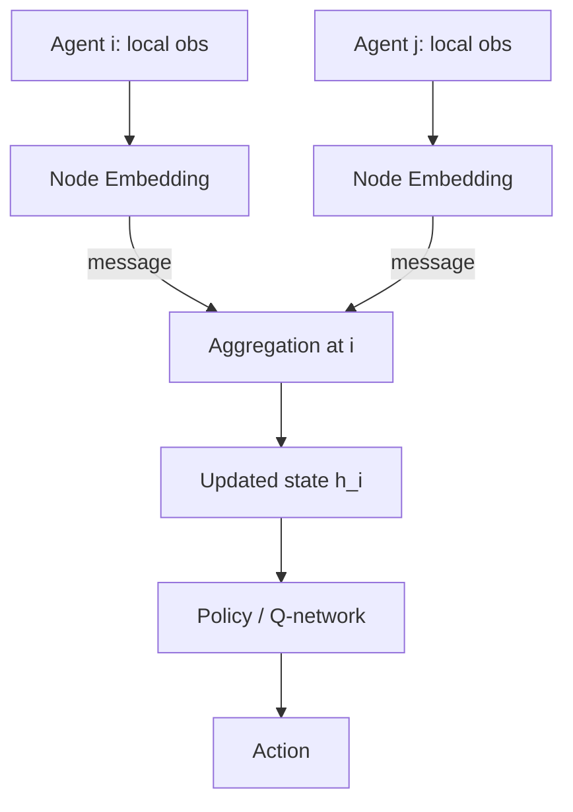

Multi-agent systems live or die on communication. But how do you design agents that can share information efficiently when you don't know in advance who needs to talk to whom? Graph Neural Networks (GNNs) offer a principled answer: treat agents as nodes, relationships as edges, and let the network learn what to pass along.

## Concept Introduction

A Graph Neural Network applied to multi-agent coordination lets each agent send small, learned **messages** to its neighbours. Each agent aggregates the messages it receives, updates its own state, and acts. Broadcasting everything to everyone is wasteful, and knowing who to talk to in advance is often impossible. GNNs resolve this by encoding the topology of communication as a graph, either fixed by proximity or dynamically learned.

Formally, a GNN operates on a graph $G = (V, E)$ where $V$ is the set of agents (nodes) and $E$ encodes their communication links (edges). At each message-passing step:

1. Each node $i$ computes a message to send to its neighbour $j$:

$$m_{ij}^{(t)} = \phi\left(h_i^{(t)}, h_j^{(t)}, e_{ij}\right)$$

2. Each node aggregates incoming messages (typically via sum or mean):

$$\tilde{m}_i^{(t)} = \text{AGG}\left(\{m_{ji}^{(t)} : j \in \mathcal{N}(i)\}\right)$$

3. Each node updates its hidden state:

$$h_i^{(t+1)} = \psi\left(h_i^{(t)}, \tilde{m}_i^{(t)}\right)$$

Here $\phi$ is the **message function**, $\psi$ is the **update function**, and $e_{ij}$ is an optional edge feature (distance, relationship type, etc.). After $K$ rounds of message passing, each agent's hidden state $h_i^{(K)}$ encodes local observations plus multi-hop context from the rest of the graph.

## Historical & Theoretical Context

Graph-structured learning has roots in spectral graph theory (Chebyshev polynomials on graphs, early 1990s), but the modern GNN formulation crystallised with Gori et al. (2005) and Scarselli et al. (2009). The message-passing framework was unified by Gilmer et al. in the **Message Passing Neural Network** (MPNN) paper at ICML 2017.

Application to multi-agent coordination emerged shortly after:

- **CommNet** (Sukhbaatar et al., 2016) was one of the first to apply continuous communication between agents in cooperative tasks, using a mean-field aggregation.
- **DIAL** (Differentiable Inter-Agent Learning, Foerster et al., 2016) back-propagated gradients through the communication channel, letting agents learn *what* to say.
- **Graph Attention Network (GAT)** (Veličković et al., 2018) introduced attention weights over neighbours, making communication selective.
- **MAAC / GMARL** (2019–2021) combined GATs with CTDE frameworks like QMIX and MAPPO, closing the loop between learned topology and joint action optimisation.

The key theoretical motivation: **permutation invariance**. An agent's policy should not change if you relabel other agents. GNNs satisfy this by design, since the aggregation is order-independent, making policies naturally invariant to agent indexing.

## Algorithms & Math

### Graph Attention for Agent Communication

Graph Attention Networks replace the uniform aggregation in CommNet with learned, normalised attention weights:

$$\alpha_{ij} = \frac{\exp\left(\text{LeakyReLU}\left(a^T [W h_i \| W h_j]\right)\right)}{\sum_{k \in \mathcal{N}(i)} \exp\left(\text{LeakyReLU}\left(a^T [W h_i \| W h_k]\right)\right)}$$

The updated hidden state for agent $i$ then becomes:

$$h_i' = \sigma\left(\sum_{j \in \mathcal{N}(i)} \alpha_{ij} W h_j\right)$$

This allows an agent to attend more strongly to close, relevant neighbours and tune out distant or less informative ones. The weighting is learned, not hand-coded.

### Pseudocode: GNN Communication Round

```
function GNN_COMMUNICATION(agents, obs, adj_matrix, K):
    # Initialise hidden states from local observations
    for each agent i:
        h[i] = ENCODER(obs[i])

    # K rounds of message passing
    for round = 1 to K:
        messages = {}
        for each edge (i, j) in adj_matrix:
            messages[i][j] = MESSAGE_FN(h[i], h[j])

        for each agent i:
            aggregated = AGGREGATE(messages[*][i])
            h[i] = UPDATE_FN(h[i], aggregated)

    # Decode to actions
    for each agent i:
        action[i] = POLICY_HEAD(h[i])

    return actions
```

## Design Patterns & Architectures

GNNs plug naturally into multi-agent frameworks in several ways:



**Common patterns:**

- **Fixed topology**: Edges defined by physical proximity ($d_{ij} < r$). Simple, interpretable, scales to large swarms. Used in flocking and traffic control.
- **Fully connected + attention**: Every agent can communicate with every other; attention learns sparsity. Expensive at $O(n^2)$ but flexible. Common in small-team cooperative tasks.
- **Learned dynamic graph**: A separate module predicts edge probabilities each step. Enables task-adaptive communication topology. Used in NRI (Neural Relational Inference, Kipf et al., 2018).
- **Hierarchical GNN**: Agents are grouped into teams; intra-team and inter-team GNN layers operate at different scales. Connects to feudal/hierarchical agent architectures.

## Practical Application

Here is a minimal GNN communication module using PyTorch Geometric, integrated with a shared MARL policy:

```python
import torch
import torch.nn as nn
from torch_geometric.nn import GATConv

class AgentGNNComm(nn.Module):
    """Graph attention communication module for cooperative agents."""

    def __init__(self, obs_dim: int, hidden_dim: int, heads: int = 4):
        super().__init__()
        self.encoder = nn.Linear(obs_dim, hidden_dim)
        self.gat1 = GATConv(hidden_dim, hidden_dim, heads=heads, concat=False)
        self.gat2 = GATConv(hidden_dim, hidden_dim, heads=heads, concat=False)
        self.policy = nn.Sequential(
            nn.Linear(hidden_dim, hidden_dim),
            nn.ReLU(),
            nn.Linear(hidden_dim, 5)  # 5 discrete actions
        )

    def forward(self, obs: torch.Tensor, edge_index: torch.Tensor):
        # obs: [num_agents, obs_dim]
        # edge_index: [2, num_edges] — COO format (source, target)
        h = torch.relu(self.encoder(obs))
        h = torch.relu(self.gat1(h, edge_index))
        h = torch.relu(self.gat2(h, edge_index))
        return self.policy(h)  # [num_agents, num_actions]


def build_proximity_graph(positions: torch.Tensor, radius: float):
    """Build communication graph based on agent proximity."""
    n = positions.shape[0]
    dists = torch.cdist(positions, positions)
    src, dst = torch.where((dists < radius) & (dists > 0))
    return torch.stack([src, dst])


# Example: 8 agents, each with 16-dim observation
obs = torch.randn(8, 16)
positions = torch.rand(8, 2) * 10.0
edge_index = build_proximity_graph(positions, radius=3.0)

model = AgentGNNComm(obs_dim=16, hidden_dim=64)
logits = model(obs, edge_index)  # [8, 5]
```

In a framework like **RLlib** or **MARLlib**, you can drop this module in as the actor/critic backbone. The `edge_index` is recomputed from environment state at each step, giving you dynamic topology for free.

## Latest Developments & Research

**DGN (Deep Graph Network for MARL, Jiang et al., ICLR 2020)** combined graph convolutional layers with multi-head dot-product attention for cooperative agents, achieving strong results on StarCraft II micromanagement. It showed that attention-based topology was critical when agent roles differed.

**NerveNet and EvolveGraph (2021–2022)** extended GNNs to morphology-aware control, where the agent *body* is a graph, useful for modular robots and articulated systems.

**QPLEX + GNN (2022)**: Integrating GNN communication into the duplex duelling factorisation of QPLEX improved sample efficiency in cooperative navigation tasks over QMIX baselines by 15–30%.

**GeMARL (Geometric Multi-Agent RL, 2023)** leveraged equivariant GNNs (using $E(n)$-equivariant networks like EGNN) to make policies invariant to rotation and reflection, which matters for physical robot teams.

**Open problems**: How many rounds of message passing are enough? Can agents learn *when not* to communicate (bandwidth-constrained settings)? How to handle adversarial edge injection (Byzantine agents sending misleading messages)?

## Cross-Disciplinary Insight

The GNN communication pattern mirrors how **biological neural circuits** propagate information. Local neurons receive signals from their synaptic neighbours, perform nonlinear integration, and fire. No single neuron has global access. The cerebellum, for example, processes sensorimotor coordination through a precisely structured graph of Purkinje cells and granule cells.

In **distributed computing**, this maps to the gossip protocol: nodes periodically exchange state with neighbours until the whole network converges to a consistent view. The key difference is that GNNs learn *what* to gossip about, rather than broadcasting raw state.

From an **economics** perspective, the learned attention weights $\alpha_{ij}$ resemble bilateral trade relationships: agents selectively "pay attention" to the information that gives them the highest marginal return.

## Daily Challenge

**Task: teach 4 agents to cover a 2D grid cooperatively using GNN communication.**

1. Define a simple environment: a $10 \times 10$ grid, 4 agents, 16 target cells. An agent "covers" a target by being on the same cell.
2. Build a proximity GNN (radius = 3 units). Each agent observes only its own position and the positions of visible targets.
3. Train with MAPPO (use the [MARLlib](https://github.com/Replicable-MARL/MARLlib) or manual REINFORCE).
4. Experiment: compare coverage rate with $K=0$ (no communication), $K=1$, and $K=2$ message-passing rounds.
5. **Thought question**: At what team size does fully connected attention become a bottleneck? What would you replace it with?

## References & Further Reading

### Papers
- **CommNet**: Sukhbaatar et al., "Learning Multiagent Communication with Backpropagation", NeurIPS 2016
- **DIAL**: Foerster et al., "Learning to Communicate with Deep Multi-Agent Reinforcement Learning", NeurIPS 2016
- **NRI**: Kipf et al., "Neural Relational Inference for Interacting Systems", ICML 2018
- **DGN**: Jiang et al., "Graph Convolutional Reinforcement Learning", ICLR 2020
- **GeMARL**: Spatial equivariance in cooperative MARL, arXiv 2023

### Frameworks & Code
- **PyTorch Geometric**: https://pytorch-geometric.readthedocs.io (standard GNN library)
- **MARLlib**: https://github.com/Replicable-MARL/MARLlib (multi-algorithm MARL library with GNN support)
- **EPyMARL**: https://github.com/uoe-agents/epymarl (extended PyMARL with communication baselines)
- **OpenAI Multi-Agent Particle Envs**: https://github.com/openai/multiagent-particle-envs (standard cooperative/competitive testbeds)

### Blog Posts
- "Graph Networks as a Universal Machine Learning Framework" (DeepMind blog, 2018)
- "How GNNs Are Changing Multi-Agent RL" (Towards Data Science, 2023)

---
