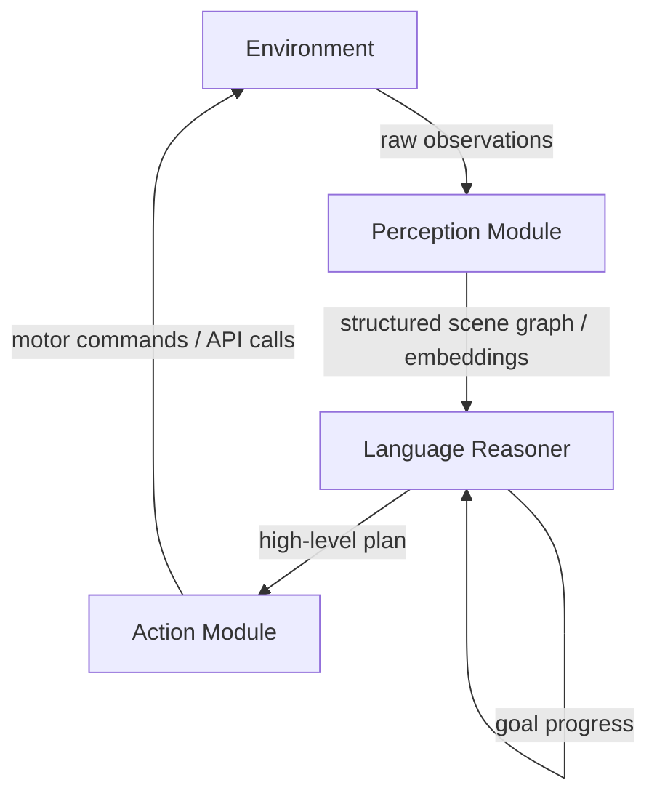

Telling a robot to "grab the red mug near the coffee machine" sounds trivially easy to a human. But for an AI agent, it requires solving one of the deepest problems in cognitive science: how do words connect to the real world? This article explores **grounded language agents** — systems that can reason in language *and* act meaningfully in physical or simulated environments.

## 1. Concept Introduction

### Simple Explanation

Imagine teaching someone a language entirely from a dictionary — no images, no real objects, only definitions of words in terms of other words. They might learn to use the language syntactically but would never truly *understand* what "red" or "hot" or "above" means. That's the situation language models are in.

**Grounding** means connecting symbols (words, tokens) to perceptual experiences and actions in the world. A grounded agent doesn't just predict text about picking up a mug — it actually perceives the mug, plans a trajectory, and executes the grip.

### Technical Detail

Grounded language agents combine several subsystems:

- **Perception module**: Processes images, video, point clouds, or sensor data into structured representations
- **Language module**: An LLM or VLM that reasons about goals, plans, and instructions
- **Action module**: Translates high-level plans into low-level motor commands or API calls
- **World model** (optional): An internal model of environment state used for lookahead planning

The key challenge is the **semantic gap** between language tokens and continuous sensorimotor signals. Bridging this gap efficiently — without requiring massive amounts of paired (language, action) data — is the central problem in embodied AI research.

## 2. Historical & Theoretical Context

The **symbol grounding problem** was formally articulated by Stevan Harnad in 1990. He argued that symbols in a formal system cannot be meaningful unless they are grounded in non-symbolic experience — perception and action. This posed a direct challenge to pure symbolic AI.

The field responded with several approaches over the decades:

- **Subsumption architecture** (Brooks, 1986): Reactive robots that act without symbolic reasoning, directly coupling sensors to actuators
- **Situated cognition** (Suchman, 1987): Intelligence emerges from environment interaction, not abstract planning
- **SHRDLU** (Winograd, 1972): An early program that connected language to manipulation of blocks in a simulated world — impressive but brittle

The modern resurgence came with two forces colliding: transformer-based LLMs that can reason fluently about tasks, and deep learning perception systems (ViT, CLIP) that can interpret rich visual scenes. Combining them unlocked a new generation of grounded agents.

## 3. Algorithms & Math

### Affordance-Conditioned Planning

The landmark **SayCan** paper (Ahn et al., Google, 2022) introduced a principled way to combine LLM reasoning with physical feasibility. Given a goal $g$ and current state $s$, the agent selects skill $a$ that maximizes:

$$\pi^*(a \mid s, g) \propto p_{\text{LLM}}(a \mid g) \cdot p_{\text{afford}}(a \mid s)$$

Where:
- $p_{\text{LLM}}(a \mid g)$ is the LLM's probability that skill $a$ is useful for goal $g$
- $p_{\text{afford}}(a \mid s)$ is a learned affordance function — the probability that $a$ is physically *executable* in state $s$

This elegantly separates what is **semantically sensible** (language model) from what is **physically possible** (affordance model). An LLM might suggest "fly to the kitchen" but the affordance model assigns that zero probability, keeping the agent grounded in reality.

### Vision-Language Action Models

**RT-2** (Brohan et al., Google DeepMind, 2023) takes a different approach: fine-tune a vision-language model end-to-end to output robot actions as tokens. Robot actions (joint angles, gripper positions) are discretized and treated like text tokens:

```
Input:  [image_tokens] + "Pick up the apple and put it in the bowl"
Output: "move_arm 0.23 -0.15 0.40 close_gripper"
```

This reframes robot control as a **language modeling problem**, allowing the model to leverage internet-scale pretraining. The key insight: the same attention mechanisms that learn relationships between words can learn relationships between visual features and motor commands.

### Pseudocode: SayCan-Style Planning Loop

```python
def saycan_plan(goal: str, environment: Environment, llm, affordance_model):
    plan = []
    state = environment.observe()

    while not goal_achieved(state, goal):
        # Get candidate skills from LLM
        candidates = llm.propose_skills(goal, plan, state)

        # Score each skill by affordance (physical feasibility)
        scores = []
        for skill in candidates:
            p_lang = llm.score_skill(skill, goal)
            p_afford = affordance_model.score(skill, state)
            scores.append((skill, p_lang * p_afford))

        # Execute highest-scoring feasible skill
        best_skill = max(scores, key=lambda x: x[1])[0]
        plan.append(best_skill)
        state = environment.execute(best_skill)

    return plan
```

## 4. Design Patterns & Architectures

### The Perception-Reasoning-Action Loop



### Key Patterns

**Scene Graph Grounding**: The perception module builds a structured graph of objects, their properties, and spatial relationships. This graph is serialized into language ("a red mug is to the left of the coffee machine") and fed to the LLM. This is far more token-efficient than raw image description.

**Hierarchical Grounding**: High-level instructions ("clean the kitchen") are decomposed by the LLM into grounded subgoals ("pick up the dish", "place it in the sink"), which are then executed by low-level controllers. This matches the planner-executor pattern but with physical grounding at each level.

**Affordance-Aware Memory**: The agent's memory includes not just facts but affordances — "the drawer is stuck and cannot be opened", "the robot arm cannot reach above shelf 3". This grounds future planning in physical experience.

## 5. Practical Application

Here's a minimal grounded agent that uses a vision-language model to answer questions about a scene and execute actions in a simulated environment:

```python
import anthropic
import base64
from pathlib import Path

client = anthropic.Anthropic()

def encode_image(path: str) -> str:
    with open(path, "rb") as f:
        return base64.b64encode(f.read()).decode()

def grounded_agent(goal: str, image_path: str, available_actions: list[str]) -> str:
    """
    A grounded agent that reasons about a visual scene and selects an action.
    """
    image_data = encode_image(image_path)
    actions_str = "\n".join(f"- {a}" for a in available_actions)

    response = client.messages.create(
        model="claude-sonnet-4-6",
        max_tokens=512,
        messages=[{
            "role": "user",
            "content": [
                {
                    "type": "image",
                    "source": {
                        "type": "base64",
                        "media_type": "image/jpeg",
                        "data": image_data
                    }
                },
                {
                    "type": "text",
                    "text": f"""You are a grounded robot agent.
Goal: {goal}

Available actions:
{actions_str}

Analyze the scene. Respond in this format:
OBSERVATION: [what you see]
REASONING: [why this action makes sense]
ACTION: [exactly one action from the list]"""
                }
            ]
        }]
    )

    return response.content[0].text

# Simulated environment execution
def execute_action(action: str, environment: dict) -> dict:
    """Apply action to environment state."""
    new_state = environment.copy()
    if action.startswith("pick_up"):
        obj = action.split("pick_up_")[1]
        new_state["holding"] = obj
        new_state["objects"].remove(obj)
    elif action.startswith("place"):
        new_state["objects"].append(new_state.pop("holding", None))
    return new_state

# Usage
available_actions = [
    "pick_up_red_mug",
    "pick_up_blue_cup",
    "move_to_sink",
    "move_to_table",
    "open_dishwasher",
    "wait"
]

result = grounded_agent(
    goal="Clean up the red mug",
    image_path="kitchen_scene.jpg",
    available_actions=available_actions
)
print(result)
```

In production systems (like those built on ROS 2 or Isaac Sim), the `execute_action` function would interface with real motor controllers or physics simulators.

## 6. Comparisons & Tradeoffs

| Approach | Grounding Method | Strengths | Weaknesses |
|---|---|---|---|
| **SayCan** | Separate affordance model | Modular, principled math | Requires skill library + affordance training |
| **RT-2** | End-to-end VLA training | Generalizes well, fewer modules | Huge compute, brittle to distribution shift |
| **Code-as-Actions** (ProgPrompt) | LLM writes Python for robot API | Flexible, interpretable | Requires robust code execution environment |
| **Scene graphs + LLM** | Symbolic scene representation | Efficient, debuggable | Loses fine-grained visual detail |
| **CLIP-based grounding** | Contrastive image-text embeddings | Zero-shot object identification | Limited to object identity, not affordances |

The fundamental tradeoff: **end-to-end** approaches generalize better but are opaque and data-hungry. **Modular** approaches are interpretable and data-efficient but require careful interface design between components.

## 7. Latest Developments & Research

**RT-2 and RT-X (2023)**: Google DeepMind trained a single robot policy across 22 different robot embodiments by pooling data — showing that language grounding helps transfer across physical platforms.

**SayPlan (2023)**: Extended SayCan to longer-horizon planning using 3D scene graphs. The LLM reasons over a compressed graph rather than raw images, enabling room-scale manipulation planning.

**Code as Policies (Liang et al., 2023)**: LLMs write Python code that calls a robot API — "grounding through code". The policy is interpretable and compositional. The agent can write loops, conditionals, and calls to perception APIs.

**OpenVLA (2024)**: An open-source 7B-parameter vision-language-action model, making RT-2-style models accessible to academic researchers without Google-scale compute.

**Embodied agents in simulation**: Platforms like AI2-THOR, Habitat 3.0, and Isaac Lab provide photo-realistic environments for training grounded agents before real-world deployment. The sim-to-real gap remains a key open problem.

**Open problems**: How do agents ground *abstract* language ("be careful", "hurry up") in physical behavior? How do they handle novel objects never seen in training? Robust failure detection — knowing *when* the affordance model is wrong — remains unsolved.

## 8. Cross-Disciplinary Insight

The symbol grounding problem maps directly onto debates in **cognitive linguistics** and **philosophy of mind**. Philosophers like John Searle (the Chinese Room argument) argued that syntactic symbol manipulation can never produce genuine understanding without grounding in experience.

Interestingly, the SayCan architecture mirrors how the **cerebellum** and **prefrontal cortex** collaborate in humans: the prefrontal cortex handles high-level goal reasoning (analogous to the LLM), while the cerebellum handles learned motor programs that encode what movements are feasible in context (analogous to the affordance model). Neither alone produces intelligent behavior — coordination between them does.

In **control theory**, this maps onto the classic separation of a **reference model** (what should happen) from a **plant model** (what can happen given physics). Grounded language agents are essentially building these models from data rather than from first principles.

## 9. Daily Challenge

**Build a Text-World Grounded Agent**

The `TextWorld` library (Microsoft) provides text-based games where an agent must navigate rooms and manipulate objects using language commands — a simplified grounding testbed without real-world complexity.

```python
# pip install textworld
import textworld
import textworld.gym

# Create a simple cooking game
options = textworld.GameOptions()
options.seeds = 42
game_file, _ = textworld.make("tw-cooking-recipe1+cut+go6", options)

env_id = textworld.gym.register_game(game_file, max_episode_steps=50)

import gym
env = gym.make(env_id)
obs, infos = env.reset()
print(obs)  # "You are in a kitchen. You see a knife and a tomato."

# Your challenge: build an agent that:
# 1. Parses the text observation into a structured state
# 2. Uses an LLM to propose an action
# 3. Executes it and observes the result
# 4. Repeats until the goal is achieved (or max steps)

# Hint: the affordance model here is implicit — invalid actions
# return "That's not something you can do" messages.
# Can you learn to avoid invalid actions without trying them?
```

**Bonus**: Add a memory module that tracks which actions failed and why, so the agent doesn't repeat mistakes.

## 10. References & Further Reading

### Foundational Papers
- **"Do As I Can, Not As I Say: Grounding Language in Robotic Affordances"** (Ahn et al., Google, 2022) — SayCan: [arxiv.org/abs/2204.01691](https://arxiv.org/abs/2204.01691)
- **"RT-2: Vision-Language-Action Models Transfer Web Knowledge to Robotic Control"** (Brohan et al., 2023): [arxiv.org/abs/2307.15818](https://arxiv.org/abs/2307.15818)
- **"Code as Policies: Language Model Programs for Embodied Control"** (Liang et al., 2023): [arxiv.org/abs/2209.07753](https://arxiv.org/abs/2209.07753)
- **"SayPlan: Grounding Large Language Models using 3D Scene Graphs"** (Rana et al., 2023): [arxiv.org/abs/2307.06135](https://arxiv.org/abs/2307.06135)

### Surveys & Background
- **"Symbol Grounding Problem"** (Harnad, 1990): The original framing of the problem
- **"A Survey of Embodied AI"** (Duan et al., 2022): Comprehensive overview of the field
- **"OpenVLA: An Open-Source Vision-Language-Action Model"** (Kim et al., 2024): [arxiv.org/abs/2406.09246](https://arxiv.org/abs/2406.09246)

### Simulators & Environments
- **AI2-THOR**: [ai2thor.allenai.org](https://ai2thor.allenai.org/) — Photo-realistic indoor environments
- **Habitat 3.0**: [aihabitat.org](https://aihabitat.org/) — Large-scale navigation and manipulation
- **TextWorld**: [github.com/microsoft/TextWorld](https://github.com/microsoft/TextWorld) — Text-based game environments for language grounding

### Frameworks
- **LeRobot** (Hugging Face): [github.com/huggingface/lerobot](https://github.com/huggingface/lerobot) — Open-source real-world robot learning
- **ROS 2**: [docs.ros.org](https://docs.ros.org/) — The standard middleware for robot software integration

---

## Key Takeaways

1. **Grounding is fundamental**: Language without physical grounding can reason but not truly act — an agent needs both
2. **Modular vs. end-to-end**: Separate affordance models are interpretable and data-efficient; end-to-end VLA models generalize better
3. **The SayCan insight**: Multiply LLM plausibility by physical feasibility — don't let language override physics
4. **Code as policies**: Writing executable code is itself a grounding strategy — the interpreter enforces physical constraints
5. **Simulation first**: Train in simulation, transfer to reality — but mind the sim-to-real gap
6. **Open problems remain**: Abstract language grounding, novel object generalization, and failure-aware affordance models are all active frontiers

Grounding is what separates a language model that *talks* about the world from an agent that *acts* in it. As embodied AI matures, the question isn't just "can the model reason?" but "can the agent *do*?"
