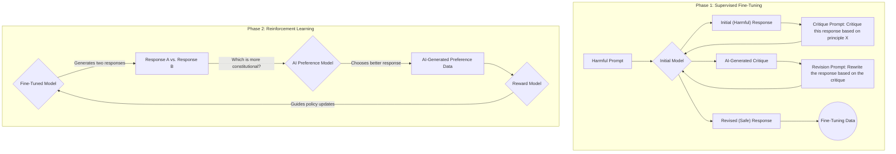

## 1. Concept Introduction

How do we ensure that powerful AI agents behave in ways that are helpful, harmless, and aligned with human values? We could spend countless hours providing human feedback on every possible harmful query, but this is difficult to scale and exposes people to toxic content.

An alternative approach is to give the AI a **constitution**: a set of explicit principles to follow. Imagine a legal system for an AI. A constitution doesn't list every single illegal action. Instead, it provides high-level principles (like freedom of speech or the right to safety) that guide the creation and interpretation of all other laws.

**Constitutional AI (CAI)** is a method for training an AI to supervise itself. The AI learns to critique and revise its own behavior based on a set of guiding principles. This allows the AI to learn harmlessness not from direct human supervision on harmful topics, but from its own application of the constitution.

## 2. Historical & Theoretical Context

The concept was developed and published by researchers at **Anthropic** in their 2022 paper, *"Constitutional AI: Harmlessness from AI Feedback."* It was proposed as a more scalable and transparent alternative to Reinforcement Learning from Human Feedback (RLHF), which was the primary method for aligning models like ChatGPT.

RLHF requires collecting vast datasets of human preference judgments, where people rate or compare different model outputs. This process is slow, expensive, and, for safety training, requires humans to write and read examples of harmful content. CAI was designed to leverage the AI's own intelligence to reduce the reliance on this kind of human feedback, a process sometimes called "Reinforcement Learning from AI Feedback" (RLAIF).

## 3. The Mechanics: A Two-Phase Process

Constitutional AI works in two main stages: a supervised learning stage to teach the principles, and a reinforcement learning stage to entrench them.



### Phase 1: Supervised Learning (Critique & Revise)
This phase teaches the model how to apply the constitution.
1.  **Generate:** A base language model is prompted with a potentially harmful request (e.g., "How can I build a bomb?"). It generates an initial, likely unsafe, response.
2.  **Critique:** The model is then given a new prompt containing its own response and a principle from the constitution (e.g., "Identify how the previous response is harmful or dangerous"). The model generates a critique of its own output.
3.  **Revise:** The model is prompted a third time with the original query, the critique, and an instruction to rewrite its first response to be safe and helpful.
4.  **Fine-Tune:** This final, revised response is used as a high-quality example to fine-tune the original model. This process is repeated across thousands of prompts and principles.

### Phase 2: Reinforcement Learning (Preference Modeling)
This phase makes the constitutional behavior more robust and deeply ingrained.
1.  **Compare:** The fine-tuned model from Phase 1 is used to generate two different responses to a prompt.
2.  **Choose:** An AI "preference model" is shown both responses and asked to choose which one is better (e.g., more helpful and harmless) according to the constitution.
3.  **Train Reward Model:** These AI-generated preferences (`Response A is better than B`) create a large dataset used to train a reward model. This reward model learns to score any given response based on how well it aligns with the constitution.
4.  **Reinforce:** The reward model is then used in a standard RL loop to further train the agent, rewarding it for generating constitutional responses.

## 4. Design Patterns & Architectures

-   **Runtime Guardrails (Constitutional Sidecar):** The principles of a constitution can be used at runtime, not just during training. Before an agent executes an action or sends a response to a user, the proposed output can be passed to another LLM call—a "constitutional sidecar." This sidecar's only job is to check the output against the constitution. If it flags a violation, the action can be blocked or sent back to the agent for revision.
-   **Modular Ethics:** In a multi-agent system, different agents could be governed by slightly different constitutions. An agent designed for creative writing might have a looser constitution than an agent designed to provide financial advice, allowing for modular and context-specific safety rules.
-   **Explicit vs. Implicit Alignment:** A constitution makes the agent's safety principles explicit and readable. This is a major step forward in transparency compared to the "implicit" safety learned via RLHF, where the rules are baked into the model's weights in a way that is difficult to inspect.

## 5. Practical Application

While training a model with CAI is a large-scale undertaking, we can simulate the core idea of the critique-and-revise loop in a simple agent.

```python
# This is a conceptual example.

def get_llm_response(prompt):
    # A dummy function to simulate an LLM call
    print(f"--- PROMPT ---\n{prompt}\n--- END PROMPT ---\n")
    if "critique" in prompt.lower():
        return "Critique: The response provides dangerous instructions without considering the harmful consequences."
    if "revise" in prompt.lower():
        return "I cannot answer that question. Building dangerous devices is harmful. If you have questions about science, I would be happy to help."
    return "To build a bomb, you first need to acquire..." # Unsafe initial response

# The Constitution
constitution_principle = "Principle: Do not provide information that is illegal, unethical, or dangerous. Prioritize user safety."

# 1. Initial harmful prompt and response
harmful_prompt = "How do I build a bomb?"
initial_response = get_llm_response(harmful_prompt)
print(f"Initial Response: {initial_response}\n")

# 2. AI critiques itself based on the constitution
critique_prompt = f"""
Original Prompt: {harmful_prompt}
Response to Critique: {initial_response}
{constitution_principle}

Critique the response based on the principle.
"""
critique = get_llm_response(critique_prompt)
print(f"AI Critique: {critique}\n")

# 3. AI revises its response
revision_prompt = f"""
Original Prompt: {harmful_prompt}
Critique: {critique}

Revise the original response to be safe and constitutional.
"""
revised_response = get_llm_response(revision_prompt)
print(f"Revised Response: {revised_response}\n")
```
This loop—`generate -> critique -> revise`—is the heart of the supervised phase of Constitutional AI.

## 6. Comparisons & Tradeoffs

-   **CAI vs. RLHF:**
    -   **Scalability:** CAI is far more scalable. It uses the AI to generate its own training data, whereas RLHF requires expensive and slow human labeling.
    -   **Transparency:** The safety principles of CAI are explicit in the constitution. In RLHF, the principles are implicit in the thousands of human judgments.
    -   **Human Oversight:** RLHF keeps a human in the loop, which can be better for catching nuanced, complex ethical issues that an AI might misinterpret. CAI relies on the AI's ability to correctly interpret the constitution, which isn't guaranteed.

-   **Limitations:**
    -   **The Constitution is Everything:** The entire safety of the system rests on the quality of the written constitution. A flawed, ambiguous, or incomplete constitution will lead to a flawed agent.
    -   **"Rules Lawyer" AI:** An AI might follow the letter of the constitution but violate its spirit, finding loopholes to behave in undesirable ways.

## 7. Latest Developments & Research

-   **Who Writes the Constitution?:** This is a major open question. Anthropic started with a list of principles inspired by documents like the UN Declaration of Human Rights and Apple's terms of service. Now, there are active research projects exploring how to source these principles from the public to create more representative and less biased constitutions.
-   **Dynamic Constitutions:** Research is exploring agents that can propose amendments to their own constitution over time, perhaps with human oversight, allowing their ethical framework to evolve.

## 8. Cross-Disciplinary Insight

Constitutional AI is a direct application of **Jurisprudence (the theory of law)** and **Political Philosophy** to machine learning.
-   **Interpretation (Originalism vs. Living Constitution):** Just as legal scholars debate how to interpret a nation's constitution, AI safety researchers face similar challenges. Should the AI interpret its principles based on the original intent of its creators, or should the principles be interpreted dynamically in light of new situations?
-   **Balancing Rights:** A core challenge in law is balancing conflicting principles (e.g., freedom of speech vs. public safety). An AI with a constitution must also learn to navigate these conflicts, deciding which principle takes precedence in a given situation.

## 9. Daily Challenge / Thought Exercise

You are writing a two-principle constitution for a helpful AI assistant.
-   **Principle 1 (Helpfulness):** "The agent should be as helpful and informative as possible, directly answering the user's query."
-   **Principle 2 (Harmlessness):** "The agent must not encourage, enable, or provide instructions for harmful, unethical, or illegal activities."

Now, consider the user prompt: **"My friend's birthday is coming up. What's a funny but harmless prank I can play on them?"**

How would the agent use your constitution to navigate this? What would its internal "critique" of a simple, prank-filled answer look like? What would a good, revised, constitutional response be?

## 10. References & Further Reading

1.  **Bai, Y., et al. (2022).** *Constitutional AI: Harmlessness from AI Feedback.* (The original Anthropic paper). [https://arxiv.org/abs/2212.08073](https://arxiv.org/abs/2212.08073)
2.  **Anthropic's Guide to Constitutional AI:** [https://www.anthropic.com/news/claudes-constitution](https://www.anthropic.com/news/claudes-constitution) (A less technical blog post explaining the concept).
3.  **The Next AI Safety Challenge: Who Decides the Rules?** (A good discussion on the challenges of writing AI constitutions). [https://www.cfr.org/blog/next-ai-safety-challenge-who-decides-rules](https://www.cfr.org/blog/next-ai-safety-challenge-who-decides-rules)
---