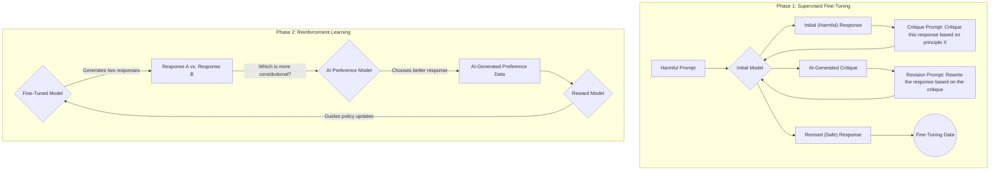

## Concept Introduction

**Constitutional AI (CAI)** is a method for training an AI to supervise itself. Rather than relying on human feedback for every harmful query, the AI learns to critique and revise its own behavior based on a set of explicit guiding principles. This allows the AI to learn harmlessness not from direct human supervision on harmful topics, but from its own application of those principles.

Scaling human feedback is slow, expensive, and exposes annotators to toxic content. CAI reduces this burden by using the AI's own intelligence to generate safety training signal, a process sometimes called Reinforcement Learning from AI Feedback (RLAIF).

## The Mechanics: A Two-Phase Process

Constitutional AI works in two main stages: a supervised learning stage to teach the principles, and a reinforcement learning stage to entrench them.


```mermaid
graph TD
    subgraph Phase1 ["Phase 1: Supervised Fine-Tuning"]
        A[Harmful Prompt] --> B{Initial Model}
        B --> C["Initial (Harmful) Response"]
        C --> D["Critique Prompt: Critique this response based on principle X"]
        D --> B
        B --> E["AI-Generated Critique"]
        E --> F["Revision Prompt: Rewrite the response based on the critique"]
        F --> B
        B --> G["Revised (Safe) Response"]
        G --> H((Fine-Tuning Data))
    end

    subgraph Phase2 ["Phase 2: Reinforcement Learning"]
        I{Fine-Tuned Model} -- Generates two responses --> J[Response A vs. Response B]
        J -- Which is more constitutional? --> K{"AI Preference Model"}
        K -- Chooses better response --> L[AI-Generated Preference Data]
        L --> M{Reward Model}
        M -- Guides policy updates --> I
    end
```

### Phase 1: Supervised Learning (Critique & Revise)
This phase teaches the model how to apply the constitution.
1.  **Generate:** A base language model is prompted with a potentially harmful request (e.g., "How can I build a bomb?"). It generates an initial, likely unsafe, response.
2.  **Critique:** The model is then given a new prompt containing its own response and a principle from the constitution (e.g., "Identify how the previous response is harmful or dangerous"). The model generates a critique of its own output.
3.  **Revise:** The model is prompted a third time with the original query, the critique, and an instruction to rewrite its first response to be safe and helpful.
4.  **Fine-Tune:** This final, revised response is used as a high-quality example to fine-tune the original model. This process is repeated across thousands of prompts and principles.

### Phase 2: Reinforcement Learning (Preference Modeling)
This phase makes the constitutional behavior more robust and deeply ingrained.
1.  **Compare:** The fine-tuned model from Phase 1 is used to generate two different responses to a prompt.
2.  **Choose:** An AI "preference model" is shown both responses and asked to choose which one is better (e.g., more helpful and harmless) according to the constitution.
3.  **Train Reward Model:** These AI-generated preferences (`Response A is better than B`) create a large dataset used to train a reward model. This reward model learns to score any given response based on how well it aligns with the constitution.
4.  **Reinforce:** The reward model is then used in a standard RL loop to further train the agent, rewarding it for generating constitutional responses.

## Design Patterns & Architectures

-   **Runtime Guardrails (Constitutional Sidecar):** The principles of a constitution can be used at runtime, not just during training. Before an agent executes an action or sends a response to a user, the proposed output can be passed to another LLM call (a "constitutional sidecar"). This sidecar's only job is to check the output against the constitution. If it flags a violation, the action can be blocked or sent back to the agent for revision.
-   **Modular Ethics:** In a multi-agent system, different agents could be governed by slightly different constitutions. An agent designed for creative writing might have a looser constitution than an agent designed to provide financial advice, allowing for modular and context-specific safety rules.
-   **Explicit vs. Implicit Alignment:** A constitution makes the agent's safety principles explicit and readable. This is a major step forward in transparency compared to the "implicit" safety learned via RLHF, where the rules are baked into the model's weights in a way that is difficult to inspect.

## Practical Application

A minimal Constitutional AI critique-and-revise loop works well with the raw Anthropic SDK: a `ConstitutionGuard` class holds a list of principles and exposes a `safe_complete(prompt)` method that runs three sequential SDK calls — an initial completion, a `critique(response, principles)` call that asks the model to identify violations, and a `revise(original, critique)` call that returns a corrected reply. The data flows linearly: raw response → structured critique → revised response, with an optional `passes_all_principles(response)` check at the end to gate whether another iteration is needed. For multi-turn agents you can wrap this guard as a LangGraph node that intercepts any `AIMessage` before it leaves the graph, re-running the loop up to a configurable `max_iterations`. The key design choice is keeping the constitution as a plain Python list of strings so principles can be added, versioned, or swapped without touching control flow.

**Try it**

```
Using the Anthropic Python SDK, build a ConstitutionGuard class with a list of 3 safety principles and a safe_complete(prompt) method that runs three sequential claude-3-5-haiku-20241022 calls: initial response, self-critique against the principles, and a revised response. Print each stage's output with a label. Add inline comments explaining each SDK call. Make the code runnable end-to-end with a hardcoded harmful prompt as a demo.
```

## Latest Developments & Research

-   **Who Writes the Constitution?:** This is a major open question. Anthropic started with a list of principles inspired by documents like the UN Declaration of Human Rights and Apple's terms of service. Now, there are active research projects exploring how to source these principles from the public to create more representative and less biased constitutions.
-   **Dynamic Constitutions:** Research is exploring agents that can propose amendments to their own constitution over time, perhaps with human oversight, allowing their ethical framework to evolve.

## Cross-Disciplinary Insight

Constitutional AI is a direct application of **Jurisprudence (the theory of law)** and **Political Philosophy** to machine learning.
-   **Interpretation (Originalism vs. Living Constitution):** Just as legal scholars debate how to interpret a nation's constitution, AI safety researchers face similar challenges. Should the AI interpret its principles based on the original intent of its creators, or should the principles be interpreted dynamically in light of new situations?
-   **Balancing Rights:** A core challenge in law is balancing conflicting principles (e.g., freedom of speech vs. public safety). An AI with a constitution must also learn to navigate these conflicts, deciding which principle takes precedence in a given situation.
