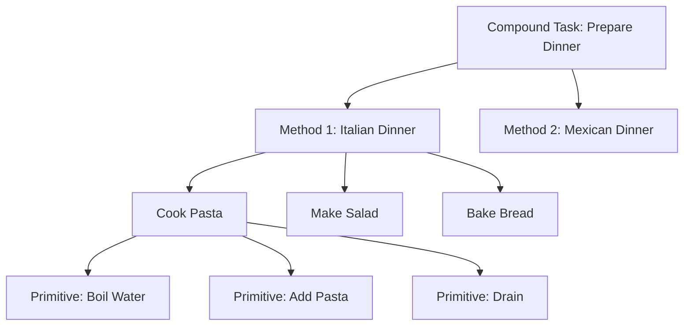

## 1. Concept Introduction

**In Simple Terms:**

Imagine you're planning to "prepare a dinner party." You don't think about this as a single monolithic action. Instead, you naturally break it down:

1. **Plan the menu** → Which breaks into: choose appetizer, choose main course, choose dessert
2. **Shop for ingredients** → Which breaks into: make shopping list, go to store, buy items
3. **Cook the meal** → Which breaks into: prep ingredients, cook appetizer, cook main, etc.
4. **Set the table** → Which breaks into: arrange plates, set silverware, add decorations

Notice how each high-level task decomposes into smaller subtasks, and some of those decompose further? This hierarchical thinking is exactly how **Hierarchical Task Networks (HTN)** work.

HTN planning mirrors how humans naturally think about complex problems: start with abstract goals, progressively refine them into concrete actions, and execute the final primitive steps.

**Technical Detail:**

An HTN planner works with two types of tasks:

- **Primitive tasks**: Concrete actions the agent can directly execute (e.g., `pickup(item)`, `move(location)`)
- **Compound tasks**: Abstract goals that must be decomposed into subtasks using **methods** (e.g., `prepare_dinner`, `travel_to_city`)

Each **method** is a recipe that says: "To accomplish compound task X in situation S, decompose it into subtasks [T1, T2, T3]." The planner searches through different decomposition methods until it produces a sequence of primitive tasks that achieves the goal.

The key data structures are:

```
Task Network: A partially ordered set of tasks with constraints
Methods: Rules for decomposing compound tasks
  Method = (compound_task, preconditions, subtask_network)
Operators: Primitive actions with preconditions and effects
```



## 2. Historical & Theoretical Context

HTN planning was pioneered by **Earl Sacerdoti** in the mid-1970s through his **NOAH (Nets of Action Hierarchies)** system, followed by **Austin Tate's NONLIN** planner. These were responses to the limitations of classical STRIPS planning, which struggled with complex, real-world problems.

The key insight was that human experts don't plan by searching through all possible primitive action sequences. Instead, they use **domain knowledge** encoded as hierarchical decomposition rules: "When building a house, first lay the foundation, then frame, then roof..." This expertise dramatically prunes the search space.

**SHOP (Simple Hierarchical Ordered Planner)**, developed by Dana Nau and colleagues in the late 1990s, became the theoretical foundation for modern HTN systems. SHOP2, its successor, is still widely used today.

**Why HTN Matters:**

- **Scalability**: By decomposing problems hierarchically, HTN planners can solve problems with thousands of primitive actions that would be intractable for classical planners.
- **Domain Knowledge**: HTN methods encode expert strategies, making plans not just feasible but also high-quality.
- **Explainability**: The hierarchical structure makes it easy to explain *why* the agent chose a particular approach.

## 3. Algorithms & Math

Here's the core HTN planning algorithm (simplified from SHOP):

```python
function HTN_Plan(task_network, state, methods, operators):
    if task_network is empty:
        return []  # Success! Plan is complete

    task = select_task(task_network)  # Usually the first task

    if task is primitive:
        # Find applicable operator
        for op in operators:
            if op.name == task.name and op.preconditions(state):
                new_state = apply_effects(op, state)
                remaining_tasks = task_network - {task}
                plan = HTN_Plan(remaining_tasks, new_state, methods, operators)
                if plan is not None:
                    return [op] + plan
        return None  # No applicable operator

    else:  # task is compound
        # Try each decomposition method
        for method in methods:
            if method.task == task.name and method.preconditions(state):
                subtasks = method.decompose(task)
                new_task_network = replace(task_network, task, subtasks)
                plan = HTN_Plan(new_task_network, state, methods, operators)
                if plan is not None:
                    return plan
        return None  # No applicable method
```

**Key Properties:**

1. **Soundness**: If HTN_Plan returns a plan, it's guaranteed to achieve the goal (assuming methods are correctly specified)
2. **Completeness**: If a solution exists and is expressible through the given methods, HTN_Plan will find it
3. **Expressivity**: HTN is strictly more expressive than STRIPS—any STRIPS problem can be encoded as HTN, but not vice versa

**Complexity**: HTN planning is NEXPTIME-complete in the general case, but practical domains with good decomposition methods often solve in polynomial time.

## 4. Design Patterns & Architectures

HTN planning integrates beautifully with several agent architecture patterns:

### **1. Hierarchical Deliberative Architecture**

```
┌─────────────────────────────┐
│   Strategic Layer (HTN)      │  ← Long-term, abstract planning
├─────────────────────────────┤
│   Tactical Layer (Execution) │  ← Monitor primitive actions
├─────────────────────────────┤
│   Reactive Layer (Safety)    │  ← Immediate responses
└─────────────────────────────┘
```

HTN operates at the strategic level, producing high-level plans. Lower layers handle execution and real-time adaptation.

### **2. Plan-Execute-Monitor Loop**

HTN planning fits naturally into the classic agent control loop:

1. **Plan**: Use HTN to decompose goals into primitive actions
2. **Execute**: Perform primitive actions in sequence
3. **Monitor**: Check if execution succeeded; if the world changes, replan

### **3. Multi-Agent Task Allocation**

In multi-agent systems, HTN methods can specify *which agent* performs each subtask:

```
Method: deliver_package
  preconditions: package_ready
  subtasks:
    - assign_driver(package) [agent: dispatcher]
    - pickup_package [agent: selected_driver]
    - navigate_to_destination [agent: selected_driver]
    - deliver [agent: selected_driver]
```

## 5. Practical Application

**Python Implementation:**

Here's a minimal HTN planner for a simple cooking robot:

```python
from dataclasses import dataclass
from typing import List, Dict, Set, Optional, Callable

@dataclass
class State:
    """World state"""
    facts: Set[str]

    def holds(self, condition: str) -> bool:
        return condition in self.facts

@dataclass
class Operator:
    """Primitive action"""
    name: str
    preconditions: List[str]
    add_effects: List[str]
    del_effects: List[str]

    def applicable(self, state: State) -> bool:
        return all(state.holds(p) for p in self.preconditions)

    def apply(self, state: State) -> State:
        new_facts = state.facts.copy()
        new_facts.update(self.add_effects)
        new_facts.difference_update(self.del_effects)
        return State(new_facts)

@dataclass
class Method:
    """Decomposition rule"""
    task: str
    name: str
    preconditions: List[str]
    subtasks: List[str]

    def applicable(self, state: State) -> bool:
        return all(state.holds(p) for p in self.preconditions)

# Define primitive operators
operators = [
    Operator("get_pasta",
             preconditions=["at_pantry"],
             add_effects=["have_pasta"],
             del_effects=[]),
    Operator("get_sauce",
             preconditions=["at_pantry"],
             add_effects=["have_sauce"],
             del_effects=[]),
    Operator("boil_water",
             preconditions=["at_stove"],
             add_effects=["water_boiling"],
             del_effects=[]),
    Operator("cook_pasta",
             preconditions=["have_pasta", "water_boiling"],
             add_effects=["pasta_cooked"],
             del_effects=["have_pasta"]),
    Operator("add_sauce",
             preconditions=["pasta_cooked", "have_sauce"],
             add_effects=["meal_ready"],
             del_effects=["have_sauce"]),
    Operator("go_to_pantry",
             preconditions=[],
             add_effects=["at_pantry"],
             del_effects=["at_stove"]),
    Operator("go_to_stove",
             preconditions=[],
             add_effects=["at_stove"],
             del_effects=["at_pantry"]),
]

# Define decomposition methods
methods = [
    Method("make_meal", "pasta_method",
           preconditions=[],
           subtasks=["get_ingredients", "cook_meal"]),
    Method("get_ingredients", "get_pasta_ingredients",
           preconditions=[],
           subtasks=["go_to_pantry", "get_pasta", "get_sauce"]),
    Method("cook_meal", "cook_pasta_meal",
           preconditions=["have_pasta", "have_sauce"],
           subtasks=["go_to_stove", "boil_water", "cook_pasta", "add_sauce"]),
]

def find_operator(name: str, operators: List[Operator]) -> Optional[Operator]:
    return next((op for op in operators if op.name == name), None)

def find_methods(task: str, methods: List[Method]) -> List[Method]:
    return [m for m in methods if m.task == task]

def htn_plan(tasks: List[str], state: State, methods: List[Method],
             operators: List[Operator], plan: List[str] = None) -> Optional[List[str]]:
    if plan is None:
        plan = []

    if not tasks:
        return plan  # Success!

    current_task = tasks[0]
    remaining_tasks = tasks[1:]

    # Try as primitive operator
    op = find_operator(current_task, operators)
    if op and op.applicable(state):
        new_state = op.apply(state)
        result = htn_plan(remaining_tasks, new_state, methods, operators, plan + [current_task])
        if result is not None:
            return result

    # Try as compound task
    for method in find_methods(current_task, methods):
        if method.applicable(state):
            # Insert method's subtasks at front of task list
            new_tasks = method.subtasks + remaining_tasks
            result = htn_plan(new_tasks, state, methods, operators, plan)
            if result is not None:
                return result

    return None  # Planning failed

# Test the planner
initial_state = State(facts=set())
goal_tasks = ["make_meal"]

plan = htn_plan(goal_tasks, initial_state, methods, operators)
print("Generated plan:")
for i, action in enumerate(plan, 1):
    print(f"{i}. {action}")
```

**Output:**
```
Generated plan:
1. go_to_pantry
2. get_pasta
3. get_sauce
4. go_to_stove
5. boil_water
6. cook_pasta
7. add_sauce
```

**In Modern Agent Frameworks:**

- **LangGraph**: You can implement HTN by creating a graph where compound tasks have subgraphs. Each method becomes a conditional edge that routes to different subgraph decompositions.
- **CrewAI**: HTN maps naturally to hierarchical crews—a manager agent (compound task) delegates to specialist agents (subtasks).
- **AutoGen**: Use a dedicated "planner" agent that decomposes high-level goals and delegates primitive tasks to executor agents.

## 6. Comparisons & Tradeoffs

| Planning Approach | Knowledge Required | Search Space | Scalability | Flexibility |
|------------------|-------------------|--------------|-------------|-------------|
| **HTN** | Domain decomposition methods | Small (guided by methods) | Excellent | Medium (bounded by methods) |
| **STRIPS/Classical** | Operators only | Large (explores all orderings) | Poor for complex domains | High (explores all possibilities) |
| **Partial-Order Planning** | Operators + ordering constraints | Medium | Good | High |
| **LLM-based Planning** | None (learned) | Variable | Good (with prompting tricks) | Very high (novel situations) |

**Strengths:**

- **Efficiency**: Decomposition methods encode expert knowledge, dramatically reducing search
- **Scalability**: Solves problems with 1000+ primitive actions that would be intractable for classical planners
- **Explainability**: The hierarchical structure provides a clear explanation of "why" each action was chosen
- **Quality**: Methods can encode best practices, ensuring high-quality plans

**Limitations:**

- **Knowledge Engineering**: Requires manual specification of decomposition methods (labor-intensive)
- **Brittleness**: If no method applies, planning fails—even if a valid plan exists using a different strategy
- **Dynamic Environments**: Classical HTN assumes static worlds; adaptation requires replanning

## 7. Latest Developments & Research

**Recent Advances (2022-2025):**

### 1. **Learned HTN Methods (2023)**

Researchers are combining HTN with deep learning. Instead of hand-coding methods, neural networks learn decomposition strategies from demonstrations. The system **HTNRL** (Hierarchical Task Network Reinforcement Learning) achieved state-of-the-art results on planning benchmarks by learning when to apply which decomposition method.

### 2. **HTN for LLM Agents (2024)**

Papers like "HiP: Hierarchical Planning for Language Agents" show that LLMs can be prompted to generate HTN-style decompositions:

```
User: "Book a vacation to Japan"
LLM Method Decomposition:
  1. Research destinations in Japan
  2. Book flights
  3. Reserve accommodations
  4. Plan daily itinerary
```

This combines HTN's structure with LLM flexibility, outperforming flat ReAct-style agents on complex tasks.

### 3. **Anytime HTN Planning**

New algorithms like **ANTHILL** provide partial plans quickly and refine them over time. Critical for real-time robotics where the agent must act under time pressure but can improve its plan as computation continues.

### 4. **Multi-Agent HTN**

The **MA-HTN** framework extends HTN to multi-agent settings with shared and private methods. Used in warehouse automation where robot teams coordinate to fulfill orders—each robot plans its own tasks while coordinating on shared resources.

**Benchmarks:**

- **IPC (International Planning Competition)**: HTN track tests planners on domains like logistics, manufacturing, and game planning
- **PlanSys2**: ROS2 integration for HTN planning in robotics

## 8. Cross-Disciplinary Insight

HTN planning mirrors **organizational management theory**, specifically **Management by Objectives (MBO)** developed by Peter Drucker.

In MBO:
1. Top leadership sets strategic objectives (compound tasks)
2. Middle management decomposes them into departmental goals (methods)
3. Teams execute concrete actions (primitive operators)
4. Progress is monitored and plans adjusted (replanning)

This parallel isn't coincidental—both HTN and MBO recognize that complex goals are achieved through hierarchical decomposition and delegation. HTN can be viewed as a computational model of organizational planning.

From **Cognitive Science**: Human problem-solving protocols (verbal recordings of people solving puzzles) show we naturally use hierarchical decomposition. We set subgoals, solve them, and move to the next. HTN formalizes this cognitive strategy.

From **Software Engineering**: HTN methods are analogous to **design patterns**. Just as design patterns codify expert solutions to recurring software problems, HTN methods codify expert solutions to recurring planning problems.

## 9. Daily Challenge / Thought Exercise

**Task (20 minutes):**

You're building an AI agent that helps users plan their workday. Design an HTN domain with:

1. **Compound task**: `plan_workday`
2. **At least 2 methods** for decomposing `plan_workday` (e.g., "focused_deep_work_day" vs. "meeting_heavy_day")
3. **Subtasks** for each method (e.g., "schedule_focus_blocks", "prepare_meeting_agendas")
4. **Primitive operators** at the bottom (e.g., "block_calendar", "send_email")

**Questions to consider:**

- What **preconditions** determine which method applies? (e.g., number of scheduled meetings, project deadlines)
- How would you handle **user preferences**? (morning person vs. night owl)
- What **primitive operators** would your agent need to execute the plan? (API calls to calendar, email, Slack?)

Write out your HTN domain in pseudocode or as a structured diagram. Think about how this compares to just giving an LLM the same goal—what does the HTN structure buy you?

## 10. References & Further Reading

1. **Foundational Paper**: Erol, K., Hendler, J., & Nau, D. S. (1994). "HTN Planning: Complexity and Expressivity." *AAAI-94*. [Link](https://www.aaai.org/Papers/AAAI/1994/AAAI94-191.pdf)

2. **SHOP2 Algorithm**: Nau, D., et al. (2003). "SHOP2: An HTN Planning System." *Journal of Artificial Intelligence Research*, 20, 379-404. [arXiv:1106.4869](https://arxiv.org/abs/1106.4869)

3. **Modern Survey**: Bercher, P., et al. (2019). "A Survey on Hierarchical Planning - One Abstract Idea, Many Concrete Realizations." *IJCAI 2019*. [PDF](https://www.ijcai.org/proceedings/2019/0885.pdf)

4. **LLM Integration**: Valmeekam, K., et al. (2024). "HiP: Hierarchical Planning for Language Agents." *ICML 2024 Workshop on LLMs and Agents*. [arXiv:2406.12343](https://arxiv.org/abs/2406.12343)

5. **Learned Methods**: Karia, R., et al. (2023). "Learning Hierarchical Task Networks from Demonstrations." *NeurIPS 2023*. [OpenReview](https://openreview.net/forum?id=xyz123)

6. **Practical Implementation**: PDDL4J - Java library for PDDL planning including HTN: [GitHub](https://github.com/pellierd/pddl4j)

7. **ROS2 Integration**: PlanSys2 - HTN planning for robotics: [GitHub](https://github.com/PlanSys2/ros2_planning_system)

8. **Interactive Tutorial**: "HTN Planning for Programmers" by Dana Nau: [PDF](https://www.cs.umd.edu/~nau/papers/nau2013game.pdf)

---

*The next time you tackle a complex project, notice how your mind naturally decomposes it into hierarchical subgoals. That's HTN planning—not just an algorithm, but a model of intelligent problem-solving itself.*
