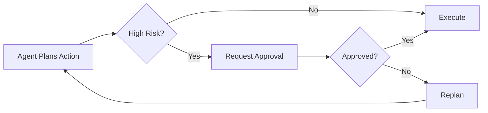

## 1. Concept Introduction

### Simple Terms
Imagine you have a highly capable assistant who can handle most tasks independently, but knows when to ask for your input on important decisions. Human-in-the-loop (HITL) agents work the same way—they're AI systems designed to collaborate with humans by requesting guidance at critical junctures, rather than operating entirely on autopilot.

### Technical Detail
Human-in-the-loop (HITL) is an architectural pattern where autonomous agents strategically interrupt their execution flow to solicit human input, validation, or decision-making. Unlike fully autonomous systems, HITL agents implement **intervention points**—predetermined or dynamically determined moments where human judgment augments or overrides the agent's proposed actions. This creates a spectrum from full automation to complete human control, with the optimal balance determined by risk tolerance, domain complexity, and trust calibration.

## 2. Historical & Theoretical Context

### Origin
The HITL concept emerged from **active learning** research in the 1990s, where machine learning systems would query humans to label uncertain data points. The term gained prominence in autonomous systems research around 2010, particularly in **semi-autonomous robotics** and **medical diagnosis systems** where high-stakes decisions required human validation.

### Theoretical Foundation
HITL bridges two classic paradigms:
- **Direct manipulation** (human does everything)
- **Delegation** (system does everything)

The principle draws from **supervisory control theory** (Sheridan, 1992), which defines levels of automation from fully manual to fully autonomous. HITL operationalizes the middle ground, implementing what cognitive science calls **shared control**—distributing cognitive work between human and machine based on comparative advantage.

## 3. Algorithms & Implementation Patterns

### Core Decision Flow

```
function agent_execute(task, confidence_threshold=0.85):
    plan = generate_plan(task)

    for step in plan:
        action, confidence = decide_action(step)

        # Intervention checkpoint
        if requires_human_input(action, confidence, confidence_threshold):
            human_decision = request_human_approval(
                action=action,
                context=step.context,
                reasoning=action.explanation,
                alternatives=generate_alternatives(step)
            )

            if human_decision.override:
                action = human_decision.chosen_action
                update_preferences(step, human_decision)  # Learn from feedback

        execute(action)
        observe_result()

    return final_result

function requires_human_input(action, confidence, threshold):
    # Multiple criteria for intervention
    return (
        confidence < threshold or
        action.risk_level == "HIGH" or
        action.irreversible == True or
        action.cost > budget_limit or
        action.domain in ["legal", "medical", "financial"]
    )
```

### Intervention Trigger Strategies

1. **Confidence-based**: Request input when model uncertainty exceeds threshold
2. **Risk-based**: Escalate high-stakes or irreversible actions
3. **Novelty-based**: Flag situations outside training distribution
4. **Time-based**: Periodic checkpoints for long-running tasks
5. **Semantic-based**: Domain-specific rules (e.g., all financial transactions >$10k)

## 4. Design Patterns & Architectures

### Pattern 1: Approval Gates
The agent proposes an action and waits for explicit human approval before execution.



### Pattern 2: Exception Handling
The agent operates autonomously but escalates to humans when encountering failures or edge cases.

### Pattern 3: Active Learning
The agent identifies knowledge gaps and queries humans to improve its model.

### Pattern 4: Bounded Autonomy
The agent operates freely within predefined constraints, requiring approval only when boundaries are exceeded.

## 5. Practical Application

### Example: Customer Support Agent with HITL

```python
from typing import Optional, Dict
from enum import Enum

class EscalationReason(Enum):
    LOW_CONFIDENCE = "low_confidence"
    HIGH_VALUE = "high_value_customer"
    SENTIMENT = "negative_sentiment"
    POLICY_EXCEPTION = "policy_exception"

class HITLSupportAgent:
    def __init__(self, confidence_threshold=0.8):
        self.confidence_threshold = confidence_threshold
        self.escalation_queue = []

    async def handle_ticket(self, ticket: Dict) -> Dict:
        """Process customer support ticket with HITL intervention"""

        # Step 1: Classify intent
        intent, confidence = await self.classify_intent(ticket['message'])

        # Step 2: Check for escalation triggers
        escalation_reason = self._should_escalate(
            ticket=ticket,
            intent=intent,
            confidence=confidence
        )

        if escalation_reason:
            return await self._escalate_to_human(
                ticket=ticket,
                reason=escalation_reason,
                suggested_response=self._generate_draft_response(intent)
            )

        # Step 3: Autonomous resolution
        response = await self._generate_response(intent, ticket)
        await self._send_response(ticket['id'], response)

        return {"status": "auto_resolved", "response": response}

    def _should_escalate(self, ticket, intent, confidence) -> Optional[EscalationReason]:
        """Multi-criteria escalation logic"""

        # Confidence-based
        if confidence < self.confidence_threshold:
            return EscalationReason.LOW_CONFIDENCE

        # Customer value-based
        if ticket['customer_tier'] == "enterprise":
            return EscalationReason.HIGH_VALUE

        # Sentiment-based
        sentiment_score = self._analyze_sentiment(ticket['message'])
        if sentiment_score < -0.5:  # Negative sentiment
            return EscalationReason.SENTIMENT

        # Policy-based
        if "refund" in intent and ticket['amount'] > 1000:
            return EscalationReason.POLICY_EXCEPTION

        return None

    async def _escalate_to_human(self, ticket, reason, suggested_response):
        """Create human review task with context"""

        escalation = {
            "ticket_id": ticket['id'],
            "reason": reason.value,
            "customer_context": self._gather_customer_history(ticket['customer_id']),
            "suggested_response": suggested_response,
            "alternatives": self._generate_alternatives(ticket),
            "timestamp": datetime.now()
        }

        # Send to human review queue
        self.escalation_queue.append(escalation)

        # Notify human agent
        await self._notify_human_agent(escalation)

        return {"status": "escalated", "reason": reason.value}

    async def process_human_feedback(self, escalation_id, human_decision):
        """Learn from human decisions to improve future performance"""

        escalation = self._get_escalation(escalation_id)

        # Log decision for training
        self._log_training_example(
            input=escalation['ticket'],
            agent_suggestion=escalation['suggested_response'],
            human_choice=human_decision['chosen_response'],
            feedback=human_decision.get('explanation')
        )

        # Update confidence calibration
        self._update_confidence_model(escalation, human_decision)

        # Execute approved action
        await self._send_response(
            escalation['ticket_id'],
            human_decision['chosen_response']
        )
```

### Using HITL in LangGraph

```python
from langgraph.graph import StateGraph, END
from langgraph.checkpoint import MemorySaver

def create_hitl_workflow():
    workflow = StateGraph()

    # Define nodes
    workflow.add_node("analyze", analyze_request)
    workflow.add_node("plan", generate_plan)
    workflow.add_node("human_review", request_human_approval)  # HITL node
    workflow.add_node("execute", execute_plan)

    # Define edges with conditional routing
    workflow.add_edge("analyze", "plan")
    workflow.add_conditional_edges(
        "plan",
        should_request_approval,  # Decision function
        {
            "human_review": "human_review",
            "execute": "execute"
        }
    )
    workflow.add_edge("human_review", "execute")
    workflow.add_edge("execute", END)

    # Enable persistence for human review wait states
    memory = MemorySaver()
    app = workflow.compile(checkpointer=memory, interrupt_before=["human_review"])

    return app

def should_request_approval(state):
    """Route to human review if action is high-risk"""
    if state['risk_score'] > 0.7 or state['confidence'] < 0.8:
        return "human_review"
    return "execute"
```

## 6. Comparisons & Tradeoffs

### HITL vs. Full Automation

| Aspect | HITL | Full Automation |
|--------|------|-----------------|
| **Speed** | Slower (human latency) | Fast (immediate execution) |
| **Accuracy** | Higher (human oversight) | Variable (model-dependent) |
| **Scalability** | Limited by human bandwidth | Unlimited |
| **Cost** | Higher (human time) | Lower (compute only) |
| **Trust** | Higher (human validation) | Requires extensive testing |
| **Learning** | Rich feedback signal | Limited to outcomes |

### Limitations
- **Attention decay**: Humans become complacent monitoring mostly-correct systems (automation bias)
- **Context switching cost**: Interruptions disrupt human productivity
- **Bottleneck risk**: Human review can become the limiting factor
- **Inconsistency**: Different humans may make different decisions
- **Scalability ceiling**: Doesn't scale beyond human capacity

### When to Use HITL
✅ **Use HITL when:**
- Mistakes have high consequences (medical, legal, financial)
- Operating in novel/uncertain domains
- Regulatory requirements mandate human oversight
- Building trust in new AI capabilities
- Gathering training data for future automation

❌ **Avoid HITL when:**
- Decisions are time-critical (millisecond response times)
- Volume exceeds human capacity
- Actions are easily reversible/low-risk
- System has proven high reliability

## 7. Latest Developments & Research

### Recent Advances (2023-2025)

**1. Adaptive Automation** (Microsoft Research, 2024)
- Systems that learn optimal intervention points from usage patterns
- Dynamically adjust autonomy levels based on user expertise and context
- Reduced human interruptions by 40% while maintaining safety

**2. Explanation-Driven HITL** (Stanford HAI, 2023)
- Providing counterfactual explanations at intervention points
- Users shown "what would happen if you choose option X"
- Improved decision quality and reduced approval time

**3. Multi-Human HITL Systems** (MIT CSAIL, 2024)
- Routing different intervention types to specialized humans
- Auction-based task allocation for human attention
- Collective decision-making for high-stakes choices

**4. Predictive Escalation** (Google DeepMind, 2023)
- ML models that predict when human input will be needed
- Proactive notification to reduce wait times
- Learned from 2M+ human-AI interactions

### Open Research Questions
- How to prevent automation bias while maintaining efficiency?
- Optimal interrupt timing to minimize context switching costs?
- How to aggregate disagreeing human feedback?
- Can agents learn when to stop asking for help?

## 8. Cross-Disciplinary Insights

### From Aviation: Levels of Automation
The aviation industry's **10 levels of automation** (Parasuraman et al., 2000) directly inform HITL design:
- **Level 1**: Computer offers no assistance
- **Level 5**: Computer suggests alternatives and narrows selection
- **Level 7**: Computer executes automatically, then informs humans
- **Level 10**: Computer decides everything, ignores humans

HITL agents typically operate at levels 5-7, where humans retain veto power.

### From Manufacturing: Andon Cord
Toyota's **andon cord** system—where any worker can stop the production line—inspired the exception-based HITL pattern. The agent "pulls the cord" when detecting anomalies, escalating to human expertise.

### From Economics: Principal-Agent Problem
HITL addresses the classic **principal-agent dilemma**: How does a principal (human) ensure an agent (AI) acts in their interest? Intervention points serve as **monitoring mechanisms** that reduce information asymmetry.

### From Neuroscience: Dual-Process Theory
Human cognition operates through System 1 (fast, intuitive) and System 2 (slow, deliberate). HITL architectures mirror this: AI handles System 1 tasks (pattern matching, quick decisions) while escalating System 2 needs (complex reasoning, ethical judgment) to humans.

## 9. Daily Challenge: Build Your Own HITL Agent

**Task**: Create a code review agent that autonomously reviews pull requests but escalates complex decisions to humans.

**Requirements** (30-minute exercise):

```python
class CodeReviewAgent:
    """
    Implement HITL for automated code review

    The agent should:
    1. Automatically flag obvious issues (syntax errors, formatting)
    2. Escalate to human review when:
       - Security-sensitive code is changed
       - Test coverage drops below threshold
       - Complexity metrics exceed limits
       - Breaking API changes detected
    3. Learn from human decisions to improve escalation logic
    """

    def review_pr(self, pr_diff: str, files_changed: list) -> dict:
        # Your implementation here
        pass

    def should_escalate(self, analysis: dict) -> bool:
        # Define your escalation criteria
        pass

# Test cases
# 1. Simple formatting fix -> auto-approve
# 2. New authentication code -> escalate
# 3. Performance optimization with tests -> auto-approve
# 4. Breaking API change -> escalate
```

**Bonus Challenge**: Implement a feedback mechanism where the agent learns which types of changes you typically approve/reject, adjusting its confidence threshold over time.

## 10. References & Further Reading

### Foundational Papers
- Parasuraman, R., Sheridan, T. B., & Wickens, C. D. (2000). "A model for types and levels of human interaction with automation." *IEEE Transactions on Systems, Man, and Cybernetics*.
- Amershi, S., et al. (2019). "Guidelines for Human-AI Interaction." *CHI Conference on Human Factors in Computing Systems*.

### Recent Research
- Wu, T., et al. (2024). "Adaptive Intervention in Human-AI Collaborative Systems." *NeurIPS 2024*.
- Bansal, G., et al. (2023). "Does the Whole Exceed its Parts? The Effect of AI Explanations on Complementary Team Performance." *CHI 2023*.
- Zhang, Y., et al. (2023). "When to Ask for Help: Proactive Interventions in Human-AI Collaboration." *ICML 2023*.

### Practical Resources
- **LangGraph HITL Tutorial**: https://langchain-ai.github.io/langgraph/how-tos/human-in-the-loop/
- **AutoGen Human Input**: https://microsoft.github.io/autogen/docs/tutorial/human-in-the-loop
- **Gradient Descent: HITL ML**: https://gradientdescent.substack.com/p/human-in-the-loop-machine-learning

### Industry Examples
- **GitHub Copilot**: Suggests code but requires developer acceptance
- **Grammarly**: Proposes edits; user decides which to apply
- **Tesla Autopilot**: Autonomous with required human supervision
- **IBM Watson for Oncology**: Recommends treatments; doctors decide

### Open-Source Frameworks
- **Label Studio**: HITL data annotation platform
- **Streamlit**: Build interactive HITL interfaces rapidly
- **Prodigy**: Active learning annotation tool with HITL workflows

---

## Key Takeaways

1. **HITL is a spectrum**, not binary—design for the right level of human involvement
2. **Intervention points are strategic**—too many overwhelm humans, too few risk errors
3. **Learn from feedback**—human decisions are valuable training signals
4. **Design for trust**—transparency at intervention points builds user confidence
5. **Balance automation bias**—keep humans engaged but not overloaded

Human-in-the-loop agents represent the pragmatic middle path between full automation and manual operation. As AI capabilities grow, the art lies not in maximizing autonomy, but in finding the optimal collaboration point where human judgment and machine scale create more value together than either could alone.
