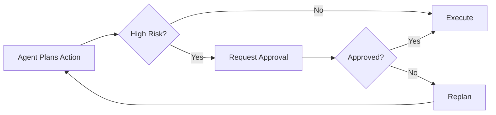

## Concept Introduction

Human-in-the-loop (HITL) is an architectural pattern where autonomous agents strategically interrupt their execution flow to solicit human input, validation, or decision-making. HITL agents implement **intervention points**: predetermined or dynamically determined moments where human judgment augments or overrides the agent's proposed actions. This creates a spectrum from full automation to complete human control, with the optimal balance determined by risk tolerance, domain complexity, and trust calibration.

## Algorithms & Implementation Patterns

### Core Decision Flow

```
function agent_execute(task, confidence_threshold=0.85):
    plan = generate_plan(task)

    for step in plan:
        action, confidence = decide_action(step)

        # Intervention checkpoint
        if requires_human_input(action, confidence, confidence_threshold):
            human_decision = request_human_approval(
                action=action,
                context=step.context,
                reasoning=action.explanation,
                alternatives=generate_alternatives(step)
            )

            if human_decision.override:
                action = human_decision.chosen_action
                update_preferences(step, human_decision)  # Learn from feedback

        execute(action)
        observe_result()

    return final_result

function requires_human_input(action, confidence, threshold):
    # Multiple criteria for intervention
    return (
        confidence < threshold or
        action.risk_level == "HIGH" or
        action.irreversible == True or
        action.cost > budget_limit or
        action.domain in ["legal", "medical", "financial"]
    )
```

### Intervention Trigger Strategies

1. **Confidence-based**: Request input when model uncertainty exceeds threshold
2. **Risk-based**: Escalate high-stakes or irreversible actions
3. **Novelty-based**: Flag situations outside training distribution
4. **Time-based**: Periodic checkpoints for long-running tasks
5. **Semantic-based**: Domain-specific rules (e.g., all financial transactions >$10k)

## Design Patterns & Architectures

**Approval Gates**: The agent proposes an action and waits for explicit human approval before execution.


```mermaid
graph LR
    A[Agent Plans Action] --> B{High Risk?}
    B -->|Yes| C[Request Approval]
    B -->|No| D[Execute]
    C --> E{Approved?}
    E -->|Yes| D
    E -->|No| F[Replan]
    F --> A
```

**Exception Handling**: The agent operates autonomously but escalates to humans when encountering failures or edge cases.

**Active Learning**: The agent identifies knowledge gaps and queries humans to improve its model.

**Bounded Autonomy**: The agent operates freely within predefined constraints, requiring approval only when boundaries are exceeded.

## Practical Application

A minimal HITL agent implementation centers on three pieces: a confidence-checking function that decides whether to pause, a persistent state store that holds the workflow while waiting for human input, and a resume mechanism that injects the human decision back into the graph. LangGraph is the natural fit because its `interrupt_before` parameter and `MemorySaver` checkpointer handle the pause-and-resume lifecycle without custom threading. The data flows from an intake node (classifying intent and scoring risk) through a conditional edge that either skips directly to execution or suspends at a `human_review` node, where the agent surfaces its draft response and awaits an approval or edit. A `process_feedback` step closes the loop by logging the human's choice for future fine-tuning of the confidence threshold.

**Try it**

```
Using LangGraph with MemorySaver, build a runnable human-in-the-loop support agent.
It should classify incoming ticket text, auto-resolve if confidence > 0.8, or pause
for human review otherwise. Use interrupt_before on the review node, persist state with
MemorySaver, and expose a resume() call that accepts an approved response string.
Include a __main__ block that simulates one auto-resolved and one escalated ticket.
Add inline comments explaining each checkpoint step.
```

## Latest Developments & Research

### Recent Advances (2023-2025)

**1. Adaptive Automation** (Microsoft Research, 2024)
- Systems that learn optimal intervention points from usage patterns
- Dynamically adjust autonomy levels based on user expertise and context
- Reduced human interruptions by 40% while maintaining safety

**2. Explanation-Driven HITL** (Stanford HAI, 2023)
- Providing counterfactual explanations at intervention points
- Users shown "what would happen if you choose option X"
- Improved decision quality and reduced approval time

**3. Multi-Human HITL Systems** (MIT CSAIL, 2024)
- Routing different intervention types to specialized humans
- Auction-based task allocation for human attention
- Collective decision-making for high-stakes choices

**4. Predictive Escalation** (Google DeepMind, 2023)
- ML models that predict when human input will be needed
- Proactive notification to reduce wait times
- Learned from 2M+ human-AI interactions

### Open Research Questions
- How to prevent automation bias while maintaining efficiency?
- Optimal interrupt timing to minimize context switching costs?
- How to aggregate disagreeing human feedback?
- Can agents learn when to stop asking for help?

## Cross-Disciplinary Insights

### From Aviation: Levels of Automation
The aviation industry's **10 levels of automation** (Parasuraman et al., 2000) directly inform HITL design:
- **Level 1**: Computer offers no assistance
- **Level 5**: Computer suggests alternatives and narrows selection
- **Level 7**: Computer executes automatically, then informs humans
- **Level 10**: Computer decides everything, ignores humans

HITL agents typically operate at levels 5-7, where humans retain veto power.

### From Manufacturing: Andon Cord
Toyota's **andon cord** system (where any worker can stop the production line) inspired the exception-based HITL pattern. The agent "pulls the cord" when detecting anomalies, escalating to human expertise.

### From Economics: Principal-Agent Problem
HITL addresses the classic **principal-agent dilemma**: How does a principal (human) ensure an agent (AI) acts in their interest? Intervention points serve as **monitoring mechanisms** that reduce information asymmetry.

### From Neuroscience: Dual-Process Theory
Human cognition operates through System 1 (fast, intuitive) and System 2 (slow, deliberate). HITL architectures mirror this: AI handles System 1 tasks (pattern matching, quick decisions) while escalating System 2 needs (complex reasoning, ethical judgment) to humans.