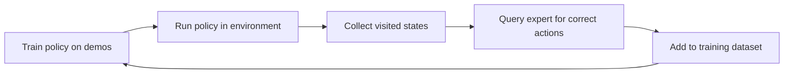

How did you learn to drive a car? Not by randomly pressing pedals until you accidentally arrived at your destination — that would be reinforcement learning. Instead, someone showed you what to do: turn the wheel here, brake there, check the mirrors. You learned by watching. This is the core idea behind **imitation learning**: teaching agents by giving them examples of expert behavior rather than reward signals.

## 1. Concept Introduction

### Simple Explanation

Imitation learning (IL) lets an agent learn a task by observing demonstrations from an expert. Instead of exploring randomly and discovering what works (as in reinforcement learning), the agent watches what a skilled performer does and tries to replicate that behavior. Think of it as the AI equivalent of an apprentice learning from a master craftsperson.

### Technical Detail

Formally, imitation learning operates on a dataset of expert demonstrations:

```
D = {(s₁, a₁), (s₂, a₂), ..., (sₙ, aₙ)}
```

Where `sᵢ` is a state (observation) and `aᵢ` is the action the expert took in that state. The goal is to learn a policy `π(a|s)` that maps states to actions, mimicking the expert's decision-making process. Unlike reinforcement learning, we never define a reward function — the expert's behavior *is* the specification.

There are three main families:

- **Behavioral Cloning (BC)**: Treat it as supervised learning — predict the expert's action from the state.
- **Inverse Reinforcement Learning (IRL)**: Infer the expert's hidden reward function, then optimize for it.
- **Interactive Imitation Learning (DAgger)**: Query the expert during training to correct the agent's mistakes.

## 2. Historical & Theoretical Context

Imitation learning has roots in both AI and psychology. In the 1960s, Albert Bandura's **social learning theory** showed that humans acquire complex behaviors through observation, not just trial-and-error — his famous Bobo doll experiments demonstrated children imitating aggressive behavior they had merely watched.

In AI, **ALVINN** (Autonomous Land Vehicle In a Neural Network, Pomerleau 1989) was a landmark: a neural network learned to steer a vehicle by watching a human driver. This was one of the earliest successful applications of behavioral cloning, and remarkably, it worked on real roads.

The theoretical foundations crystallized with **DAgger** (Dataset Aggregation, Ross et al. 2011), which proved that naive behavioral cloning suffers from compounding errors and offered an elegant fix. More recently, imitation learning has become central to LLM agent training — models like GPT-4 and Claude learn from vast demonstrations of human reasoning before being fine-tuned with reinforcement learning from human feedback (RLHF).

The relationship to core AI principles is direct: imitation learning sits at the intersection of **supervised learning** (learning from labeled examples) and **sequential decision-making** (where actions affect future states).

## 3. Algorithms & Math

### Behavioral Cloning

The simplest approach: treat demonstrations as a supervised learning dataset.

```
Objective: minimize  L(θ) = Σ -log π_θ(aᵢ | sᵢ)
```

**Pseudocode:**

```
BEHAVIORAL_CLONING(expert_demos D, epochs E):
    Initialize policy network π_θ
    for epoch in 1..E:
        for (state, action) in D:
            loss = cross_entropy(π_θ(state), action)
            θ ← θ - α * ∇loss
    return π_θ
```

**The compounding error problem:** BC trains on expert states, but at test time the agent visits its own states. Small errors accumulate — if the agent drifts slightly off the expert's trajectory, it encounters states never seen in training, leading to worse actions, which leads to more unfamiliar states, and so on.

For a horizon of `T` steps, the error grows as **O(T²)** — quadratically with trajectory length.

### DAgger (Dataset Aggregation)

DAgger fixes compounding error by iteratively collecting expert labels on the agent's own states:

```
DAGGER(expert π*, iterations N, policy π_θ):
    D ← initial expert demonstrations
    for i in 1..N:
        π_i ← train π_θ on D             # Train on all data so far
        Roll out π_i to collect states S_i # Run the learned policy
        Query expert: a* = π*(s) for s in S_i  # Ask expert what to do
        D ← D ∪ {(s, a*) for s in S_i}   # Add corrected data
    return best π_i
```

DAgger achieves **O(T)** error — linear instead of quadratic — because the agent learns to recover from its own mistakes.



## 4. Design Patterns & Architectures

### Pattern: Demonstration-Guided Planning

In modern agent architectures, imitation learning often appears as a **warm-start** for more complex systems. The pattern:

1. **Collect**: Record expert traces (tool calls, reasoning steps, API sequences)
2. **Clone**: Train a policy to reproduce expert behavior
3. **Refine**: Use RL or self-play to improve beyond the expert

This maps directly to the **Planner-Executor-Memory** loop. The cloned policy serves as the initial planner, and refinement improves execution quality over time.

### Pattern: Trajectory-Level Cloning for LLM Agents

For LLM-based agents, imitation learning operates on entire reasoning trajectories rather than individual state-action pairs:

```
Expert trajectory:
  Thought: I need to find the user's order status
  Action: search_orders(user_id="123")
  Observation: Order #456, shipped 2 days ago
  Thought: The order is in transit, I should provide tracking
  Action: get_tracking(order_id="456")
  ...
```

The agent learns not just *what* tools to call, but *when* and *why* — the full reasoning chain becomes the demonstration.

### Connection to Known Patterns

- **Event-driven architecture**: Demonstrations become event sequences the agent learns to replay
- **Blackboard pattern**: Expert traces populate the blackboard with exemplar solutions
- **Retrieval-augmented generation**: Stored demonstrations serve as retrievable examples for few-shot prompting

## 5. Practical Application

Here's a working example that uses behavioral cloning to teach an agent a tool-use pattern:

```python
import json
import numpy as np
from dataclasses import dataclass

@dataclass
class Demonstration:
    state: dict       # Current context (user query, history, etc.)
    action: str       # Tool name or response type
    parameters: dict  # Action parameters

class BehavioralCloningAgent:
    """Agent that learns tool-use patterns from expert demonstrations."""

    def __init__(self):
        self.demos: list[Demonstration] = []
        self.action_counts: dict[str, dict] = {}

    def add_demonstration(self, demo: Demonstration):
        """Record an expert demonstration."""
        self.demos.append(demo)
        intent = demo.state.get("intent", "unknown")
        if intent not in self.action_counts:
            self.action_counts[intent] = {}
        action = demo.action
        self.action_counts[intent][action] = (
            self.action_counts[intent].get(action, 0) + 1
        )

    def predict_action(self, state: dict) -> tuple[str, float]:
        """Predict the best action for a given state using
        frequency-based behavioral cloning."""
        intent = state.get("intent", "unknown")
        if intent not in self.action_counts:
            return "fallback_response", 0.0

        counts = self.action_counts[intent]
        total = sum(counts.values())
        best_action = max(counts, key=counts.get)
        confidence = counts[best_action] / total
        return best_action, confidence

    def predict_with_dagger(self, state: dict, expert_fn=None,
                            confidence_threshold: float = 0.7):
        """DAgger-style: query expert when confidence is low."""
        action, confidence = self.predict_action(state)

        if confidence < confidence_threshold and expert_fn:
            expert_action = expert_fn(state)
            # Add this correction to our dataset
            self.add_demonstration(Demonstration(
                state=state,
                action=expert_action,
                parameters={}
            ))
            return expert_action, 1.0

        return action, confidence


# --- Usage Example ---
agent = BehavioralCloningAgent()

# Train from expert demonstrations
demos = [
    Demonstration({"intent": "order_status"}, "search_orders", {"by": "user_id"}),
    Demonstration({"intent": "order_status"}, "search_orders", {"by": "user_id"}),
    Demonstration({"intent": "order_status"}, "get_tracking", {"by": "order_id"}),
    Demonstration({"intent": "refund"}, "check_eligibility", {"by": "order_id"}),
    Demonstration({"intent": "refund"}, "process_refund", {"by": "order_id"}),
]

for d in demos:
    agent.add_demonstration(d)

# Predict
action, conf = agent.predict_action({"intent": "order_status"})
print(f"Predicted: {action} (confidence: {conf:.2f})")
# Output: Predicted: search_orders (confidence: 0.67)

# DAgger: ask expert when unsure
def mock_expert(state):
    return "escalate_to_human"

action, conf = agent.predict_with_dagger(
    {"intent": "complaint"},
    expert_fn=mock_expert,
    confidence_threshold=0.7
)
print(f"DAgger result: {action} (confidence: {conf:.2f})")
# Output: DAgger result: escalate_to_human (confidence: 1.00)
```

### In a Framework Context (LangGraph)

In LangGraph, you could implement demonstration-guided routing:

```python
from langgraph.graph import StateGraph

def route_from_demonstrations(state):
    """Use cloned policy to decide the next node."""
    agent = load_trained_agent()
    action, confidence = agent.predict_action(state)
    if confidence > 0.8:
        return action
    return "reasoning_node"  # Fall back to explicit reasoning

graph = StateGraph(AgentState)
graph.add_conditional_edges("input", route_from_demonstrations, {
    "search_orders": "search_node",
    "process_refund": "refund_node",
    "reasoning_node": "llm_reasoning",
})
```

## 6. Comparisons & Tradeoffs

| Method | Data Needed | Reward Function? | Compounding Error | Sample Efficiency |
|--------|------------|------------------|-------------------|-------------------|
| **Behavioral Cloning** | Expert demos only | No | Yes (O(T²)) | High |
| **DAgger** | Demos + expert queries | No | Reduced (O(T)) | High |
| **Inverse RL** | Expert demos | Inferred | No | Low |
| **Standard RL** | Environment interaction | Yes (hand-designed) | No | Very low |
| **RLHF** | Preferences + demos | Learned from prefs | No | Medium |

**When to use imitation learning:**
- You have access to expert demonstrations but no clear reward signal
- The task is too complex for hand-designed rewards
- You need fast initial training (warm-start for RL)
- Safety matters — learning from experts avoids dangerous exploration

**Limitations:**
- The agent can never exceed the expert's skill level (with pure BC)
- Requires high-quality demonstrations — garbage in, garbage out
- Struggles with out-of-distribution states (without DAgger)
- Expert time is expensive to collect at scale

## 7. Latest Developments & Research

**GATO (Reed et al., 2022)**: DeepMind's generalist agent used behavioral cloning across 600+ tasks — playing games, captioning images, controlling robots — all with a single transformer trained on demonstrations.

**Learning from Language Feedback (2023-2024)**: Instead of action demonstrations, agents learn from natural language corrections. Papers like "Reflexion" (Shinn et al., 2023) show agents improving by processing verbal feedback, a form of linguistic imitation learning.

**AgentTrek (2024)**: Automated pipeline that generates web agent training data from documentation, achieving strong behavioral cloning results without human demonstrations — addressing the data bottleneck.

**Agent Trajectory Distillation (2024-2025)**: Distilling GPT-4-level agent traces into smaller models. Techniques like FireAct (Chen et al., 2023) fine-tune smaller LLMs on expert agent trajectories, achieving 77% of GPT-4 performance at a fraction of the cost.

**Open problems:**
- How to efficiently collect diverse demonstrations at scale
- Combining imitation learning with exploration for superhuman performance
- Handling multi-modal demonstrations (text + images + actions)
- Theoretical guarantees for imitation learning in partially observable environments

## 8. Cross-Disciplinary Insight

Imitation learning mirrors **cultural transmission** in evolutionary biology. Humans don't re-derive calculus from scratch each generation — knowledge passes through demonstration, apprenticeship, and imitation. This is remarkably efficient compared to individual trial-and-error.

In economics, this connects to **principal-agent theory**: how do you transfer the principal's (expert's) objectives to the agent when you can't directly specify the reward function? Imitation learning answers: show, don't tell. The demonstrations implicitly encode the reward structure, much like how corporate culture transmits organizational values through example rather than explicit rules.

Distributed computing offers another parallel: **leader-follower replication**. Follower nodes replicate the leader's state by observing its log of decisions — exactly what behavioral cloning does with expert trajectories.

## 9. Daily Challenge

**Exercise: Build a DAgger Loop for a Text Classification Agent**

Create a simple agent that classifies customer support tickets into categories. Start with 20 manually labeled examples (behavioral cloning), then implement DAgger:

1. Train a classifier on the initial 20 examples
2. Run it on 50 unlabeled tickets
3. Find the 10 lowest-confidence predictions
4. Manually label those 10 (you're the expert)
5. Retrain on all 30 examples
6. Measure accuracy improvement

**Starter code:**

```python
from sklearn.feature_extraction.text import TfidfVectorizer
from sklearn.linear_model import LogisticRegression

def dagger_loop(initial_data, unlabeled_pool, expert_label_fn, rounds=3):
    """Implement DAgger for text classification."""
    train_texts, train_labels = zip(*initial_data)
    train_texts, train_labels = list(train_texts), list(train_labels)

    for round_i in range(rounds):
        vec = TfidfVectorizer()
        X = vec.fit_transform(train_texts)
        clf = LogisticRegression().fit(X, train_labels)

        # Score unlabeled pool
        X_pool = vec.transform(unlabeled_pool)
        probs = clf.predict_proba(X_pool)
        confidence = probs.max(axis=1)

        # Query expert on lowest-confidence examples
        uncertain_idx = confidence.argsort()[:10]
        for idx in uncertain_idx:
            label = expert_label_fn(unlabeled_pool[idx])
            train_texts.append(unlabeled_pool[idx])
            train_labels.append(label)

        print(f"Round {round_i+1}: {len(train_texts)} examples, "
              f"mean confidence: {confidence.mean():.3f}")

    return clf, vec
```

**Bonus:** Compare the DAgger agent's accuracy against one trained only on the initial 20 examples. How many DAgger rounds does it take to match having 50 labeled examples from the start?

## 10. References & Further Reading

### Papers
- **"A Reduction of Imitation Learning and Structured Prediction to No-Regret Online Learning"** (Ross et al., 2011): The DAgger paper — foundational reading
- **"ALVINN: An Autonomous Land Vehicle In a Neural Network"** (Pomerleau, 1989): The original behavioral cloning success story
- **"Generative Adversarial Imitation Learning"** (Ho & Ermon, 2016): GAIL — combining GANs with imitation learning
- **"FireAct: Toward Language Agent Fine-tuning"** (Chen et al., 2023): Distilling agent trajectories into smaller models
- **"Reflexion: Language Agents with Verbal Reinforcement Learning"** (Shinn et al., 2023): Learning from language feedback

### Blog Posts & Tutorials
- **"An Introduction to Imitation Learning"** (Zheng, 2023): Clear overview of the field
- **"Behavioral Cloning from Observation"** (Torabi et al.): Learning without access to expert actions

### GitHub Repositories
- **imitation**: https://github.com/HumanCompatibleAI/imitation — Clean implementations of BC, DAgger, GAIL, and AIRL
- **d3rlpy**: https://github.com/takuseno/d3rlpy — Offline RL library with imitation learning support
- **MiniGrid**: https://github.com/Farama-Foundation/Minigrid — Simple environments for testing imitation learning agents

---

## Key Takeaways

1. **Imitation learning lets agents skip the exploration phase** by learning directly from expert behavior
2. **Behavioral cloning is simple but fragile** — compounding errors grow quadratically with trajectory length
3. **DAgger solves compounding errors** by iteratively collecting expert corrections on the agent's own states
4. **Modern LLM agents are fundamentally imitation learners** — pre-training on human text is behavioral cloning at scale
5. **The expert bottleneck is real** — collecting demonstrations is expensive, driving research toward automated data generation
6. **Imitation learning pairs naturally with RL** — clone first for a strong start, then refine with rewards to surpass the expert
