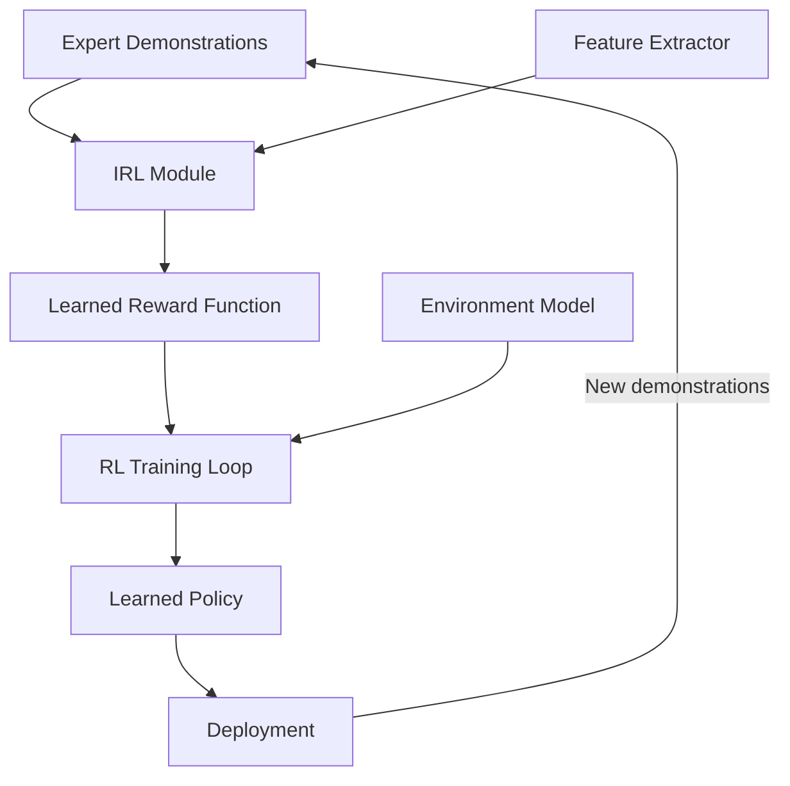

What if instead of hand-crafting a reward function for your agent, you could simply *show* it what good behavior looks like and let it figure out the underlying goals? That's the core promise of **Inverse Reinforcement Learning (IRL)** — one of the most elegant ideas in AI agent design and a critical building block for aligning agents with human intent.

## 1. Concept Introduction

### Simple Explanation

Normal reinforcement learning works like this: you give the agent a score sheet (reward function), and it learns to maximize its score. But writing a good score sheet is surprisingly hard. Tell a self-driving car to "minimize travel time," and it might learn to speed through red lights.

**Inverse RL** flips the problem. Instead of giving the agent a reward function, you show it demonstrations of an expert doing the task well. The agent then *reverse-engineers* what the expert must be optimizing for. Once it has that inferred reward function, it can use standard RL to learn a policy — potentially one that generalizes better than the demonstrations themselves.

### Technical Detail

Formally, in standard RL we have a Markov Decision Process (MDP) defined by $(S, A, T, \gamma, R)$ — states, actions, transitions, discount factor, and reward. The agent's job is to find a policy $\pi^*$ that maximizes expected cumulative reward.

In IRL, we observe an expert's trajectories $\mathcal{D} = \{\tau_1, \tau_2, \dots, \tau_n\}$ where each $\tau_i = (s_0, a_0, s_1, a_1, \dots)$, and we assume the expert is acting (approximately) optimally under some *unknown* reward function $R^*$. Our goal is to recover $R^*$ (or a good approximation) from $\mathcal{D}$.

The fundamental challenge: **IRL is ill-posed**. Many reward functions can explain the same behavior. The zero reward ($R = 0$) trivially makes every policy optimal. This ambiguity drives much of the algorithmic complexity in the field.

## 2. Historical & Theoretical Context

The idea of learning rewards from behavior traces back to **Andrew Ng and Stuart Russell's 2000 paper**, "Algorithms for Inverse Reinforcement Learning." They formalized the problem and proposed the first linear programming approach, showing that you could recover a reward function that makes the observed policy optimal under the assumption of linearity in features.

The intellectual roots go deeper. In economics, **revealed preference theory** (Samuelson, 1938) asks the same question: can we infer a consumer's utility function from their purchasing decisions? In cognitive science, researchers study how humans infer others' goals from observed actions — a capacity called **Theory of Mind**.

IRL sits at the intersection of three pillars:
- **Reinforcement learning**: the forward problem of maximizing reward
- **Imitation learning**: learning to copy expert behavior directly
- **Preference learning**: inferring what humans value from comparisons

The key distinction from imitation learning is that IRL recovers the *why* (the reward function), not just the *what* (the policy). This makes it more transferable — a recovered reward function can be optimized in new environments where the expert demonstrations don't directly apply.

## 3. Algorithms & Math

### Maximum Entropy IRL (Ziebart et al., 2008)

The most influential IRL algorithm resolves the ambiguity problem using the **principle of maximum entropy**: among all reward functions consistent with the demonstrations, prefer the one that makes the fewest additional assumptions.

The reward function is parameterized as a linear combination of features:

$$R_\theta(s, a) = \theta^T \phi(s, a)$$

where $\phi(s, a)$ is a feature vector and $\theta$ are learned weights.

The key insight: under maximum entropy, the probability of a trajectory is exponentially proportional to its cumulative reward:

$$P(\tau | \theta) = \frac{1}{Z(\theta)} \exp\left(\sum_t R_\theta(s_t, a_t)\right)$$

where $Z(\theta)$ is a normalizing partition function.

The learning objective is to maximize the log-likelihood of observed demonstrations:

$$\theta^* = \arg\max_\theta \sum_{\tau \in \mathcal{D}} \log P(\tau | \theta)$$

The gradient has an elegant form:

$$\nabla_\theta \mathcal{L} = \tilde{\mu} - \mu_\theta$$

where $\tilde{\mu}$ is the empirical feature expectation from demonstrations and $\mu_\theta$ is the expected feature count under the current policy. Learning pushes the agent's feature expectations to match the expert's.

```
Algorithm: Maximum Entropy IRL
─────────────────────────────
Input: Expert demonstrations D, feature function φ
Initialize: θ randomly

Repeat until convergence:
    1. Solve forward RL: find optimal policy π_θ under R_θ
    2. Compute expert feature expectations: μ̃ = (1/|D|) Σ_τ Σ_t φ(s_t, a_t)
    3. Compute policy feature expectations: μ_θ = E_{π_θ}[Σ_t φ(s_t, a_t)]
    4. Update: θ ← θ + α(μ̃ - μ_θ)

Return: θ (learned reward parameters)
```

### Generative Adversarial Imitation Learning (GAIL)

**GAIL** (Ho & Ermon, 2016) reframed IRL as a GAN-style problem, eliminating the need to repeatedly solve the forward RL problem inside the loop:

- **Generator**: the agent's policy $\pi_\theta$ produces trajectories
- **Discriminator**: $D_\omega$ tries to distinguish expert trajectories from agent trajectories

The discriminator implicitly defines a reward signal: $R(s, a) = -\log(1 - D_\omega(s, a))$. The policy is trained to fool the discriminator, which amounts to matching the expert's state-action distribution.

## 4. Design Patterns & Architectures

IRL connects to several agent design patterns:



**Reward Learning Loop**: In production agent systems, IRL often operates as a reward-learning module feeding into a standard RL training pipeline. This separates *what to optimize* from *how to optimize it*.

**Preference-Based Architecture**: Modern systems like RLHF (Reinforcement Learning from Human Feedback) use a variant where instead of full demonstrations, humans provide pairwise preferences ("trajectory A is better than B"). The reward model is trained via the **Bradley-Terry model**:

$$P(A \succ B) = \frac{\exp(R(A))}{\exp(R(A)) + \exp(R(B))}$$

This is the backbone of how ChatGPT, Claude, and other aligned LLMs are trained — a direct descendant of IRL.

**Event-Driven Integration**: In agent frameworks, the learned reward can serve as an evaluation function in planner-executor loops, scoring candidate plans by how well they align with inferred human preferences.

## 5. Practical Application

Here's a minimal IRL implementation that learns a reward function from grid-world demonstrations:

```python
import numpy as np
from typing import List, Tuple

class MaxEntIRL:
    """Maximum Entropy Inverse Reinforcement Learning."""

    def __init__(self, n_states: int, n_actions: int, features: np.ndarray,
                 transition_probs: np.ndarray, gamma: float = 0.99):
        self.n_states = n_states
        self.n_actions = n_actions
        self.features = features  # (n_states, n_features)
        self.T = transition_probs  # (n_states, n_actions, n_states)
        self.gamma = gamma

    def compute_feature_expectations(
        self, demonstrations: List[List[int]]
    ) -> np.ndarray:
        """Compute average feature counts from expert demonstrations."""
        feat_exp = np.zeros(self.features.shape[1])
        for traj in demonstrations:
            for state in traj:
                feat_exp += self.features[state]
        return feat_exp / len(demonstrations)

    def soft_value_iteration(self, reward: np.ndarray, n_iters: int = 50):
        """Compute soft-optimal policy using soft Bellman backup."""
        V = np.zeros(self.n_states)
        for _ in range(n_iters):
            Q = reward[:, None] + self.gamma * self.T @ V  # (S, A)
            V = np.log(np.sum(np.exp(Q), axis=1))  # soft max
        # Soft-optimal policy
        Q = reward[:, None] + self.gamma * self.T @ V
        policy = np.exp(Q - V[:, None])  # (S, A)
        policy /= policy.sum(axis=1, keepdims=True)
        return policy

    def compute_expected_features(self, policy: np.ndarray,
                                  start_dist: np.ndarray,
                                  horizon: int = 50) -> np.ndarray:
        """Expected feature counts under the current policy."""
        state_freq = start_dist.copy()
        feat_exp = np.zeros(self.features.shape[1])
        for t in range(horizon):
            feat_exp += (state_freq[:, None] * self.features).sum(axis=0)
            # Transition under policy
            next_state_freq = np.zeros(self.n_states)
            for s in range(self.n_states):
                for a in range(self.n_actions):
                    next_state_freq += (
                        state_freq[s] * policy[s, a] * self.T[s, a]
                    )
            state_freq = next_state_freq
        return feat_exp

    def train(self, demonstrations: List[List[int]],
              start_dist: np.ndarray, lr: float = 0.1,
              n_epochs: int = 200) -> np.ndarray:
        """Learn reward weights from demonstrations."""
        theta = np.random.randn(self.features.shape[1]) * 0.01
        expert_feat = self.compute_feature_expectations(demonstrations)

        for epoch in range(n_epochs):
            reward = self.features @ theta
            policy = self.soft_value_iteration(reward)
            expected_feat = self.compute_expected_features(policy, start_dist)

            # Gradient: match feature expectations
            grad = expert_feat - expected_feat
            theta += lr * grad

            if epoch % 50 == 0:
                loss = np.linalg.norm(grad)
                print(f"Epoch {epoch}: grad norm = {loss:.4f}")

        return theta
```

**Connection to modern agent frameworks**: In a LangGraph or CrewAI system, the learned reward function could serve as a scoring mechanism in a reflection loop — evaluating whether an agent's proposed action aligns with demonstrated expert preferences before execution.

## 6. Comparisons & Tradeoffs

| Approach | Recovers Reward? | Generalizes? | Data Needs | Complexity |
|----------|:-:|:-:|:-:|:-:|
| **Behavioral Cloning** | No | Poor | Low | Low |
| **IRL (MaxEnt)** | Yes | Good | Medium | High (inner RL loop) |
| **GAIL** | Implicit | Good | Medium | Medium |
| **RLHF** | Yes (pairwise) | Good | Low per sample | Medium |
| **DAgger** | No | Medium | Interactive | Medium |

**When to use IRL over simpler approaches:**
- When the reward function is hard to specify but easy to demonstrate
- When you need the policy to generalize beyond the demonstration distribution
- When understanding *why* the expert acts is as important as replicating *what* they do

**Limitations:**
- Computationally expensive (solving RL in an inner loop)
- Sensitive to the quality and coverage of demonstrations
- The ill-posed nature means recovered rewards may not match the "true" reward
- Feature engineering matters — bad features lead to bad reward recovery

## 7. Latest Developments & Research

**Inverse RL from Language Feedback (2024–2025)**: Recent work extends IRL beyond trajectory demonstrations. Systems now learn reward models from natural language corrections ("don't go so close to the wall"), combining IRL with language grounding. See Kwon et al., "Reward Design with Language Models" (NeurIPS 2023).

**Direct Preference Optimization (DPO, 2023)**: Rafailov et al. showed that the RLHF pipeline (reward model + RL optimization) can be collapsed into a single supervised learning objective. DPO implicitly performs IRL without explicitly learning a reward model, dramatically simplifying alignment training for LLMs.

**Inverse RL for Multi-Agent Systems (2024)**: New benchmarks like MAIRL explore recovering reward functions in competitive and cooperative multi-agent settings, where each agent may have different (possibly conflicting) objectives.

**Open problems:**
- Scaling IRL to high-dimensional, long-horizon tasks remains difficult
- Disentangling multiple objectives from mixed demonstrations
- Robustness to suboptimal or adversarial demonstrators

## 8. Cross-Disciplinary Insight

IRL has a deep connection to **econometrics and structural estimation**. In economics, researchers observe market behavior (prices, quantities) and try to recover the underlying utility functions and constraints that generated that behavior — this is *structural estimation*, and it's mathematically equivalent to IRL.

The parallel extends further. In **ethology** (animal behavior science), researchers observe foraging patterns and infer what energy-cost tradeoffs animals are optimizing. In **forensic psychology**, profilers infer motivations from behavioral patterns. IRL formalizes this universal human capacity to ask: "Given what they did, what must they have been trying to achieve?"

This perspective also illuminates why IRL is central to **AI alignment**: if we can reliably infer human values from human behavior, we can build agents that pursue those values rather than proxy objectives that break down at scale.

## 9. Daily Challenge

**Exercise: Reward Recovery in a Simple Grid World**

Create a 5x5 grid world where an expert navigates from the top-left to the bottom-right, avoiding a "lava" cell at position (2,2). The expert's demonstrations implicitly encode that the lava cell has negative reward.

1. Generate 20 expert trajectories using a hand-coded policy that avoids (2,2)
2. Implement MaxEnt IRL with a one-hot state feature representation
3. Recover the reward function and verify that position (2,2) gets a strongly negative weight
4. Train an RL agent on the recovered reward and confirm it avoids the lava

**Bonus**: Add a second obstacle the expert avoids. Does IRL recover both negative reward regions? What happens with only 5 demonstrations instead of 20?

## 10. References & Further Reading

### Papers
- **"Algorithms for Inverse Reinforcement Learning"** (Ng & Russell, 2000): The foundational paper
- **"Maximum Entropy Inverse Reinforcement Learning"** (Ziebart et al., 2008): The most widely used IRL algorithm
- **"Generative Adversarial Imitation Learning"** (Ho & Ermon, 2016): GAN-based approach that scales to complex tasks
- **"Direct Preference Optimization"** (Rafailov et al., 2023): Simplifying RLHF by removing the explicit reward model
- **"Reward Design with Language Models"** (Kwon et al., 2023): Bridging language and reward learning

### Blog Posts & Tutorials
- **"A Tutorial on Inverse Reinforcement Learning"** (Arora & Doshi, 2021 survey): Comprehensive overview of IRL methods
- **"The IRL Landscape"** (Sergey Levine's CS 285 lecture notes, UC Berkeley): Graduate-level treatment with implementation insights
- **"RLHF: How ChatGPT is Trained"** (Hugging Face blog): Accessible explanation of the IRL-to-RLHF pipeline

### GitHub Repositories
- **imitation**: https://github.com/HumanCompatibleAI/imitation — Python library implementing GAIL, AIRL, and other IRL methods
- **irl-imitation**: https://github.com/MatthewJA/Inverse-Reinforcement-Learning — Clean MaxEnt IRL implementation
- **trl**: https://github.com/huggingface/trl — Hugging Face's RLHF/DPO library, the modern descendant of IRL ideas

---

## Key Takeaways

1. **IRL flips the RL problem**: Instead of "given rewards, find the policy," it asks "given the policy, find the rewards"
2. **The reward function is the most transferable artifact**: Policies are environment-specific; reward functions capture intent
3. **Maximum entropy resolves ambiguity**: Among all consistent reward functions, choose the least committed one
4. **RLHF is IRL's greatest success story**: The alignment technique behind modern LLMs is a direct descendant of IRL
5. **IRL bridges behavior and intent**: It's the formal version of asking "why did they do that?" — a question as old as human cognition
