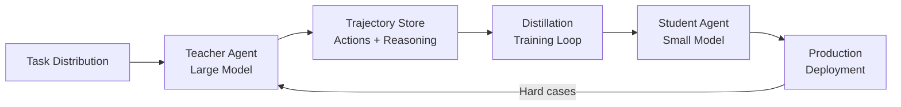

Your most capable AI agent costs $0.15 per call and takes 30 seconds to respond. Your users need sub-second answers at a fraction of the cost. Knowledge distillation is how you bridge that gap — training a smaller, cheaper "student" agent to mimic the behavior of a larger, smarter "teacher" without losing what matters.

## 1. Concept Introduction

### Simple Explanation

Think of a master chef training an apprentice. The master doesn't hand over every recipe and technique at once. Instead, the apprentice watches the master work, learns *how* the master makes decisions (not just what the final dishes look like), and gradually builds intuition. The apprentice will never replicate everything perfectly, but for the dishes that matter most, they become good enough to run the kitchen alone.

**Knowledge distillation** works the same way. A large, powerful model (the "teacher") generates training signals — not just correct answers, but the *distribution* of its confidence across all possible answers. A smaller model (the "student") learns from these soft signals, absorbing the teacher's reasoning patterns in a compressed form.

### Technical Detail

In the context of AI agents, distillation goes beyond single model outputs. An agent produces:

- **Action selections**: Which tool to call, what to say
- **Reasoning traces**: Chain-of-thought steps, planning sequences
- **Confidence distributions**: Soft probabilities over possible next actions
- **State assessments**: How the agent evaluates the current situation

Distilling an agent means transferring all of these behavioral patterns — not just the final answers — from a high-capability system to a leaner one that can operate in production at scale.

## 2. Historical & Theoretical Context

Knowledge distillation was formalized by Geoffrey Hinton, Oriol Vinyals, and Jeff Dean in their 2015 paper *"Distilling the Knowledge in a Neural Network."* The core insight was elegant: the "wrong" answers a teacher model gives contain valuable information. When a digit classifier says an image is "70% a 7, 20% a 2, 10% a 1," the relationship between those probabilities encodes structural knowledge about what makes digits similar.

The idea has roots in **model compression** (Buciluă et al., 2006) and connects to several foundational concepts:

- **Minimum Description Length**: Compressing knowledge into a simpler representation
- **PAC learning**: What can a simpler hypothesis class learn from a more complex one?
- **Transfer learning**: Reusing knowledge across tasks and architectures

In multi-agent systems, distillation connects to the principle of **agent specialization** — the idea that not every agent in a system needs full general capability. Some agents only need to handle a narrow slice of the problem space, and distillation is how you carve that slice efficiently.

## 3. Algorithms & Math

### The Distillation Loss

The standard distillation objective combines two losses:

```
L = α · L_hard + (1 - α) · L_soft
```

Where:

- **L_hard** = Cross-entropy between student predictions and ground-truth labels
- **L_soft** = KL divergence between softened teacher and student distributions
- **α** = Weighting factor (typically 0.1–0.5)

The "softening" uses a temperature parameter T:

```
softmax(z_i / T) = exp(z_i / T) / Σ_j exp(z_j / T)
```

Higher temperature (T > 1) produces softer probability distributions, revealing more of the teacher's internal ranking of alternatives.

### Pseudocode for Agent Distillation

```
Algorithm: Agent Behavior Distillation
─────────────────────────────────────
Input: Teacher agent A_T, Student agent A_S, Task distribution D
Output: Trained student agent A_S*

1. COLLECT trajectories:
   For each task t ~ D:
     Run A_T on task t
     Record: (state, action, reasoning_trace, confidence) tuples

2. BUILD distillation dataset:
   For each trajectory:
     Extract (input_state, teacher_action_distribution, teacher_reasoning)

3. TRAIN student:
   For each epoch:
     For each (state, teacher_dist, reasoning) in dataset:
       student_dist = A_S.predict(state)
       L_action = KL(teacher_dist || student_dist)
       L_reasoning = CrossEntropy(reasoning, A_S.generate_reasoning(state))
       L_total = α · L_action + (1 - α) · L_reasoning
       Update A_S parameters via gradient descent on L_total

4. EVALUATE:
   Compare A_S* vs A_T on held-out tasks
   Return A_S* if performance meets threshold
```

## 4. Design Patterns & Architectures

### Pattern: Teacher-Student Pipeline



The key architectural element is the **fallback escalation**: when the student agent encounters inputs outside its competence, it routes to the teacher. This creates a tiered system where 90% of requests are handled cheaply and only edge cases incur full cost.

### Pattern: Cascade Distillation

Instead of a single teacher-student pair, arrange agents in a cascade:

1. **Tier 1** (smallest): Handles common, simple queries
2. **Tier 2** (medium): Handles moderate complexity
3. **Tier 3** (largest): Handles the long tail of difficult cases

Each tier is distilled from the one above it, specialized for the difficulty level it serves. This mirrors how organizations work — junior staff handle routine work, escalating to seniors only when needed.

### Connection to Existing Patterns

- **Mixture of Experts**: Distillation can create specialized experts for different subdomains
- **Semantic Routing**: A router decides which tier handles each request (see your semantic routing article)
- **Planner-Executor**: The teacher can serve as the planner while distilled students serve as fast executors

## 5. Practical Application

Here's a concrete example: distilling a large agent's tool-calling behavior into a smaller model using OpenAI's API and a simple training loop.

```python
import json
import openai
from dataclasses import dataclass


@dataclass
class DistillationSample:
    user_query: str
    teacher_reasoning: str
    teacher_action: str
    teacher_tool_calls: list[dict]


def collect_teacher_trajectories(
    queries: list[str],
    teacher_model: str = "gpt-4o",
) -> list[DistillationSample]:
    """Run the teacher agent and collect its behavior."""
    client = openai.OpenAI()
    samples = []

    tools = [
        {
            "type": "function",
            "function": {
                "name": "search_database",
                "description": "Search the product database",
                "parameters": {
                    "type": "object",
                    "properties": {
                        "query": {"type": "string"},
                        "limit": {"type": "integer", "default": 10},
                    },
                    "required": ["query"],
                },
            },
        }
    ]

    for query in queries:
        response = client.chat.completions.create(
            model=teacher_model,
            messages=[
                {"role": "system", "content": "Think step-by-step before acting."},
                {"role": "user", "content": query},
            ],
            tools=tools,
            temperature=0.3,
        )

        msg = response.choices[0].message
        samples.append(
            DistillationSample(
                user_query=query,
                teacher_reasoning=msg.content or "",
                teacher_action=msg.role,
                teacher_tool_calls=[
                    {"name": tc.function.name, "args": tc.function.arguments}
                    for tc in (msg.tool_calls or [])
                ],
            )
        )

    return samples


def build_finetuning_dataset(
    samples: list[DistillationSample],
    output_path: str = "distillation_train.jsonl",
):
    """Convert teacher trajectories into fine-tuning format."""
    with open(output_path, "w") as f:
        for sample in samples:
            record = {
                "messages": [
                    {
                        "role": "system",
                        "content": "You are a helpful assistant. "
                        "Think briefly, then act.",
                    },
                    {"role": "user", "content": sample.user_query},
                    {
                        "role": "assistant",
                        "content": sample.teacher_reasoning,
                        "tool_calls": [
                            {
                                "id": f"call_{i}",
                                "type": "function",
                                "function": tc,
                            }
                            for i, tc in enumerate(sample.teacher_tool_calls)
                        ]
                        if sample.teacher_tool_calls
                        else None,
                    },
                ]
            }
            f.write(json.dumps(record) + "\n")

    return output_path


# Usage:
# 1. Collect teacher behavior
# samples = collect_teacher_trajectories(your_query_list)
# 2. Build fine-tuning dataset
# build_finetuning_dataset(samples)
# 3. Fine-tune a smaller model (e.g., gpt-4o-mini) on this dataset
# 4. Deploy the student model in production with fallback to teacher
```

## 6. Comparisons & Tradeoffs

| Approach | Cost Reduction | Quality Loss | Complexity | Best For |
|----------|---------------|-------------|------------|----------|
| **Direct distillation** (fine-tune small model) | 80-95% | 5-15% | Medium | High-volume production |
| **Prompt distillation** (optimize prompts for small model) | 60-80% | 10-25% | Low | Quick wins, prototyping |
| **Cascade/routing** (route easy tasks to small model) | 50-70% | Near zero | Medium | Mixed-difficulty workloads |
| **No distillation** (use large model everywhere) | 0% | 0% | Low | Low volume, high stakes |

### Key Tradeoffs

- **Coverage vs. cost**: More training data improves the student but costs more to generate
- **Specialization vs. generality**: A student trained on narrow tasks excels there but fails on novel inputs
- **Freshness**: When the teacher model updates, student models may need re-distillation
- **Reasoning fidelity**: Students can mimic actions without truly understanding reasoning — they may fail on edge cases where the reasoning matters most

## 7. Latest Developments & Research

### Distilling Reasoning (2024-2025)

A major trend is distilling not just outputs but **chain-of-thought reasoning**. OpenAI's approach with the o1 model family demonstrated that reasoning traces themselves are valuable training signals. Papers like *"Orca 2: Teaching Small Language Models How to Reason"* (Microsoft, 2023) showed that carefully curated reasoning demonstrations can make 13B-parameter models competitive with much larger ones on specific tasks.

### Constitutional AI Distillation (Anthropic, 2024)

Anthropic explored distilling safety behaviors from large models into smaller ones, showing that alignment properties can partially transfer through distillation — though gaps remain in edge cases.

### Agent-Specific Distillation Benchmarks

- **AgentBench** (2024): Evaluates distilled agents across web, code, and database tasks
- **τ-bench** (2024): Tests whether distilled agents maintain tool-use accuracy
- The consistent finding: distilled agents retain 85-95% of teacher performance on in-distribution tasks but degrade on out-of-distribution inputs

### Open Problems

- **Reasoning collapse**: Students sometimes learn to produce reasoning-shaped text without actual reasoning
- **Calibration drift**: Student confidence scores diverge from teacher calibration
- **Multi-step degradation**: Errors compound faster in distilled agents over long trajectories

## 8. Cross-Disciplinary Insight

Knowledge distillation mirrors **apprenticeship and institutional knowledge transfer** in organizational theory. When a senior engineer leaves a company, their knowledge doesn't transfer through documentation alone — it transfers through *working alongside* juniors, showing not just what decisions to make but *how* to think about problems.

In distributed computing, this maps to **caching hierarchies**. An L1 cache (student) handles most requests with low latency. Cache misses escalate to L2 (teacher). The system works because most access patterns are predictable — just as most user queries follow common patterns that a distilled model can handle.

From biology, distillation resembles **genetic assimilation** (the Baldwin effect): behaviors initially learned through expensive individual experience become encoded in simpler, faster mechanisms over generations.

## 9. Daily Challenge

**Exercise: Build a Distillation Quality Monitor**

Create a system that compares teacher and student agent outputs to measure distillation quality:

1. Run 50 test queries through both a large model (teacher) and a small model (student)
2. Compare: Do they select the same tools? Do they produce equivalent reasoning?
3. Calculate an "agreement score" and identify the query types where the student diverges most
4. Design a routing rule: which queries should be escalated to the teacher?

```python
def measure_distillation_quality(
    queries: list[str],
    teacher_model: str,
    student_model: str,
) -> dict:
    """Compare teacher and student on the same queries."""
    results = {"agreement": 0, "divergences": []}

    for query in queries:
        teacher_output = run_agent(query, teacher_model)
        student_output = run_agent(query, student_model)

        # TODO: Compare tool selections
        # TODO: Compare reasoning similarity (use embedding cosine similarity)
        # TODO: Compare final answer equivalence
        # TODO: Track which query categories diverge most

    results["agreement_rate"] = results["agreement"] / len(queries)
    return results
```

**Bonus**: Implement an automatic escalation threshold — if the student's confidence on a query is below a certain level, route to the teacher instead.

## 10. References & Further Reading

### Papers
- **"Distilling the Knowledge in a Neural Network"** (Hinton, Vinyals, Dean, 2015): The foundational distillation paper
- **"Orca 2: Teaching Small Language Models How to Reason"** (Microsoft, 2023): Reasoning distillation for smaller models
- **"Lion: Adversarial Distillation of Closed-Source Large Language Model"** (Jiang et al., 2023): Distilling from black-box APIs
- **"AgentBench: Evaluating LLMs as Agents"** (Liu et al., 2024): Benchmarking agent capabilities including distilled models

### Blog Posts & Guides
- **"How to Fine-Tune GPT-4o-mini"** (OpenAI Cookbook): Practical fine-tuning for distillation
- **"Distilling Step-by-Step"** (Google Research Blog, 2023): Extracting reasoning as training signal
- **"Building Tiered Agent Systems"** (LangChain Blog): Cascading agents for cost optimization

### GitHub Repositories
- **distilabel** by Argilla: https://github.com/argilla-io/distilabel — Framework for AI feedback and distillation dataset generation
- **LitGPT**: https://github.com/Lightning-AI/litgpt — Lightweight models suitable as distillation students
- **OpenRLHF**: https://github.com/OpenRLHF/OpenRLHF — Open-source RLHF and distillation framework

---

## Key Takeaways

1. **Distillation is the bridge** between capable-but-expensive and fast-but-cheap agents
2. **Soft labels matter**: The teacher's probability distribution over wrong answers carries structural knowledge
3. **Distill reasoning, not just answers**: Chain-of-thought traces are powerful training signals
4. **Build fallback paths**: Always route hard cases back to the teacher
5. **Monitor drift**: Distilled models degrade on out-of-distribution inputs — track agreement rates
6. **Think in tiers**: Production systems benefit from cascaded agents at different capability levels
7. **Re-distill when teachers update**: Student models grow stale when their teacher evolves

Knowledge distillation transforms AI agent deployment from an all-or-nothing capability choice into an engineering optimization problem — and that's where real systems get built.
