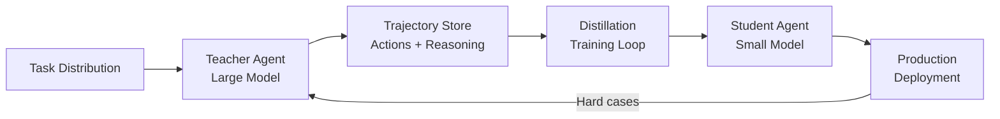

**Knowledge distillation** trains a smaller, cheaper "student" agent to mimic the behavior of a larger "teacher" model. The result is a system that can handle most queries at a fraction of the cost and latency, while routing genuinely hard cases back to the full model.

## Concept Introduction

A large, powerful model (the "teacher") generates training signals — not just correct answers, but the *distribution* of its confidence across all possible answers. A smaller model (the "student") learns from these soft signals, absorbing the teacher's reasoning patterns in a compressed form.

In the context of AI agents, distillation goes beyond single model outputs. An agent produces:

- **Action selections**: which tool to call, what to say
- **Reasoning traces**: chain-of-thought steps, planning sequences
- **Confidence distributions**: soft probabilities over possible next actions
- **State assessments**: how the agent evaluates the current situation

Distilling an agent means transferring all of these behavioral patterns, not just the final answers, from a high-capability system to a leaner one that can operate in production at scale.

## Algorithms & Math

### The Distillation Loss

The standard distillation objective combines two losses:

```
L = α · L_hard + (1 - α) · L_soft
```

Where:

- **L_hard** = Cross-entropy between student predictions and ground-truth labels
- **L_soft** = KL divergence between softened teacher and student distributions
- **α** = Weighting factor (typically 0.1–0.5)

The "softening" uses a temperature parameter T:

```
softmax(z_i / T) = exp(z_i / T) / Σ_j exp(z_j / T)
```

Higher temperature (T > 1) produces softer probability distributions, revealing more of the teacher's internal ranking of alternatives.

### Pseudocode for Agent Distillation

```
Algorithm: Agent Behavior Distillation
─────────────────────────────────────
Input: Teacher agent A_T, Student agent A_S, Task distribution D
Output: Trained student agent A_S*

1. COLLECT trajectories:
   For each task t ~ D:
     Run A_T on task t
     Record: (state, action, reasoning_trace, confidence) tuples

2. BUILD distillation dataset:
   For each trajectory:
     Extract (input_state, teacher_action_distribution, teacher_reasoning)

3. TRAIN student:
   For each epoch:
     For each (state, teacher_dist, reasoning) in dataset:
       student_dist = A_S.predict(state)
       L_action = KL(teacher_dist || student_dist)
       L_reasoning = CrossEntropy(reasoning, A_S.generate_reasoning(state))
       L_total = α · L_action + (1 - α) · L_reasoning
       Update A_S parameters via gradient descent on L_total

4. EVALUATE:
   Compare A_S* vs A_T on held-out tasks
   Return A_S* if performance meets threshold
```

## Design Patterns & Architectures

### Teacher-Student Pipeline


```mermaid
graph LR
    A[Task Distribution] --> B[Teacher Agent<br/>Large Model]
    B --> C[Trajectory Store<br/>Actions + Reasoning]
    C --> D[Distillation<br/>Training Loop]
    D --> E[Student Agent<br/>Small Model]
    E --> F[Production<br/>Deployment]
    F -->|Hard cases| B
```

The key architectural element is **fallback escalation**: when the student agent encounters inputs outside its competence, it routes to the teacher. This creates a tiered system where most requests are handled cheaply and only edge cases incur full cost.

### Cascade Distillation

Instead of a single teacher-student pair, arrange agents in a cascade:

1. **Tier 1** (smallest): Handles common, simple queries
2. **Tier 2** (medium): Handles moderate complexity
3. **Tier 3** (largest): Handles the long tail of difficult cases

Each tier is distilled from the one above it, specialized for the difficulty level it serves.

### Connection to Existing Patterns

- **Mixture of Experts**: Distillation can create specialized experts for different subdomains
- **Semantic Routing**: A router decides which tier handles each request (see your semantic routing article)
- **Planner-Executor**: The teacher can serve as the planner while distilled students serve as fast executors

## Practical Application

A minimal knowledge distillation pipeline for agent behavior has three stages: trajectory collection, dataset construction, and student fine-tuning. A `TeacherCollector` class drives a capable model (e.g., Claude claude-opus-4-6 or GPT-4o) through a set of representative queries, capturing the full chain-of-thought reasoning and any tool calls via the raw Anthropic SDK or OpenAI client. A `DatasetBuilder` function converts those `DistillationSample` records into JSONL fine-tuning format, pairing each user query with the teacher's reasoning trace and structured tool call sequence. The resulting file is uploaded for supervised fine-tuning of a smaller student model (e.g., GPT-4o-mini or a local Mistral variant), after which a `StudentAgent` wrapper runs the student in production with an optional fallback to the teacher when confidence is low. No orchestration framework is needed here — the raw SDK is the right fit because the workflow is a straight data pipeline, not a dynamic graph.

**Try it**

```
Using the raw Anthropic SDK (anthropic Python package), build a knowledge distillation
pipeline with three functions: collect_teacher_trajectories(queries, model) that calls
claude-opus-4-6 with tool use enabled and captures reasoning + tool calls per query,
build_finetune_jsonl(samples, path) that writes each sample as a chat-format JSONL
record, and run_student(query, model) that calls a smaller model trained on that data.
Include inline comments explaining each step. Make the code runnable end-to-end with
a short hardcoded query list as a demo.
```

## Latest Developments & Research

### Distilling Reasoning (2024-2025)

A major trend is distilling not just outputs but **chain-of-thought reasoning**. OpenAI's approach with the o1 model family demonstrated that reasoning traces themselves are valuable training signals. Papers like *"Orca 2: Teaching Small Language Models How to Reason"* (Microsoft, 2023) showed that carefully curated reasoning demonstrations can make 13B-parameter models competitive with much larger ones on specific tasks.

### Constitutional AI Distillation (Anthropic, 2024)

Anthropic explored distilling safety behaviors from large models into smaller ones, showing that alignment properties can partially transfer through distillation — though gaps remain in edge cases.

### Agent-Specific Distillation Benchmarks

- **AgentBench** (2024): Evaluates distilled agents across web, code, and database tasks
- **τ-bench** (2024): Tests whether distilled agents maintain tool-use accuracy
- The consistent finding: distilled agents retain 85-95% of teacher performance on in-distribution tasks but degrade on out-of-distribution inputs

### Open Problems

- **Reasoning collapse**: Students sometimes learn to produce reasoning-shaped text without actual reasoning
- **Calibration drift**: Student confidence scores diverge from teacher calibration
- **Multi-step degradation**: Errors compound faster in distilled agents over long trajectories

## Cross-Disciplinary Insight

Knowledge distillation mirrors **apprenticeship and institutional knowledge transfer** in organizational theory. When a senior engineer leaves a company, their knowledge doesn't transfer through documentation alone — it transfers through *working alongside* juniors, showing not just what decisions to make but *how* to think about problems.

In distributed computing, this maps to **caching hierarchies**. An L1 cache (student) handles most requests with low latency; cache misses escalate to L2 (teacher). The system works because most access patterns are predictable, just as most user queries follow common patterns that a distilled model can handle.

From biology, distillation resembles **genetic assimilation** (the Baldwin effect): behaviors initially learned through expensive individual experience become encoded in simpler, faster mechanisms over generations.