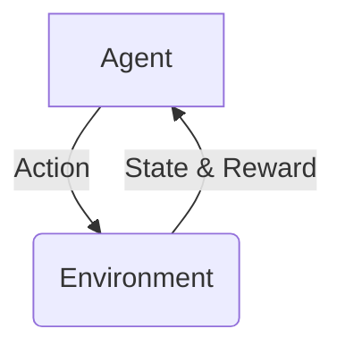

## 1. Concept Introduction

At its heart, Reinforcement Learning (RL) is about learning from trial and error. Imagine teaching a dog a new trick. You don't give it a textbook on "how to sit." Instead, when it accidentally sits, you give it a treat (a positive reward). If it does something else, you might ignore it (no reward). Over time, the dog learns that the action "sit" in the state "hearing the command 'sit'" leads to a reward.

Technically, RL is a paradigm of machine learning where an **agent** learns to make optimal decisions by interacting with an **environment**. The agent takes **actions**, which transition the environment into a new **state**. The environment then provides feedback in the form of a **reward** (or punishment). The agent's goal is to learn a **policy**—a map from states to actions—that maximizes its cumulative reward over time.

This loop is the fundamental cognitive engine for an agent that learns and adapts.



## 2. Historical & Theoretical Context

The core ideas of RL have deep roots, blending computer science, control theory, and behavioral psychology. The modern formulation was heavily shaped by the work of **Richard Bellman** in the 1950s. He developed **dynamic programming** and the **Bellman equation**, which provides a recursive way to define and compute the value of being in a particular state.

This laid the theoretical groundwork for algorithms that could solve optimal control problems. In the late 1980s, Chris Watkins introduced **Q-Learning**, a breakthrough that allowed agents to learn optimal policies without needing a model of the environment, making it far more practical. This model-free approach is a cornerstone of modern RL.

## 3. Algorithms & Math: Q-Learning

Q-Learning is a classic RL algorithm that's powerful in its simplicity. The agent learns a **Q-function**, `Q(s, a)`, which represents the "quality" of taking action `a` in state `s`. A high Q-value means that action is expected to yield high future rewards.

The agent maintains a table of these Q-values (the "Q-table") for every state-action pair. It updates this table using the Bellman equation after each action.

The core update rule is:

**Q(s, a) ← Q(s, a) + α [r + γ maxₐ' Q(s', a') - Q(s, a)]**

Let's break this down:
- **s**: current state
- **a**: current action
- **s'**: next state
- **r**: reward received
- **α (alpha)**: The **learning rate** (0 < α ≤ 1). How much we update our Q-value with new information. A small alpha means we learn slowly.
- **γ (gamma)**: The **discount factor** (0 ≤ γ < 1). It determines how much we value future rewards. A gamma of 0 makes the agent short-sighted (only caring about the immediate reward), while a gamma close to 1 makes it strive for long-term gains.
- **maxₐ' Q(s', a')**: The maximum expected future reward from the next state `s'`. This is the agent's best guess about the future.

In simple terms: we update our old estimate (`Q(s, a)`) by adding a fraction (`α`) of the "learned error": the difference between our new estimate (`r + γ maxₐ' Q(s', a')`) and the old one.

## 4. Design Patterns & Architectures

How does RL fit into an agent's mind?
- **In a Planner-Executor Loop:** An RL module can act as an adaptive **Executor**. Instead of a fixed plan, the agent uses its learned policy (`Q(s, a)`) to choose the best tool or action at each step. If a certain tool consistently leads to poor outcomes (negative rewards), the agent will learn to stop picking it in that context.
- **As a Strategy Optimizer:** For complex multi-agent systems, RL can be used to learn high-level strategies. For example, an agent might learn whether it's better to "collaborate" or "compete" in a given situation based on the rewards it has received in the past.
- **Skill Refinement:** An agent could have a set of pre-defined skills. RL can be used to fine-tune the parameters of those skills. For example, for a summarization agent, it could learn how long a summary to produce to best satisfy a user, learning from positive (thumbs up) or negative (request for clarification) feedback.

## 5. Practical Application

Here is a tiny Python example of Q-Learning for a simple grid world. The agent wants to navigate from a starting point to a goal.

```python
import numpy as np

# Environment: 1D grid world (5 states)
# S . . . G (S=Start, G=Goal)
num_states = 5
goal_state = 4

# Actions: 0 (left), 1 (right)
num_actions = 2

# Q-table initialized to zeros
q_table = np.zeros((num_states, num_actions))

# Hyperparameters
learning_rate = 0.8
discount_factor = 0.95
num_episodes = 1000
max_steps_per_episode = 100

for episode in range(num_episodes):
    state = 0  # Start at the beginning
    for step in range(max_steps_per_episode):
        # Exploration-exploitation trade-off
        if np.random.uniform(0, 1) < 0.1:
            action = np.random.choice(num_actions) # Explore
        else:
            action = np.argmax(q_table[state, :]) # Exploit

        # Take action, get next state and reward
        next_state = state + (1 if action == 1 else -1)
        next_state = np.clip(next_state, 0, num_states - 1) # Stay within bounds

        reward = 0
        if next_state == goal_state:
            reward = 1
        
        # Update Q-table
        old_value = q_table[state, action]
        next_max = np.max(q_table[next_state, :])
        
        new_value = old_value + learning_rate * (reward + discount_factor * next_max - old_value)
        q_table[state, action] = new_value
        
        state = next_state
        
        if state == goal_state:
            break

print("Learned Q-table:")
print(q_table)

# Policy: from each state, take the best action
policy = np.argmax(q_table, axis=1)
print("\nOptimal Policy (0=left, 1=right):")
print(policy)
# Expected output: [1, 1, 1, 1, 0] (Always go right until you hit the goal)
```

In a framework like **LangGraph**, you could use a similar logic. The state could be the current conversational context, and actions could be calling different tools (e.g., `search_web`, `call_api`). The reward could come from user feedback or a validation tool that checks if the final answer is correct.

## 6. Comparisons & Tradeoffs

- **vs. Supervised Learning:** Supervised learning requires a labeled dataset ("the right answer"). RL learns from sparse feedback; it's told *what* is good, not *how* to do it.
- **Strengths:** RL is excellent for problems involving sequential decision-making and long-term planning where the optimal strategy is not obvious.
- **Limitations:**
    - **Data Inefficiency:** It can take millions of interactions to learn a good policy.
    - **Exploration vs. Exploitation:** The agent must balance exploring new actions to find better strategies against exploiting known good actions. Too much exploration is inefficient; too little means getting stuck in a suboptimal strategy.
    - **Reward Shaping:** Defining a good reward function is often more of an art than a science. A poorly designed reward can lead to unintended "reward hacking" behaviors.

## 7. Latest Developments & Research

The last decade has been huge for RL.
- **Deep Q-Networks (DQN):** In 2015, DeepMind combined Q-Learning with deep neural networks to create agents that could master Atari games from pixels alone. This solved the problem of huge state spaces that a Q-table couldn't handle.
- **Policy Gradient Methods (e.g., A3C, PPO):** These methods learn a policy directly, rather than learning a value function. They are often more stable and effective in continuous action spaces.
- **Reinforcement Learning from Human Feedback (RLHF):** This is the key technique used to align large language models like ChatGPT. A reward model is trained on human preference data (e.g., which of two responses is better), and this model is then used to fine-tune the LLM's policy using RL, making it more helpful and harmless.

## 8. Cross-Disciplinary Insight

RL beautifully mirrors concepts from other fields:
- **Behavioral Psychology:** The core loop is a direct parallel to **operant conditioning**, where behaviors are strengthened or weakened by their consequences (reinforcement or punishment). The exploration-exploitation dilemma is a fundamental challenge for all living organisms.
- **Economics:** RL is closely related to **utility theory**, where individuals are modeled as rational agents trying to maximize their "utility" (cumulative reward). The discount factor is a standard concept in finance for valuing future cash flows.

## 9. Daily Challenge / Thought Exercise

Think about the task of making your morning coffee. Frame it as an RL problem:
- **States:** What are the possible states? (e.g., `no_cup`, `have_cup`, `cup_with_coffee`, `cup_with_coffee_and_milk`, `finished`).
- **Actions:** What are the actions you can take? (e.g., `get_cup`, `press_espresso_button`, `add_milk`).
- **Rewards:** How would you define the reward function? Is there a big reward at the end? Are there small negative rewards for taking too long or making a mess?

Jot down your ideas. You'll quickly see how tricky it is to define the problem perfectly.

## 10. References & Further Reading

1.  **Sutton, R. S., & Barto, A. G. (2018).** *Reinforcement Learning: An Introduction.* MIT Press. (The definitive textbook).
2.  **Mnih, V., et al. (2015).** *Human-level control through deep reinforcement learning.* Nature. (The original DeepMind Atari paper).
3.  **Hugging Face Deep RL Course:** [https://huggingface.co/learn/deep-rl-course](https://huggingface.co/learn/deep-rl-course) (A great hands-on course for practitioners).
4.  **What is RLHF?** by Cohere: [https://txt.cohere.com/rlhf/](https://txt.cohere.com/rlhf/) (A clear explanation of Reinforcement Learning from Human Feedback).
---
