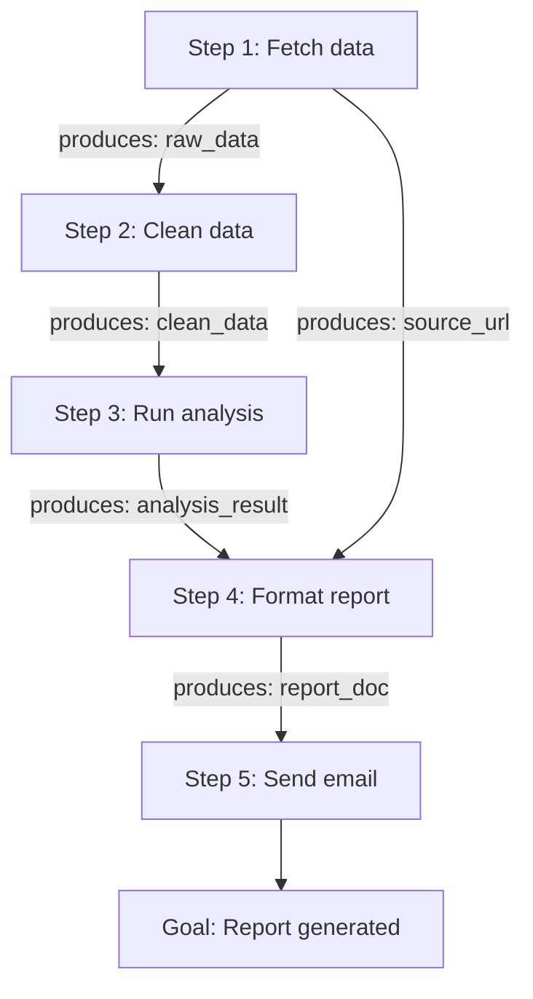

Most agent planners build a plan as an ordered list: do step 1, then step 2, then step 3. That works fine on paper. In practice, committing to a total order early creates brittle plans that break the moment reality diverges from the assumption baked into step 2.

Least-commitment planning flips that instinct. Instead of ordering steps eagerly, the planner defers all ordering decisions it doesn't have to make yet. The result is a **partial-order plan**: a dependency graph of actions connected by causal links and ordering constraints, with no unnecessary sequencing. Steps that don't depend on each other remain unordered until execution forces a choice.

This isn't just academic elegance. Partial-order plans are significantly easier to repair when something goes wrong, because a failure breaks only the specific causal links that depend on the failed step, not the entire linear sequence downstream.

## Historical Context

The idea comes from classical AI planning research in the late 1980s. David Chapman's TWEAK planner (1987) formalized the notion of causal links and threats, the two core concepts the field still uses. McAllester and Rosenblitt's SNLP (1991) showed that plan-space search over partial-order plans was sound and complete. Penberthy and Weld's UCPOP (1992) extended this to handle quantified goals and conditional effects.

The key insight those researchers contributed was framing planning as a search over plan structures rather than world states. Instead of asking "what state do I reach if I do X?" you ask "what plans are consistent with what I need to achieve?" The search space is different, and it exposes structure that state-space planners hide.

Partial-order planning fell somewhat out of fashion when researchers found that state-space planners with good heuristics (like Fast Downward) outperformed it on benchmark domains. But for agent systems where plans are large, execution is expensive, and failures must be repaired locally, the partial-order approach is experiencing renewed interest.

## The Core Mechanics

A partial-order plan has four components:

- **Steps**: the actions the agent will take
- **Ordering constraints**: "$A$ before $B$", with no constraint meaning "either order is fine"
- **Causal links**: "$A$ achieves condition $p$ for step $B$", written $A \xrightarrow{p} B$
- **Open preconditions**: conditions required by some step that no causal link yet satisfies

Plan construction is a search that resolves flaws. A flaw is either an open precondition (something needed but not yet provided) or a threat (a step $C$ that could negate condition $p$ on an existing causal link $A \xrightarrow{p} B$, because $C$ deletes $p$ and might execute between $A$ and $B$).

To resolve an open precondition for step $B$ needing condition $p$: find or add a step $A$ that achieves $p$, and add the causal link $A \xrightarrow{p} B$ plus the ordering constraint $A < B$.

To resolve a threat from step $C$ to link $A \xrightarrow{p} B$: either add $C < A$ (demotion, push the threat before the link's producer) or add $B < C$ (promotion, push the threat after the link's consumer). Both eliminate the window during which $C$ could delete $p$.

**Plan repair pseudocode:**

```python
def resolve_flaws(plan):
    while plan has open preconditions or threats:
        flaw = choose_flaw(plan)      # pick any unresolved flaw
        resolvers = find_resolvers(plan, flaw)
        if not resolvers:
            return FAILURE             # dead end, backtrack
        resolver = choose(resolvers)   # heuristic or search choice
        apply(plan, resolver)
    return plan                        # consistent, executable
```

The "choose" steps are where planners differ. SNLP picks arbitrarily and backtracks on failure. Better heuristics pick the most constrained flaw first (fewest resolvers), similar to the MRV heuristic in constraint satisfaction.

## Why This Matters for Plan Repair

Consider a ten-step linear plan where step 4 assumes a file exists that step 2 created. If step 2 fails, a linear planner replans from scratch. A partial-order planner knows exactly which causal link broke: $\text{step2} \xrightarrow{\text{file-exists}} \text{step4}$. Repair means finding a new resolver for that one open precondition, leaving the rest of the plan intact.

This locality is the main practical benefit. In LLM-based agents, replanning from scratch means re-invoking the model with a new context, re-generating all the steps, and likely producing a plan that looks completely different from the original (even when only one step needed fixing). Targeted repair is cheaper and more predictable.

## How This Fits into LLM Agent Architectures

In practice, LLM agents don't implement UCPOP directly. What practitioners build is a structure that captures the same commitments: a dependency graph where each action node carries its preconditions and effects, and edges represent causal dependencies (not just execution order).

The pattern looks like this:



When step 3 fails, the executor knows that `analysis_result` is now missing. Only steps that consume `analysis_result` (step 4) are blocked. Steps without that dependency (fetching a URL for the report header, for example) can still proceed. The repair targets exactly the broken causal link.

This is more structured than a flat task list but less rigid than a fixed linear sequence. Frameworks like LangGraph support it naturally: graph nodes represent actions, edges represent dependencies, and conditional edges model the "resolve threat by ordering" decisions.

## Practical Application

A minimal implementation defines actions as dataclasses with `preconditions` and `effects` fields (string sets), builds a dependency graph by matching effects to preconditions, and runs a loop that tracks which actions are "ready" (all preconditions satisfied by completed actions' effects). An executor picks a ready action, runs it, and marks its effects as available. On failure, only descendant actions whose preconditions depended on the failed step's effects are flagged for repair. LangGraph is a natural fit because its graph compilation step can validate that every precondition has a producing node before execution begins.

**Try it**

```text
Using LangGraph and Python, build a partial-order plan executor:
- Define 5 actions (dataclasses) with string sets for preconditions and effects
- Auto-build a LangGraph graph by matching effects to preconditions
- Run the graph and simulate one action failing mid-execution
- On failure, identify which downstream actions depend on the failed
  action's effects and re-plan only those steps using the LLM
- Add inline comments explaining each causal link decision
```

## Daily Challenge

Take any three-step agent workflow you've built (or can sketch on paper). Draw the causal links explicitly: for each step, label what condition it produces and which later step needs that condition. Now ask: which pairs of steps have NO causal link between them? Those pairs have no required ordering. If your current implementation runs them sequentially anyway, you've found unnecessary rigidity. Sketch what the partial-order plan looks like, and identify which step, if it failed, would require the least replanning.

## References & Further Reading

- **"SNLP: An Improved Algorithm for Nonlinear Planning"**, McAllester & Rosenblitt, AAAI 1991. Foundational partial-order planning algorithm with completeness proof.
- **"UCPOP: A Sound, Complete, Partial Order Planner for ADL"**, Penberthy & Weld, KR 1992. Extended partial-order planning to expressive action languages.
- **"Nonlinear Problem Solving"**, Chapman, Artificial Intelligence 1987. Original formalization of causal links and threats.
- **"A Comparison of STRIPS-Like and Partial-Order Planners"**, Barrett & Weld, Artificial Intelligence 1994. Empirical analysis of when each approach wins.
- **"Plan Repair as an Extension of Planning"**, Kambhampati & Hendler, AAAI 1992. Direct treatment of using partial-order structure for targeted repair rather than full replanning.
