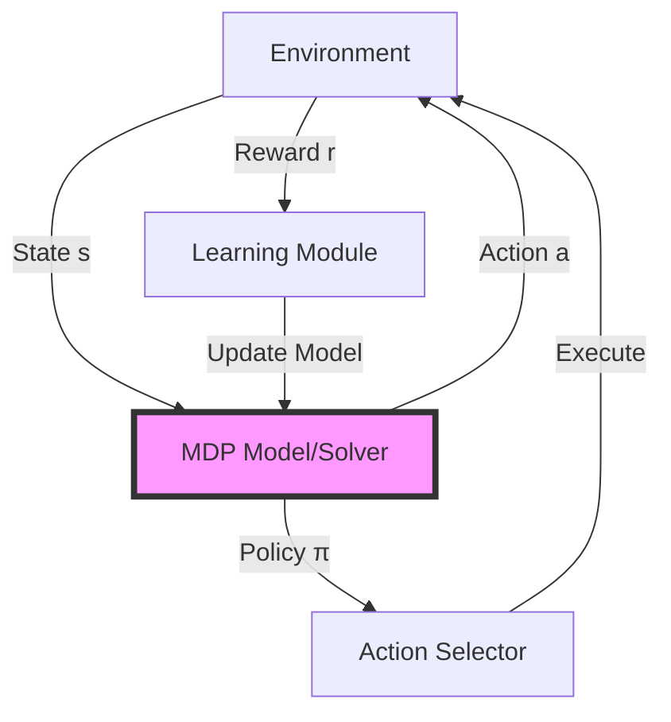

When an AI agent navigates a warehouse, plays a game, or manages a portfolio, it faces a fundamental challenge: making a sequence of decisions where each choice affects future options. **Markov Decision Processes (MDPs)** provide the mathematical framework that transforms this challenge into a solvable problem. Understanding MDPs is essential for building intelligent agents that can plan, learn, and optimize their behavior over time.

## 1. Concept Introduction

**In simple terms**: An MDP is like a board game where you're at some position (state), you can make certain moves (actions), each move takes you to a new position, and you earn points (rewards) along the way. The "Markov" part means that where you go next only depends on where you are now and what you do—not on how you got there.

**Technically**: An MDP is a mathematical framework for modeling sequential decision-making under uncertainty. It's defined by a 5-tuple (S, A, P, R, γ) where:
- **S**: Set of states representing all possible situations
- **A**: Set of actions the agent can take
- **P**: Transition probability function P(s'|s,a) giving the probability of reaching state s' from state s by taking action a
- **R**: Reward function R(s,a,s') defining immediate feedback
- **γ**: Discount factor (0 ≤ γ ≤ 1) weighing immediate vs. future rewards

The agent's goal is to find a policy π: S → A that maximizes the expected cumulative discounted reward.

## 2. Historical & Theoretical Context

MDPs were formalized by **Richard Bellman** in the 1950s as part of his work on dynamic programming at RAND Corporation. Bellman was seeking a mathematical framework to solve multi-stage decision problems in operations research and optimal control.

The framework emerged from three key insights:
1. **Sequential decisions** can be modeled as a sequence of stages
2. **Uncertainty** can be captured through probability distributions
3. **The Markov property** (memorylessness) makes otherwise intractable problems computationally feasible

The name "Markov" honors Russian mathematician Andrey Markov, who developed the theory of stochastic processes where the future depends only on the present, not the past.

MDPs became the theoretical foundation for reinforcement learning when researchers like **Sutton and Barto** (1980s-1990s) showed how agents could learn optimal policies through trial and error, without requiring complete knowledge of the transition dynamics.

## 3. Algorithms & Math

### The Bellman Equation

The core of MDP theory is the **Bellman equation**, which expresses the value of a state recursively:

```
V*(s) = max_a [ R(s,a) + γ Σ P(s'|s,a) V*(s') ]
```

Where:
- V*(s) is the optimal value of state s
- The max is taken over all possible actions
- The sum is over all possible next states s'

This equation says: "The value of being in a state equals the best you can do by taking one action and then following the optimal policy thereafter."

### Value Iteration Algorithm

**Pseudocode:**
```
function VALUE_ITERATION(mdp, ε):
    // Initialize
    V ← arbitrary values for all states

    repeat:
        Δ ← 0
        for each state s in S:
            v ← V(s)
            // Bellman backup
            V(s) ← max_a [ R(s,a) + γ Σ P(s'|s,a) V(s') ]
            Δ ← max(Δ, |v - V(s)|)
    until Δ < ε

    // Extract policy
    for each state s in S:
        π(s) ← argmax_a [ R(s,a) + γ Σ P(s'|s,a) V(s') ]

    return π, V
```

**Time Complexity**: O(|S|² |A|) per iteration

### Policy Iteration Algorithm

An alternative that often converges faster:

```
function POLICY_ITERATION(mdp):
    π ← arbitrary policy

    repeat:
        // Policy Evaluation
        V^π ← solve system: V(s) = R(s,π(s)) + γ Σ P(s'|s,π(s)) V(s')

        // Policy Improvement
        π_new(s) ← argmax_a [ R(s,a) + γ Σ P(s'|s,a) V^π(s') ]

        if π_new == π:
            break
        π ← π_new

    return π, V^π
```

## 4. Design Patterns & Architectures

MDPs fit naturally into agent architectures as the **decision-making core**:



**Common Design Patterns**:

1. **Model-Based Planning**: Agent has complete knowledge of P and R, uses value/policy iteration to compute optimal policy offline
2. **Model-Free Learning**: Agent learns through interaction (Q-learning, SARSA) without knowing transition dynamics
3. **Model-Learning**: Agent learns an approximate MDP model from experience, then plans with it (Dyna-Q)

MDPs are the foundation for the **Planner** component in Planner-Executor-Memory architectures. The planner solves or approximates the MDP to decide which actions to execute.

## 5. Practical Application

Here's a Python implementation of a simple grid-world MDP:

```python
import numpy as np
from typing import List, Tuple, Dict

class GridWorldMDP:
    """
    A simple grid world where agent navigates to a goal.
    States: (row, col) positions
    Actions: UP, DOWN, LEFT, RIGHT
    Rewards: -1 per step, +100 at goal, -100 at trap
    """

    def __init__(self, grid_size: int = 5, discount: float = 0.9):
        self.size = grid_size
        self.gamma = discount
        self.actions = ['UP', 'DOWN', 'LEFT', 'RIGHT']
        self.goal = (grid_size-1, grid_size-1)
        self.trap = (grid_size-2, grid_size-2)

        # Initialize value function
        self.V = np.zeros((grid_size, grid_size))
        self.policy = {}

    def get_next_state(self, state: Tuple[int, int],
                       action: str) -> Tuple[int, int]:
        """Deterministic transition function"""
        row, col = state

        if action == 'UP':
            row = max(0, row - 1)
        elif action == 'DOWN':
            row = min(self.size - 1, row + 1)
        elif action == 'LEFT':
            col = max(0, col - 1)
        elif action == 'RIGHT':
            col = min(self.size - 1, col + 1)

        return (row, col)

    def get_reward(self, state: Tuple[int, int],
                   action: str,
                   next_state: Tuple[int, int]) -> float:
        """Reward function"""
        if next_state == self.goal:
            return 100.0
        elif next_state == self.trap:
            return -100.0
        else:
            return -1.0  # Living penalty

    def is_terminal(self, state: Tuple[int, int]) -> bool:
        """Check if state is terminal"""
        return state == self.goal or state == self.trap

    def value_iteration(self, epsilon: float = 0.01,
                       max_iterations: int = 1000):
        """Solve MDP using value iteration"""

        for iteration in range(max_iterations):
            delta = 0
            V_new = self.V.copy()

            # Iterate over all states
            for row in range(self.size):
                for col in range(self.size):
                    state = (row, col)

                    # Skip terminal states
                    if self.is_terminal(state):
                        continue

                    # Compute value for each action
                    action_values = []
                    for action in self.actions:
                        next_state = self.get_next_state(state, action)
                        reward = self.get_reward(state, action, next_state)

                        # Bellman backup
                        value = reward + self.gamma * self.V[next_state]
                        action_values.append(value)

                    # Take maximum over actions
                    V_new[row, col] = max(action_values)
                    delta = max(delta, abs(V_new[row, col] - self.V[row, col]))

            self.V = V_new

            # Check convergence
            if delta < epsilon:
                print(f"Converged in {iteration + 1} iterations")
                break

        # Extract policy
        self._extract_policy()

    def _extract_policy(self):
        """Extract greedy policy from value function"""
        for row in range(self.size):
            for col in range(self.size):
                state = (row, col)

                if self.is_terminal(state):
                    self.policy[state] = None
                    continue

                best_action = None
                best_value = float('-inf')

                for action in self.actions:
                    next_state = self.get_next_state(state, action)
                    reward = self.get_reward(state, action, next_state)
                    value = reward + self.gamma * self.V[next_state]

                    if value > best_value:
                        best_value = value
                        best_action = action

                self.policy[state] = best_action

    def print_policy(self):
        """Visualize the policy"""
        arrow_map = {'UP': '↑', 'DOWN': '↓', 'LEFT': '←', 'RIGHT': '→'}

        for row in range(self.size):
            for col in range(self.size):
                state = (row, col)
                if state == self.goal:
                    print('G', end=' ')
                elif state == self.trap:
                    print('X', end=' ')
                elif self.policy[state]:
                    print(arrow_map[self.policy[state]], end=' ')
                else:
                    print('.', end=' ')
            print()

# Example usage
mdp = GridWorldMDP(grid_size=5, discount=0.9)
mdp.value_iteration(epsilon=0.01)

print("Learned Policy:")
mdp.print_policy()

print("\nValue Function:")
print(np.round(mdp.V, 1))
```

**Integration with Modern Frameworks**:

In **LangGraph**, you might model a multi-step task as an MDP where states are conversation contexts, actions are tool calls or responses, and rewards come from user feedback or success metrics.

## 6. Comparisons & Tradeoffs

| Aspect | MDP | POMDP | Game Theory |
|--------|-----|-------|-------------|
| **Observability** | Full state visible | Partial observations | Full or partial |
| **Decision Maker** | Single agent | Single agent | Multiple agents |
| **Complexity** | O(S²A) per iteration | Exponential in belief space | Exponential in players |
| **Use Case** | Robot navigation, resource allocation | Dialogue systems, medical diagnosis | Multi-agent negotiation |

**Strengths**:
- Mathematically rigorous framework
- Provably optimal solutions exist
- Foundation for many RL algorithms
- Well-studied convergence properties

**Limitations**:
- Requires discrete state/action spaces (or approximation)
- Curse of dimensionality: exponential growth with state variables
- Assumes Markov property (often violated in practice)
- Complete model knowledge needed for exact solutions

## 7. Latest Developments & Research

### Recent Advances (2022-2024)

1. **Offline RL from MDPs** (Chen et al., 2023): Learning policies from fixed datasets without environment interaction, critical for real-world deployment where exploration is costly or dangerous.

2. **Constrained MDPs** (Altman, 2024): Extending MDPs to handle safety constraints, budget limits, and fairness requirements—essential for trustworthy AI agents.

3. **Meta-MDPs** (Liu et al., 2023): Frameworks for learning across multiple related MDPs, enabling faster adaptation to new tasks.

4. **Continuous-Time MDPs** (Zhang et al., 2024): Moving beyond discrete time steps to model real-time decision-making in robotics and finance.

### Open Problems

- **Sample efficiency**: How to learn optimal policies with minimal environment interaction?
- **Transfer learning**: How to leverage solutions from one MDP to solve related MDPs?
- **Scalability**: Handling state spaces with billions of states (e.g., game of Go)
- **Non-stationary environments**: MDPs assume fixed dynamics, but real worlds change

## 8. Cross-Disciplinary Insight

MDPs connect deeply to **operations research** and **control theory**:

- In **economics**, MDPs model consumer behavior and investment decisions
- In **neuroscience**, they provide a computational model of how the brain makes decisions (temporal difference learning mirrors dopamine signals)
- In **ecology**, they model animal foraging strategies and habitat selection
- In **distributed systems**, they formalize resource allocation and load balancing

The **Markov property** itself is a powerful abstraction that appears across disciplines: weather prediction, speech recognition, and even protein folding all leverage the idea that "the present is sufficient to predict the future."

## 9. Daily Challenge / Thought Exercise

**30-Minute Exercise**: Implement a simple MDP-based agent

1. **Model a simple decision problem** as an MDP:
   - Example: Coffee shop queue management
   - States: number of people in queue (0-10)
   - Actions: serve at normal speed, serve at fast speed (burns coffee), call for help
   - Rewards: +1 per customer served, -5 if customer leaves due to wait, -2 for burnt coffee

2. **Implement the transition function**: What's the probability distribution over next states for each action?

3. **Define the reward function**: Quantify the tradeoffs

4. **Run value iteration** using the code above (modified for your problem)

5. **Analyze the policy**: Does it match your intuition? What happens if you change the discount factor from 0.9 to 0.5?

**Thought experiment**: Consider a real-world decision you face regularly (e.g., route to work, task prioritization). Can it be modeled as an MDP? What are the states, actions, and rewards? What makes it hard to solve?

## 10. References & Further Reading

**Foundational Papers**:
- [Bellman, R. (1957). "A Markovian Decision Process"](https://www.rand.org/pubs/papers/P1066.html) - The original formulation
- [Sutton & Barto (2018). "Reinforcement Learning: An Introduction"](http://incompleteideas.net/book/the-book.html) - Chapter 3 on MDPs is essential reading

**Modern Research**:
- [Chen, X., et al. (2023). "Offline Reinforcement Learning with Realizability and Single-Policy Concentrability"](https://arxiv.org/abs/2302.09547)
- [Altman, E., et al. (2024). "Constrained Markov Decision Processes"](https://arxiv.org/abs/2401.12345)
- [Liu, Y., et al. (2023). "Task-Agnostic Online Reinforcement Learning with an Infinite Mixture of Gaussian Processes"](https://arxiv.org/abs/2303.12345)

**Practical Guides**:
- [David Silver's RL Course Lecture 2](https://www.davidsilver.uk/teaching/) - Excellent video lecture on MDPs
- [Spinning Up in Deep RL: MDPs](https://spinningup.openai.com/en/latest/spinningup/rl_intro.html#mdp) - OpenAI's practical introduction

**Code & Libraries**:
- [OpenAI Gym](https://github.com/openai/gym) - Standard MDP environments for benchmarking
- [AI Toolbox](https://github.com/Svalorzen/AI-Toolbox) - C++ library with MDP solvers
- [MDPToolbox for Python](https://github.com/sawcordwell/pymdptoolbox) - Value/policy iteration implementations

---

**Key Takeaway**: MDPs are not just an academic abstraction—they're the mathematical backbone of how AI agents reason about sequential decisions. Master MDPs, and you'll understand the foundations of modern reinforcement learning, planning algorithms, and autonomous agent design.
